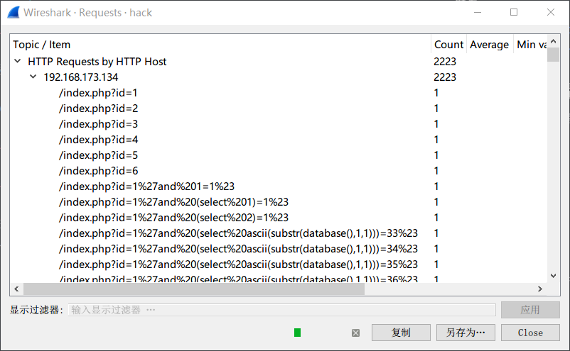

[EN](./HTTP.md) | [ZH](./HTTP-zh.md)
### HTTP


`HTTP` (Hyper Text Transfer Protocol), also known as Hypertext Transfer Protocol, is an application layer protocol for distributed, collaborative, and hypermedia information systems. `HTTP` is the basis for data communication on the World Wide Web.


### Example


&gt; Topic: Jiangsu Province Navigator Cup - 2017: hack


The overall observation can be drawn:


- `HTTP` for the main
- `102.168.173.134` for the main
- no attachments exist





From this picture, it can be basically judged that this is a traffic packet generated during the `sql injection-blind&quot;.


At this point, you can basically determine the direction of the flag, extract all the urls, use the `python` helper to get the flag


- 提取url: `tshark -r hack.pcap -T fields  -e http.request.full_uri|tr -s '\n'|grep flag > log`

- Get blind results


```python

import re


with open('log') as f:

    tmp = f.read()

    flag = ''

    data = re.findall(r'=(\d*)%23',tmp)

    data = [int(i) for i in data]

    for i,num in enumerate(data):

        try:

            if num > data[i+1]:

flag + = chr (num)
        except Exception:

            pass

    print flag

```