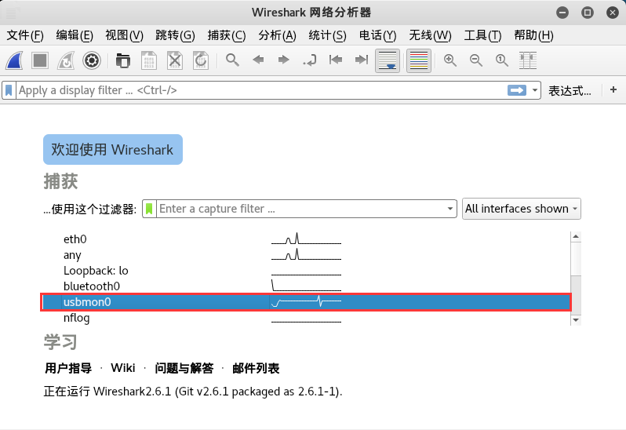
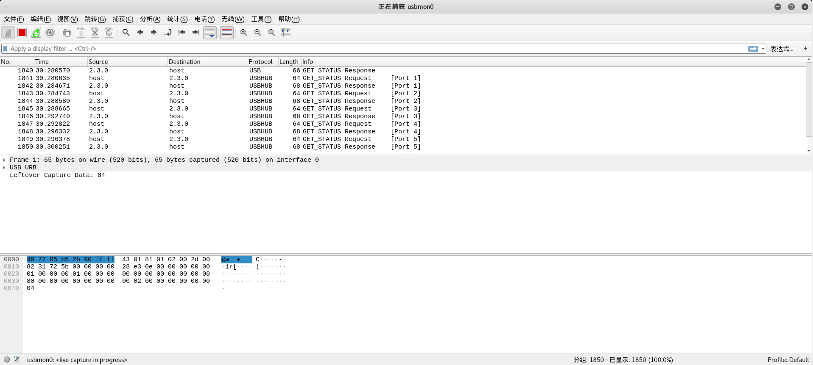

[EN](./USB.md) | [ZH](./USB-zh.md)
### USB


**USB Details**: [http://www.usb.org/developers/hidpage/Hut1_12v2.pdf] (http://www.usb.org/developers/hidpage/Hut1_12v2.pdf)


- Mouse protocol


The movement of the mouse is continuous, which is different from the discreteness of the keyboard keystrokes. However, the data packets generated by the mouse action are also discrete. After all, the continuity information of the computer is composed of a large amount of discrete information.


The data area of each data packet has four bytes. The first byte represents the button. When 0x00 is taken, it means there is no button. When it is 0x01, it means the left button. When it is 0x02, it means the current button is the right button. The second byte can be thought of as a signed byte type, with the highest bit being the sign bit. When this value is positive, it represents how many pixels the mouse is horizontally shifted to the right. When it is negative, it represents how many pixels are shifted to the left. The third byte is similar to the second byte and represents the offset of the vertical up and down movement.


After getting the information of these points, you can recover the mouse movement track.


- Tools

  - [UsbMiceDataHacker](https://github.com/WangYihang/UsbMiceDataHacker)

- Keyboard protocol


The data length of the keyboard packet is 8 bytes, and the keystroke information is concentrated in the 3rd byte.


Correspondence between data values and specific key bits


The case information of the keyboard can be recovered from the data packet


- Tools

  - [UsbKeyboardDataHacker](https://github.com/WangYihang/UsbKeyboardDataHacker)


**reference**


- https://www.anquanke.com/post/id/85218


### Example


&gt; `Xman` three summer camp qualifying exercises: `AutoKey`
>

&gt; WP: https://www.cnblogs.com/ECJTUACM-873284962/p/9473808.html


Problem Description:


This question is a question that I participated in the selection of the Xman`s summer camp. How do we analyze it?


#### How is the traffic packet captured?


First of all, we can know from the above packet analysis, this is a `USB` traffic package, we can first try to analyze how the `USB` packet is captured.


Before we get started, let&#39;s introduce some of the basics of `USB`. `USB` has different specifications, the following are three ways to use `USB`:


```shell

l USB UART

l USB HID

l USB Memory

```


`UART` or `Universal Asynchronous Receiver/Transmitter`. In this way, the device simply uses `USB` to accept and transmit data, and there is no other communication function.


`HID` is a human interface. This type of communication is suitable for interactive applications such as keyboards, mice, gamepads and digital display devices.


The last is `USB Memory`, or data storage. `External HDD`, `thumb drive/flash drive`, etc. are all of this type.


The most widely used one is not `USB HID` which is `USB Memory`.


Each `USB` device (especially `HID` or `Memory`) has a vendor `ID (Vendor ID)` and a product identifier (Product Id)`. `Vendor ID` is used to mark which manufacturer produced this `USB` device. `Product ID` is used to mark different products. He is not a special number, of course it is better. As shown below:


The above picture is a list of `USB` devices I connected to my computer in a virtual machine environment, and the command is viewed by `lsusb`.


For example, I have a wireless mouse under `VMware`. It belongs to the `HID` device. This device is running normally, and you can see all the `USB` devices through the `lsusb` command. Now you can find out which one is this mouse? ? Nothing wrong, it is the fourth one, which is the following:


```shell

Bus 002 Device 002: ID 0e0f:0003 VMware, Inc. Virtual Mouse

```


Where `ID 0e0f:0003` is the `Vendor-Product ID` pair, the value of `Vendor ID` is `0e0f`, and the value of `Product ID` is `0003`. `Bus 002 Device 002` stands for the normal connection of the `usb` device. This needs to be noted.


We run `Wireshark` with `root` permission to capture the `USB` data stream. But usually we don&#39;t recommend it. We need to give the user enough permissions to get the `usb` data stream in `Linux`. We can use `udev` to achieve our goal. We need to create a user group `usbmon` and add our account to this group.


```shell

addgroup usbmon

gpasswd -a $USER usbmon

echo 'SUBSYSTEM=="usbmon", GROUP="usbmon", MODE="640"' > /etc/udev/rules.d/99-usbmon.rules

```


Next, we need the `usbmon` kernel module. If the module is not loaded, we can load the module with the following command:


```shell

modprobe usbmon

```


Open `wireshark` and you will see `usbmonX` where `X` represents the number. The picture below is the result of our this time (I am using `root `):





If the interface is active or there is a data flow, the `wireshark` interface will display it as a waveform. So, what should we choose? Nothing wrong, that is, I just let everyone remember, this X number is corresponding to this `USB Bus`. In this article is `usbmon0`. Open it and you can observe the packet.





Through these, we can understand the communication process and working principle between the `usb` device and the host, we can analyze the traffic packet.


#### How do I analyze a USB traffic packet?


Based on the previous knowledge, we have a rough outline of the `USB` traffic packet capture. Let&#39;s talk about how to analyze a `USB` traffic packet.


For details on the `USB` protocol, refer to the `wikishark` `wiki`: <https://wiki.wireshark.org/USB>


Let&#39;s start with a simple example on `GitHub`:


We can know that the data part of the `USB` protocol is in the `Leftover Capture Data` field. Under `Mac` and `Linux`, you can use the `tshark` command to extract the `leftover capture data` separately. The command is as follows: :


```shell

Tshark -r example.pcap -T fields -e usb.capdata //If you want to import the usbdata.txt file, add the following parameter:&gt;usbdata.txt
```


`Windows` has the `wireshark` environment installed, there is a `tshark.exe` in the `wireshark` directory, such as my `D:\Program Files\Wireshark\tshark.exe`


Call `cmd` and navigate to the current directory. Enter the following command:

```

Tshark.exe -r example.pcap -T fields -e usb.capdata //If you want to import the usbdata.txt file, add the following parameter:&gt;usbdata.txt
```


For detailed usage of the `tshark` command, refer to the `wireshark` official documentation: <https://www.wireshark.org/docs/man-pages/tshark.html>


Run the command and look at `usbdata.txt` to find the packet length is eight bytes.


I have found a picture about the features of `USB`, which clearly reflects this problem:


Here we only focus on keyboard traffic and mouse traffic in `USB` traffic.


The data length of the keyboard packet is `8` bytes, the keystroke information is concentrated in the `3` bytes, and each time `key stroke` will generate a `keyboard event usb packet`.


The data length of the mouse data packet is `4` bytes. The first byte represents the button. When the value is 0x00, it means there is no button. When it is 0x01, it means the left button. When it is `0x02`, it represents the current The button is the right button. The second byte can be thought of as a `signed byte` type, with the highest bit being the sign bit. When this value is positive, it represents how many pixels the mouse is horizontally shifted to the right. When it is negative, it represents how many pixels are horizontally shifted to the left. The third byte is similar to the second byte and represents the offset of the vertical up and down movement.


I looked through a lot of documentation for the `USB` protocol, where we can find the correspondence between this value and the specific key: <http://www.usb.org/developers/hidpage/Hut1_12v2.pdf>


The mapping table of `usb keyboard` takes the third byte according to this mapping table, and the corresponding comparison table is decoded:


We write the following script:


```python

mappings = { 0x04:"A",  0x05:"B",  0x06:"C", 0x07:"D", 0x08:"E", 0x09:"F", 0x0A:"G",  0x0B:"H", 0x0C:"I",  0x0D:"J", 0x0E:"K", 0x0F:"L", 0x10:"M", 0x11:"N",0x12:"O",  0x13:"P", 0x14:"Q", 0x15:"R", 0x16:"S", 0x17:"T", 0x18:"U",0x19:"V", 0x1A:"W", 0x1B:"X", 0x1C:"Y", 0x1D:"Z", 0x1E:"1", 0x1F:"2", 0x20:"3", 0x21:"4", 0x22:"5",  0x23:"6", 0x24:"7", 0x25:"8", 0x26:"9", 0x27:"0", 0x28:"n", 0x2a:"[DEL]",  0X2B:"    ", 0x2C:" ",  0x2D:"-", 0x2E:"=", 0x2F:"[",  0x30:"]",  0x31:"\\", 0x32:"~", 0x33:";",  0x34:"'", 0x36:",",  0x37:"." }

nums = []

keys = open('usbdata.txt')

for line in keys:

    if line[0]!='0' or line[1]!='0' or line[3]!='0' or line[4]!='0' or line[9]!='0' or line[10]!='0' or line[12]!='0' or line[13]!='0' or line[15]!='0' or line[16]!='0' or line[18]!='0' or line[19]!='0' or line[21]!='0' or line[22]!='0':

         continue

    nums.append(int(line[6:8],16))

    # 00:00:xx:....

keys.close()

output = ""

for n in nums:

    if n == 0 :

        continue

    if n in mappings:

        output += mappings[n]

    else:

        output += '[unknown]'

print('output :n' + output)

```


The results are as follows:


We integrated the previous one into a script and got:


```python

#!/usr/bin/env python


import sys

import


DataFileName = &quot;usb.dat&quot;


presses = []


normalKeys = {"04":"a", "05":"b", "06":"c", "07":"d", "08":"e", "09":"f", "0a":"g", "0b":"h", "0c":"i", "0d":"j", "0e":"k", "0f":"l", "10":"m", "11":"n", "12":"o", "13":"p", "14":"q", "15":"r", "16":"s", "17":"t", "18":"u", "19":"v", "1a":"w", "1b":"x", "1c":"y", "1d":"z","1e":"1", "1f":"2", "20":"3", "21":"4", "22":"5", "23":"6","24":"7","25":"8","26":"9","27":"0","28":"<RET>","29":"<ESC>","2a":"<DEL>", "2b":"\t","2c":"<SPACE>","2d":"-","2e":"=","2f":"[","30":"]","31":"\\","32":"<NON>","33":";","34":"'","35":"<GA>","36":",","37":".","38":"/","39":"<CAP>","3a":"<F1>","3b":"<F2>", "3c":"<F3>","3d":"<F4>","3e":"<F5>","3f":"<F6>","40":"<F7>","41":"<F8>","42":"<F9>","43":"<F10>","44":"<F11>","45":"<F12>"}


shiftKeys = {"04":"A", "05":"B", "06":"C", "07":"D", "08":"E", "09":"F", "0a":"G", "0b":"H", "0c":"I", "0d":"J", "0e":"K", "0f":"L", "10":"M", "11":"N", "12":"O", "13":"P", "14":"Q", "15":"R", "16":"S", "17":"T", "18":"U", "19":"V", "1a":"W", "1b":"X", "1c":"Y", "1d":"Z","1e":"!", "1f":"@", "20":"#", "21":"$", "22":"%", "23":"^","24":"&","25":"*","26":"(","27":")","28":"<RET>","29":"<ESC>","2a":"<DEL>", "2b":"\t","2c":"<SPACE>","2d":"_","2e":"+","2f":"{","30":"}","31":"|","32":"<NON>","33":"\"","34":":","35":"<GA>","36":"<","37":">","38":"?","39":"<CAP>","3a":"<F1>","3b":"<F2>", "3c":"<F3>","3d":"<F4>","3e":"<F5>","3f":"<F6>","40":"<F7>","41":"<F8>","42":"<F9>","43":"<F10>","44":"<F11>","45":"<F12>"}


def main():

    # check argv

    if len(sys.argv) != 2:

        print "Usage : "

        print "        python UsbKeyboardHacker.py data.pcap"

        print "Tips : "

        print "        To use this python script , you must install the tshark first."

        print "        You can use `sudo apt-get install tshark` to install it"

        print "        Thank you for using."

        exit(1)


    # get argv

    pcapFilePath = sys.argv[1]

    

    # get data of pcap

    os.system("tshark -r %s -T fields -e usb.capdata > %s" % (pcapFilePath, DataFileName))


    # read data

    with open(DataFileName, "r") as f:

        for line in f:

            presses.append(line[0:-1])

    # handle

    result = ""

    for press in presses:

        Bytes = press.split(":")

        if Bytes[0] == "00":

            if Bytes[2] != "00":

                result += normalKeys[Bytes[2]]

        elif Bytes[0] == "20": # shift key is pressed.

            if Bytes[2] != "00":

                result += shiftKeys[Bytes[2]]

        else:

            print "[-] Unknow Key : %s" % (Bytes[0])

    print "[+] Found : %s" % (result)


    # clean the temp data

    os.system("rm ./%s" % (DataFileName))


if __name__ == "__main__":

    main()

```


The effect is as follows:


Also paste a mouse traffic packet conversion script:


```python

nums = [] 

keys = open('usbdata.txt','r') 

posx = 0 

posy = 0 

for line in keys: 

if len(line) != 12 : 

     continue 

x = int(line[3:5],16) 
y = int (line [6: 8], 16)
if x > 127 : 

    x -= 256 

if y > 127 : 

and - = 256
posx += x 

posy + = y
btn_flag = int(line[0:2],16)  # 1 for left , 2 for right , 0 for nothing 

if btn_flag == 1 : 

    print posx , posy 

keys.close()

```


The keyboard traffic packet conversion script is as follows:


```python

nums=[0x66,0x30,0x39,0x65,0x35,0x34,0x63,0x31,0x62,0x61,0x64,0x32,0x78,0x33,0x38,0x6d,0x76,0x79,0x67,0x37,0x77,0x7a,0x6c,0x73,0x75,0x68,0x6b,0x69,0x6a,0x6e,0x6f,0x70]

s=''

for x in nums:

    s+=chr(x)

print s

mappings = { 0x41:"A",  0x42:"B",  0x43:"C", 0x44:"D", 0x45:"E", 0x46:"F", 0x47:"G",  0x48:"H", 0x49:"I",  0x4a:"J", 0x4b:"K", 0x4c:"L", 0x4d:"M", 0x4e:"N",0x4f:"O",  0x50:"P", 0x51:"Q", 0x52:"R", 0x53:"S", 0x54:"T", 0x55:"U",0x56:"V", 0x57:"W", 0x58:"X", 0x59:"Y", 0x5a:"Z", 0x60:"0", 0x61:"1", 0x62:"2", 0x63:"3", 0x64:"4",  0x65:"5", 0x66:"6", 0x67:"7", 0x68:"8", 0x69:"9", 0x6a:"*", 0x6b:"+",  0X6c:"separator", 0x6d:"-",  0x6e:".", 0x6f:"/" }

output = ""

for n in nums:

    if n == 0 :

        continue

    if n in mappings:

        output += mappings[n]

    else:

        output += '[unknown]'

print 'output :\n' + output

```


So for the question of the `xman` three summer camp qualifying, we can imitate the example above:


First we export `usb.capdata` all by `tshark`:


```shell

Tshark -r task_AutoKey.pcapng -T fields -e usb.capdata //If you want to import the usbdata.txt file, add the following parameter:&gt;usbdata.txt
```


The results are as follows:


We use the above `python` script to take the third byte out and the corresponding lookup table is decoded:


```python

mappings = { 0x04:"A",  0x05:"B",  0x06:"C", 0x07:"D", 0x08:"E", 0x09:"F", 0x0A:"G",  0x0B:"H", 0x0C:"I",  0x0D:"J", 0x0E:"K", 0x0F:"L", 0x10:"M", 0x11:"N",0x12:"O",  0x13:"P", 0x14:"Q", 0x15:"R", 0x16:"S", 0x17:"T", 0x18:"U",0x19:"V", 0x1A:"W", 0x1B:"X", 0x1C:"Y", 0x1D:"Z", 0x1E:"1", 0x1F:"2", 0x20:"3", 0x21:"4", 0x22:"5",  0x23:"6", 0x24:"7", 0x25:"8", 0x26:"9", 0x27:"0", 0x28:"n", 0x2a:"[DEL]",  0X2B:"    ", 0x2C:" ",  0x2D:"-", 0x2E:"=", 0x2F:"[",  0x30:"]",  0x31:"\\", 0x32:"~", 0x33:";",  0x34:"'", 0x36:",",  0x37:"." }

nums = []

keys = open('usbdata.txt')

for line in keys:

    if line[0]!='0' or line[1]!='0' or line[3]!='0' or line[4]!='0' or line[9]!='0' or line[10]!='0' or line[12]!='0' or line[13]!='0' or line[15]!='0' or line[16]!='0' or line[18]!='0' or line[19]!='0' or line[21]!='0' or line[22]!='0':

         continue

    nums.append(int(line[6:8],16))

    # 00:00:xx:....

keys.close()

output = ""

for n in nums:

    if n == 0 :

        continue

    if n in mappings:

        output += mappings[n]

    else:

        output += '[unknown]'

print('output :n' + output)

```


The results are as follows:


```shell

output :n[unknown]A[unknown]UTOKEY''.DECIPHER'[unknown]MPLRVFFCZEYOUJFJKYBXGZVDGQAURKXZOLKOLVTUFBLRNJESQITWAHXNSIJXPNMPLSHCJBTYHZEALOGVIAAISSPLFHLFSWFEHJNCRWHTINSMAMBVEXO[DEL]PZE[DEL]IZ'

```


We can see that this is automatic key decoding. The question now is how to decode if we don&#39;t know the key?


I found the following about how to blast the key: <http://www.practicalcryptography.com/cryptanalysis/stochastic-searching/cryptanalysis-autokey-cipher/>


The blasting script is as follows:


```python

from ngram_score import ngram_score

from pycipher import Autokey

import re

from itertools import permutations


qgram = ngram_score('quadgrams.txt')

trigram = ngram_score('trigrams.txt')


ctext = &#39;MPLRVFFCZEYOUJFJKYBXGZVDGQAURKXZOLKOLVTUFBLRNJESQITWAHXNSIJXPNMPLSHCJBTYHZEALOGVIAAISSPLFHLFSWFEHJNCRWHTINSMAMBVEXPZIZ&#39;


ctext = re.sub(r'[^A-Z]','',ctext.upper())

# keep a list of the N best things we have seen, discard anything else


class nbest(object):

    def __init__(self,N=1000):

        self.store = []

        self.N = N


    def add(self,item):

        self.store.append(item)

        self.store.sort(reverse=True)

self.store = self.store [: self.N]


    def __getitem__(self,k):

        return self.store[k]


    def __len__(self):

        return len(self.store)

        

#init

N=100

for KLEN in range(3,20):

    rec = nbest(N)

    for i in permutations('ABCDEFGHIJKLMNOPQRSTUVWXYZ',3):

        key = ''.join(i) + 'A'*(KLEN-len(i))

        pt = Autokey(key).decipher(ctext)

        score = 0

for j in range (0, len (ctext), KLEN):
            score += trigram.score(pt[j:j+3])

        rec.add((score,''.join(i),pt[:30]))


    next_rec = nbest(N)

    for i in range(0,KLEN-3):

        for k in xrange(N):
            for c in 'ABCDEFGHIJKLMNOPQRSTUVWXYZ':

                key = rec[k][1] + c

fullkey = key + &#39;A&#39; * (KLEN-len (key))
                pt = Autokey(fullkey).decipher(ctext)

                score = 0

for j in range (0, len (ctext), KLEN):
                    score += qgram.score(pt[j:j+len(key)])

                next_rec.add((score,key,pt[:30]))

        rec = next_rec

        next_rec = nbest(N)

    bestkey = rec[0][1]

    pt = Autokey(bestkey).decipher(ctext)

    bestscore = qgram.score(pt)

    for i in range(N):

        pt = Autokey(rec[i][1]).decipher(ctext)

        score = qgram.score(pt)

        if score > bestscore:

            bestkey = rec[i][1]

            bestscore = score       

print best score, &#39;autokey, klen&#39;, KLEN, &#39;: &quot;&#39; + bestkey + &#39;&quot;,&#39;, Autokey (bestkey) .decipher (ctext)
```


The results of running out are as follows:


We saw the words `flag`, which can be sorted as follows:


```shell

-674.914569565 autokey, klen 8 :"FLAGHERE", HELLOBOYSANDGIRLSYOUARESOSMARTTHATYOUCANFINDTHEFLAGTHATIHIDEINTHEKEYBOARDPACKAGEFLAGISJHAWLZKEWXHNCDHSLWBAQJTUQZDXZQPF

```


We split the field to see:


```shell

HELLO

BOYS

AND

GIRLS

YOU

ARE

SO

SMART

THAT

YOU

CAN

FIND

THE

FLAG

THAT

THEM
HERE
IN

THE

KEY

BOARD

PACKAGE

FLAG

IS

JHAWLZKEWXHNCDHSLWBAQJTUQZDXZQPF
```


The last `flag` is `flag{JHAWLZKEWXHNCDHSLWBAQJTUQZDXZQPF}`


### references


- https://www.cnblogs.com/ECJTUACM-873284962/p/9473808.html

- https://blog.csdn.net/songze_lee/article/details/77658094

- https://wiki.wireshark.org/USB

- http://www.usb.org/developers/hidpage/Hut1_12v2.pdf

- https://www.wireshark.org/docs/man-pages/tshark.html

- http://www.practicalcryptography.com/cryptanalysis/stochastic-searching/cryptanalysis-autokey-cipher/

- https://hackfun.org/2017/02/22/CTF%E4%B8%AD%E9%82%A3%E4%BA%9B%E8%84%91%E6%B4%9E%E5%A4%A7%E5%BC%80%E7%9A%84%E7%BC%96%E7%A0%81%E5%92%8C%E5%8A%A0%E5%AF%86/