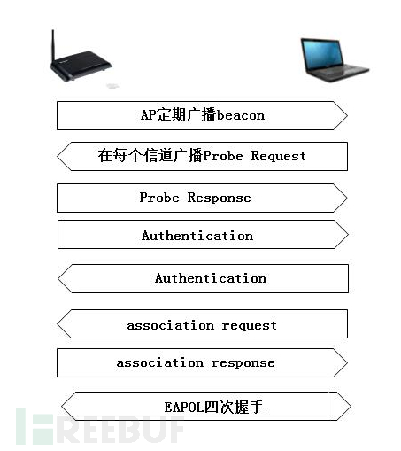

### WIFI

> `802.11` 是现今无线局域网通用的标准,常见认证方式
>
> - 不启用安全‍‍
> - `WEP‍‍`
> - `WPA/WPA2-PSK`（预共享密钥）‍‍
> - `PA/WPA2 802.1X` （`radius` 认证）

#### WPA-PSK

认证大致过程如下图

其中四次握手过程

1. 4次握手开始于验证器(AP)，它产生一个随机的值(ANonce)发送给请求者
2. 请求者也产生了它自己的随机SNonce，然后用这两个Nonces以及PMK生成了PTK。请求者回复消息2给验证器,还有一个MIC（message integrity code，消息验证码）作为PMK的验证
3. 它先要验证请求者在消息2中发来的MIC等信息，验证成功后，如果需要就生成GTK。然后发送消息3
4. 请求者收到消息3，验证MIC，安装密钥，发送消息4，一个确认信息。验证器收到消息4，验证MIC，安装相同的密钥

### 例题  

> 实验吧： `shipin.cap`

从大量的`Deauth` 攻击基本可以判断是一个破解 `wifi` 时的流量攻击

同时也成功发现了握手包信息

接下来跑密码

- `linux` ： `aircrack` 套件
- `windows` ： `wifipr` ，速度比 `esaw` 快， `GTX850` 能将近 `10w\s  :`)

得到密码`88888888`在 `wireshark` 中`Edit -> Preferences -> Protocols -> IEEE802.11 -> Edit`以`key:SSID`形式填入即可解密 `wifi` 包看到明文流量

> KCARCK相关: https://www.krackattacks.com/

### 参考文献

- http://www.freebuf.com/articles/wireless/58342.html
- http://blog.csdn.net/keekjkj/article/details/46753883