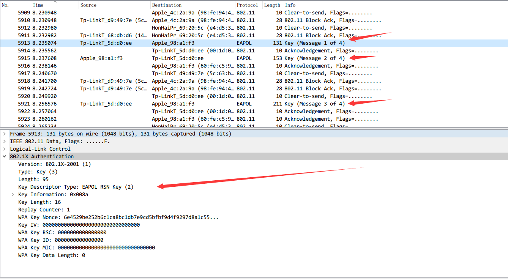

[EN](./WIFI.md) | [ZH](./WIFI-zh.md)
### WIFI

&gt; `802.11` is a common standard for wireless LANs today, common authentication methods
>

&gt; - Do not enable security‍‍
&gt; - `WEP‍‍`
&gt; - `WPA/WPA2-PSK` (pre-shared key)‍‍
&gt; - `PA/WPA2 802.1X` (`radius` certification)

#### WPA-PSK

The general process of certification is as follows

Four handshakes

1. The 4th handshake starts at the validator (AP), which generates a random value (ANonce) to send to the requester.
2. The requester also generates its own random SNonce, and then uses these two Nonces and PMK to generate the PTK. The requester replies message 2 to the verifier, and also has a MIC (message integrity code) as the verification of the PMK.
3. It first verifies the MIC and other information sent by the requester in message 2. After the verification is successful, the GTK is generated if necessary. Then send the message 3
4. The requester receives message 3, verifies the MIC, installs the key, sends a message 4, and a confirmation message. The verifier receives message 4, verifies the MIC, installs the same key

### Example

&gt; Experiment: `shipin.cap`

From a large number of `Deauth` attacks, it can be judged that it is a traffic attack when cracking `wifi`

At the same time, the handshake packet information was successfully discovered.

Next run the password

- `linux` : `aircrack` kit
- `windows` : `wifipr` , faster than `esaw`, `GTX850` can be close to `10w\s :`)

Get the password `88888888` in `wireshark` `Edit -&gt; Preferences -&gt; Protocols -&gt; IEEE802.11 -&gt; Edit` Fill in the form `key:SSID` to decrypt the `wifi` package to see the clear text traffic

&gt; KCARCK related: https://www.krackattacks.com/

### references

- http://www.freebuf.com/articles/wireless/58342.html

- http://blog.csdn.net/keekjkj/article/details/46753883