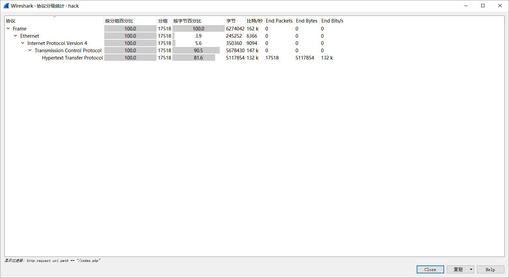

[EN](./Wireshark.md) | [ZH](./Wireshark-zh.md)
## Wireshark 常用功能介绍

### 显示过滤器

显示过滤器可以用很多不同的参数来作为匹配标准，比如IP地址、协议、端口号、某些协议头部的参数。此外，用户也用一些条件工具和串联运算符创建出更加复杂的表达式。用户可以将不同的表达式组合起来，让软件显示的数据包范围更加精确。在数据包列表面板中显示的所有数据包都可以用数据包中包含的字段进行过滤。

```
[not] Expression [and|or] [not] Expression
```

经常要用到各种运算符

| 运算符 | 说明      |
| ------ | --------- |
| ==     | 等于      |
| !=     | 不等于    |
| >      | 大于      |
| <      | 小于      |
| >=     | 大于等于  |
| <=     | 小于等于  |
| 与     | and , &&  |
| 或     | or , \|\| |
| 非     | ! , not   |

#### 配置方法

1. 借助于过滤器窗口

   

2. 借助于工具条的输入栏

   

3. 将数据包某个属性值指定为过滤条件

   

!!! note
​    复杂的过滤命令可以直接通过第三种方式得到过滤语法

### 信息统计

#### Protocol History(协议分级)

这个窗口现实的是捕捉文件包含的所有协议的树状分支



包含的字段

| 名称          | 含义                                           |
| ------------- | ---------------------------------------------- |
| Protocol：    | 协议名称                                       |
| % Packets：   | 含有该协议的包数目在捕捉文件所有包所占的比例   |
| Packets：     | 含有该协议的包的数目                           |
| Bytes：       | 含有该协议的字节数                             |
| Mbit/s：      | 抓包时间内的协议带宽                           |
| End Packets： | 该协议中的包的数目（作为文件中的最高协议层）   |
| End Bytes：   | 该协议中的字节数（作为文件中的最高协议层）     |
| End Mbit/s：  | 抓包时间内的协议带宽（作为文件中的最高协议层） |

这一功能可以为分析数据包的主要方向提供依据

#### Conversation(对话)

发生于一特定端点的IP间的所有流量.


!!! note
​    - 查看收发大量数据流的IP地址。如果是你知道的服务器（你记得服务器的地址或地址范围），那问题就解决了；但也有可能只是某台设备正在扫描网络，或仅是一台产生过多数据的PC。
​    - 查看扫描模式（scan pattern）。这可能是一次正常的扫描，如SNMP软件发送ping报文以查找网络，但通常扫描都不是好事情

#### EndPoints(端点)

这一工具列出了Wireshark发现的所有endpoints上的统计信息


#### HTTP

- Packet Counter

  

**参考**

- http://blog.jobbole.com/73482/
- http://www.vuln.cn/2103

### 信息统计 进阶版

根据总体信息迅速把握流量包总体特征,搞清楚 **做什么?**

TODO

## 