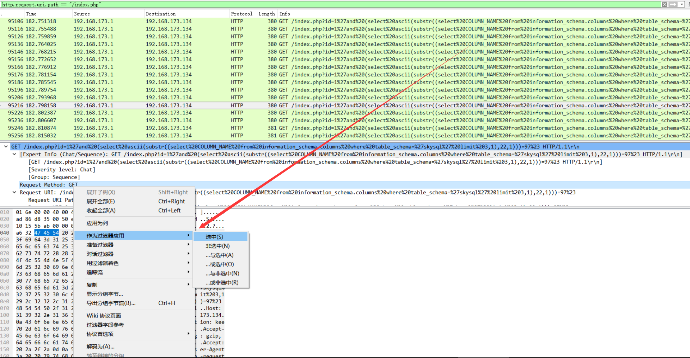

[EN](./Wireshark.md) | [ZH](./Wireshark-zh.md)
## Wireshark Introduction to Common Functions


### Display filter


Display filters can use many different parameters as matching criteria, such as IP address, protocol, port number, and parameters of some protocol headers. In addition, users use some conditional tools and concatenation operators to create more complex expressions. Users can combine different expressions to make the software display a more precise range of packets. All packets displayed in the packet list panel can be filtered with the fields contained in the packet.


```

[not] Expression [and|or] [not] Expression

```


Often use a variety of operators


| Operator | Description |
| ------ | --------- |

| == | equals |
| != | Not equal |
| &gt; | Greater than |
| &lt; | Less than |
| &gt;= | Greater than or equal to |
| &lt;= | Less than or equal to |
| with | and , &amp;&amp; |
| 或     | or , \|\| |

| non| ! , not |


#### Configuration Method


By means of the filter window


   


2. With the help bar of the toolbar


   


3. Specify a property value for the packet as a filter


   


!!! note

Complex filtering commands can be filtered directly in the third way.


### Information Statistics


#### Protocol History


The reality of this window is to capture the tree branch of all the protocols contained in the file.


Included fields


| Name | Meaning |
| ------------- | ---------------------------------------------- |

| Protocol: | Protocol Name|
| % Packets: | The number of packages containing this protocol is the ratio of all packets in the capture file |
| Packets: | Number of packages containing this protocol |
| Bytes: | Number of bytes containing this protocol |
| Mbit/s: | Protocol Bandwidth in Capture Time |
End Packets: | Number of packets in the protocol (as the highest protocol layer in the file) |
| End Bytes: | The number of bytes in the protocol (as the highest protocol layer in the file) |
End Mbit/s: | Protocol bandwidth during capture time (as the highest protocol layer in the file) |


This feature can provide a basis for analyzing the main directions of the data packet.


#### Conversation(Dialog)


All traffic between IPs that occur at a particular endpoint.


!!! note

- View the IP address that sends and receives a large number of data streams. If it&#39;s the server you know (you remember the server&#39;s address or address range), then the problem is solved; but it&#39;s also possible that just one device is scanning the network, or just a PC that generates too much data.
- View the scan pattern. This may be a normal scan, such as SNMP software sending ping messages to find the network, but usually scanning is not a good thing


#### EndPoints (Endpoints)


This tool lists statistics on all endpoints found by Wireshark.


#### HTTP


- Packet Counter


  


**reference**


- http://blog.jobbole.com/73482/

- http://www.vuln.cn/2103


### Information Statistics Advanced Edition


Quickly grasp the overall characteristics of the traffic package based on the overall information, and figure out what to do?**


ALL


## 