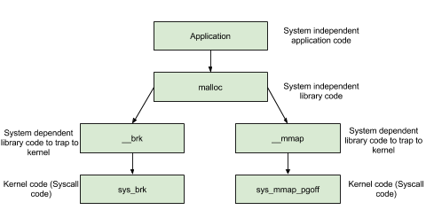

[EN](./heap_overview.md) | [ZH](./heap_overview-zh.md)
---

typora-root-url: ../../../docs

---


#堆 overview


## What is a heap?


The heap can provide dynamically allocated memory while the program is running, allowing the program to request memory of unknown size. The heap is actually a continuous linear region of the program virtual address space, which grows from a low address to a high address. We generally refer to the part of the program that manages the heap as the heap manager.


The heap manager is in the middle of the user program and the kernel, mainly doing the following work.


1. In response to the user&#39;s request for a memory request, request memory from the operating system and return it to the user program. At the same time, in order to maintain the efficiency of memory management, the kernel generally pre-allocates a large piece of contiguous memory, and then let the heap manager manage the memory through some algorithm. The heap manager will interact with the operating system again only if there is insufficient heap space.
2. Manage the memory released by the user. In general, the memory released by the user is not directly returned to the operating system, but is managed by the heap manager. These released memory can respond to requests from the user for newly requested memory.


Early heap allocation and reclamation in Linux was implemented by Doug Lea, but it shared the heap memory space of the process when it processed multiple threads in parallel. Therefore, for security, when a thread uses a heap, it locks. At the same time, however, locking can cause other threads to be unable to use the heap, reducing the efficiency of memory allocation and reclamation. At the same time, if it is not properly controlled when it is used by multiple threads, it may affect the correctness of memory allocation and recycling. Wolfram Gloger has been improved on top of Doug Lea to support multithreading. This heap allocator is ptmalloc. After glibc-2.3.x., ptmalloc2 is integrated in glibc.


The heap allocator currently used in the Linux standard distribution is the heap allocator in glibc: ptmalloc2. Ptmalloc2 mainly allocates and frees memory blocks through the malloc/free function.


It should be noted that in the process of memory allocation and use, Linux has such a basic memory management idea, ** only when a real address is accessed, the system will establish a mapping relationship between virtual pages and physical pages**. So although the operating system has allocated a large chunk of memory to the program, this memory is actually just virtual memory. Only when the user uses the corresponding memory will the system actually allocate the physical page to the user.


## heap basic operations


Here we mainly introduce


- Basic heap operations, including heap allocation, reclamation, system calls behind heap allocation
- Introducing the current multithreading support for the heap.


### malloc


In glibc&#39;s [malloc.c] (https://github.com/iromise/glibc/blob/master/malloc/malloc.c#L448), the description of malloc is as follows


```c++

/*

  malloc(size_t n)

  Returns a pointer to a newly allocated chunk of at least n bytes, or null

  if no space is available. Additionally, on failure, errno is

  set to ENOMEM on ANSI C systems.

  If n is zero, malloc returns a minumum-sized chunk. (The minimum

  size is 16 bytes on most 32bit systems, and 24 or 32 bytes on 64bit

  systems.)  On most systems, size_t is an unsigned type, so calls

  with negative arguments are interpreted as requests for huge amounts

  of space, which will often fail. The maximum supported value of n

  differs across systems, but is in all cases less than the maximum

  representable value of a size_t.

*/

```


As you can see, the malloc function returns a pointer to the memory block of the corresponding size byte. In addition, the function also handles some exceptions.


- When n=0, returns the smallest memory block of the heap allowed by the current system.
- When n is negative, since **size_t is an unsigned number (which is very important)** on most systems, the program will apply for a large amount of memory, but usually it will fail because the system Not so much memory can be allocated.


### free


In glibc&#39;s [malloc.c] (https://github.com/iromise/glibc/blob/master/malloc/malloc.c#L465), the description of free is as follows


```c++

/*

      free(void* p)

      Releases the chunk of memory pointed to by p, that had been previously

      allocated using malloc or a related routine such as realloc.

      It has no effect if p is null. It can have arbitrary (i.e., bad!)

      effects if p has already been freed.

      Unless disabled (using mallopt), freeing very large spaces will

      when possible, automatically trigger operations that give

      back unused memory to the system, thus reducing program footprint.

    */

```


As you can see, the free function releases the memory block pointed to by p. This memory block may be obtained through the malloc function, or it may be obtained through the related function realloc.


In addition, this function also handles exceptions.


- ** When p is a null pointer, the function does nothing. **
- When p has been released, releasing it again will have a messy effect, which is actually `double free`.
- In addition to being disabled (mallopt), when a large amount of memory is freed, the program will return the memory to the system in order to reduce the memory space used by the program.


### System call behind memory allocation


In the functions mentioned above, whether it is malloc function or free function, we use it frequently when we apply and release memory dynamically, but they are not functions that really interact with the system. The system calls behind these functions are mainly [(s)brk](http://man7.org/linux/man-pages/man2/sbrk.2.html) functions and [mmap, munmap](http://man7 .org/linux/man-pages/man2/mmap.2.html) function.


As shown in the following figure, we mainly consider the operation of applying for a memory block to the heap.





#### (s) brk


For heap operations, the operating system provides brk functions, and the glibc library provides sbrk functions. We can request memory from the operating system by increasing the size of [brk] (https://en.wikipedia.org/wiki/Sbrk).


Initially, the starting address of the heap [start_brk] (http://elixir.free-electrons.com/linux/v3.8/source/include/linux/mm_types.h#L365) and the current end of the heap [brk] (http://elixir.free-electrons.com/linux/v3.8/source/include/linux/mm_types.h#L365) Point to the same address. The exact location of the two will vary depending on whether ASLR is turned on.


- When ASLR protection is not enabled, start_brk and brk point to the end of the data/bss section.
- When ASLR protection is turned on, start_brk and brk also point to the same location, except that this location is at a random offset after the end of the data/bss section.


The specific effect is as follows (this picture is basically the same as that spread on the Internet, here is because you have to draw a large picture, so you have drawn it separately)


**example**


```c

/* sbrk and brk example */

#include <stdio.h>

#include <unistd.h>

#include <sys/types.h>


int main()

{

        void *curr_brk, *tmp_brk = NULL;


        printf("Welcome to sbrk example:%d\n", getpid());


        /* sbrk(0) gives current program break location */

tmp_brk = curr_brk = sbrk (0);
        printf("Program Break Location1:%p\n", curr_brk);

        getchar();


        /* brk(addr) increments/decrements program break location */

brk (+ curr_brk 4096);


curr_brk = sbrk (0);
        printf("Program break Location2:%p\n", curr_brk);

        getchar();


BRK (tmp_brk);

curr_brk = sbrk (0);
        printf("Program Break Location3:%p\n", curr_brk);

        getchar();


        return 0;

}

```


It should be noted that the getchar() function is executed after each execution, which is for us to see the true mapping of the program.


**Before the first call to brk**


As you can see from the output below, there is no heap. therefore


- start_brk = brk = end_data = 0x804b000


```shell

sploitfun@sploitfun-VirtualBox:~/ptmalloc.ppt/syscalls$ ./sbrk

Welcome to sbrk example:6141

Program Break Location1:0x804b000

...

sploitfun@sploitfun-VirtualBox:~/ptmalloc.ppt/syscalls$ cat /proc/6141/maps

...

0804a000-0804b000 rw-p 00001000 08:01 539624 /home/sploitfun/ptmalloc.ppt/syscalls/sbrk
b7e21000-b7e22000 rw-p 00000000 00:00 0
...

sploitfun@sploitfun-VirtualBox:~/ptmalloc.ppt/syscalls$

```


**After adding brk for the first time**


As you can see from the output below, the heap segment has appeared.


- start_brk = end_data = 0x804b000

- brk = 0x804c000


```shell

sploitfun@sploitfun-VirtualBox:~/ptmalloc.ppt/syscalls$ ./sbrk

Welcome to sbrk example:6141

Program Break Location1:0x804b000

Program Break Location2:0x804c000

...

sploitfun@sploitfun-VirtualBox:~/ptmalloc.ppt/syscalls$ cat /proc/6141/maps

...

0804a000-0804b000 rw-p 00001000 08:01 539624 /home/sploitfun/ptmalloc.ppt/syscalls/sbrk
0804b000-0804c000 rw-p 00000000 00:00 0          [heap]

b7e21000-b7e22000 rw-p 00000000 00:00 0
...

sploitfun@sploitfun-VirtualBox:~/ptmalloc.ppt/syscalls$

```


Among them, the row about the heap


- 0x0804b000 is the starting address of the corresponding heap
- rw-p indicates that the heap has read and write permissions and is private data.
- 00000000 indicates a file offset, which is 0 because this part of the content is not mapped from the file.
- 00:00 is the device number of the master/slave (Major/mirror). This part of the content is not mapped from the file, so it is also 0.
- 0 indicates the Inode number. Since this part of the content is not mapped from the file, it is 0.


#### mmap


Malloc will use [mmap] (http://lxr.free-electrons.com/source/mm/mmap.c?v=3.8#L1285) to create a separate anonymous map segment. The purpose of anonymous mapping is mainly to apply for memory filled with 0, and this memory is only used by the calling process.


**example**


```c++

/* Private anonymous mapping example using mmap syscall */

##include <stdio.h>

##include <sys/mman.h>

##include <sys/types.h>

##include <sys/stat.h>

##include <fcntl.h>

##include <unistd.h>

##include <stdlib.h>


void static inline errExit(const char* msg)

{

        printf("%s failed. Exiting the process\n", msg);

        exit(-1);

}


int main()

{

int right = -1;
        printf("Welcome to private anonymous mapping example::PID:%d\n", getpid());

        printf("Before mmap\n");

        getchar();

        char* addr = NULL;

        addr = mmap(NULL, (size_t)132*1024, PROT_READ|PROT_WRITE, MAP_PRIVATE | MAP_ANONYMOUS, -1, 0);

        if (addr == MAP_FAILED)

                errExit("mmap");

        printf("After mmap\n");

        getchar();


        /* Unmap mapped region. */

        ret = munmap(addr, (size_t)132*1024);

if (right == -1)
erreximus ( &quot;munmap&quot;);
        printf("After munmap\n");

        getchar();

        return 0;

}

```


**Before executing mmap**


We can see from the output below that there is currently only the mmap segment of the .so file.


```shell

sploitfun@sploitfun-VirtualBox:~/ptmalloc.ppt/syscalls$ cat /proc/6067/maps

08048000-08049000 r-xp 00000000 08:01 539691 /home/sploitfun/ptmalloc.ppt/syscalls/mmap
08049000-0804a000 r--p 00000000 08:01 539691     /home/sploitfun/ptmalloc.ppt/syscalls/mmap

0804a000-0804b000 rw-p 00001000 08:01 539691 /home/sploitfun/ptmalloc.ppt/syscalls/mmap
b7e21000-b7e22000 rw-p 00000000 00:00 0
...

sploitfun@sploitfun-VirtualBox:~/ptmalloc.ppt/syscalls$

```


**mmap after **


As can be seen from the output below, the memory we applied for is combined with the existing memory segment to form the mmap segment of b7e00000 to b7e21000.


```shell

sploitfun@sploitfun-VirtualBox:~/ptmalloc.ppt/syscalls$ cat /proc/6067/maps

08048000-08049000 r-xp 00000000 08:01 539691 /home/sploitfun/ptmalloc.ppt/syscalls/mmap
08049000-0804a000 r--p 00000000 08:01 539691     /home/sploitfun/ptmalloc.ppt/syscalls/mmap

0804a000-0804b000 rw-p 00001000 08:01 539691 /home/sploitfun/ptmalloc.ppt/syscalls/mmapb7e00000-b7e22000 rw-p 00000000 00:00 0
...

sploitfun@sploitfun-VirtualBox:~/ptmalloc.ppt/syscalls$

```


**munmap**


From the output below, we can see that the memory segment we originally applied has disappeared, and the memory segment has returned to its original state.


```shell

sploitfun@sploitfun-VirtualBox:~/ptmalloc.ppt/syscalls$ cat /proc/6067/maps

08048000-08049000 r-xp 00000000 08:01 539691 /home/sploitfun/ptmalloc.ppt/syscalls/mmap
08049000-0804a000 r--p 00000000 08:01 539691     /home/sploitfun/ptmalloc.ppt/syscalls/mmap

0804a000-0804b000 rw-p 00001000 08:01 539691 /home/sploitfun/ptmalloc.ppt/syscalls/mmap
b7e21000-b7e22000 rw-p 00000000 00:00 0
...

sploitfun@sploitfun-VirtualBox:~/ptmalloc.ppt/syscalls$

```


### Multi-threading support


In the original dlmalloc implementation, when two threads were simultaneously requesting memory, only one thread could enter the critical section to apply for memory, while another thread had to wait until there were no more threads in the critical section. This is because all threads share a heap. In gmbc&#39;s ptmalloc implementation, a better point is to support multi-threaded fast access. In the new implementation, all threads share multiple heaps.


Here is an example.


```c++

/* Per thread arena example. */

##include <stdio.h>

##include <stdlib.h>

##include <pthread.h>

##include <unistd.h>

##include <sys/types.h>


void* threadFunc(void* arg) {

        printf("Before malloc in thread 1\n");

        getchar();

        char* addr = (char*) malloc(1000);

        printf("After malloc and before free in thread 1\n");

        getchar();

        free(addr);

        printf("After free in thread 1\n");

        getchar();

}


int main() {

        pthread_t t1;

        void* s;

int right;
        char* addr;


        printf("Welcome to per thread arena example::%d\n",getpid());

        printf("Before malloc in main thread\n");

        getchar();

        addr = (char*) malloc(1000);

        printf("After malloc and before free in main thread\n");

        getchar();

        free(addr);

        printf("After free in main thread\n");

        getchar();

        ret = pthread_create(&t1, NULL, threadFunc, NULL);

if (right)
        {

                printf("Thread creation error\n");

                return -1;

        }

        ret = pthread_join(t1, &s);

if (right)
        {

                printf("Thread join error\n");

                return -1;

        }

        return 0;

}

```


**Before the first application**, there are no piles.


```shell

sploitfun@sploitfun-VirtualBox:~/ptmalloc.ppt/mthread$ ./mthread

Welcome to per thread arena example::6501

Before malloc in main thread

...

sploitfun@sploitfun-VirtualBox:~/ptmalloc.ppt/mthread$ cat /proc/6501/maps

08048000-08049000 r-xp 00000000 08:01 539625 /home/sploitfun/ptmalloc.ppt/mthread/mthread
08049000-0804a000 r--p 00000000 08:01 539625     /home/sploitfun/ptmalloc.ppt/mthread/mthread

0804a000-0804b000 rw-p 00001000 08:01 539625 /home/sploitfun/ptmalloc.ppt/mthread/mthread
b7e05000-b7e07000 rw-p 00000000 00:00 0
...

sploitfun@sploitfun-VirtualBox:~/ptmalloc.ppt/mthread$

```


**After the first application**, as you can see from the output below, the heap segment is created and it is next to the data segment, which means that the malloc is implemented with the brk function. At the same time, it should be noted that although we only applied for 1000 bytes, we got a heap of 0x0806c000-0x0804b000=0x21000 bytes. **This means that although the program may only request a small amount of memory from the operating system, for convenience, the operating system allocates a large amount of memory to the program. In this case, the switching between the kernel state and the user state is avoided, and the efficiency of the program is improved. ** We call this contiguous memory area as arena. In addition, we call the memory requested by the main thread as main_arena. The memory of subsequent applications will always be obtained from this arena until there is not enough space. When there is not enough space in the arena, it can increase the heap space by adding brk. Similarly, arena can also shrink its space by reducing brk.


```shell

sploitfun@sploitfun-VirtualBox:~/ptmalloc.ppt/mthread$ ./mthread

Welcome to per thread arena example::6501

Before malloc in main thread

After malloc and before free in main thread

...

sploitfun@sploitfun-VirtualBox:~/lsploits/hof/ptmalloc.ppt/mthread$ cat /proc/6501/maps

08048000-08049000 r-xp 00000000 08:01 539625 /home/sploitfun/ptmalloc.ppt/mthread/mthread
08049000-0804a000 r--p 00000000 08:01 539625     /home/sploitfun/ptmalloc.ppt/mthread/mthread

0804a000-0804b000 rw-p 00001000 08:01 539625 /home/sploitfun/ptmalloc.ppt/mthread/mthread
0804b000-0806c000 rw-p 00000000 00:00 0          [heap]

b7e05000-b7e07000 rw-p 00000000 00:00 0
...

sploitfun@sploitfun-VirtualBox:~/ptmalloc.ppt/mthread$

```


** After the main thread releases the memory, we can see from the output below that the corresponding arena is not recycled, but is managed by glibc. When the later program requests memory again, glibc allocates the corresponding memory to the program according to the heap allocation algorithm when the memory managed by glibc is sufficient.


```shell

sploitfun@sploitfun-VirtualBox:~/ptmalloc.ppt/mthread$ ./mthread

Welcome to per thread arena example::6501

Before malloc in main thread

After malloc and before free in main thread

After free in main thread

...

sploitfun@sploitfun-VirtualBox:~/lsploits/hof/ptmalloc.ppt/mthread$ cat /proc/6501/maps

08048000-08049000 r-xp 00000000 08:01 539625 /home/sploitfun/ptmalloc.ppt/mthread/mthread
08049000-0804a000 r--p 00000000 08:01 539625     /home/sploitfun/ptmalloc.ppt/mthread/mthread

0804a000-0804b000 rw-p 00001000 08:01 539625 /home/sploitfun/ptmalloc.ppt/mthread/mthread
0804b000-0806c000 rw-p 00000000 00:00 0          [heap]

b7e05000-b7e07000 rw-p 00000000 00:00 0
...

sploitfun@sploitfun-VirtualBox:~/ptmalloc.ppt/mthread$

```


**Before the first thread malloc**, we can see that there is no heap associated with thread 1, but there is a stack associated with thread 1.


```shell

sploitfun@sploitfun-VirtualBox:~/ptmalloc.ppt/mthread$ ./mthread

Welcome to per thread arena example::6501

Before malloc in main thread

After malloc and before free in main thread

After free in main thread

Before malloc in thread 1

...

sploitfun@sploitfun-VirtualBox:~/ptmalloc.ppt/mthread$ cat /proc/6501/maps

08048000-08049000 r-xp 00000000 08:01 539625 /home/sploitfun/ptmalloc.ppt/mthread/mthread
08049000-0804a000 r--p 00000000 08:01 539625     /home/sploitfun/ptmalloc.ppt/mthread/mthread

0804a000-0804b000 rw-p 00001000 08:01 539625 /home/sploitfun/ptmalloc.ppt/mthread/mthread
0804b000-0806c000 rw-p 00000000 00:00 0          [heap]

b7604000-b7605000 ---p 00000000 00:00 0

b7605000-b7e07000 rw-p 00000000 00:00 0          [stack:6594]

...

sploitfun@sploitfun-VirtualBox:~/ptmalloc.ppt/mthread$

```


**The first thread after malloc**, we can see from the output below that the heap segment of thread 1 was created. And its location is the memory mapped segment area, the same size is also 132KB (b7500000-b7521000). So this indicates that the corresponding function behind the thread is the mmap function. At the same time, we can see that the actual memory allocated to the program is 1M (b7500000-b7600000). Moreover, only 132KB of the part has readable and writable permissions, and this contiguous area becomes the thread arena.


note:


&gt; When the memory requested by the user is greater than 128KB, and no arena has enough space, then the system will execute the mmap function to allocate the corresponding memory space. This is independent of whether the request comes from the main thread or from the thread.


```shell

sploitfun@sploitfun-VirtualBox:~/ptmalloc.ppt/mthread$ ./mthread

Welcome to per thread arena example::6501

Before malloc in main thread

After malloc and before free in main thread

After free in main thread

Before malloc in thread 1

After malloc and before free in thread 1

...

sploitfun@sploitfun-VirtualBox:~/ptmalloc.ppt/mthread$ cat /proc/6501/maps

08048000-08049000 r-xp 00000000 08:01 539625 /home/sploitfun/ptmalloc.ppt/mthread/mthread
08049000-0804a000 r--p 00000000 08:01 539625     /home/sploitfun/ptmalloc.ppt/mthread/mthread

0804a000-0804b000 rw-p 00001000 08:01 539625 /home/sploitfun/ptmalloc.ppt/mthread/mthread
0804b000-0806c000 rw-p 00000000 00:00 0          [heap]

b7500000-b7521000 rw-p 00000000 00:00 0
b7521000-b7600000 ---p 00000000 00:00 0

b7604000-b7605000 ---p 00000000 00:00 0

b7605000-b7e07000 rw-p 00000000 00:00 0          [stack:6594]

...

sploitfun@sploitfun-VirtualBox:~/ptmalloc.ppt/mthread$

```


** After the first thread releases the memory, we can see from the output below that releasing the memory will not re-send the memory to the system.


```shell

sploitfun@sploitfun-VirtualBox:~/ptmalloc.ppt/mthread$ ./mthread

Welcome to per thread arena example::6501

Before malloc in main thread

After malloc and before free in main thread

After free in main thread

Before malloc in thread 1

After malloc and before free in thread 1

After free in thread 1

...

sploitfun@sploitfun-VirtualBox:~/ptmalloc.ppt/mthread$ cat /proc/6501/maps

08048000-08049000 r-xp 00000000 08:01 539625 /home/sploitfun/ptmalloc.ppt/mthread/mthread
08049000-0804a000 r--p 00000000 08:01 539625     /home/sploitfun/ptmalloc.ppt/mthread/mthread

0804a000-0804b000 rw-p 00001000 08:01 539625 /home/sploitfun/ptmalloc.ppt/mthread/mthread
0804b000-0806c000 rw-p 00000000 00:00 0          [heap]

b7500000-b7521000 rw-p 00000000 00:00 0
b7521000-b7600000 ---p 00000000 00:00 0

b7604000-b7605000 ---p 00000000 00:00 0

b7605000-b7e07000 rw-p 00000000 00:00 0          [stack:6594]

...

sploitfun@sploitfun-VirtualBox:~/ptmalloc.ppt/mthread$

```


## references


- [sploitfun](https://sploitfun.wordpress.com/archives/)
