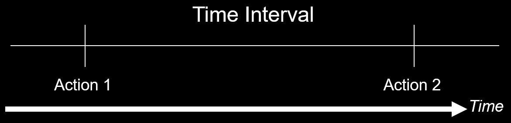

[EN](./introduction.md) | [ZH](./introduction-zh.md)
---
typora-root-url: ../../../docs
---

# Race Condition

## 概述

条件竞争是指一个系统的运行结果依赖于不受控制的事件的先后顺序。当这些不受控制的事件并没有按照开发者想要的方式运行时，就可能会出现 bug。这个术语最初来自于两个电信号互相竞争来影响输出结果。


条件竞争主要出现在如下领域

- 电子系统，尤其是逻辑电路
- 计算机，尤其是多线程程序和分布式程序。

由于目前的系统中大量采用并发编程，经常对资源进行共享，往往会产生条件竞争漏洞。

这里我们主要考虑计算机程序方面的条件竞争。当一个软件的运行结果依赖于进程或者线程的顺序时，就可能会出现条件竞争。简单考虑一下，可以知道条件竞争需要如下的**条件**：

- 并发，即至少存在两个并发执行流。这里的执行流包括线程，进程，任务等级别的执行流。
- 共享对象，即多个并发流会访问同一对象。**常见的共享对象有共享内存，文件系统，信号。一般来说，这些共享对象是用来使得多个程序执行流相互交流。**此外，我们称访问共享对象的代码为**临界区**。在正常写代码时，这部分应该加锁。
- 改变对象，即至少有一个控制流会改变竞争对象的状态。因为如果程序只是对对象进行读操作，那么并不会产生条件竞争。

由于在并发时，执行流的不确定性很大，条件竞争相对**难察觉**，并且在**复现和调试方面会比较困难**。这给修复条件竞争也带来了不小的困难。

条件竞争造成的影响也是多样的，轻则程序异常执行，重则程序崩溃。如果条件竞争漏洞被攻击者利用的话，很有可能会使得攻击者获得相应系统的特权。

这里举一个简单的例子。

```c
#include <pthread.h>
#include <stdio.h>

int counter;
void *IncreaseCounter(void *args) {
  counter += 1;
  sleep(0.1);
  printf("Thread %d has counter value %d\n", (unsigned int)pthread_self(),
         counter);
}

int main() {
  pthread_t p[10];
  for (int i = 0; i < 10; ++i) {
    pthread_create(&p[i], NULL, IncreaseCounter, NULL);
  }
  for (int i = 0; i < 10; ++i) {
    pthread_join(p[i], NULL);
  }
  return 0;
}

```

一般来说，我们可能希望按如下方式输出

```shell
➜  005race_condition ./example1
Thread 1859024640 has counter value 1
Thread 1841583872 has counter value 2
Thread 1832863488 has counter value 3
Thread 1824143104 has counter value 4
Thread 1744828160 has counter value 5
Thread 1736107776 has counter value 6
Thread 1727387392 has counter value 7
Thread 1850304256 has counter value 8
Thread 1709946624 has counter value 9
Thread 1718667008 has counter value 10
```

但是，由于条件竞争的存在，最后输出的结果往往不尽人意

```c
➜  005race_condition ./example1
Thread 1417475840 has counter value 2
Thread 1408755456 has counter value 2
Thread 1391314688 has counter value 8
Thread 1356433152 has counter value 8
Thread 1365153536 has counter value 8
Thread 1373873920 has counter value 8
Thread 1382594304 has counter value 8
Thread 1400035072 has counter value 8
Thread 1275066112 has counter value 9
Thread 1266345728 has counter value 10
```

仔细思考一下条件竞争为什么可能会发生呢？以下面的为具体的例子

- 程序首先执行了action1，然后执行了action2。其中 action 可能是应用级别的，也可能是操作系统级别的。正常来说，我们希望程序在执行 action2 时，action1 所产生的条件仍然是满足的。
- 但是由于程序的并发性，攻击者很有可能可以在 action2 执行之前的这个短暂的时间窗口中破坏 action1 所产生的条件。这时候攻击者的操作与 action2 产生了条件竞争，所以可能会影响程序的执行效果。



所以我认为问题的根源在于程序员虽然假设某个条件在相应时间段应该是满足的，但是往往条件可能会在这个很小的时间窗口中被修改。**虽然这个时间的间隔可能非常小，但是攻击者仍然可能可以通过执行某些操作（如计算密集型操作，Dos攻击）使得受害机器的处理速度变得相对慢一些。**

## 形式

常见的条件竞争有以下形式。

### CWE-367: TOCTOU Race Condition

#### 描述

TOCTOC (Time-of-check Time-of-use) 指的是程序在使用资源（变量，内存，文件）前会对进行检查，但是在程序使用对应的资源前，该资源却被修改了。


下面给出一些更加具体的例子。

#### CWE-365: Race Condition in Switch

当程序正在执行 switch 语句时，如果 switch 变量的值被改变，那么就可能造成不可预知的行为。尤其在case 语句后不写 break 语句的代码，一旦 switch 变量发生改变，很有可能会改变程序原有的逻辑。

#### CWE-363: Race Condition Enabling Link Following

我们知道 Linux 中提供了两种对于文件的命名方式

- 文件路径名
- 文件描述符

但是，将这两种命名解析到相应对象上的方式有所不同

- 文件路径名在解析的时候是通过传入的路径（文件名，硬链接，软连接）**间接解析**的，其传入的参数并不是相应文件的真实地址(inode)。
- 文件描述符通过访问直接指向文件的指针来解析。

正是由于间接性，产生了上面我们所说的时间窗口。

以下面的代码为例子，程序在访问某个文件之前，会检查是否存在，之后会打开文件然后执行操作。但是如果在检查之后，真正使用文件之前，攻击者将文件修改为某个符号链接，那么程序将访问错误的文件。


这种条件竞争出现的问题的根源在于文件系统中的名字对象绑定的问题。而下面的函数都会使用文件名作为参数：access(), open(), creat(), mkdir(), unlink(), rmdir(), chown(), symlink(), link(), rename(), chroot(),…

那该如何避免这个问题呢？我们可以使用 fstat 函数来读取文件的信息并把它存入到stat结构体中，然后我们可以将该信息与我们已知的信息进行比较来判断我们是否读入了正确的信息。其中，stat结构体中的 `st_ino` 和 `st_dev` 变量可以唯一表示文件

- `st_ino` ，包含了文件的序列号，即 `i-node`
- `st_dev` ，包含了文件对应的设备。


### CWE-364: Signal Handler Race Condition

#### 概述

条件竞争经常会发生在信号处理程序中，这是因为信号处理程序支持异步操作。尤其是当信号处理程序是**不可重入**的或者状态敏感的时候，攻击者可能通过利用信号处理程序中的条件竞争，可能可以达到拒绝服务攻击和代码执行的效果。比如说，如果在信号处理程序中执行了free操作，此时又来了一个信号，然后信号处理程序就会再次执行free操作，这时候就会出现 double free 的情况，再稍微操作一下，就可能可以达到任意地址写的效果了。

一般来说，与信号处理程序有关的常见的条件竞争情况有

- 信号处理程序和普通的代码段共享全局变量和数据段。
- 在不同的信号处理程序中共享状态。
- 信号处理程序本身使用不可重入的函数，比如 malloc 和 free 。
- 一个信号处理函数处理多个信号，这可能会进而导致use after free 和 double free 漏洞。
- 使用 setjmp 或者 longjmp 等机制来使得信号处理程序不能够返回原来的程序执行流。

#### 线程安全与可重入

这里说明一下线程安全与可重入的关系。

-   线程安全
    -   即该函数可以被多个线程调用，而不会出现任何问题。
    -   条件
        -   本身没有任何共享资源
        -   有共享资源，需要加锁。
-   可重用
    -   一个函数可以被多个实例可以同时运行在相同的地址空间中。
    -   可重入函数可以被中断，并且其它代码在进入该函数时，不会丢失数据的完整性。所以可重入函数一定是线程安全的。
    -   可重入强调的是单个线程执行时，重新进入同一个子程序仍然是安全的。
    -   不满足条件
        -   函数体内使用了静态数据结构，并且不是常量
        -   函数体内使用了malloc 或者 free 函数
        -   函数使用了标准 IO 函数。
        -   调用的函数不是可重入的。
    -   可重入函数使用的所有变量都保存在[调用栈](https://zh.wikipedia.org/wiki/%E8%B0%83%E7%94%A8%E6%A0%88)的当前[函数栈](https://zh.wikipedia.org/w/index.php?title=%E5%87%BD%E6%95%B0%E6%A0%88&action=edit&redlink=1)（frame）上。

## 防范

如果想要消除条件竞争，那么首要的目标是找到竞争窗口（race windows）。

所谓竞争窗口，就是访问竞争对象的代码段，这给攻击者相应的机会来修改相应的竞争对象。

一般来说，如果我们可以使得冲突的竞争窗口相互排斥，那么就可以消除竞争条件。

### 同步原语

一般来说，我们会使用同步原语来消除竞争条件。常见的如下

-   锁变量
    -   通常互斥琐，在等待期间放弃CPU，进入idle状态，过一段时间自动尝试。
    -   自旋锁（spinlock），在等待期间不放弃CPU，一直尝试。
-   条件变量
    -   **条件变量是用来等待而不是用来上锁的。条件变量用来自动阻塞一个线程，直到某特殊情况发生为止。通常条件变量和互斥锁同时使用。**
-   临界区对象，CRITICAL_SECTION

-   信号量（semaphore），控制可访问某个临界区的线程数量，一般比1大。
-   管道，指用于连接一个读进程和一个写进程以实现它们之间通信的一个共享文件。其生存期不超过创建管道的进程的生存期。
-   命名管道，生存期可以与操作系统运行期一样长。

```
# 创建管道
mkfifo my_pipe
# gzip从给定的管道中读取数据，并把数据压缩到out.gz中
gzip -9 -c < my_pipe > out.gz &
# 给管道传输数据
cat file > my_pipe
```

### 死锁

#### 概述

当同步原语使用的不恰当的时候，进程就可能会出现死锁。当两个或两个以上的执行流互相阻塞导致都不能继续执行，死锁就会发生。其实，死锁主要是因为在冲突的执行流中，出现了循环等待的执行流，即循环等待中的每一个执行流都获得一个资源，同时试图获得下一个资源。下图所示，P1、P2 两个进程都需要资源才能继续运行。P1 拥有资源 R2、还需要额外资源 R1 才能运行；P2 拥有资源 R1、还需要额外资源 R2 才能运行，两边都在互相等待而没有任何一个可运行。


一般来说，死锁有以下四个必要条件

- 互斥，资源是互斥的。
- 持有和等待，持有已有的资源，同时等待使用下一个资源。
- 不可抢占，进程所获得的资源在未使用完毕之前，资源申请者不能强行地从资源占有者手中夺取资源，而只能由该资源的占有者进程自行释放。
- 循环等待，循环等待资源。

而如果想要消除死锁，也就是打破上面的四个必要条件。

此外，死锁可能来源于以下的原因

- 处理器速度
- 进程或者线程调度算法的变动
- 在执行的过程中，不同内存的限制。
- 任何能够中断程序执行的异步事件。

#### 影响

死锁一般情况下会造成拒绝服务攻击。

## 检测

那么，说到这里，我们有没有可能来检测条件竞争漏洞呢？目前也确实有这方面的研究，也是主要从静态分析和动态分析两个方面来检测。

### 静态检测

目前已知的静态检测工具有

-   [Flawfinder](http://www.dwheeler.com/flawfinder/)
    -   目标：C/C++源码
    -   步骤
        -   建立漏洞数据库
        -   进行简单的文本模式匹配，没有任何的数据流或控制流分析
-   [ThreadSanitizer](https://github.com/google/sanitizers)
    -   目标：C++和GO
    -   实现：LLVM

### 动态检测

- [Intel Inspector](https://en.wikipedia.org/wiki/Intel_Inspector)
- [Valgrind](https://en.wikipedia.org/wiki/Valgrind)

# 参考

- http://www.teraits.com/pitagoras/marcio/segapp/05.ppt
- http://repository.root-me.org/Programmation/C%20-%20C++/EN%20-%20Secure%20Coding%20in%20C%20and%20C++%20Race%20Conditions.pdf
- https://www.blackhat.com/presentations/bh-europe-04/bh-eu-04-tsyrklevich/bh-eu-04-tsyrklevich.pdf
- https://xinhuang.github.io/posts/2014-09-23-detect-race-condition-using-clang-thread-sanitizer.html
- https://llvm.org/devmtg/2011-11/Hutchins_ThreadSafety.pdf
- http://www.cnblogs.com/biyeymyhjob/archive/2012/07/20/2601655.html
- http://www.cnblogs.com/huxiao-tee/p/4660352.html
- https://github.com/dirtycow/dirtycow.github.io
