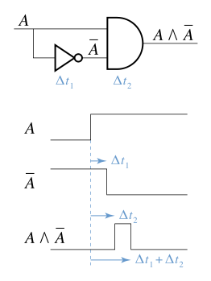
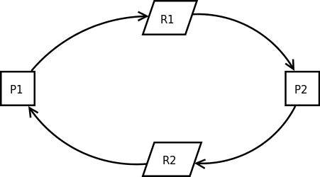

[EN](./introduction.md) | [ZH](./introduction-zh.md)
---

typora-root-url: ../../../docs

---


# Race Condition


## Overview


Conditional competition refers to the order in which a system&#39;s operations depend on the order of uncontrolled events. When these uncontrolled events do not run the way the developer wants, bugs can occur. This term originally comes from the fact that two electrical signals compete with each other to affect the output.





Conditional competition mainly occurs in the following fields


- Electronic systems, especially logic circuits
- Computers, especially multithreaded programs and distributed programs.


Due to the large number of concurrent programming in the current system, resources are often shared, which often leads to conditional competition loopholes.


Here we mainly consider the conditional competition in computer programs. Conditional contention can occur when the results of a piece of software depend on the order of processes or threads. For a simple consideration, you can know that conditional competition requires the following conditions**:


- Concurrency, ie there are at least two concurrent execution flows. The execution flow here includes execution flows at the threads, processes, tasks, and so on.
- Shared objects, that is, multiple concurrent streams access the same object. **Common shared objects have shared memory, file system, and signals. In general, these shared objects are used to allow multiple program execution flows to communicate with each other. ** In addition, we call the code to access the shared object **critical section**. This part should be locked when writing code normally.
- Change the object, ie at least one control flow will change the state of the competing object. Because if the program just reads the object, it does not create conditional competition.


Since the execution flow is highly uncertain at the time of concurrency, conditional competition is relatively difficult to detect, and it is difficult to reproduce and debug. This brings great difficulties to the competition for repair conditions.


The effects of conditional competition are also diverse, and the program is executed abnormally and the program crashes. If the conditional contention vulnerability is exploited by an attacker, it is likely that the attacker will gain the privileges of the corresponding system.


Here is a simple example.


```c

#include <pthread.h>

#include <stdio.h>


int counter;

void *IncreaseCounter(void *args) {

  counter += 1;

  sleep(0.1);

  printf("Thread %d has counter value %d\n", (unsigned int)pthread_self(),

         counter);

}


int main() {

  pthread_t p[10];

  for (int i = 0; i < 10; ++i) {

    pthread_create(&p[i], NULL, IncreaseCounter, NULL);

  }

  for (int i = 0; i < 10; ++i) {

    pthread_join(p[i], NULL);

  }

  return 0;

}


```


In general, we may wish to output as follows


```shell

➜  005race_condition ./example1

Thread 1859024640 has counter value 1

Thread 1841583872 has counter value 2

Thread 1832863488 has counter value 3

Thread 1824143104 has counter value 4

Thread 1744828160 has counter value 5

Thread 1736107776 has counter value 6

Thread 1727387392 has counter value 7

Thread 1850304256 has counter value 8

Thread 1709946624 has counter value 9

Thread 1718667008 has counter value 10

```


However, due to the existence of conditional competition, the final output is often unsatisfactory.


```c

➜  005race_condition ./example1

Thread 1417475840 has counter value 2

Thread 1408755456 has counter value 2

Thread 1391314688 has counter value 8

Thread 1356433152 has counter value 8

Thread 1365153536 has counter value 8

Thread 1373873920 has counter value 8

Thread 1382594304 has counter value 8

Thread 1400035072 has counter value 8

Thread 1275066112 has counter value 9

Thread 1266345728 has counter value 10

```


Think carefully about why conditional competition can happen? Take the following as a specific example


- The program first executed action1 and then executed action2. The action may be at the application level or at the operating system level. Normally, we want the condition generated by action1 to be satisfied when the program executes action2.
- But due to the concurrency of the program, it is very likely that the attacker can destroy the conditions generated by action1 in this short time window before action2 is executed. At this time, the attacker&#39;s operation competes with action2, so it may affect the execution of the program.


So I think the root of the problem is that although the programmer assumes that a certain condition should be satisfied in the corresponding time period, often the condition may be modified in this small time window. **Although the interval between this time may be very small, the attacker may still be able to perform some operations (such as computationally intensive operations, Dos attacks) to make the processing speed of the victim machine relatively slower. **


## Form


Common conditional competition has the following form.


### CWE-367: TOCTOU Race Condition


#### Description


TOCTOC (Time-of-check Time-of-use) refers to the program will check before using resources (variables, memory, files), but the resources are modified before the program uses the corresponding resources.


Some more specific examples are given below.


#### CWE-365: Race Condition in Switch


When the program is executing a switch statement, if the value of the switch variable is changed, it can cause unpredictable behavior. Especially after the case statement does not write the code of the break statement, once the switch variable changes, it is likely to change the original logic of the program.


#### CWE-363: Race Condition Enabling Link Following


We know that there are two ways to name files in Linux.


- File path name
- file descriptor


However, the way these two names are resolved to the corresponding object is different.


- When the file path name is parsed, it is indirectly parsed by the passed path (file name, hard link, soft link)**, and the passed parameters are not the real address (inode) of the corresponding file.
- File descriptors are resolved by accessing a pointer that points directly to the file.

It is because of the indirectness that the time window we mentioned above is produced.


Taking the following code as an example, the program checks for the existence of a file before accessing it, and then opens the file and then performs the operation. But if, after checking, the attacker modifies the file to a symbolic link before actually using the file, the program will access the wrong file.


The root cause of this kind of conditional competition is the problem of name object binding in the file system. The following functions will use the file name as a parameter: access(), open(), creat(), mkdir(), unlink(), rmdir(), chown(), symlink(), link(), rename() , chroot(),...


How to avoid this problem? We can use the fstat function to read the file information and store it in the stat structure, and then we can compare this information with our known information to determine if we have read the correct information. Among them, the `st_ino` and `st_dev` variables in the stat structure can uniquely represent files.


- `st_ino` contains the serial number of the file, ie `i-node`
- `st_dev` contains the device corresponding to the file.


### CWE-364: Signal Handler Race Condition


#### Overview


Conditional competition often occurs in signal handlers because the signal handler supports asynchronous operations. Especially when the signal processing program is **non-reentrant or state sensitive, the attacker may use the conditional competition in the signal processing program to achieve the effect of denial of service attack and code execution. For example, if the free operation is executed in the signal processing program, then a signal is sent again, and then the signal processing program will perform the free operation again. At this time, double free will occur, and then a little operation may be possible. Can achieve the effect of any address write.


In general, the common conditions of competition related to signal processing procedures are


- Signal handlers share common variables and data segments with normal code segments.
- Share status in different signal handlers.
- The signal handler itself uses functions that are not reentrant, such as malloc and free.
- A signal handler handles multiple signals, which in turn can lead to use after free and double free vulnerabilities.
- Use mechanisms such as setjmp or longjmp to prevent the signal handler from returning to the original program execution flow.


#### Thread safe and reentrant


Here is a description of the relationship between thread safety and reentrancy.


- Thread safe
- That is, the function can be called by multiple threads without any problems.
- conditions
- There are no shared resources themselves
- There are shared resources that need to be locked.
- Reusable
- A function can be run in the same address space by multiple instances at the same time.
- Reentrant functions can be interrupted, and other code does not lose data integrity when entering the function. So the reentrant function must be thread safe.
- Reentrant emphasizes that when a single thread executes, it is still safe to re-enter the same subroutine.
- does not meet the conditions
- The function body uses a static data structure and is not a constant
- The function uses the malloc or free function
- The function uses a standard IO function.
- The function called is not reentrant.
- All variables used by the reentrant function are saved in the current [Call Stack] (https://zh.wikipedia.org/wiki/%E8%B0%83%E7%94%A8%E6%A0%88) [Function stack] (https://zh.wikipedia.org/w/index.php?title=%E5%87%BD%E6%95%B0%E6%A0%88&amp;action=edit&amp;redlink=1)(frame) .


## Prevention


If you want to eliminate conditional competition, the primary goal is to find the race windows.


The so-called competition window is the code segment that accesses the competing object, which gives the attacker a corresponding opportunity to modify the corresponding competing object.


In general, if we can make the conflicting competition windows mutually exclusive, then we can eliminate the competition conditions.


### Synchronization primitive


In general, we use synchronization primitives to eliminate race conditions. Common as follows


- lock variable
- Usually mutual exclusion, give up the CPU during the wait, enter the idle state, and try automatically after a while.
- Spinlock, do not give up the CPU while waiting, try it all the time.
- Conditional variables
- ** Condition variables are used to wait instead of being used for locking. Condition variables are used to automatically block a thread until a special condition occurs. Usually condition variables and mutex locks are used at the same time. **
- Critical section object, CRITICAL_SECTION


- A semaphore that controls the number of threads that can access a critical section, typically greater than one.
- Pipeline, a shared file used to connect a read process and a write process to communicate between them. Its lifetime does not exceed the lifetime of the process that created the pipeline.
- Named pipes, which can be as long as the operating system runtime.


```

#Create a pipe
mkfifo my_pipe

# gzip reads data from a given pipe and compresses the data into out.gz
gzip -9 -c < my_pipe > out.gz &

#送数据数据数据
cat file > my_pipe

```


### Deadlock


#### Overview


When the synchronization primitive is used inappropriately, the process may be deadlocked. When two or more execution flows block each other and cannot continue execution, a deadlock occurs. In fact, the deadlock is mainly because in the execution flow of the conflict, there is a loop waiting execution flow, that is, each execution flow in the loop waits to obtain a resource while trying to obtain the next resource. As shown in the figure below, both P1 and P2 processes require resources to continue running. P1 owns resource R2 and needs additional resource R1 to run. P2 owns resource R1 and needs additional resource R2 to run. Both sides wait for each other and no one can run.





In general, deadlocks have the following four requirements:


- Mutually exclusive, resources are mutually exclusive.
- Hold and wait, hold existing resources while waiting for the next resource.
- Cannot be preempted. Before the resources obtained by the process are not used, the resource applicant cannot forcibly seize resources from the resource occupants, but can only be released by the occupant process of the resource.
- Loop wait, loop waiting for resources.


And if you want to eliminate the deadlock, it is to break the four necessary conditions above.


In addition, the deadlock may be due to the following reasons


- Processor speed
- Changes in the process or thread scheduling algorithm
- Different memory limits during the execution process.
- Any asynchronous event that can interrupt program execution.


#### influences


Deadlocks typically cause a denial of service attack.


## Detection


So, when it comes to this, is it possible for us to detect conditional competition loopholes? At present, there is indeed research in this area, and it is mainly detected from two aspects of static analysis and dynamic analysis.


### Static detection


Currently known static detection tools are available


- [Flawfinder] (http://www.dwheeler.com/flawfinder/)
- Target: C/C++ source code
- steps
- Create a vulnerability database
- Simple text pattern matching without any data flow or control flow analysis
-   [ThreadSanitizer](https://github.com/google/sanitizers)

- Target: C++ and GO
- Implementation: LLVM


### Dynamic detection

- [Intel Inspector](https://en.wikipedia.org/wiki/Intel_Inspector)

- [Valgrind](https://en.wikipedia.org/wiki/Valgrind)


# 参考


- http://www.teraits.com/pitagoras/marcio/segapp/05.ppt

- http://repository.root-me.org/Programmation/C%20-%20C++/EN%20-%20Secure%20Coding%20in%20C%20and%20C++%20Race%20Conditions.pdf

- https://www.blackhat.com/presentations/bh-europe-04/bh-eu-04-tsyrklevich/bh-eu-04-tsyrklevich.pdf

- https://xinhuang.github.io/posts/2014-09-23-detect-race-condition-using-clang-thread-sanitizer.html

- https://llvm.org/devmtg/2011-11/Hutchins_ThreadSafety.pdf

- http://www.cnblogs.com/biyeymyhjob/archive/2012/07/20/2601655.html

- http://www.cnblogs.com/huxiao-tee/p/4660352.html

- https://github.com/dirtycow/dirtycow.github.io
