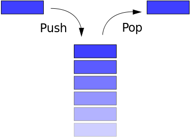
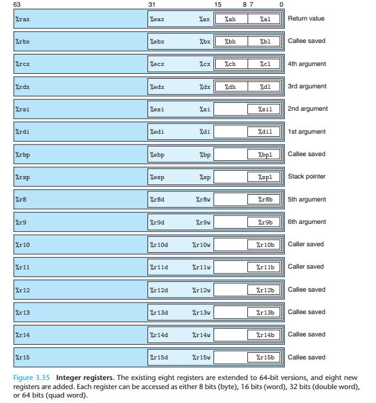

# 栈介绍

## 基本栈介绍

栈是一种典型的后进先出( Last in First Out )的数据结构，其操作主要有压栈(push)与出栈(pop)两种操作，如下图所示（维基百科）。两种操作都操作栈顶，当然，它也有栈底。

高级语言在运行时都会被转换为汇编程序，在汇编程序运行过程中，充分利用了这一数据结构。每个程序在运行时都有虚拟地址空间，其中某一部分就是该程序对应的栈，用于保存函数调用信息和局部变量。此外，常见的操作也是压栈与出栈。需要注意的是，**程序的栈是从进程地址空间的高地址向低地址增长的**。

## 函数调用栈

请务必仔细看一下下面的文章来学习一下基本的函数调用栈。

- [C语言函数调用栈(一)](http://www.cnblogs.com/clover-toeic/p/3755401.html)
- [C语言函数调用栈(二)](http://www.cnblogs.com/clover-toeic/p/3756668.html)

这里再给出另外一张寄存器的图

需要注意的是，32 位和 64 位程序有以下简单的区别

- **x86**
    - **函数参数**在**函数返回地址**的上方
- **x64**
    - System V AMD64 ABI (Linux、FreeBSD、macOS 等采用)中前六个整型或指针参数依次保存在**RDI, RSI, RDX, RCX, R8 和 R9 寄存器**中，如果还有更多的参数的话才会保存在栈上。
    - 内存地址不能大于 0x00007FFFFFFFFFFF，**6 个字节长度**，否则会抛出异常。

## 参考阅读

- csapp
- Calling conventions for different C++ compilers and operating systems, Agner Fog
