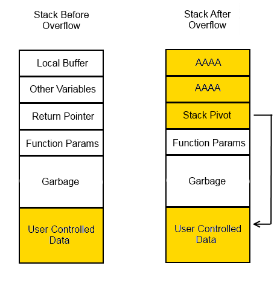
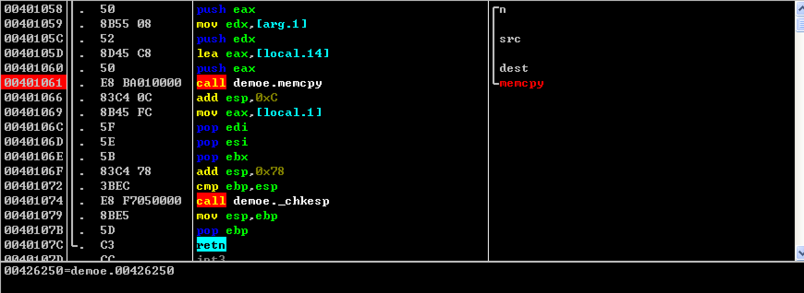
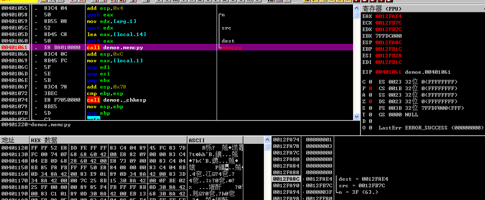
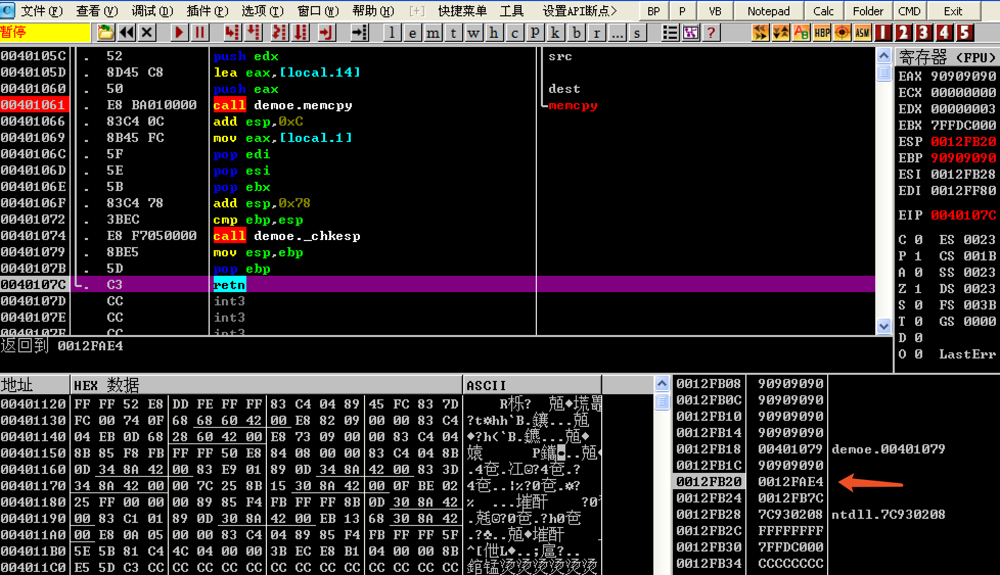
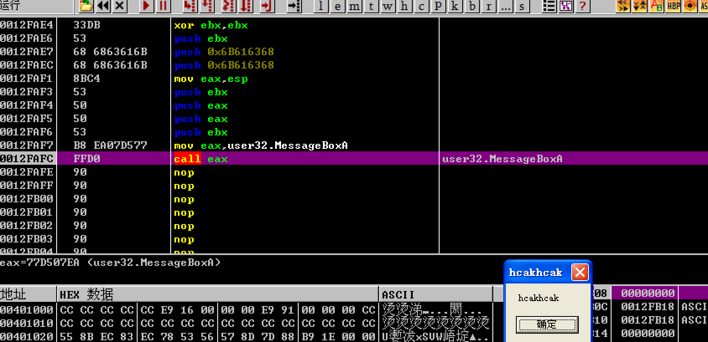

[EN](./shellcode-in-stack.md) | [ZH](./shellcode-in-stack-zh.md)
# 执行 Shellcode


## 介绍 

shellcode 是一段用于利用软件漏洞而执行的代码，shellcode 为16进制之机械码，以其经常让攻击者获得 shell 而得名。shellcode 常常使用机器语言编写。 可在暂存器 eip 溢出后，塞入一段可让 CPU 执行的 shellcode 机械码，让电脑可以执行攻击者的任意指令。在编译时关闭 ASLR、NX 、CANARY 选项，这样就可以在输入时把 shellcode 布置在栈中，通过动态调试获得所需要的 padding 溢出到返回地址为输入的 shellcode 地址，这样程序返回后便会执行 shellcode。




### 示例 

下面给出一个经典例子，验证程序溢出后执行 **shellcode**，编译的环境为 winxp 工具为 vc6.0。

```c
#include <stdio.h>
#include <windows.h>

#define PASSWORD "1234567"

int verify_password(char *password)
{
	int authenticated;
	char buffer[50];
	authenticated = strcmp(password,PASSWORD);
	memcpy(buffer,password,strlen(password)); 
	return authenticated;
}

void main()
{
	int valid_flag =0;
	char password[1024];
	FILE *fp;

	LoadLibrary("user32.dll");

	if (!(fp=fopen("password.txt","rw+")))
	{
		exit(0);
	}
	fscanf(fp,"%s",password);

	valid_flag = verify_password(password);

	if (valid_flag !=0)
	{
		printf("incorrect password!\n\n");
	}
	else
	{
		printf("Congratulation! You have passed the verification!\n");
	}
	fclose(fp);
	getchar();
}
```


编译完成后拖入 OllyDbg 动态调试确定 **padding** 的长度，在 **memcpy** 处下一个断点方便随后调试。可以先生成50 BYTES 的 padding 比较与返回地址的距离，最后确定为60 BYTES 后为返回地址。




输入的字符串会被复制到栈中 **0012FAE4** 的位置。




因为通过合理的 padding 控制了返回地址到 **0012FAE4**，所以在函数返回时寄存器 **EIP** 的值为 **0012FAE4**，这时系统会认为栈中的数据为机器码，程序就会执行地址为 **0012FAE4** 的代码。




**password.txt** 中的内容为精心布置的机器码，功能是弹出一个消息框，内容为 **hackhack**。如何编写 **password.txt** 中的内容，我们放在后面的章节来讲，本章着重介绍整个执行流程。

如我们所期望的，程序返回后执行了弹窗功能。




### 参考阅读 

[0day安全：软件漏洞分析技术]()

[cve-2015-8277](https://www.securifera.com/advisories/cve-2015-8277/)

