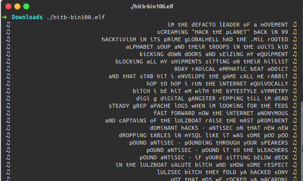
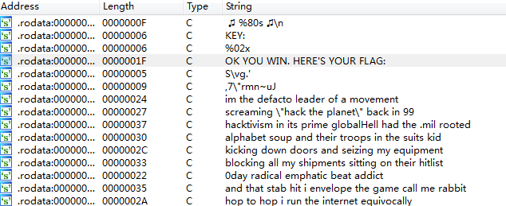
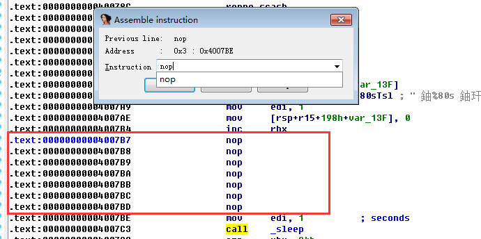
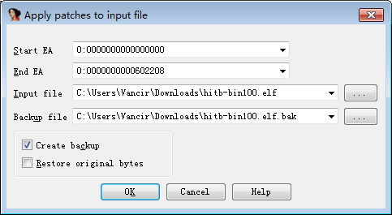
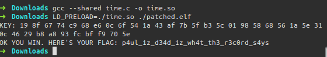

## 原理

正常情况下, Linux 动态加载器`ld-linux`(见man手册ld-linux(8))会搜寻并装载程序所需的共享链接库文件, 而`LD_PRELOAD`是一个可选的环境变量, 包含一个或多个指向共享链接库文件的路径. 加载器会先于C语言运行库之前载入`LD_PRELOAD`指定的共享链接库，也就是所谓的预装载(`preload`)。

预装载意味着会它的函数会比其他库文件中的同名函数先于调用, 也就使得库函数可以被阻截或替换掉. 多个共享链接库文件的路径可以用`冒号`或`空格`进行区分. 显然不会受到`LD_PRELOAD`影响的也就只有那些静态链接的程序了.

当然为避免用于恶意攻击, 在`ruid != euid`的情况下加载器是不会使用`LD_PRELOAD`进行预装载的.

更多阅读: [https://blog.fpmurphy.com/2012/09/all-about-ld_preload.html#ixzz569cbyze4](https://blog.fpmurphy.com/2012/09/all-about-ld_preload.html#ixzz569cbyze4)

## 例题

下面以2014年`Hack In The Box Amsterdam: Bin 100`为例. 题目下载链接: [hitb_bin100.elf](https://github.com/ctf-wiki/ctf-challenges/blob/master/reverse/linux-re/2014_hitb/hitb_bin100.elf)

这是一个64位的ELF文件. 运行结果如下图所示:



程序似乎在一直打印着一些句子. 并且没有停止下来的迹象. 我们就用IDA打开来看一下. 首先按下`Shift+F12`查找字符串.



显然, 除开一直在打印的句子外, 我们发现了一些有趣的字符串:

```
.rodata:0000000000400A53 00000006 C KEY:
.rodata:0000000000400A5F 0000001F C OK YOU WIN. HERE'S YOUR FLAG:
```

我们根据`OK YOU WIN. HERE'S YOUR FLAG: `的交叉引用来到关键代码处(我删去了一些不必要的代码).

```  c
int __cdecl main(int argc, const char **argv, const char **envp)
{
  qmemcpy(v23, &unk_400A7E, sizeof(v23));
  v3 = v22;
  for ( i = 9LL; i; --i )
  {
    *(_DWORD *)v3 = 0;
    v3 += 4;
  }
  v20 = 0x31337;
  v21 = time(0LL);
  do
  {
    v11 = 0LL;
    do
    {
      v5 = 0LL;
      v6 = time(0LL);
      srand(233811181 - v21 + v6); // 初始化随机数种子
      v7 = v22[v11];
      v22[v11] = rand() ^ v7;   // 伪随机数
      v8 = (&funny)[8 * v11];
      while ( v5 < strlen(v8) )
      {
        v9 = v8[v5];
        if ( (_BYTE)v9 == 105 )
        {
          v24[(signed int)v5] = 105;
        }
        else
        {
          if ( (_DWORD)v5 && v8[v5 - 1] != 32 )
            v10 = __ctype_toupper_loc();    // 大写
          else
            v10 = __ctype_tolower_loc();    // 小写
          v24[(signed int)v5] = (*v10)[v9];
        }
        ++v5;
      }
      v24[(signed int)v5] = 0;
      ++v11;
      __printf_chk(1LL, " 鈾%80s 鈾玕n", v24); // 乱码的其实是一个音符
      sleep(1u);
    }
    while ( v11 != 36 );
    --v20;
  }
  while ( v20 );
  v13 = v22;    // key存储在v22数组内
  __printf_chk(1LL, "KEY: ", v12);
  do
  {
    v14 = (unsigned __int8)*v13++;
    __printf_chk(1LL, "%02x ", v14); // 输出key
  }
  while ( v13 != v23 );
  v15 = 0LL;
  putchar(10);
  __printf_chk(1LL, "OK YOU WIN. HERE'S YOUR FLAG: ", v16);
  do
  {
    v17 = v23[v15] ^ v22[v15];  // 跟key的值有异或
    ++v15;
    putchar(v17);   // 输出flag
  }
  while ( v15 != 36 );
  putchar(10);      // 输出换行
  result = 0;
  return result;
}
```

整个的代码流程主要就是在不断地循环输出`funny`里的句子, 满足循环条件后输出`key`, 并用`key`进行异或得到`flag`的值.

但我们可以发现, 整个循环的次数相对来说是比较少的. 所以我们可以采用一些方法, 让循环进行得更快一些. 比如说我手动patch一下, 不让程序输出字符串(实际上`printf`的耗时是相当多的), 其次就是使用`LD_PRELOAD`使得程序的`sleep()`失效. 可以很明显地节省时间.

手动patch的过程比较简单. 我们可以找到代码位置, 然后用一些十六进制编辑器进行修改. 当然我们也可以使用`IDA`来进行patch工作.

``` asm
.text:00000000004007B7                 call    ___printf_chk
.text:00000000004007BC                 xor     eax, eax
```

将光标点在`call    ___printf_chk`上, 然后选择菜单`Edit->Patch Program->Assemble`(当然你可以使用其他patch方式. 效果都一样).  然后将其修改为`nop(0x90)`, 如下图所示



将`4007B7`到`4007BD`之间的汇编代码全部修改为`nop`即可. 然后选择菜单`Edit->Patch Program->Apply patches to input file`. 当然最好做一个备份(即勾选`Create a backup`), 然后点击OK即可(我重命名为了`patched.elf`, 下载链接: [patched.elf](https://github.com/ctf-wiki/ctf-challenges/blob/master/reverse/linux-re/2014_hitb/patched.elf)).



现在进入`LD_PRELOAD`部分. 这里我们简单编写一下c代码, 下载链接: [time.c](https://github.com/ctf-wiki/ctf-challenges/blob/master/reverse/linux-re/2014_hitb/time.c)

``` c
static int t = 0x31337;

void sleep(int sec) {
	t += sec;
}

int time() {
	return t;
}
```

然后使用命令`gcc --shared time.c -o time.so`生成动态链接文件. 当然也给出了下载链接: [time.so](https://github.com/ctf-wiki/ctf-challenges/blob/master/reverse/linux-re/2014_hitb/time.so)

然后打开linux终端, 运行命令: `LD_PRELOAD=./time.so ./patched.elf`



过一会, 你就能听到CPU疯狂运转的声音, 然后很快就出来了flag.
