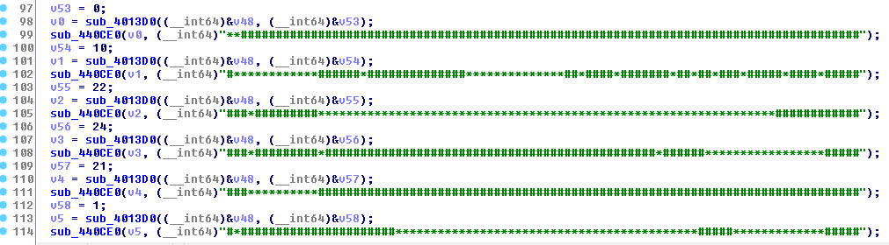
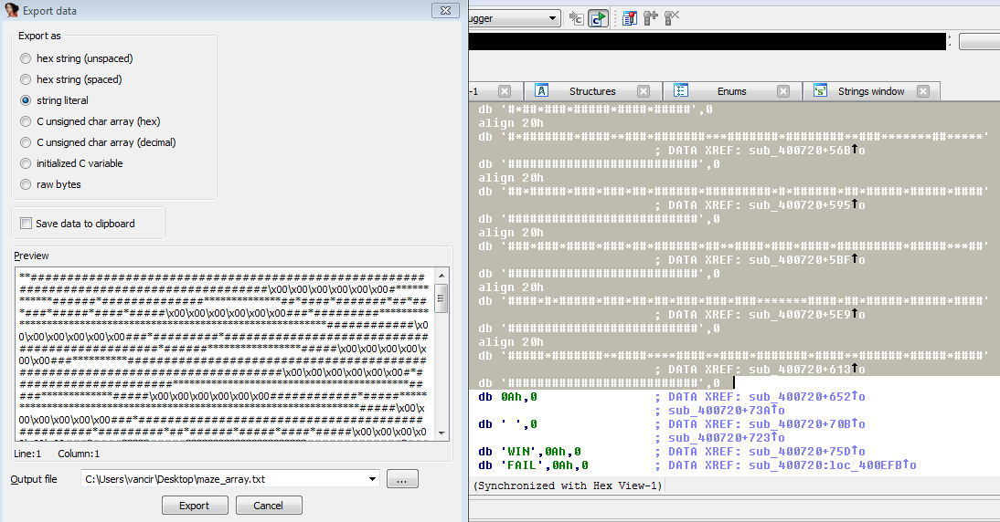
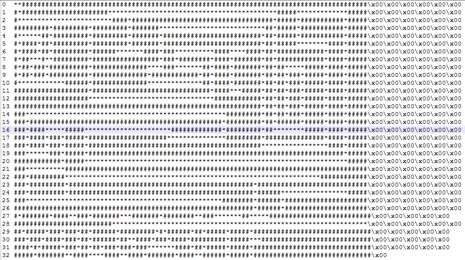
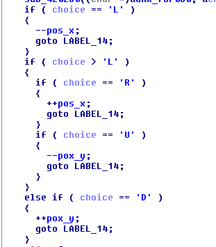
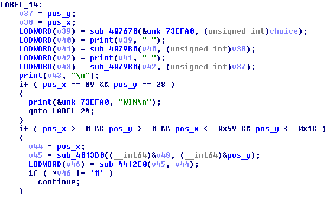
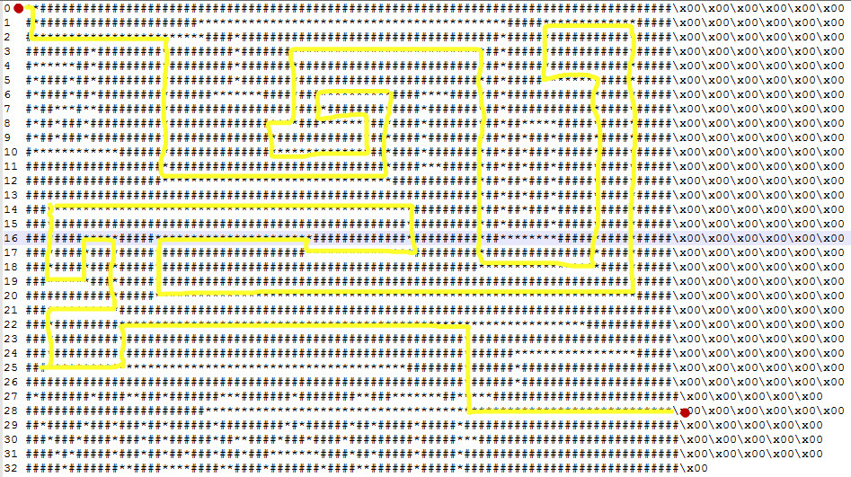

[EN](./maze.md) | [ZH](./maze-zh.md)
# 迷宫问题

迷宫问题有以下特点: 

* 在内存中布置一张"地图"
* 将用户输入限制在少数几个字符范围内. 
* 一般只有一个迷宫入口和一个迷宫出口

布置的地图可以由可显字符(比如`#`和`*`)组合而成(这非常明显, 查看字符串基本就知道这是个迷宫题了.), 也可以单纯用不可显的十六进制值进行表示. 可以将地图直接组成一条非常长的字符串, 或是一行一行分开布置. 如果是一行一行分开布置的话, 因为迷宫一般都会比较大, 所以用于按行(注意, 布置并非按顺序布置, 每行都对应一个具体的行号, 你需要确定行号才能还原迷宫地图)布置迷宫的函数会明显重复多次. 

而被限制的字符通常会是一些方便记忆的组合(不是也没办法), 比如`w/s/a/d`, `h/j/k/l`, `l/r/u/d`这样的类似组合. 当然各个键具体的操作需要经过分析判断(像那种只用一条字符串表示迷宫的, 就可以用`t`键表示向右移动`12`个字符这样). 对于二维的地图, 一般作者都会设置一个`X坐标`和一个`Y坐标`用于保存当前位置. 我们也可以根据这个特点来入手分析.

一般情况下, 迷宫是只有1个入口和1个出口, 像入口在最左上角`(0, 0)`位置, 而出口在最右下角`(max_X, max_Y)`处. 但也有可能是出口在迷宫的正中心, 用一个`Y`字符表示等等. 解答迷宫题的条件也是需要根据具体情况判断的.  

当然迷宫的走法可能不止1条, 也有情况是有多条走法, 但是要求某一个走法比如说代价最小. 那么这就可以变相为一个算法问题. 

## Volga Quals CTF 2014: Reverse 100

接下来我们以这道题进行示例, 这是一道简单的迷宫题. 该题对地图按行乱序布置, 使用的字符是`#`和`*`. 

对应的`crackme`可以点击此处下载: [rev100](https://github.com/ctf-wiki/ctf-challenges/blob/master/reverse/maze/2014_volga_quals/rev100)

对应的`idb`可以点击此处下载: [rev100.i64](https://github.com/ctf-wiki/ctf-challenges/blob/master/reverse/maze/2014_volga_quals/rev100.i64)



我们可以到`.rodata`段用光标选择所有的地图字符串, 按下`shift+E`提取所有的地图数据. 



但是目前提取到的地图字符串, 从上往下并非是按顺序的, 因此我们需要回到IDA生成的伪C代码, 获取行号并重新排序组合起来. 

最后得到的完整地图如下:

对应的`迷宫地图文件`可以点击此处下载: [maze_array.txt](https://github.com/ctf-wiki/ctf-challenges/blob/master/reverse/maze/2014_volga_quals/maze_array.txt)



再来看迷宫移动所需要的字符:



这里我们知道, 可以使用的字符有`L/R/U/D`, 分别对应于`左/右/上/下`.  

再往下看



通过调试是可以知道, 这里其实是每次在用户输入`L/R/U/D`后, 先打印一次你的输入, 然后打印对应的`X/Y坐标`. 而最后的判定成功的条件, 就是当`pos_x == 89 && pos_y == 28`. 那么我们就可以根据上述信息, 获得走出迷宫的路径. 



最后得到的迷宫路径就是

```
RDDRRRRRRRRRRRRRRRRRRDDDDDDDDDDRRRRRRRRRRRRRRRRRRRRRRRRRRRRRRRUUUUUULLLLLLLLLDDRRRRRRDDLLLLLLLLLLLLLUURRRUUUUURRRRRRRRRRRRRRRRRRRRRRRRRRDDDDDDDDDDDDDDDRRRRRRRRRRRRRRRRUUUUUUUUUUUUULLLLLLLUUUURRRRRRRRRRRRDDDDDDDDDDDDDDDDDDDLLLLLLLLLLLLLLLLLLLLLLLLLLLLLLLLLLLLLLLLLLLLLLLLLLLLLLLLLLLLLLLLLLUUUURRRRRRRRRRRRRRRRRRRRRDRRRRRRRRRRRRRRUUULLLLLLLLLLLLLLLLLLLLLLLLLLLLLLLLLLLLLLLLLLLLLLLLLLDDDDDRRRRRUUURRRRDDDDDLLLLLLLLLDDDDRRRRRRRRRRUUURRRRRRRRRRRRRRRRRRRRRRRRRRRRRRRRRRRRRRRRRRRRRRRRDDDDDDRRRRRRRRRRRRRRRRRRRRRRRRRRRR
```

## 参考链接

* [[VolgaCTF Quals 2014 writeup - Reverse-100](https://singularityctf.blogspot.com/2014/03/volgactf-quals-2014-writeup-reverse-100.html)]