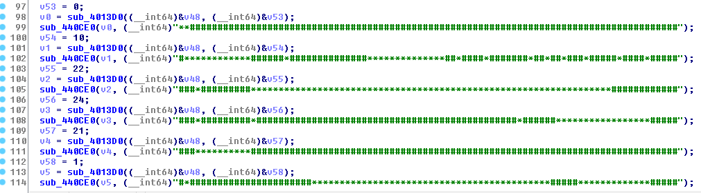
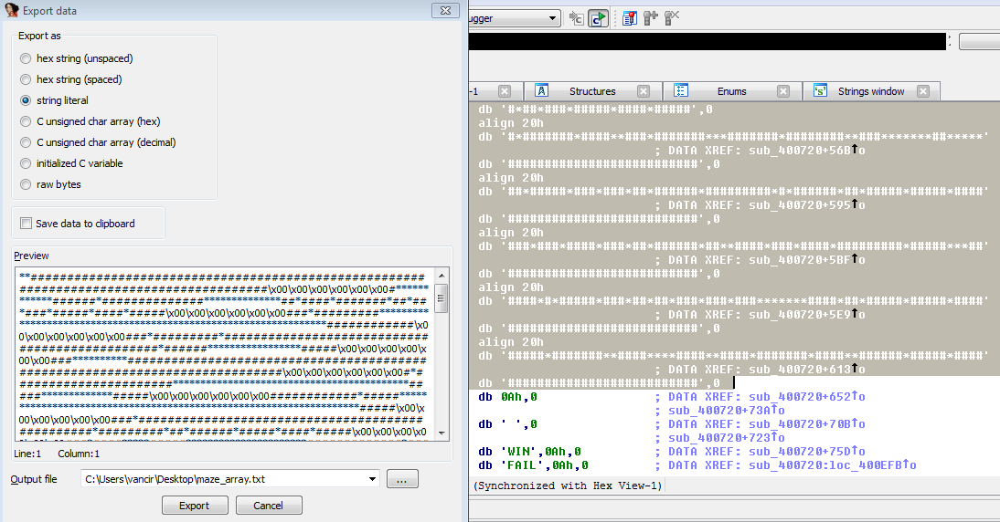

[EN](./maze.md) | [ZH](./maze-zh.md)
# Maze problem


The maze problem has the following characteristics:


* Place a &quot;map&quot; in memory
* Limit user input to a few characters.
* Generally only one labyrinth entrance and one labyrinth exit


The laid map can be composed of displayable characters (such as `#` and `*`) (this is very obvious, the basic view of the string knows that this is a labyrinth.), you can also use the invisible sixteen The value can be expressed. The map can be directly composed into a very long string, or arranged one by one. If it is arranged line by line, because the maze is generally larger, it is used to press the line (note, the arrangement is not pressed) Arrange in order, each line corresponds to a specific line number, you need to determine the line number to restore the maze map. The function of arranging the maze will be repeated many times.


The restricted characters are usually a combination of easy memory (not a good idea), such as `w/s/a/d`, `h/j/k/l`, `l/r/u/d` Such a similar combination. Of course, the specific operation of each key needs to be analyzed and judged (like the one that uses only one string to represent the maze, you can use the `t` key to move the `12` characters to the right). The map, the general author will set an `X coordinate` and a `Y coordinate` to save the current position. We can also start analysis based on this feature.


In general, the labyrinth has only one entrance and one exit, like the entrance at the top left corner `(0, 0)` position, and the exit at the bottom right corner `(max_X, max_Y)`. But there may be an exit. In the center of the maze, use a `Y` character to indicate, etc. The conditions for answering the maze question are also judged according to the specific situation.


Of course, there may be more than one move of the maze, and there are cases where there are multiple moves, but asking for a move is the least costly. Then this can be disguised as an algorithmic problem.


## Volga Quals CTF 2014: Reverse 100


Next, let&#39;s take this example as an example. This is a simple labyrinth. This question lays out the maps in order, using the characters `#` and `*`.


The corresponding `crackme` can be downloaded here: [rev100](https://github.com/ctf-wiki/ctf-challenges/blob/master/reverse/maze/2014_volga_quals/rev100)


The corresponding `idb` can be downloaded here: [rev100.i64](https://github.com/ctf-wiki/ctf-challenges/blob/master/reverse/maze/2014_volga_quals/rev100.i64)





We can use the cursor to select all the map strings in the `.rodata` section, and press `shift+E` to extract all the map data.





However, the currently extracted map strings are not in order from top to bottom, so we need to go back to the pseudo-C code generated by IDA, get the line numbers and reorder them.


The final complete map is as follows:


The corresponding `Maze Map File` can be downloaded here: [maze_array.txt] (https://github.com/ctf-wiki/ctf-challenges/blob/master/reverse/maze/2014_volga_quals/maze_array.txt)


Look at the characters needed to move the maze:


Here we know that the characters that can be used are `L/R/U/D`, which correspond to `left/right/up/down` respectively.


Look down


Through debugging, you can know that here is the time to print your input once after the user inputs `L/R/U/D`, and then print the corresponding `X/Y coordinates`. The final decision is successful. , that is, when `pos_x == 89 &amp;&amp; pos_y == 28`. Then we can get the path out of the maze based on the above information.


[maze.jpg] (./ figure / maze.jpg)


The last labyrinth path is


```

RDDRRRRRRRRRRRRRRRRRRDDDDDDDDDDRRRRRRRRRRRRRRRRRRRRRRRRRRRRRRRUUUUUULLLLLLLLLDDRRRRRRDDLLLLLLLLLLLLLUURRRUUUUURRRRRRRRRRRRRRRRRRRRRRRRRRDDDDDDDDDDDDDDDRRRRRRRRRRRRRRRRUUUUUUUUUUUUULLLLLLLUUUURRRRRRRRRRRRDDDDDDDDDDDDDDDDDDDLLLLLLLLLLLLLLLLLLLLLLLLLLLLLLLLLLLLLLLLLLLLLLLLLLLLLLLLLLLLLLLLLLUUUURRRRRRRRRRRRRRRRRRRRRDRRRRRRRRRRRRRRUUULLLLLLLLLLLLLLLLLLLLLLLLLLLLLLLLLLLLLLLLLLLLLLLLLLDDDDDRRRRRUUURRRRDDDDDLLLLLLLLLDDDDRRRRRRRRRRUUURRRRRRRRRRRRRRRRRRRRRRRRRRRRRRRRRRRRRRRRRRRRRRRRDDDDDDRRRRRRRRRRRRRRRRRRRRRRRRRRRR
```


## Reference link


* [[VolgaCTF Quals 2014 writeup - Reverse-100] (https://singularityctf.blogspot.com/2014/03/volgactf-quals-2014-writeup-reverse-100.html)]