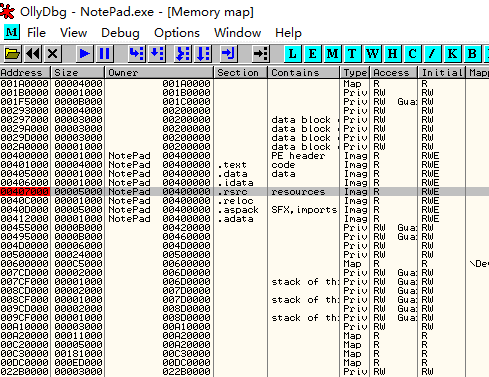
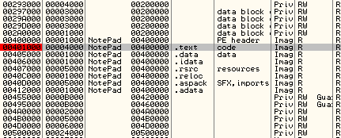
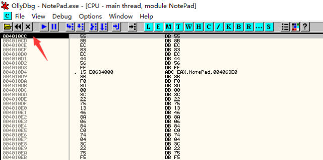

内存镜像法是在加壳程序被加载时, 通过OD的`ALT+M`快捷键, 进入到程序虚拟内存区段. 然后通过加两次内存一次性断点, 到达程序正确OEP的位置.

内存镜像法的原理在于对于程序资源段和代码段下断点, 一般程序自解压或者自解密时, 会首先访问资源段获取所需资源, 然后在自动脱壳完成后, 转回程序代码段. 这时候下内存一次性断点, 程序就会停在OEP处.

## 要点

1. 选择菜单的`选项->调试选项->异常`
2. 勾选所有的忽略异常
3. 按下`ALT+M`, 打开内存镜像, 找到程序的第一个`.rsrc`, 按F2下断点, 然后按`SHIFT+F9`运行到断点
4. 再按`ALT+M`, 打开内存镜像, 找到程序的第一个`.rsrc`上面的`.text`(在示例中是`00401000`处), 按F2下断点. 然后按`SHIFT+F9`（或者是在没异常情况下按F9）

## 示例

示例程序可以点击此处下载: [4_memory.zip](https://github.com/ctf-wiki/ctf-challenges/blob/master/reverse/unpack/example/4_memory.zip)

OD载入程序, 在菜单栏的`选项->调试设置->异常标签页`中勾选所有的忽略异常

按下`Alt+M`打开内存镜像, 找到资源段, 也就是`地址=00407000`, `大小=00005000`的`.rsrc`段, 选中F2下断

回到CPU窗口, 按下F9运行, 程序断在了`0040D75F`处

再次按下`Alt+M`打开内存镜像, 对`.text`代码段下断

再继续运行, 程序断在了`004010CC`处, 也就是OEP

