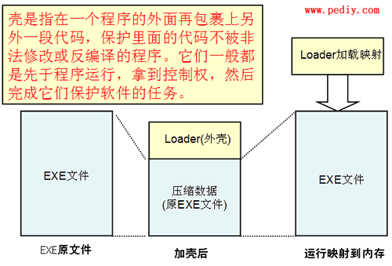

## 认识壳是什么

**壳** 是在一些计算机软件里也有一段专门负责保护软件不被非法修改或反编译的程序。

它们一般都是先于程序运行，拿到控制权，然后完成它们保护软件的任务。

由于这段程序和自然界的壳在功能上有很多相同的地方，基于命名的规则，就把这样的程序称为 **壳** 了。

## 壳的分类

我们通常将 **壳** 分为两类，一类是压缩壳，另一类是加密壳。

### 压缩壳

压缩壳早在 DOS 时代就已经出现了，但是当时因为计算能力有限，解压开销过大，并没有得到广泛的运用。

使用压缩壳可以帮助缩减 PE 文件的大小，隐藏了 PE 文件内部代码和资源，便于网络传输和保存。

通常压缩壳有两类用途，一种只是单纯用于压缩普通 PE 文件的压缩壳，而另一种则会对源文件进行较大变形，严重破坏 PE 文件头，经常用于压缩恶意程序。

常见的压缩壳有：Upx、ASpack、PECompat

### 加密壳

加密壳或称保护壳，应用有多种防止代码逆向分析的技术，它最主要的功能是保护 PE 免受代码逆向分析。

由于加密壳的主要目的不再是压缩文件资源，所以加密壳保护的 PE 程序通常比原文件大得多。

目前加密壳大量用于对安全性要求高，对破解敏感的应用程序，同时也有恶意程序用于避免（降低）杀毒软件的检测查杀。

常见的加密壳有：ASProtector、Armadillo、EXECryptor、Themida、VMProtect

## 壳的加载过程

### 保存入口参数

1.  加壳程序初始化时保存各寄存器的值
2.  外壳执行完毕，恢复各寄存器值
3.  最后再跳到原程序执行

通常用 `pushad` / `popad`、`pushfd` / `popfd` 指令对来保存和恢复现场环境

### 获取所需函数 API

1.  一般壳的输入表中只有 `GetProcAddress`、`GetModuleHandle` 和 `LoadLibrary` 这几个 API 函数
2.  如果需要其他 API 函数，则通过 `LoadLibraryA(W)` 或 `LoadLibraryExA(W)` 将 DLL 文件映射到调用进程的地址空间中
3.  如果 DLL 文件已被映射到调用进程的地址空间里，就可以调用 `GetModuleHandleA(W)` 函数获得 DLL 模块句柄
4.  一旦 DLL 模块被加载，就可以调用 `GetProcAddress` 函数获取输入函数的地址

### 解密各区块数据

1.  处于保护源程序代码和数据的目的，一般会加密源程序文件的各个区块。在程序执行时外壳将这些区块数据解密，以让程序正常运行
2.  外壳一般按区块加密，按区块解密，并将解密的数据放回在合适的内存位置

### 跳转回原程序入口点

1.  在跳转回入口点之前，一般会恢复填写原PE文件输入表（IAT），并处理好重定位项（主要是 DLL 文件）
2.  因为加壳时外壳自己构造了一个输入表，因此在这里需要重新对每一个 DLL 引入的所有函数重新获取地址，并填写到 IAT 表中
3.  做完上述工作后，会将控制权移交原程序，并继续执行
