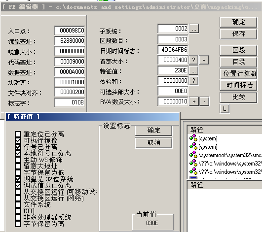

这里需要联系上篇的 [手动查找IAT并使用ImportREC重建](/reverse/unpack/manually-fix-iat/index.html)

例题文件你可以点击此处下载: [unpack_dll.zip](https://github.com/ctf-wiki/ctf-challenges/blob/master/reverse/unpack/example/unpack_dll.zip)

因为`Dll`脱壳需要这一步骤. `Dll`脱壳的最关键的步骤在于`使用LordPE修改其Dll的标志`, 用`LordPE`打开`UnpackMe.dll`, 然后在特征值那里点击`...`, 然后取消勾选`DLL`标志, 保存后, 系统就会将该文件视作一个可执行文件.

我们将`UnpackMe.dll`后缀名改成`UnpackMe.exe`, 然后用OD载入.

一般在入口点, 程序都会保存一些信息, 这里就很简单, 只作了一个`cmp`. 要注意的一点是, 这里的`jnz`跳转直接就跳到了`unpacking`过程的末尾. 因此我们需要修改寄存器的`z`标志来使得跳转失效. 同时在`unpacking`过程的末尾设下一个断点以避免脱壳完然后直接运行.(程序会断在这个断点上, 但是脱壳已经完成, 代码都很清晰)

`Dll`脱壳的基本步骤跟`exe`文件脱壳一样, 而在重建`IAT`时, 需要照着上篇 [手动查找IAT并使用ImportREC重建](/reverse/unpack/manually-fix-iat/index.html) 所说的那样, 手动找到`IAT`表并用`ImportREC`进行重建. 只是要注意, 在脱壳完dump后, 要记得用LordPE把`DLL`标志恢复过来并将文件后缀名改为`.dll`.
