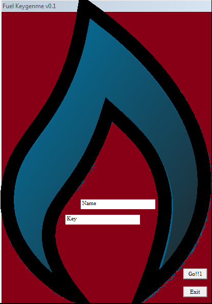

[EN](./vm.md) | [ZH](./vm-zh.md)
#Virtual machine analysis


For the virtual machine analysis part, we will explain it with a simple crackme.


The corresponding `crackme` can be downloaded here: [FuelVM.exe] (https://github.com/ctf-wiki/ctf-challenges/blob/master/reverse/vm/fuelvm/FuelVM.exe)


The corresponding `keygenme` can be downloaded here: [fuelvm_keygen.py](https://github.com/ctf-wiki/ctf-challenges/blob/master/reverse/vm/fuelvm/fuelvm_keygen.py)


The corresponding `IDA database` can be downloaded here: [FuelVM.idb](https://github.com/ctf-wiki/ctf-challenges/blob/master/reverse/vm/fuelvm/FuelVM.idb)


The author of this question designed a simple virtual machine with multiple instructions. We used IDA for analysis. For the sake of convenience, I renamed some of the disassembled variables.


## Run the program


We run the program FuelVM.exe. The interface is as follows





In this interface, we see the right two input boxes, one for entering the username Name and the other for entering the key Key. There are two buttons, Go for submitting input, and Exit for exiting. program.


## Get user input


Then we can start from here. The program wants to get user input, an API that needs to be called is `GetDlgItemTextA()`


``` c

UINT GetDlgItemTextA(

  HWND  hDlg,

  int   nIDDlgItem,

  LPSTR lpString,

  int   cchMax

);

```


The obtained input string will be saved in `lpString`. Then we can open IDA to find the place with the cross reference `GetDlgItemTextA()`.


`` `asm
.text:00401142                 push    0Ch             ; cchMax

.text: 00401144 push offset inputName; lpString
.text:00401149                 push    3F8h            ; nIDDlgItem

.text:0040114E                 push    [ebp+hWnd]      ; hDlg

.text:00401151                 call    GetDlgItemTextA

.text:00401156                 push    0Ch             ; cchMax

.text: 00401158 push offset inputKey; lpString
.text:0040115D                 push    3F9h            ; nIDDlgItem

.text:00401162                 push    [ebp+hWnd]      ; hDlg

.text:00401165                 call    GetDlgItemTextA

.text:0040116A                 mov     var_a, 0

.text:00401171                 call    process_input

.text:00401176                 jmp     short locExit

```


As above, IDA only calls `GetDlgItemTextA` here and calls it twice to get `inputName` and `inputKey` respectively. Then initializes a variable to 0, because it doesn&#39;t understand the role of this variable, so rename it to `var_a` first. After a function call and jmp jump. Because the code of the jmp jump position is some code to exit the program, so we can conclude that the above call is a function that calls the user input. So the position of jmp is heavy. Named `locExit`, the function is renamed to `process_input`.


## Handling user input


We enter the `process_input` function, which simply handles the input string very simply.


```c

  result = strlength((int)inputName);

  if ( v1 >= 7 )                                // v1 = length of inputName

  {

    *(_DWORD *)&lenOfName = v1;

    result = strlength((int)inputKey);

    if ( v2 >= 7 )                              // v2 = length of inputKey

    {

      i = 0;

      do

      {

        inputName[i] ^= i;

        ++i;

      }

      while ( i <= *(_DWORD *)&lenOfName );

      unk_4031CE = i;

      dword_4031C8 = dword_4035FF;

initVM ();
initVM ();
__debugbreak ();
      JUMPOUT(*(_DWORD *)&word_4012CE);

    }

  }

  return result;

```


The first is the `strlength()` function. The function uses `cld; repne scasb; not ecx; dec ecx` to calculate the string length and save the result in `ecx`. The assembly basics are not introduced. So we Rename the function to `strlength`


`` `asm
.text:004011C2 arg_0           = dword ptr  8

.text:004011C2

.text:004011C2                 push    ebp

.text:004011C3                 mov     ebp, esp

.text:004011C5                 mov     edi, [ebp+arg_0]

.text: 004011C8 under ecx, ecx
.text:004011CA                 sub     al, al

.text:004011CC                 not     ecx

.text:004011CE                 cld

.text:004011CF                 repne scasb

.text:004011D1                 not     ecx

.text:004011D3                 dec     ecx

.text:004011D4                 leave

.text: 004011D5 retn 4
.text:004011D5 strlength       endp

```


In the pseudo-C code generated by IDA, there are `v1` and `v2`, I have annotated it, you can see the assembly, which is compared with `cx` and `7`, and `ecx` is a string. Length, so we can know that the input requirements here are: *inputName and inputKey are not less than 7*


When the lengths of `inputName` and `inputKey` are not less than 7, then you can make a simple transformation on the input. Here is a loop


```c

      i = 0;

      do

      {

        inputName[i] ^= i;

        ++i;

      }

      while ( i <= *(_DWORD *)&lenOfName );

```


The corresponding python code is


``` python

def obfuscate(username):

    s = ""

    for i in range(len(username)):

        s += chr(ord(username[i]) ^ i)

    return s

```


After the function is assigned to some variables (these are not important, just ignore it.)


## Registering SEH


`` `asm
.text:004012B5                 push    offset seh_handler

.text:004012BA                 push    large dword ptr fs:0

.text:004012C1                 mov     large fs:0, esp

.text:004012C8                 call    initVM

.text:004012CD                 int     3               ; Trap to Debugger

```


`initVM` is done by some virtual machine initialization before starting (in fact, it is the initial value of some registers and related parts), we will discuss later. Here we are concerned about the SEH part. Here is registered a SEH handle, exception I renamed the handler to `seh_handler` and then manually triggered the exception using `int 3`. In the `seh_handler` location, IDA did not correctly identify the corresponding code.


``` 

.text:004012D7 seh_handler     db 64h                  ; DATA XREF: process_input+7Do

.text:004012D8                 dd 58Fh, 0C4830000h, 13066804h, 0FF640040h, 35h, 25896400h

.text:004012D8                 dd 0

.text:004012F4                 dd 1B8h, 0F7C93300h, 0F7C033F1h, 0FFC483E1h, 8F64FDEBh

.text:004012F4                 dd 5, 4C48300h, 40133068h, 35FF6400h, 0

.text:0040131C                 dd 258964h, 33000000h, 33198BC9h, 83E1F7C0h, 0FDEBFFC4h

.text:0040131C                 dd 58F64h, 83000000h, 5E6804C4h, 64004013h, 35FFh, 89640000h

.text:0040131C                 dd 25h, 0C033CC00h, 0C483E1F7h, 83FDEBFFh, 4035FF05h, 0D8B0200h

.text:0040131C                 dd 4035FFh, 3000B1FFh, 58F0040h, 4031C8h, 31C83D80h, 750A0040h

.text:0040131C                 dd 0B1FF4176h, 403000h, 31C8058Fh, 3D800040h, 4031C8h

```


We can click the corresponding position and press the `c` key to convert the data into code for identification. (We need to press the c key multiple times to convert), and get the following code.


As follows, in the `seh_handler` position, a similar method is used to register an exception handler located at `401306h`, and a `x0 ecx, ecx; div ecx` is manually triggered by a `divide 0 exception`. and at `loc_401301 `Location, this is an anti-debugging trick, `jmp loc_401301+2` will cause `EIP` to turn to the middle of an instruction, making it impossible to continue debugging. So we can remove the `nop` of the `00401301~00401306` part, then `00401306`Location creates a new function `seh_handler2`


```

seh_handler:                            ; DATA XREF: process_input+7Do

.text:004012D7                 pop     large dword ptr fs:0

.text:004012DE                 add     esp, 4

.text:004012E1                 push    401306h

.text:004012E6                 push    large dword ptr fs:0

.text:004012ED                 mov     large fs:0, esp

.text:004012F4                 mov     eax, 1

.text: 004012F9 xor ecx, ecx
.text: 004012FB div ecx
.text:004012FD                 xor     eax, eax

.text: 004012FF mul ecx
.text:00401301

.text:00401301 loc_401301:                             ; CODE XREF: .text:00401304j

.text:00401301                 add     esp, 0FFFFFFFFh

.text:00401304                 jmp     short near ptr loc_401301+2

.text:00401306 ; ---------------------------------------------------------------------------

.text:00401306                 pop     large dword ptr fs:0

.text:0040130D                 add     esp, 4

.text:00401310                 push    401330h

.text:00401315                 push    large dword ptr fs:0

.text:0040131C                 mov     large fs:0, esp

.text: 00401323 xor ecx, ecx
.text: 00401325 mov ebx, [ecx]
.text:00401327                 xor     eax, eax

.text:00401329                 mul     ecx

```


Similarly, `401330h` is renamed to `seh_handler3`, and `40135Eh` is the last registered exception handler. We can speculate that this is the real main function of the virtual machine, so we renamed `40135Eh` to `vm_main`. (For the SEH and anti-debugging part, you can recommend yourself to go to the dynamic debugging to figure out)


## Restore stack balance


We created a `vm_main` function (you need to create a function after renaming, IDA can recognize it), then press `F5` to prompt the failure. The reason for the failure is due to the stack imbalance. So we can click on the IDA menu item. `Options-&gt;General` check the `stack pointer` on the right side. This will display the corresponding stack pointer.


```

.text:004017F2 000                 jmp     vm_main

.text:004017F7     ; ---------------------------------------------------------------------------

.text:004017F7 000                 push    0               ; uType

.text:004017F9 004                 push    offset aError   ; "Error"

.text:004017FE 008                 push    offset Text     ; "The key is wrong."

.text:00401803 00C                 push    0               ; hWnd

.text:00401805 010                 call    MessageBoxA

.text:0040180A

.text:0040180A     locret_40180A:                          ; CODE XREF: vm_main+492j

.text:0040180A 000                 leave

.text:0040180B -04                 leave

.text:0040180C -08                 leave

.text:0040180D -0C                 leave

.text:0040180E -10                 leave

.text:0040180F -14                 leave

.text:00401810 -18                 leave

.text: 00401811 -1C retn
.text:00401811     vm_main         endp ; sp-analysis failed

```


We come to the bottom to show the unbalanced position. The top `jmp vm_main` indicates that the virtual machine is executing a loop internally. The call to `MessageBoxA` is to display the last pop-up error message. At the location of `locret_40180A`, after much The leave stack is heavily unbalanced, so we need to manually restore the stack balance.


It&#39;s also very simple. The `0040180A` position has been stack balanced (000), so we only need to change the `leave` to `retn`.


```

.text:0040180A     locret_40180A:                          ; CODE XREF: vm_main+492j

.text: 0040180A 000 retn
.text:0040180B     ; ---------------------------------------------------------------------------

.text:0040180B 004                 leave

.text:0040180C 004                 leave

.text:0040180D 004                 leave

```


Then you can find that `vm_main` can generate pseudo C code in F5.


## Virtual machine instruction analysis


To be honest, the analysis part of the virtual machine is a relatively tedious restore process. You need to compare the operations of each small part to determine what kind of instruction is this, which registers are used. Like this crackme, vm is a `Fetch-decode-execute` loop. The `decode` procedure gives us the most information. Different instructions are here, according to their respective `opcode`, using the `if-else if-else` branch. Differentiate. The actual restore process is not complicated, but it may be tedious because of the number of instructions implemented by the virtual machine.


The final analysis results are as follows:


| opcode | value |

| ------ | ----- |

| push   | 0x0a  |

| pop    | 0x0b  |

| mov    | 0x0c  |

| cmp    | 0x0d  |

| inc    | 0x0e  |

| dec    | 0x0f  |

| and    | 0x1b  |

| or     | 0x1c  |

| chorus 0x1d |
| check  | 0xff  |


Let&#39;s look at the analyzed `initVM` function.


```c

int initVM()

{

  int result; // eax@1


r1 = 0;
r2 = 0;
r3 = 0;
  result = (unsigned __int8)inputName[(unsigned __int8)cur_index];

  r4 = (unsigned __int8)inputName[(unsigned __int8)cur_index];

  vm_sp = 0x32;

  vm_pc = 0;

  vm_flags_zf = 0;

  vm_flags_sf = 0;

++ cur_index;
  return result;

}

```


There are 4 general-purpose registers (`r1/r2/r3/r4`), 1 `sp` pointer and 1 `pc` pointer, flags `zf` and `sf`. `var_a` which we did not know before. It is renamed to `cur_index`, which points to the character index currently being processed by `inputName`.


We will not say more about the multiple instructions implemented by the VM. Let&#39;s focus on the operation of the `check` part.


```c

int __fastcall check(int a1)

{

char v1; // al @ 1
  int result; // eax@4


v1 = r1;
  if ( (unsigned __int8)r1 < 0x21u )

    v1 = r1 + 0x21;

  LOBYTE(a1) = cur_index;

if (v1 == inputKey [a1])
  {

    if ( (unsigned __int8)cur_index >= (unsigned __int8)lenOfName )

      result = MessageBoxA(0, aGoodJobNowWrit, Caption, 0);

    else

      result = initVM();

  }

  else

  {

    result = MessageBoxA(0, Text, Caption, 0);

  }

  return result;

}

```


If the value in `r1` is equal to `inputKey[cur_index]`, then it will continue to determine whether the entire `inputName` has been checked. If there is no error and the comparison ends, then `Good job! Now write a keygen. `Message box. Otherwise it will continue to `initVM` to enter the next round of loops. (Of course, the pop-up message box prompts an error.)


`cur_index` will increment by 1 in `initVM`, then remember to execute `initVM` twice in `process_input`. Because there are 2 times `initVM`, so the first 2 of our `inputKey` Can be any character.


```c

      unk_4031CE = i;

      opcode = vm_pc;

initVM ();
initVM ();
__debugbreak ();
      JUMPOUT(*(_DWORD *)&word_4012CE);

```


So after we analyzed the entire virtual machine, we can start writing `Keygen`.


The corresponding `keygenme` can be downloaded here: [fuelvm_keygen.py](https://github.com/ctf-wiki/ctf-challenges/blob/master/reverse/vm/fuelvm/fuelvm_keygen.py)


```bash

$ python2 fuelvm_keygen.py ctf-wiki

[*] Password for user 'ctf-wiki' is: 4mRC*TKJI

```


The corresponding `IDA database` can be downloaded here: [FuelVM.idb](https://github.com/ctf-wiki/ctf-challenges/blob/master/reverse/vm/fuelvm/FuelVM.idb)