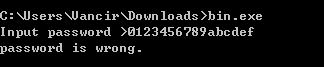
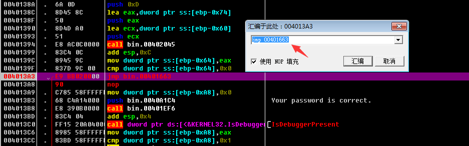
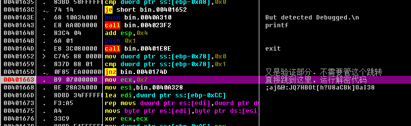
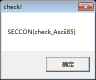

[EN](./example.md) | [ZH](./example-zh.md)
Let&#39;s analyze a 2016 anti-debugging problem for SecCon, title download link: [bin.exe](https://github.com/ctf-wiki/ctf-challenges/blob/master/reverse/anti- Debug/2016_seccon/anti_debugging_100/bin.exe)


This is a 32-bit PE file. It is a console program. We run it directly and will ask for `password`. When you type a wrong `password`, you will be prompted `password is wrong`.





We use IDA to open it. The quickest way is to look at the string directly and find the key code according to `password is wrong`. The result shown by IDA is as follows:


! [ida_strings.png] (./ figure / 2016_seccon / ida_strings.png)


Obviously, the string indicates that there may be various tests in the program, such as detecting the process names `ollydbg.exe`, `ImmunityDebugger.exe`, `idaq.exe` and `Wireshark.exe`. Then there are other tests. We also see I got the words `password is wrong` and `You password is correct`. I also found a string that is likely to be the flag to be decrypted. Then we will first come to the cross reference of `password is wrong` Key function.


As shown below: The program uses a lot of anti-debugging techniques.


``` c

int __cdecl main(int argc, const char **argv, const char **envp)

{

  v23 = 0;

  memset(&v24, 0, 0x3Fu);

  v22 = 1;

  printf("Input password >");

  v3 = (FILE *)sub_40223D();

  fgets(&v23, 64, v3);

  strcpy(v21, "I have a pen.");

V22 = strncmp(&amp;v23, v21, 0xDu); // 1. Compare plaintext strings with input strings directly
  if ( !v22 )

  {

    puts("Your password is correct.");

    if ( IsDebuggerPresent() == 1 )     // 2. API: IsDebuggerPresent()

    {

      puts("But detected debugger!");

      exit(1);

    }

If ( sub_401120() == 0x70 ) // 3. Check if the 0x68 offset of the PEB is 0x70. Detect NtGlobalFlag()
    {

      puts("But detected NtGlobalFlag!");

      exit(1);

    }


    /*  BOOL WINAPI CheckRemoteDebuggerPresent(

     *    _In_    HANDLE hProcess,

     *    _Inout_ PBOOL  pbDebuggerPresent

     *  );

     */

v4 = GetCurrentProcess ();
CheckRemoteDebuggerPresent (v4, &amp; pbDebuggerPresent);
    if ( pbDebuggerPresent )            // 4. API: CheckRemoteDebuggerPresent()

    {

      printf("But detected remotedebug.\n");

      exit(1);

    }

    v13 = GetTickCount();

    for ( i = 0; i == 100; ++i )

      Sleep(1u);

    v16 = 1000;

If ( GetTickCount() - v13 &gt; 1000 ) // 5. Detect time difference
    {

      printf("But detected debug.\n");

      exit(1);

    }

    lpFileName = "\\\\.\\Global\\ProcmonDebugLogger";

    if ( CreateFileA("\\\\.\\Global\\ProcmonDebugLogger", 0x80000000, 7u, 0, 3u, 0x80u, 0) != (HANDLE)-1 )

    {

      printf("But detect %s.\n", &lpFileName);      // 6. 检测ProcessMonitor

      exit(1);

    }

V11 = sub_401130(); // 7. API: CreateToolhelp32Snapshot() detects the process
    if ( v11 == 1 )

    {

      printf("But detected Ollydbg.\n");

      exit(1);

    }

    if ( v11 == 2 )

    {

      printf("But detected ImmunityDebugger.\n");

      exit(1);

    }

    if ( v11 == 3 )

    {

      printf("But detected IDA.\n");

      exit(1);

    }

    if ( v11 == 4 )

    {

      printf("But detected WireShark.\n");

      exit(1);

    }

If ( sub_401240() == 1 ) // 8. Detect through the i/O port of vmware
    {

      printf("But detected VMware.\n");

      exit(1);

    }

v17 = 1;
v20 = 1;
    v12 = 0;

    v19 = 1 / 0;

    ms_exc.registration.TryLevel = -2;  // 9. SEH

    printf("But detected Debugged.\n");

    exit(1);

  }

  printf("password is wrong.\n");

  return 0;

}

```


I wrote a note in the code that lists the 9 protection techniques used in it. Let&#39;s analyze it one by one.


## Compare plaintext strings


``` c

printf("Input password >");

v3 = (FILE *)sub_40223D();

fgets(&v23, 64, v3);

strcpy(v21, "I have a pen.");

V22 = strncmp(&amp;v23, v21, 0xDu); // 1. Compare plaintext strings with input strings directly
if ( !v22 )  {

    ......

}

```


Here is the output `Input password &gt;`. Then use `fgets()` to get the string entered by the user, copy `I have a pen.` to the buffer of `v21`, and compare the user input with `strncmp` With the contents of `I have a pen.`, and return the comparison result to `v22`. The following will be based on `v22`, that is, according to whether the input `password` is correct, and jump.


## IsDebuggerPresent()


``` c

puts("Your password is correct.");

if ( IsDebuggerPresent() == 1 )     // 2. API: IsDebuggerPresent()
{

    puts("But detected debugger!");

    exit(1);

}

```


Obviously, if the input `password` is correct, it will output the prompt `Your password is correct.`. ??? Not surprising. Is it `I have a pen.` is our flag? No, no, of course not. This is actually a trap. Since you know `I have a pen.` then there is definitely some way to analyze the program through some reverse means. So the next part will start some anti-debugging or other means of detection (actual Such a trap can also occur in the middle).


At the beginning is `IsDebuggerPresent()`, which determines if there is debugging based on the returned result. If you are not sure, you can go back and look at [IsDebuggerPresent()](./isdebuggerpresent.md)


## NtGlobalFlag


Next is to detect the flag of the `NtGlobalFlag` field. Detect the debugger by checking if the field value of the PEB is `0x70`. If it is not clear, you can go back and look at [NtGlobalFlag](./ntglobalflag.md )


``` c

If ( sub_401120() == 0x70 ) // 3. Check if the 0x68 offset of the PEB is 0x70. Detect NtGlobalFlag()
{

    puts("But detected NtGlobalFlag!");

    exit(1);

}

```


Then let&#39;s take a quick look at `sub_401120()`.


``` c

int sub_401120()

{

  return *(_DWORD *)(__readfsdword(48) + 0x68) & 0x70;

}

```


`0x68` is the offset value of the `NtGlobalFlag` field of the PEB. `0x70` is the three flags of `FLG_HEAP_ENABLE_TAIL_CHECK (0x10)`, `FLG_HEAP_ENABLE_FREE_CHECK (0x20)` and `FLG_HEAP_VALIDATE_PARAMETERS (0x40)`


## CheckRemoteDebuggerPresent


``` c++

/*  BOOL WINAPI CheckRemoteDebuggerPresent(

 *    _In_    HANDLE hProcess,

 *    _Inout_ PBOOL  pbDebuggerPresent

 *  );

 */

v4 = GetCurrentProcess ();
CheckRemoteDebuggerPresent (v4, &amp; pbDebuggerPresent);
if ( pbDebuggerPresent )            // 4. API: CheckRemoteDebuggerPresent()

{

    printf("But detected remotedebug.\n");

    exit(1);

}

```

Here I will list the function prototype of the `CheckRemoteDebuggerPresent()` API in the comments. If the debugger is detected, `pbDebuggerPresent` will be set to a non-zero value. Detect the debugger based on its value ([CheckRemoteDebuggerPresent( )](./checkremotedebuggerpresent.md)


## Time difference detection


``` c

v13 = GetTickCount();

for ( i = 0; i == 100; ++i )    // 睡眠

    Sleep(1u);

v16 = 1000;

If ( GetTickCount() - v13 &gt; 1000 ) // 5. Detect time difference
{

    printf("But detected debug.\n");

    exit(1);

}

```


`GetTickCount` will return the number of milliseconds from start to now. The loop is `sleep(1)`, which is 100 times, that is, 100 milliseconds. If the difference between the two times is greater than 1000 milliseconds, the time difference is obviously greater than the consumed time. The time, indirectly detected debugging.


## ProcessMonitor


``` c

lpFileName = "\\\\.\\Global\\ProcmonDebugLogger";

if ( CreateFileA("\\\\.\\Global\\ProcmonDebugLogger", 0x80000000, 7u, 0, 3u, 0x80u, 0) != (HANDLE)-1 )

{

    printf("But detect %s.\n", &lpFileName);      // 6. 检测ProcessMonitor

    exit(1);

}

```


Check `ProcessMonitor` here by checking the device file `\\\\.\\Global\\ProcmonDebugLogger`


## Detection process name


Here, the process is detected by executing the `sub_401130()` function, and the corresponding value is returned according to the detected different processes.


``` c

V11 = sub_401130(); // 7. API: CreateToolhelp32Snapshot() detects the process
if ( v11 == 1 )

{

    printf("But detected Ollydbg.\n");

    exit(1);

}

if ( v11 == 2 )

{

    printf("But detected ImmunityDebugger.\n");

    exit(1);

}

if ( v11 == 3 )

{

    printf("But detected IDA.\n");

    exit(1);

}

if ( v11 == 4 )

{

    printf("But detected WireShark.\n");

    exit(1);

}

```


Let&#39;s take a look at the `sub_401130()` function.


``` c

signed int sub_401130()

{

PROCESSENTRY32 pe; // [sp + 0h] [bp-138h] @ 1
  HANDLE hSnapshot; // [sp+130h] [bp-8h]@1

  int i; // [sp+134h] [bp-4h]@1


pe.dwSize = 296;
memset (&amp; pe.cntUsage, 0, 0x124u);
  hSnapshot = CreateToolhelp32Snapshot(2u, 0);

  for ( i = Process32First(hSnapshot, &pe); i == 1; i = Process32Next(hSnapshot, &pe) )

  {

    if ( !_stricmp(pe.szExeFile, "ollydbg.exe") )

      return 1;
if (! _stricmp (pe.szExeFile, &quot;ImmunityDebugger.exe&quot;))
      return 2;

if (! _stricmp (pe.szExeFile, &quot;idaq.exe&quot;))
      return 3;

if (! _stricmp (pe.szExeFile, &quot;Wireshark.exe&quot;))
      return 4;

  }

  return 0;

}

```


Here the API is used: `CreateToolhelp32Snapshot` to get the current process information. It is compared in the for loop. If the specified process name is found, it returns the corresponding value directly. Then it jumps to a different branch according to the return value.


## Detecting VMware


Testing VMware is also detecting some features. Judging based on the results of the test.


``` c

If ( sub_401240() == 1 ) // 8. Detect through the i/O port of vmware
{

    printf("But detected VMware.\n");

    exit(1);

}

```


Look at the `sub_401240()` function.


``` c

signed int sub_401240()

{

  unsigned __int32 v0; // eax@1


  v0 = __indword(0x5658u);

  return 1;

}

```


This is a &quot;backdoor&quot; I/O port for VMware, `0x5658 = &quot;VX&quot;`. If the program is running inside VMware, the program uses the `In` instruction to read data through the `0x5658` port, the value of the `EBX` register. Will become `0x564D5868` (`0x564D5868 == &quot;VMXh&quot;`)


Look at the pseudo-C code decompiled by IDA is not very intuitive to reflect this, we see the assembly code is clear


`` `asm
.text:0040127A                 push    edx

.text:0040127B                 push    ecx

.text:0040127C                 push    ebx

.text:0040127D                 mov     eax, 564D5868h   //  <------

.text:00401282                 mov     ebx, 0

.text: 00401287 mov ecx, 0Ah
.text:0040128C                 mov     edx, 5658h   //  <------

.text:00401291                 in      eax, dx

.text:00401292                 pop     ebx

.text:00401293                 pop     ecx

.text:00401294                 pop     edx

```


更多阅读: [E-cards don?t like virtual environments](https://isc.sans.edu/diary/E-cards+don%3Ft+like+virtual+environments/3190)


## SEH


``` c

v17 = 1;
v20 = 1;
v12 = 0;

v19 = 1/0; // 9 SEH
ms_exc.registration.TryLevel = -2;

printf("But detected Debugged.\n");

exit(1);

```


The next paragraph, very strange is not. Here `v19 = 1 / 0; ` obviously unreasonable, will produce a divide by zero exception. And the latter `ms_exc.registration.TryLevel = -2; `this is to cancel the exception , `TryLevel=TRYLEVEL_NONE (-2)` . Look at the assembly code.


```

.text:004015B8                 mov     [ebp+var_88], 1

.text:004015C2                 mov     [ebp+var_7C], 1

.text:004015C9                 mov     [ebp+var_9C], 0

.text:004015D3                 mov     [ebp+ms_exc.registration.TryLevel], 0

.text:004015DA                 mov     eax, [ebp+var_7C]

.text:004015DD                 cdq

.text:004015DE                 idiv    [ebp+var_9C]

.text:004015E4                 mov     [ebp+var_80], eax

.text:004015E7                 mov     [ebp+ms_exc.registration.TryLevel], 0FFFFFFFEh

.text:004015EE                 jmp     short loc_40160A

```


After the `idiv [ebp+var_9C]` trigger exception is taken over by the exception handler handled by the program, if the breakpoint is not set at the exception handler entry, the program will easily run away.


## Get flag


But the whole look at it. How do you feel that there is nothing left in the flag? Have you remembered the string that was previously seen in the string window and is suspected to be the flag to be decrypted? Actually due to the limitation of IDA decompilation, Make the decompiled pseudo C code is not correct. For example, in the last paragraph of `printf(&quot;But detected Debugged.\n&quot;); `here, let&#39;s look at the specific assembly code.


`` `asm
.text:00401627                 call    sub_4012E0

.text:0040162C                 movzx   eax, ax

.text:0040162F                 mov     [ebp+var_A8], eax

.text:00401635                 cmp     [ebp+var_A8], 0      // <------

.text:0040163C                 jz      short loc_401652     // <------

.text:0040163E                 push    offset aButDetectedD_2 ; "But detected Debugged.\n"

.text:00401643                 call    _printf

.text:00401648                 add     esp, 4

.text:0040164B                 push    1               ; int

.text:0040164D                 call    _exit

```


In fact, this code is not decompiled by IDA. The `loc_401652` position is a string of code, the highlight is the use of a `MessageBoxA` function. And one of the function parameters is our flag to be decrypted. Then we After entering `I have a pen.`, in the assembly code section of the `if ( !v22 )` jump, manually change it to jump to the flag decryption and pop up the `messagebox` part of the run, let the program help yourself. Decrypt and output, you can.


The operation is as shown below:





Here is the jump part after inputting `I have a pen.`, because the part that is normally jumped to is all part of the detection and debugging, so we jump directly to the part of the code decryption. That is the position of `00401663`.





The `mov-cmp-jnz` above `00401663` is also a verification part, regardless of it, jump directly to `mov ecx, 7` here `00401663` here to run the decryption code, and follow the `MessageBoxA()` Pop up message box, get flag



