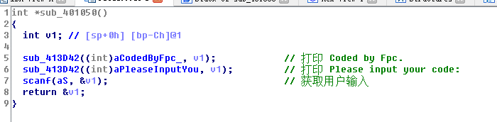
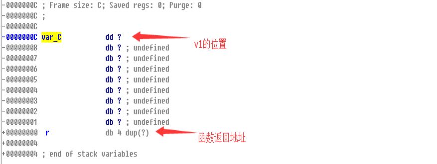
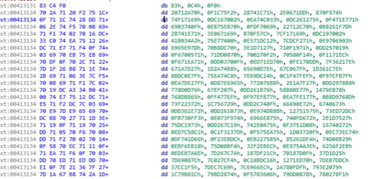
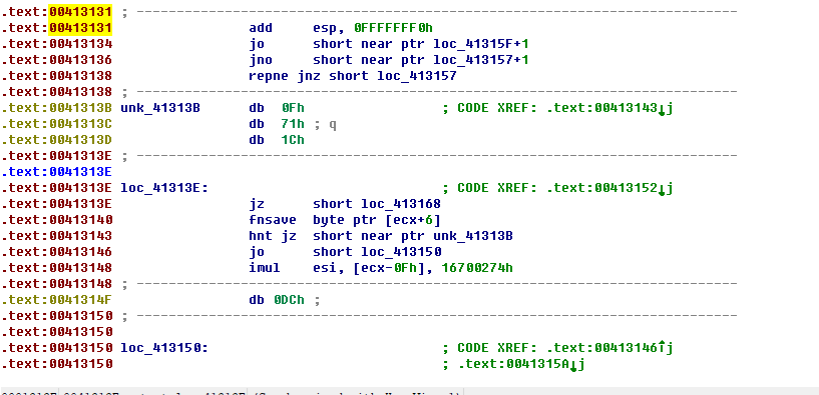
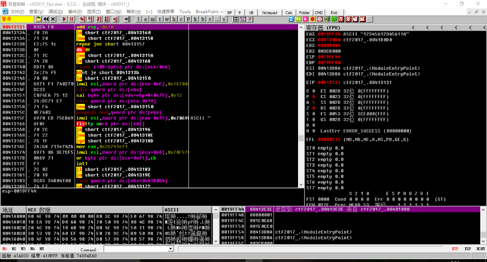
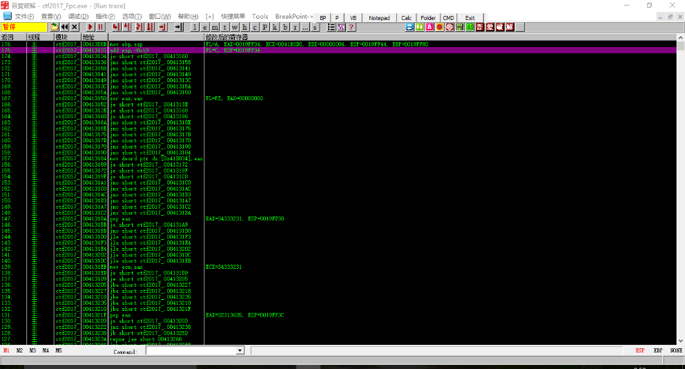
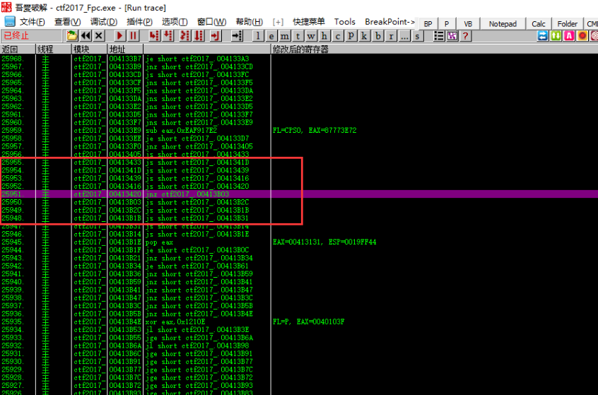
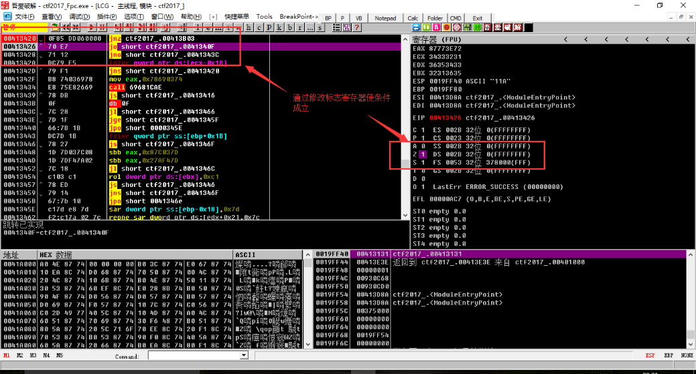

[EN](./junk-code.md) | [ZH](./junk-code-zh.md)
## Principle

A flower instruction is a way to hide a block of code (or other function) that you don&#39;t want to be reverse engineered. Inserting some junk code in the real code also ensures proper execution of the original program, and the program cannot decompile well. It is difficult to understand the content of the program and achieve the effect of confusing audiovisual.

## Example

Here is the second question of `See Snow.TSRC 2017CTF Fall Season&#39;. The title download link: [ctf2017_Fpc.exe](https://github.com/ctf-wiki/ctf-challenges/blob/master/reverse/anti -debug/2017_pediy/ctf2017_Fpc.exe)

The program writes several functions to confuse the audio and visual, and the key verification logic is added to prevent the static analysis of IDA. We use IDA to open the Fpc, the program will first print some prompt information, and then get the user&#39;s input.

Here we use the unsafe `scanf` function, the user input buffer is only `0xCh` long, we double-click `v1` to enter the stack frame view

Therefore, we can overwrite the return address by overflowing the data, and then transfer to any address to continue execution.

Here I need to explain, that is, several confusing functions written before `scanf` are simple equations but actually have no solution. The program confuses the real verification logic, which makes IDA not very good. Decompilation. So the idea of our problem is to continue execution by overflowing to the real verification code.

We can find the following data blocks not far from the code during analysis.

Because IDA does not recognize the data well, we can move the cursor to the beginning of the data block and then press the `C` key to disassemble the data into code.

It is worth noting that the location of this code is `0x00413131`, `0x41` is the &#39;ci&#39; code of `&#39;A&#39;`, and `0x31` is the ascii code of `&#39;1&#39;`. Due to restrictions on snow games, users The input can only be letters and numbers, so we can also use the overflow vulnerability to execute this code.

Open with OD, then set Ctrl+G` to reach the breakpoint of `0x413131`. After running, enter `12345612345611A` to enter, the program successfully reaches `0x00413131`. Then `right-click analysis-&gt;delete analysis from the module. Identify the correct code

After breaking at `0x413131`, click on the &quot;&quot;View&quot; in the menu bar, select `&quot;RUN Track&quot;`, then click on &quot;&quot;Debug&quot;`, select `&quot;Track Step&quot;, and the program will record this flower. The process of instruction execution is as follows:

This flower instruction is very long, but after using the OD tracking function, the execution flow of the flower instruction is very clear. A lot of jumps are made in the whole process, we just take the effective instructions and analyze it.

It should be noted that in the effective instruction, we still have to satisfy some conditional jumps, so that the program can continue to execute on the correct logic.

For example, `jnz ctf2017_.00413B03` at `0x413420`. We are going to come back again, and set a breakpoint at `0x413420`

The jump is satisfied by modifying the flag register. Continue to follow the step (after the &#39;0041362E jnz ctf2017_.00413B03&#39; needs to be satisfied). After the logic is correct, take the valid instruction and continue the analysis.

