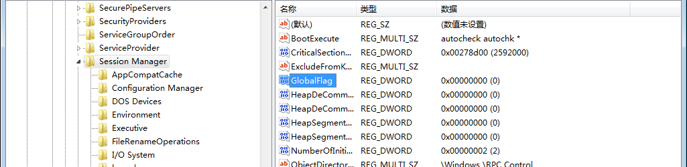
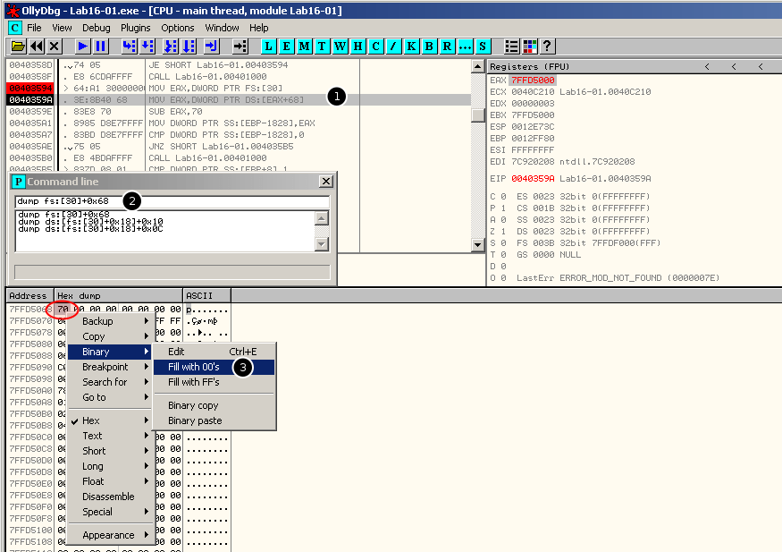

[EN](./ntglobalflag.md) | [ZH](./ntglobalflag-zh.md)
## About NtGlobalFlag


On 32-bit machines, the `NtGlobalFlag` field is located at the offset of `PEB` (process environment block) `0x68`, and the 64-bit machine is at offset &#39;0xBC`. The default value for this field is 0. When debugging This field is set to a specific value while the device is running. Although this value does not quite indicate that a debugger is actually running, this field is often used for this purpose.


This field contains a series of flag bits. The process created by the debugger sets the following flags:


```c

FLG_HEAP_ENABLE_TAIL_CHECK (0x10)

FLG_HEAP_ENABLE_FREE_CHECK (0x20)

FLG_HEAP_VALIDATE_PARAMETERS (0x40)

```


## Detection code


Therefore, you can check these flags to detect the presence of the debugger. For example, use the 32-bit code below to detect on a 32-bit machine:


`` `asm
mov eax, fs:[30h] ;Process Environment Block

mov al, [eax+68h] ;NtGlobalFlag

and al, 70h
cmp al, 70h
je being_debugged

```


The following is the detection code for 64-bit code on a 64-bit machine:


`` `asm
push 60h

pop rsi
gs:lodsq                ;Process Environment Block

mov al, [rsi*2+rax-14h] ;NtGlobalFlag

and al, 70h
cmp al, 70h
je being_debugged

```


It should be noted that if a 32-bit program is running on a 64-bit machine, there will actually be two PEBs: one is a 32-bit part and the other is a 64-bit. The corresponding field of the 64-bit PEB will also look like Changed in 32-bit.


So we have the following, using a 32-bit code to detect the 64-bit machine environment:


```

mov eax, fs:[30h] ; Process Environment Block

;64-bit Process Environment Block

;follows 32-bit Process Environment Block

mov al, [eax+10bch] ;NtGlobalFlag

and al, 70h
cmp al, 70h
je being_debugged

```


Remember not to compare directly without masking other bits, so you won&#39;t be able to detect the debugger.


In `ExeCryptor`, the `NtGlobalFlag` is used to detect the debugger, but the three flags of `NtGlobalFlag` are only when the program is `created by the debugger` instead of the process attached by the debugger. Will be set.


## Change the initial value of NtGlobalFlag


Of course, the way to bypass this detection is also very simple, that is, the debugger wants to reset the field to 0. However, this default initial value can be changed in any of the following four ways:


1. The value of `GlobalFlag` of the registry `HKLM\System\CurrentControlSet\Control\SessionManager` will be replaced by the `NtGlobalFlag` field. Although it may be changed by Windows (described below), the registry key will be on the system. All processes in the process have an impact and take effect after the restart.


    


Of course, this also produces another way to detect the debugger: If a debugger copies the key values in the registry to the `NtGlobalFlag` field in order to hide itself, the key values in the registry have been replaced beforehand and have not yet been The restart takes effect. Then the debugger just copies a fake value, not the one that is really needed. If the program knows the real value instead of the fake value in the registry, then the debugger can be detected.


Of course, the debugger can also run other processes and then query the `NtGlobalFlag` field to get the real value.


2. It is still `GlobalFlag`, but here is `HKLM\Software\Microsoft\Windows NT\CurrentVersion\Image File Execution Options\ <filename> `. (Image hijacking), here you need to <filename> `Replace the file name of the executable file that needs to be changed (no need to specify the path). After setting `GlobalFlag`, the system will overwrite its value to the `NtGlobalFlag` field (only covered for the specified process). Can be changed again by Windows (see below).
3. Load two fields in the configuration table (`Load Configuration Table`): `GlobalFlagsClear` and `GlobalFlagsSet`.


`GlobalFlagsClear` lists the flags that need to be cleared, and `GlobalFlagsSet` lists the flags that need to be set. These settings will take effect after the `GlobalFlag` application, so it can override the value specified by `GlobalFlag`. However it Cannot override the flag set by Windows. For example, setting `FLG_USER_STACK_TRACE_DB (0x1000)` allows Windows to set the `FLG_HEAP_VALIDATE_PARAMETERS (0x40)` flag, even if `FLG_HEAP_VALIDATE_PARAMETERS` is cleared in the load configuration table (`Load Configuration Table`). Windows will also be reset during subsequent process loading.


4. When the debugger creates a process, Windows will make some changes. By setting `_NO_DEBUG_HEAP` in the environment variable, `NtGlobalFlag` will not set the flags of the 3 heaps because of the debugger. Of course they are still You can continue to set it by `GlobalFlag` or by loading `GlobalFlagsSet` in the configuration table.


## How to bypass detection?


There are 3 ways to bypass the detection of `NtGlobalFlag`


* Manually modify the value of the flag bit (`FLG_HEAP_ENABLE_TAIL_CHECK`, `FLG_HEAP_ENABLE_FREE_CHECK`, `FLG_HEAP_VALIDATE_PARAMETERS`)
* Use the `hide-debug` plugin in Ollydbg
* Start the program in the way that Windbg disables the debug heap (`windbg -hd program.exe`)


## Manual bypass example


The following is an example that demonstrates how to manually bypass detection.


`` `asm
.text:00403594     64 A1 30 00 00 00          mov     eax, large fs:30h   ; PEB struct loaded into EAX

.text:0040359A                                db      3Eh                 ; IDA Pro display error (the byte is actually used in the next instruction)

.text:0040359A     3E 8B 40 68                mov     eax, [eax+68h]      ; NtGlobalFlag (offset 0x68 relative to PEB) saved to EAX

.text:0040359E     83 E8 70                   sub     eax, 70h            ; Value 0x70 corresponds to all flags on (FLG_HEAP_ENABLE_TAIL_CHECK, FLG_HEAP_ENABLE_FREE_CHECK, FLG_HEAP_VALIDATE_PARAMETERS)

.text:004035A1     89 85 D8 E7 FF FF          mov     [ebp+var_1828], eax

.text:004035A7     83 BD D8 E7 FF FF 00       cmp     [ebp+var_1828], 0   ; Check whether 3 debug flags were on (result of substraction should be 0 if debugged)

.text:004035AE     75 05                      jnz     short loc_4035B5    ; No debugger, program continues...

.text:004035B0     E8 4B DA FF FF             call    s_selfDelete        ; ...else, malware deleted

```


Set the breakpoint in offset `0x40359A` in Ollydbg, run the program to trigger the breakpoint. Then open the `CommandLine` plugin with `dump fs:[30]+0x68`dump out the contents of `NtGlobalFlag `





Right-click `Binary-&gt;Fill with 00&#39;s` and replace the value `0x70` with `0x00`.


## Reference link


* [The "Ultimate" Anti-Debugging Reference](http://anti-reversing.com/Downloads/Anti-Reversing/The_Ultimate_Anti-Reversing_Reference.pdf)

* [PEB-Process-Environment-Block/NtGlobalFlag](https://www.aldeid.com/wiki/PEB-Process-Environment-Block/NtGlobalFlag)
