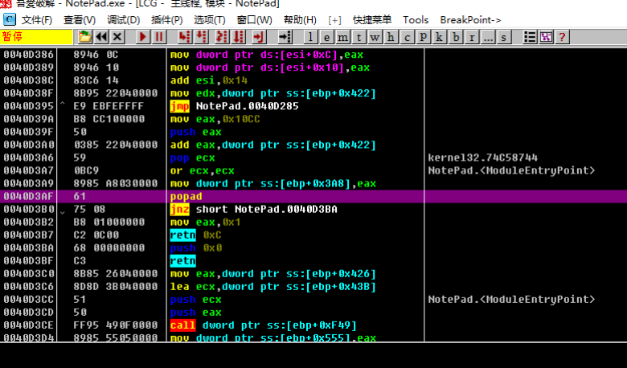

[EN](./direct-oep.md) | [ZH](./direct-oep-zh.md)
所谓的一步到达OEP的脱壳方法, 是根据所脱壳的特征, 寻找其距离OEP最近的一处汇编指令, 然后下int3断点, 在程序走到OEP的时候dump程序.

如一些压缩壳往往popad指令距离OEP或者大jmp特别近, 因此使用Ollydbg的搜索功能, 可以搜索壳的特征汇编代码, 达到一步断点到达OEP的效果.

## 要点

1. ctrl+f 查找popad
2. ctrl+l 跳转到下一个匹配处
3. 找到匹配处, 确认是壳解压完毕即将跳转到OEP部分, 则设下断点运行到该处
4. 只适用于极少数压缩壳

## 示例

示例程序可以点击此处下载: [3_direct2oep.zip](https://github.com/ctf-wiki/ctf-challenges/blob/master/reverse/unpack/example/3_direct2oep.zip)

还是用的原先的notepad.exe来示例, 用`Ollydbg`打开后, 我们按下`ctrl+f`来查找指定的字符串, 像`popad`是典型的一个特征, 有部分壳它就常用`popad`来恢复状态, 所以如下图所示来搜索`popad`.

在本例中, 当搜索到的`popad`不符合我们的要求时, 可以按下`ctrl+l`来搜索下一个匹配处, 大概按下个三四次, 我们找到了跳转到OEP的位置处.

