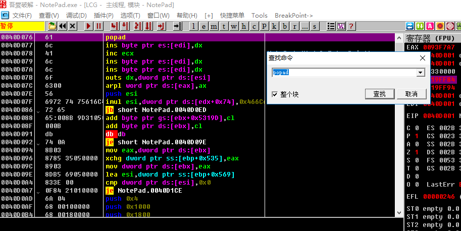
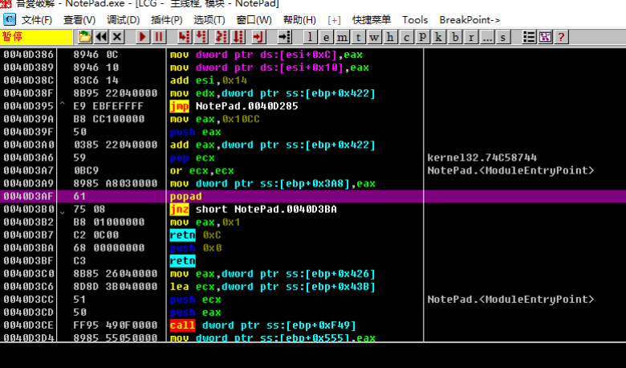

[EN](./direct-oep.md) | [ZH](./direct-oep-zh.md)
The so-called one-step OEP shelling method is based on the characteristics of the shelling, looking for the assembly instruction closest to OEP, then the int3 breakpoint, and the dump program when the program goes to OEP.

For example, some compression shells tend to be particularly close to OEP or large jmp. Therefore, using Ollydbg&#39;s search function, you can search the shell&#39;s feature assembly code to achieve the effect of one step breakpoint to OEP.

## 要点

1. ctrl+f find popad
2. ctrl+l jumps to the next match
3. Find the match, confirm that the shell is ready to jump to the OEP part, then set the breakpoint to run there.
4. Only for a very small number of compression shells

##example

The sample program can be downloaded here: [3_direct2oep.zip](https://github.com/ctf-wiki/ctf-challenges/blob/master/reverse/unpack/example/3_direct2oep.zip)

Still use the original notepad.exe to illustrate, after opening with `Ollydbg`, we press `ctrl+f` to find the specified string, like `popad` is a typical feature, some shells are commonly used. Popad` to restore state, so search for `popad` as shown below.

In this example, when the searched &#39;popad` does not meet our requirements, you can press `ctrl+l` to search for the next match, about three or four times, we found a jump to OEP. Location.

