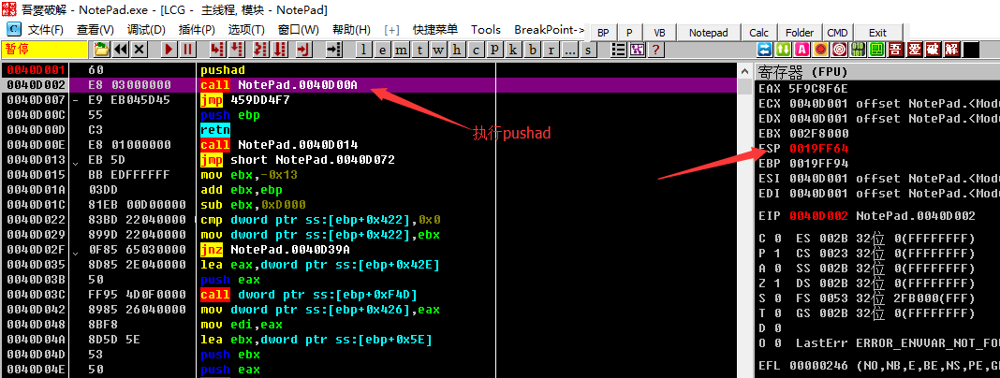
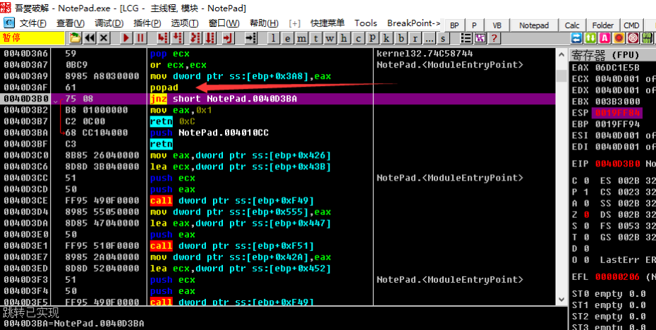

[EN](./esp.md) | [ZH](./esp-zh.md)
ESP law is a weapon for shelling, and it is one of the most frequently used methods for shelling.

## 要点

The principle of ESP law is to use the stack balance in the program to quickly find OEP.

Because in the process of self-decryption or self-extraction, many shells will first push the current register state, such as using `pushad`, after the decompression ends, the previous register values will be popped, such as using `popad`. When the register is popped, the program code is often restored, and the hardware breakpoint is triggered. Then at the current position of the program, it is easy to reach the correct OEP position with only a few single steps.

1. The program just loaded and started pushad/pushfd
2. Set all the registers to the ESP register and set the hardware breakpoint.
3. Run the program, trigger a breakpoint
4. Remove hardware breakpoints and start analyzing

##example

The sample program can be downloaded here: [2_esp.zip](https://github.com/ctf-wiki/ctf-challenges/blob/master/reverse/unpack/example/2_esp.zip)

As the example in the previous article, enter a sentence `popad`, we press F8 to execute `popad` to save the register state. We can find in the register window on the right that the value of the `ESP` register has changed to red, that is, the value has changed. .

We right click on the value of the `ESP` register, which is `0019FF64` in the figure. After selecting `HW break[ESP]`, press `F9` to run the program, and the program will break when the breakpoint is triggered. Came to the position of `0040D3B0`. Here is the position we arrived in the single step tracking, the rest will not go into details.

