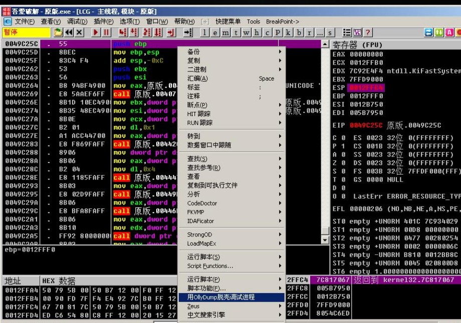
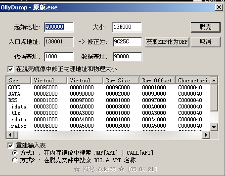
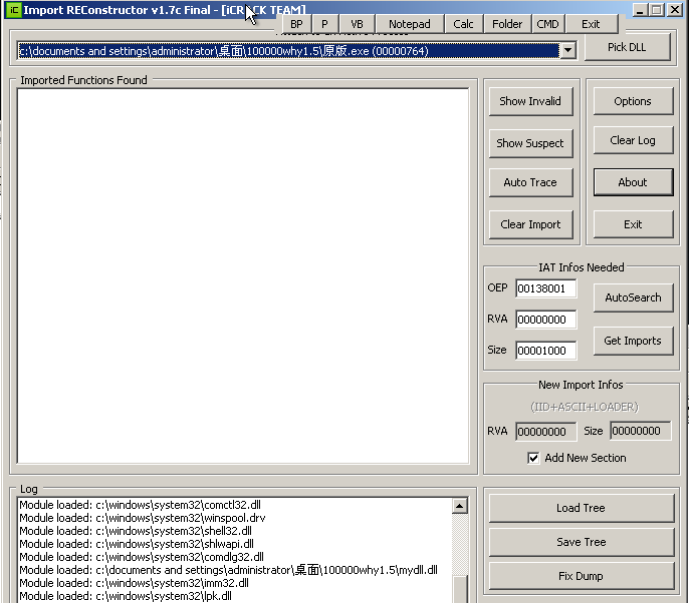
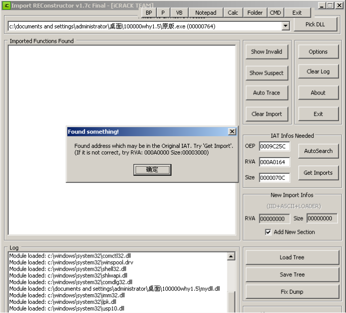
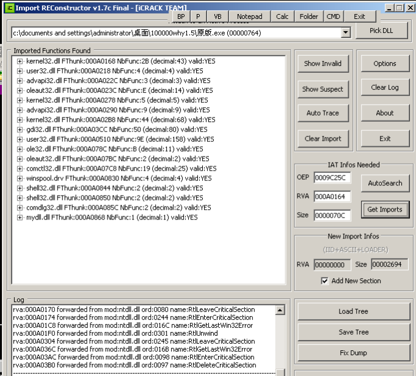

[EN](./fix-iat.md) | [ZH](./fix-iat-zh.md)
## Principle

After finding the program OEP, we need to dump the program and rebuild the `IAT`. `IAT` full name is `Import Address Table`, the entry points to the actual address of the function.

##example

For example, as follows, we found OEP and reached the real entry point of the program. We need to dump the program. Right click, select `&quot;Use OllyDump to unpack the debugging process&quot; (but you can also use `LoadPE`) Dump out):

A window pops up to see if the address is correct. The main thing is to check if the &#39;entry point address&#39; has been selected. Then uncheck the &#39;Rebuild Input Table&#39;.

Name the dump file, I am named `dump.exe` here. Let&#39;s try to run `dump.exe`, we can find that the program can&#39;t run normally. For some simple shells, you dump it and it doesn&#39;t work. If you do find the correct OEP and use &#39;IDA` to decompile and see the results well, then your first thought should be that the program &#39;IAT` has a problem. You need to rebuild `IAT`.

We need to use `ImportREC` to help fix the input table.

Open `ImportREC`, select a running process `original .exe` (`original.exe` is the process I am debugging in OD, `EIP` in OD is in `OEP` position, using `Ollydump `Do not close this process afterwards.). `ImportREC` repair input table entry point needs to know `OEP`, that is, input in the `OEP` input box in the middle of the right side of the window.

As we know, in Ollydbg we know that the current entry point of the program is `0049C25C`, and the mirror base address is `00400000`.

So we need to fill in `OEP` here is `0009C25C`

We modify the `OEP` in `ImportREC` to `0009C25C` and then click on &#39;AutoSearch`. A pop-up prompt box is displayed, &quot;The discovery may be the original IAT address&quot;.

We can click ``Get Imports&#39;` button to rebuild `IAT`. The left side will display the address of each imported function in `IAT` and whether it is valid. Obviously in the figure you can see `ImportREC` found in memory `IAT` Position and detect that each function is valid.

We click on `Fix Dump` and open the file that was previously dumped using the `OllyDump` plugin, which is the `dump.exe` file.

Then `ImportREC` will help restore the import table and generate the `dump_.exe` file. `dump_.exe` will run normally.