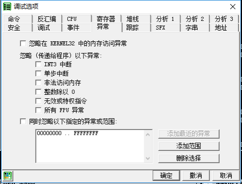
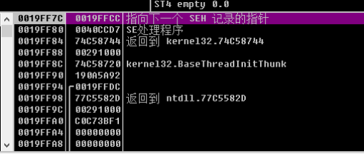
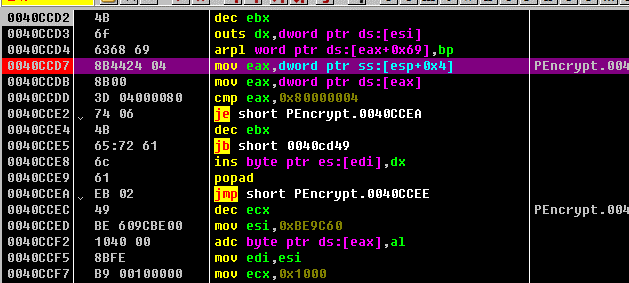
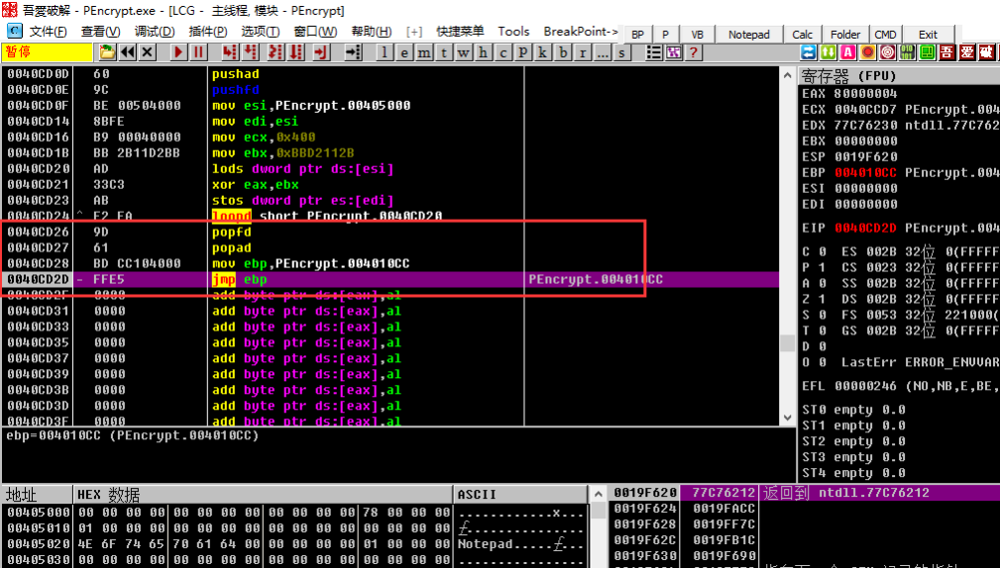
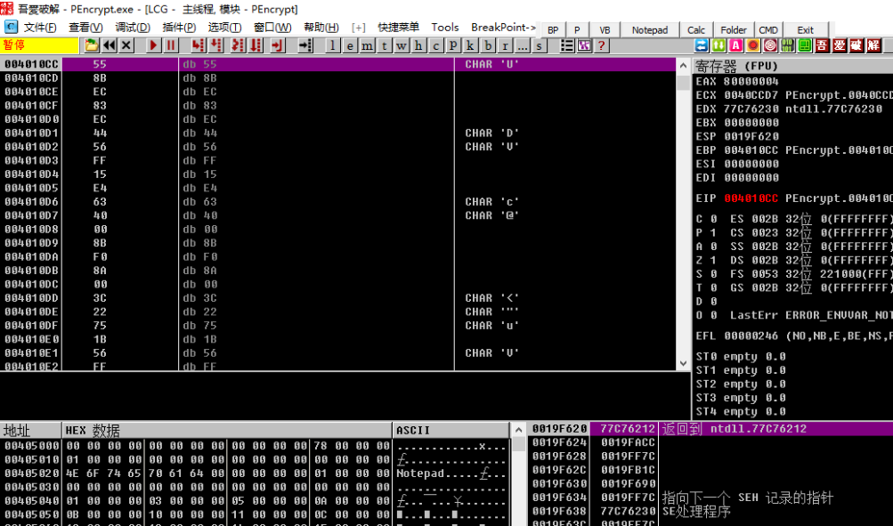

最后一次异常法的原理是, 程序在自解压或自解密过程中, 可能会触发无数次的异常. 如果能定位到最后一次程序异常的位置, 可能就会很接近自动脱壳完成位置. 现在最后一次异常法脱壳可以利用Ollydbg的异常计数器插件, 先记录异常数目, 然后重新载入, 自动停在最后一次异常处.

## 要点

1. 点击`选项->调试选项—>异常`, 把里面的√全部去掉! 按下`CTRL+F2`重载下程序
2. 开始程序就是一个跳转, 在这里我们按`SHIFT+F9`, 直到程序运行, 记下从开始按`SHIFT+F9`到程序运行的次数`m`!
3. `CTRL+F2`重载程序, 按`SHIFT+F9`(这次按的次数为程序运行的次数`m-1`次)
4. 在OD的右下角我们看见有一个"`SE 句柄`", 这时我们按`CTRL+G`, 输入`SE 句柄`前的地址!
5. 按F2下断点!然后按`SHIFT+F9`来到断点处, F8单步跟踪

## 示例

示例程序可以点击此处下载: [5_last_exception.zip](https://github.com/ctf-wiki/ctf-challenges/blob/master/reverse/unpack/example/5_last_exception.zip)

OD载入程序, 在菜单`选项->调试设置->异常标签页`中取消勾选所有的忽略异常, 然后重载程序.

我们按下`Shift+F9`, 记录按了多少次, 程序正常运行. 我们要得到的是倒数第二次按下是按了多少次. 在本例中

* `shift+F9`一次, 到了`0040CCD2`的位置
* `shift+F9`两次, 程序正常运行

那么我们重载程序, 只需按下1次(`2-1=1`)`Shift+F9`, 来到`0040CCD2`的位置, 观察堆栈窗口, 这里有一个`SE处理程序: 0040CCD7`

我们在CPU窗口(汇编指令), 按`Ctrl+G`, 输入`0040CCD7`, 然后在此处按下F2. 也就是在`0040CCD7`处设置断点, 然后按下`Shift+F9`运行, 触发断点.

触发断点后, 来单步跟踪. 向下都是一些循环和跳转, 我们使用F4跳过循环. 最后到达如下位置

显然在最后的`mov ebp, 0041010CC; jmp ebp`是在跳转向OEP, 我们跳转过去如下图所示:

显然, 我们幸运地来到了OEP处.
