[EN](./manually-fix-iat.md) | [ZH](./manually-fix-iat-zh.md)
示例程序可以从此链接下载: [manually_fix_iat.zip](https://github.com/ctf-wiki/ctf-challenges/blob/master/reverse/unpack/example/manually_fix_iat.zip)

我们常用的`ImportREC`脱壳是使用的软件自带的`IAT auto search`, 但是如果我们要手动查找`IAT`的地址并`dump`出来, 又该怎么操作呢？

首先使用ESP定律, 可以很快地跳转到`OEP: 00401110`.

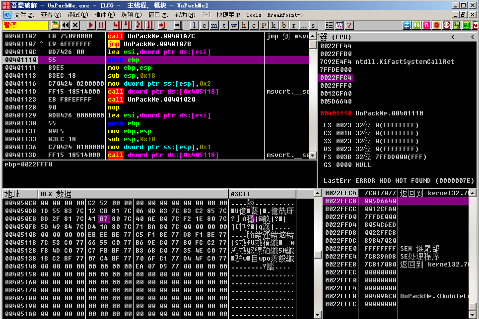

我们右键点击, 选择`查找->所有模块间的调用`

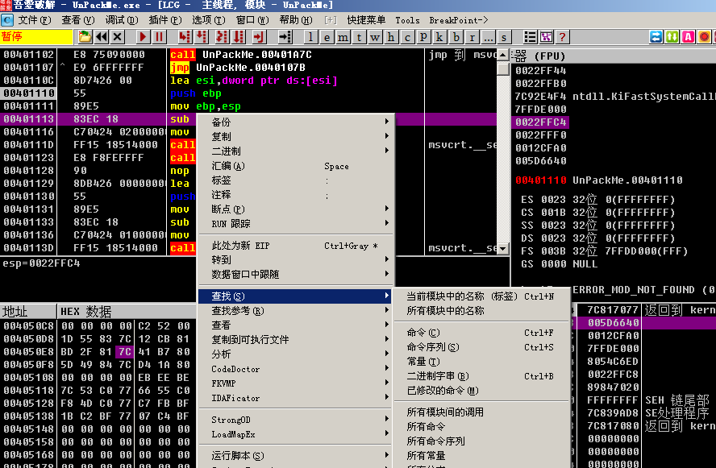

显示出调用的函数列表, 我们双击其中的某个函数(注意这里要双击的应该是程序的函数而不是系统函数)

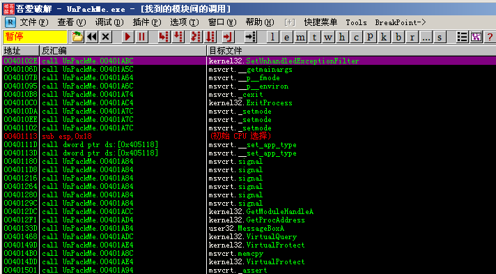

我们来到了函数调用处

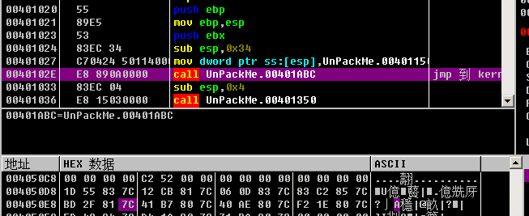

右键点击`跟随`, 进入函数

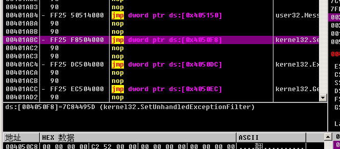

然后再右键点击`数据窗口中跟随->内存地址`

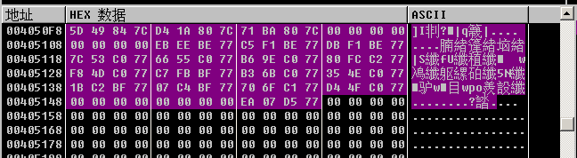

这里因为显示是十六进制值, 不方便查看, 我们可以在数据窗口点击右键选择`长型->地址`, 就可以显示函数名

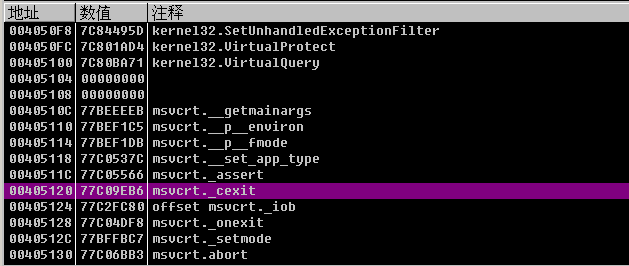

注意我们要向上翻到IAT表的起始位置, 可以看到最开始的函数地址是`004050D8`的`kernel.AddAtomA`, 我们向下找到最后一个函数, 也就是`user32.MessageBoxA`函数, 计算一下整个IAT表的大小。在OD的最下方有显示`块大小：0x7C`, 所以我们整个IAT块大小就是`0x7C`

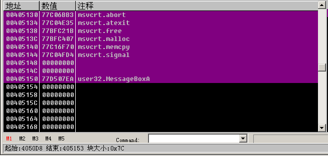

打开`ImportREC`, 选择我们正在调试的这个程序, 然后分别输入`OEP：1110, RVA:50D8, SIZE:7C`, 然后点击`获取输入表`

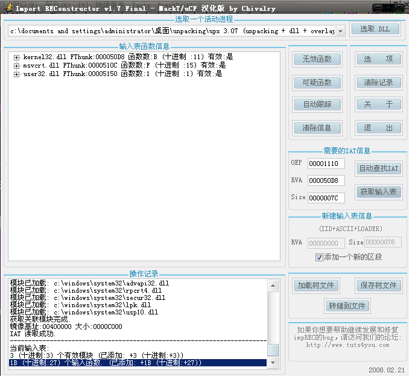

这里在输入表窗口中右键选择`高级命令->选择代码块`.

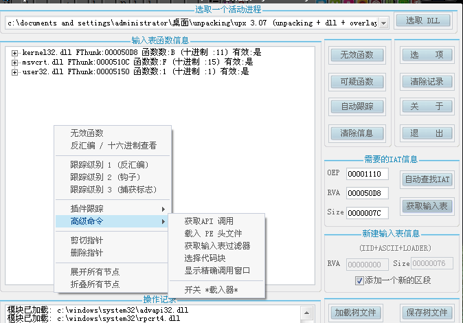

然后会弹出窗口, 选择完整转储, 保存为`dump.exe`文件

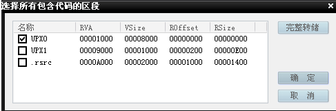

dump完成后, 选择`转储到文件`, 这里选择修复我们刚刚dump出的dump.exe, 得到一个`dump\_.exe`. 这时整个脱壳就完成了
