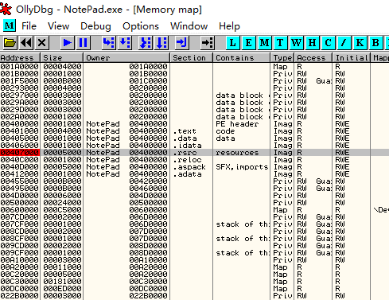

[EN](./memory.md) | [ZH](./memory-zh.md)
The memory mirroring method is to enter the virtual memory section of the program by the ALT&#39;s `ALT+M` shortcut when the packer is loaded. Then, by adding two memory one-time breakpoints, the correct OEP position of the program is reached.

The principle of the memory mirroring method is that for the program resource segment and the code segment under the breakpoint, when the general program self-extracting or self-decrypting, the resource segment is first accessed to obtain the required resources, and then after the automatic shelling is completed, the program code segment is transferred back. At this time, the memory will be disconnected once, and the program will stop at OEP.

## 要点

1. Select &#39;Options -&gt; Debug Options -&gt; Exceptions from the menu.
2. Check all ignore exceptions
3. Press `ALT+M` to open the memory image, find the first `.rsrc` of the program, press F2 to break the point, then press `SHIFT+F9` to run to the breakpoint.
4. Press `ALT+M` again to open the memory image. Find the `.text` on the first `.rsrc` of the program (in the example, `00401000`), press F2 to break the point. Then press ` SHIFT+F9` (or press F9 without exception)

##example

The sample program can be downloaded here: [4_memory.zip](https://github.com/ctf-wiki/ctf-challenges/blob/master/reverse/unpack/example/4_memory.zip)

OD loader, check all ignore exceptions in the menu item &#39;Options -&gt; Debug Settings -&gt; Exceptions tab&gt;.

Press `Alt+M` to open the memory image and find the resource segment, which is ``srcrc` of `address=00407000`, `size=00005000`, select F2 to break

Go back to the CPU window, press F9 to run, the program is broken at `0040D75F`

Press `Alt+M` again to open the memory image and break the `.text` code snippet.

Continue to run, the program is broken at `004010CC`, which is OEP

