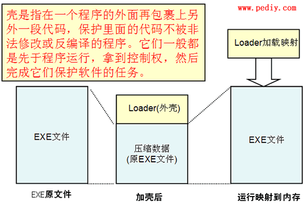

[EN](./packer-introduction.md) | [ZH](./packer-introduction-zh.md)
## What is the shell?

**Shell** is a program in some computer software that is specifically responsible for protecting software from unauthorized modification or decompilation.

They generally run before the program, gain control, and then complete their task of protecting the software.

Since this program and the shell of nature have many functions in the same place, based on the naming rules, such a program is called a shell.

## Shell classification

We usually divide the shell** into two categories, one is a compression shell and the other is an encryption shell.

### Compressed shell

Compressed shells have been around since the days of DOS, but at that time, due to limited computing power, the decompression overhead was too large and was not widely used.

Using a compressed shell can help reduce the size of PE files, hide the internal code and resources of PE files, and facilitate network transmission and storage.

Usually, there are two types of compression shells. One is just a compression shell for compressing ordinary PE files, and the other is a large deformation of the source file, which seriously damages the PE file header and is often used to compress malicious programs.

Common compression shells are: Upx, ASpack, PECompat

### Encryption shell

Encryption shells or protective cases, there are a variety of techniques to prevent reverse code analysis, its main function is to protect PE from code reverse analysis.

Since the primary purpose of the Encryption Shell is no longer to compress file resources, the PE shell protected by the Encryption Shell is usually much larger than the original file.

At present, the encryption shell is widely used for security-critical applications, and sensitive programs are also used to avoid (reduce) detection and killing of anti-virus software.

Common encryption shells are: ASProtector, Armadillo, EXECryptor, Themida, VMProtect

## Shell loading process

### Save entry parameters

1. The value of each register is saved when the packer is initialized.
2. After the shell is executed, restore each register value.
3. Finally jump to the original program execution

Usually use the `pushad` / `popad`, `pushfd` / `popfd` command to save and restore the live environment

### Get the required function API

1. There are only `GetProcAddress`, `GetModuleHandle` and `LoadLibrary` API functions in the input table of the general shell.
2. If other API functions are required, map the DLL file to the calling process&#39;s address space via `LoadLibraryA(W)` or `LoadLibraryExA(W)`
3. If the DLL file has been mapped into the address space of the calling process, you can call the `GetModuleHandleA(W)` function to get the DLL module handle.
4. Once the DLL module is loaded, you can call the `GetProcAddress` function to get the address of the input function.

### Decrypting each block data

1. For the purpose of protecting source code and data, each block of the source program file is generally encrypted. The shell decrypts these block data when the program is executed to make the program run normally.
2. The shell is generally encrypted by block, decrypted by block, and the decrypted data is placed back in the appropriate memory location.

### Jump back to the original entry point

1. Before jumping back to the entry point, the original PE file input form (IAT) will be restored and the relocation items (mainly DLL files) will be processed.
2. Because the shell itself constructs an input table when packing, you need to re-acquire all the functions introduced by each DLL and fill in the IAT table.
3. After completing the above work, the control will be transferred to the original program and continue to be executed.