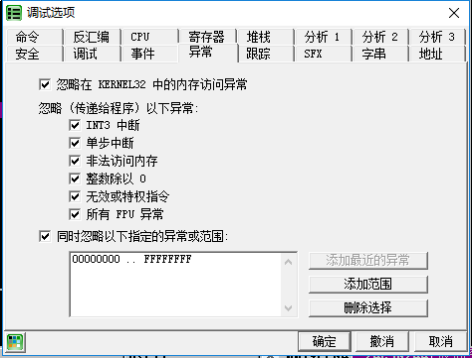
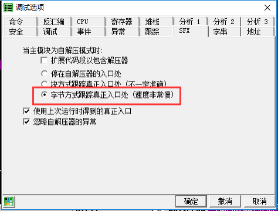
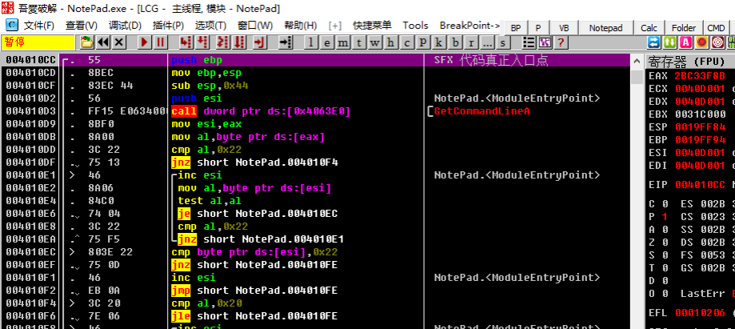

[EN](./sfx.md) | [ZH](./sfx-zh.md)
The &quot;SFX&quot; method takes advantage of the OEP search function that comes with Ollydbg. You can choose to stop the program directly at the OEP found by the OD. At this time, the decompression process of the shell is completed, and you can directly dump the program.

## 要点

1. Set OD, ignore all exceptions, that is, check the exception tab
2. Switch to the SFX tab and select &quot;Byte mode to track the actual entry (very slow)&quot;, OK
3. Reload the program (if &quot;Block code?&quot; is selected, &quot;No&quot;, OD directly reaches OEP)

##example

The sample program can be downloaded here: [6_sfx.zip](https://github.com/ctf-wiki/ctf-challenges/blob/master/reverse/unpack/example/6_sfx.zip)

First we check all ignore exceptions in the menu `Options -&gt; Debug Settings -&gt; Exceptions tab`.

Then switch to the `SFX` tab and click on &quot;Byte mode to track the real entrance (very slow)&quot;

Overloading the program, the program has stopped at the code entry point, and there is no need to re-analyze the OEP.

