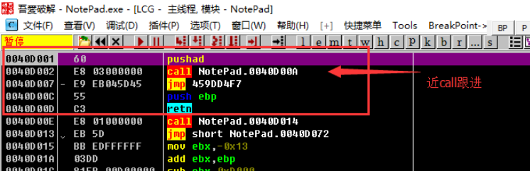
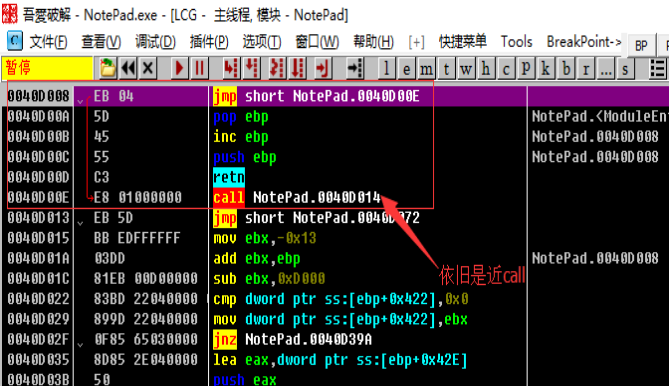
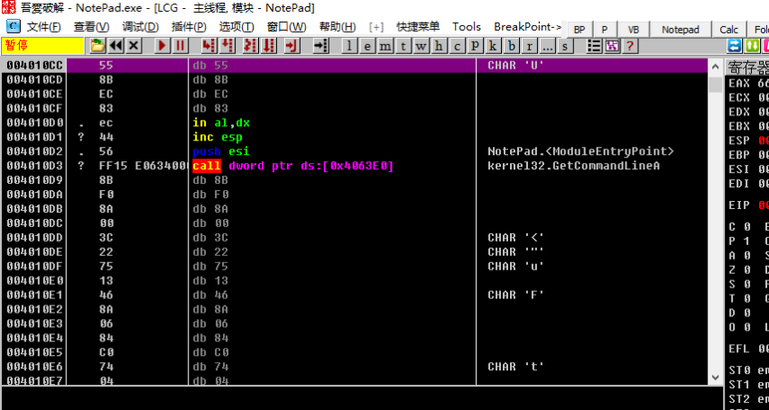
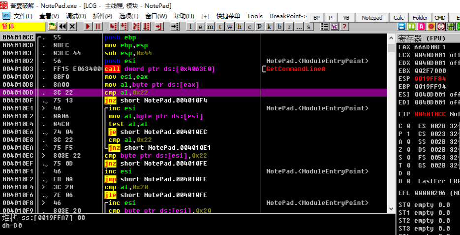

[EN](./trace.md) | [ZH](./trace-zh.md)
The principle of the single-step tracking method is to go through the steps of (F8), step (F7) and run to (F4) of Ollydbg, completely go through the self-shelling process of the program, skip some fragments of the loop recovery code, and use the single Step to ensure that the program will not skip OEP. This way, after the software auto-hull module is finished running, it will reach OEP and dump the program.


## 要点


1. Open the program and press F8 to step down. Try to implement the downward jmp jump.
2. You will often encounter large loops, then use F4 to skip the loop.
3. If the function is not far away is a call (near call), then we try not to skip directly, but enter this call
4. The jmp instruction with a large jump range is most likely to jump to the original program entry point (OEP).


##example


The sample program can be downloaded here: [1_trace.zip](https://github.com/ctf-wiki/ctf-challenges/blob/master/reverse/unpack/example/1_trace.zip)


The single-step tracking method is to go down the program entry point step by step. In the single-step process, pay attention to the EIP not to go wrong, but for some complicated shells, the single-step process will be extremely boring and easy. I confuse myself. So single-step tracking is also often used to analyze some key code parts (combined with static analysis), rather than completely from the beginning to the end, which is contrary to the concept of reverse engineering.


Open the Notepad.exe in the archive with Ollydbg and stop at the location below. The entry point is a `pushad` that saves all register states to the stack, followed by a `call` call to the function at `0040D00A`. After that, unconditionally jump to `459DD4F7`, then `push ebp` and `retn` obviously have no meaning. Like this entry point is a `call` we call `near call`, for near call us Select step, press F7 (of course you can only choose to step, or EIP will stop the program).





After the stepping is a `call`, we continue to step, press F7, follow up and find that there is no near call, we can see the program in the `GetModuleHandleA`, `GetProcAddress` and other APIs, continue to analyze downwards.





After that, we will encounter multiple jumps. We try to satisfy the downward jump. For the upward jump, we will not implement it and use F4 to jump out of the loop until `0040D3AF`. We look at the following code.


`` `asm
0040D3AF    61              	popad

0040D3B0    75 08           	jnz short NotePad.0040D3BA

0040D3B2    B8 01000000    	    mov eax,0x1

0040D3B7 C2 0C00 direction 0xC
0040D3BA    68 CC104000     	push NotePad.004010CC

0040D3BF C3 retn
```


Here `popad` can restore the state of the register saved at the program entry point, then `jnz` jumps to `0040D3BA`, here uses `push` and `retn` to change `EIP` to `004010CC`, also That is to say, after the shell decompresses the code and other resources, it will jump to `push` through `jnz`, then set `EIP` to the original entry point (OEP) and return by `push` and `ret`. Go to OEP, and then continue to execute the code of the original program. After we return to `retn`, we can see the following:





Obviously, we went to a bunch of places where `Ollydbg` was mistaken for data. Obviously `Ollydbg` analysis error, we need to let `Ollydbg` re-analyze, we can right-click `analysis-&gt;delete analysis from module. , or press `ctrl+a`, which correctly displays the assembly instructions at OEP.



