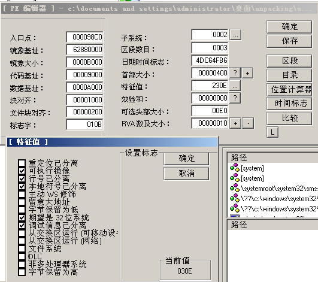
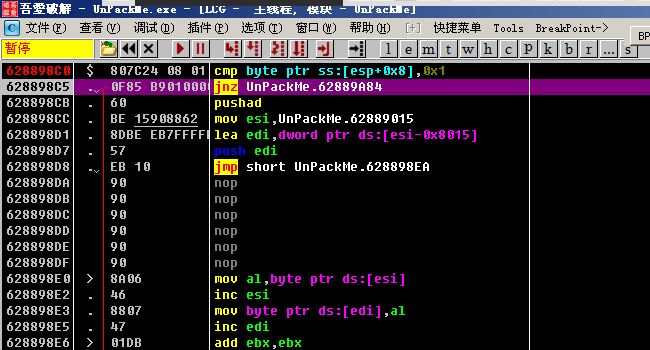

[EN](./unpack-dll.md) | [ZH](./unpack-dll-zh.md)
Here you need to contact the previous section [Manually find IAT and use ImportREC to rebuild] (/reverse/unpack/manually-fix-iat/index.html)

The example file can be downloaded here: [unpack_dll.zip](https://github.com/ctf-wiki/ctf-challenges/blob/master/reverse/unpack/example/unpack_dll.zip)

This step is required for `Dll` shelling. The most critical step for `Dll` shelling is to use LordPE to modify its Dll flag, open `UnpackMe.dll` with `LordPE`, and click on the feature value. ...`, then uncheck the `DLL` flag. After saving, the system will treat the file as an executable file.

We changed the `UnpackMe.dll` suffix to `UnpackMe.exe` and loaded it with OD.

Usually at the entry point, the program will save some information, here is very simple, just make a `cmp`. One thing to note is that the `jnz` jump here jumps directly to the end of the `unpacking` process. So we Need to modify the `z` flag of the register to invalidate the jump. Also set a breakpoint at the end of the `unpacking` process to avoid shelling and then run directly. (The program will break at this breakpoint, but the shell has been Finished, the code is very clear)

The basic steps of `Dll` shelling are the same as the `exe` file shelling, and when rebuilding ʻIAT`, you need to follow the previous article [Manually find IAT and use ImportREC to rebuild] (/reverse/unpack/manually-fix-iat /index.html) As mentioned, manually find the `IAT` table and rebuild it with `ImportREC`. Just note that after unpacking the dump, remember to restore the `DLL` flag with LordPE and append the file name. Change to `.dll`.