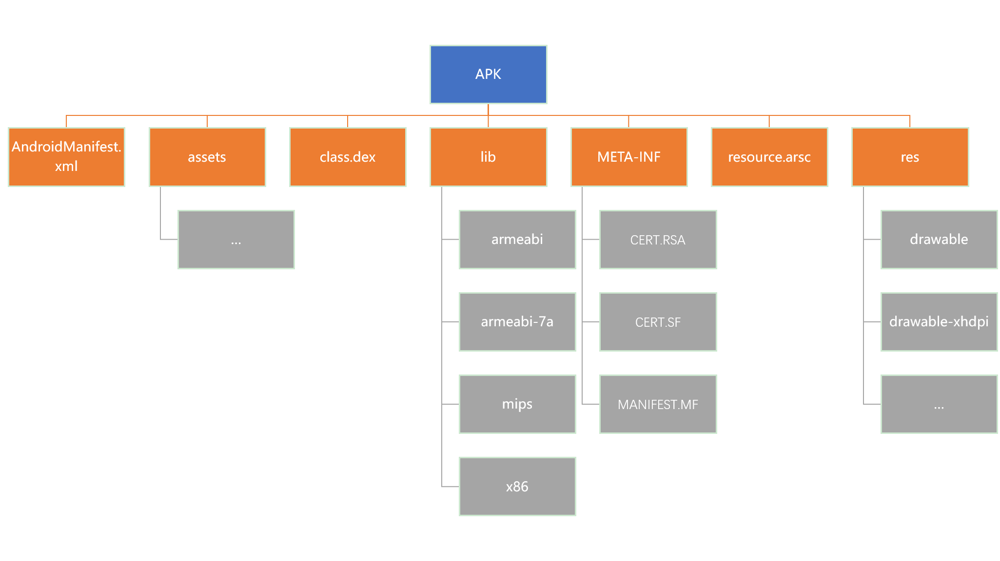

# Android 開發基礎

在做 Android 安全之前，我們應該儘可能地瞭解 Android 開發的基本流程。

## 基礎知識

依次閱讀以下書籍，由淺入深地瞭解 Android 基本開發知識

- 第一行代碼，閱讀完前七章即可
- JNI/NDK 開發，目前尚未找到一本相關合適的指南。
- Android 編程權威指南（可選）
- Android 高級進階（可選）

在學習的過程中，個人覺得需要着重瞭解 Android 開發中如下知識

- Android 系統架構
- 基本源文件架構
- 基本開發方式與代碼編寫慣例，瞭解常見代碼的意思。
- 瞭解 xml 等一些配置資源的文件格式。

**一定要搭好基本的 Android 開發環境！！！！！**

- java
- ddms
- ndk
- sdk，多安裝幾個版本的 sdk，5.0-8.0

## Apk 打包流程

當編寫完 App 相關的代碼後，我們的最後一步就是將 App 中所有使用到的資源文件進行打包，打包流程如下圖（<u>http://androidsrc.net/android-app-build-overview/</u>）所示：

具體的操作如下

1. 使用 aapt( The Android Asset Packing Tool ) 對資源文件進行打包，生成 R.java 文件。
2. 如果項目中使用到了 AIDL（Android Interface Definition Language）提供的服務，則需要使用 AIDL 工具解析 AIDL 接口文件生成相應的 Java 代碼。
3. 使用 javac 將 R.java 和 AIDL 文件編譯爲 .class 文件。
4. 使用 dx 工具將 class 和第三方的 library 轉換爲 dex 文件。
5. 利用 apkbuilder 將第一步編譯後的資源、第四步生成的 .dex 文件，以及一些其它資源打包到 APK 文件中。
6. 這一部主要是對 APK 進行簽名。可以分爲兩種情況，如果我們是要發佈 App，那就採用 RealeaseKeystore  簽名；反之，我們如果只是想要對 App 進行調試，那就使用 debug.keystore 簽名。
7. 在發佈正式版之前，我們需要將 APK 包中資源文件距離文件的起始偏移修改爲 4 字節的整數倍數，這樣，在之後運行 App 的時候，速度會比較快。

## Apk 文件結構

APK 文件也是一種 ZIP 文件。因此，我們可以使用解壓 zip 的工具來對其進行解壓。一個典型的 APK 文件的結構如下圖所示。其中，關於每一部分的介紹如下

- AndroidManifest.xml

    - 該文件主要用於聲明應用程序的名稱，組件，權限等基本信息。

- class.dex
    - 該文件是 dalvik 虛擬機對應的可執行文件，包含應用程序的可執行代碼。
- resource.arsc
    - 該文件主要是應用程序編譯後的二進制資源以及資源位置與資源 id 之間的映射關係，如字符串。
- assets
    - 該文件夾一般用於包含應用程序的原始資源文件，例如字體和音樂文件。程序在運行的時候，可以通過API 獲取這些信息。
- lib/
    - lib目錄下主要用於存儲通過 JNI（Java Native Interface）機制使用的本地庫文件，並且會按照其支持的架構，分別創建對應的子目錄。
- res/
    - 該目錄主要包含了 Android 應用引用的資源，並且會按照資源類型進行存儲，如圖片，動畫，菜單等。主要還有一個 value 文件夾，包含了各類屬性資源
- colors.xml-->顏色資源
- dimens.xml--->尺寸資源
- strings--->字符串資源
- styles.xml-->樣式資源
- META-INF/
    - 類似於 JAR 文件，APK 文件中也包含了 META-INF 目錄，用於存放代碼簽名等文件，以便於用來確保 APK 文件不會被人隨意修改。
