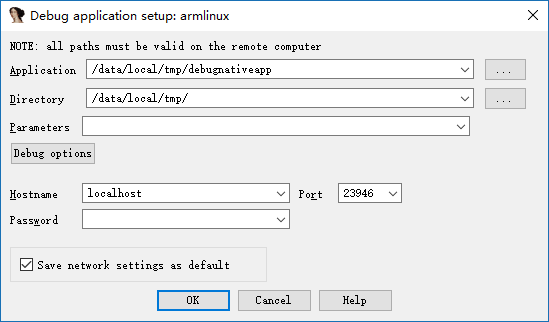
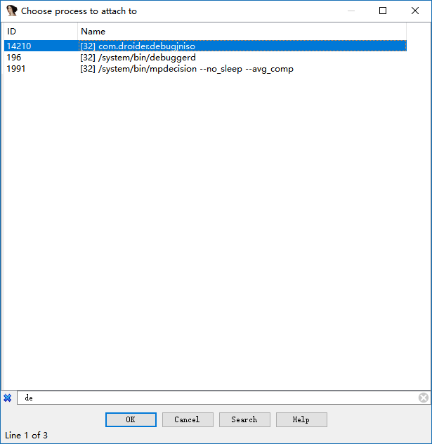
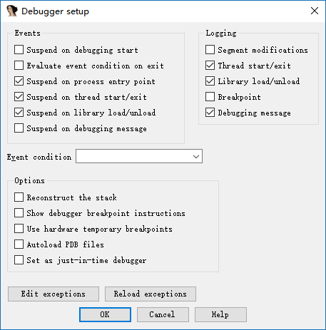
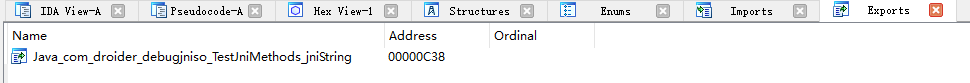

# IDA 動態調試原生層程序

這裏我們會介紹如何調試以下種類的程序

- 基本的原生層程序，即簡單的 C/C++ 程序。
- 原生 so 程序

## 必備工具

- **已經root的手機**
- IDA

## 基本原理

在使用 ida 動態調試原生層程序時，主要會使用到 android_server 程序。該程序會使用 ptrace 技術注入到要調試的程序中。

每一個進程都有一個 status 文件，其中有一字段 TracerPid 用來標識該進程是被哪個進程 ptrace 了。如果沒有被其他進程 ptrace，那麼就返回 0，否則返回對應進程的 pid。

## 基本環境搭建

無論是調試什麼原生層程序，基本的環境搭建都是類似的，需要確保 IDA 與手機通信正常。

1. 上傳 android_server 文件(在 ida 的 dbgsrv 文件夾下)，並修改相應權限使其可以執行

```shell
adb push android_server /data/local/tmp/
adb shell chmod 755 /data/local/tmp/android_server
```

2. 開啓 android_server，其會監聽 23946 端口(以 root 權限運行)

```shell
adb shell # 進入adb
su # 切換root
./data/local/tmp/android_server #啓動android_server
```
3. 建立本地計算機 23496 端口與手機端口 23946 的通信。當 PC 有客戶端連接 23946 端口時，其發送的信息都將被轉發到手機的相應的端口，這時 android_server 就收到相應的數據，從而使得 IDA 可以調試程序。前面的 tcp 的端口指的是本地 PC 的端口，後面的指的是手機的端口。

```shell
adb forward tcp:23946 tcp:23946
```
注意：

> 其實這個連接建立的是 adb server 與與手機上 adbd 之間的通信。所以其通信大概是這個樣子的
>
> IDA<-->adb server<--->adbd<---->android_server
>
> ​         電腦                   |             手機

**其中，第一步只需要執行一次，後面就不需要再次執行。而第 2-3 步每次都得執行，因此可以寫成一個腳本，並將腳本的路徑放在系統的 path 環境變量下，這樣我們可以執行一個命令直接執行。**

## 基本原生程序調試-法1

基本原生程序指的是普通的編譯爲 arm 彙編的 c/c++ 程序。

### 添加程序

這裏我們以<u>http://www.52pojie.cn/thread-554068-1-1.html</u>中的 debugnativeapp 爲例子。

首先，我們需要把原生程序放到 android 設備中，並修改其權限，使其可以被執行。如下

```shell
adb push debugnativeapp /data/local/tmp/
adb shell chmod 755 /data/local/tmp/debugnativeapp
```

### 啓動調試

根據原生層程序的位數選擇相應的 ida，然後選擇 Debugger-Run-RemoteArmLinux/Android debugger，如下界面



其中，重要的參數意義如下

- Application
  - 被調試程序在手機上的絕對路徑。
- Directory
  - 被調試程序在手機中的目錄
- Hostname
  - 即我們與哪個主機進行通信，這裏我們直接和本地PC進行通信。

其中 Debug options 選擇如下


主要是選擇了三個 Events，使得我們的程序可以在入口點，線程啓動時，library加載時自動停止。當然，也可以都進行選擇。

啓動程序後，如下


注：

> 1. 如果發現can not load plugin ，那可能是手機沒有root。
>
> 2. 如果遇到以下問題，直接cancel就好。具體原因還不清楚。
>
>    
>
> 3. 如果遇到error: only position independent executables (PIE) are supported.一般是因爲android手機的版本大於5，可以嘗試
>
>    - 使用android_server的PIE版本
>    - 利用010Editor將可執行ELF文件的header中的elf header字段中的e_type改爲ET_DYN(3)。

## so原生程序調試

對於 so 原生程序，我們可能會想這和普通原生程序有什麼不一樣的地方呢？自然是有的，so文件不能單獨運行。一般是其它程序調用 so 文件中的基本某些函數。所以這裏我們就不能直接採用上面 run 的方式了。一般來說，android 中 so 文件都是依賴於 apk 文件的。

這裏我們以 <u>http://www.52pojie.cn/thread-554068-1-1.html</u> 中的 debugjniso.apk 爲例子。

**首先，必須搭建基本調試環境。**

### 安裝程序

首先，我們需要將 apk 安裝到手機上。

```shell
adb install debugjniso.apk
```

### 調試模式啓動app

其次，我們需要以**調試模式啓動程序**，這樣，纔可以方便 IDA 來捕捉到相應的程序並對其進行 attach。

 ```shell
adb shell am start -D -n packagename/.MainActivity
 ```

### attach程序

啓動 IDA pro，點擊Debugger-Attach-RemoteArmLinux/Android debugger，Hostname 填 localhost，port 默認就是 23946 端口。其實就是我們本地電腦的監聽端口。如下


點擊 ok，啓動調試

**注意：**

> 如果最後出現只有一個程序 /bin/sh 可以被 attach，那說明沒有以 root 權限運行 android_server 程序。

利用 ctrl+f 快速定位並選擇相應的進程，如下



然後ok確定即可。

這時我們可以看到我們已經 attach 成功了。


這時候我們再點擊 Debugger-Debugger options，設置相關選項如下



意思類同於原生程序。

> 爲什麼這時候才選擇要設下相應的斷點，是因爲如果在開始attach的時候就設置的話，到這裏其實是沒有的。大家可以試試。

### 恢復 app 執行

這時候，app 的界面是 wait for debugger，我們也已經 attach 上去了。這時候，就需要讓程序繼續運行了。

首先，我們打開 ddms 來選中我們要調試的進程。


這裏其實相當於直接執行了

```shell
# 顯示手機所有可供調試的用戶進程
adb jdwp
# 在PC的xxx端口與手機的相應端口之間建立連接，方便通信
adb forward tcp:xxx jdwp:<pid>
```

之所以不使用命令去執行，是因爲我們還得自己去確定我們的 apk 的進程號，這會比較麻煩。

這裏給出一個基本的通信過程


此時，我們的電腦已經與手機的 app 虛擬機之間建立了通信。

同時，我們需要使用 jdb 在 java 層來將我們的 apk 應用 attach 到我們的電腦上，這裏我們使用如下的命令。

```shell
jdb -connect com.sun.jdi.SocketAttach:hostname=localhost,port=xxx
```

其中 xxx 就是我們在 ddms 看到的 8700 端口，一般默認就是這個。執行之後

```shell
C:\Users\iromise
λ jdb.bat

jdb -connect com.sun.jdi.SocketAttach:hostname=127.0.0.1,port=8700
設置未捕獲的java.lang.Throwable
設置延遲的未捕獲的java.lang.Throwable
正在初始化jdb...
>
```

我們再次看一下我們的手機，


此時，應用已經又繼續運行了，不再是之前的 wait for debugger 了。

### 確定原生函數地址

這裏我們再次打開一個 ida，導入該 apk 的 so 庫，然後在 export 中尋找我們的函數，如下



可以看出其偏移爲 0xc38。

我們再在之前的調試的 IDA 中運行 F9 直到怎麼按都不再運行，我們會看到程序斷在 linker 處


此時，我們**點擊 app 界面的設置標題按鈕**（之所以要按這個，是因爲在該函數中調用了原生 API），再次觀察IDA，可以看出該 so 庫已經被加載進入

```text
B3B05000: loaded /data/app/com.droider.debugjniso-1/oat/arm/base.odex
B39B9000: loaded /system/lib/hw/gralloc.msm8974.so
B39B2000: loaded /system/lib/libmemalloc.so
B39AA000: loaded /system/lib/libqdutils.so
B3B00000: loaded /data/app/com.droider.debugjniso-1/lib/arm/libdebugjniso.so
```

這時，我們利用 ctrl+s 定位到該庫的起始地址處 0xB3B00000。然後根據

```text
絕對地址=基地址+相對偏移
```

得到 jnistring 的地址。

### 觀察結果

按下 g，然後輸入 `+0xC38` ，點擊 ok 即可跳轉至該函數

```assembly
libdebugjniso.so:B3B00C38 Java_com_droider_debugjniso_TestJniMethods_jniString
libdebugjniso.so:B3B00C38 LDR             R1, =(unk_B3B02148 - 0xB3B00C4C)
libdebugjniso.so:B3B00C3C STMFD           SP!, {R4,LR}
libdebugjniso.so:B3B00C40 LDR             R3, [R0]
libdebugjniso.so:B3B00C44 ADD             R1, PC, R1 ; unk_B3B02148
libdebugjniso.so:B3B00C48 MOV             LR, PC
```

我們在此函數的開始處 F2 下斷點，然後再次F9執行程序，同時觀看手機，就可以發現app的標題變成了`你好！Nativemethod` 。

到此，so 原生程序的基本調試步驟就結束了。

注：

> 如果中間出現了add map的對話框直接點擊Cancel，然後apply即可。

### 注意事項

1.  當使用模擬器調試 apk 出現異常時，很有可能是應用檢測了是否運行在模擬器環境下，考慮使用手機。
2.  當使用真機調試 apk 時，也有可能會遇到異常，卡在某一條指令上，這時我們可以手動執行這條指令，然後將 PC 設置爲下一條指令的地址。

## 基本原生程序調試-法2

待補充。

## 多線程調試

## 參考閱讀

- http://www.52pojie.cn/thread-554068-1-1.html
- https://www.kanxue.com/chm.htm?id=10296&pid=node1000944
