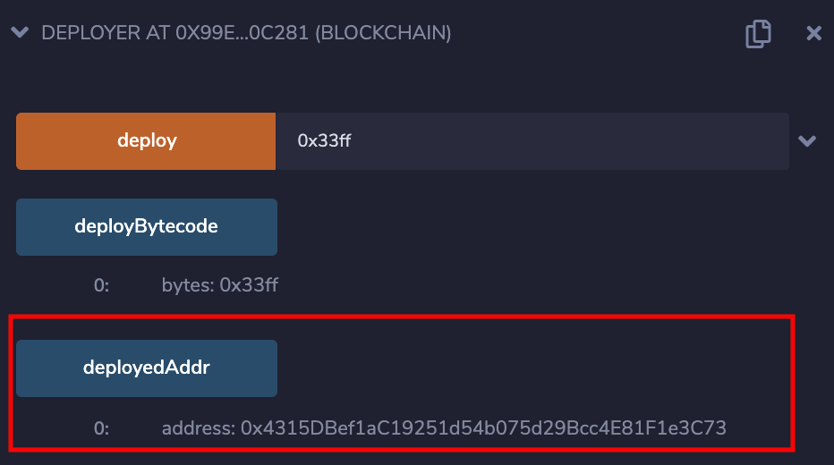
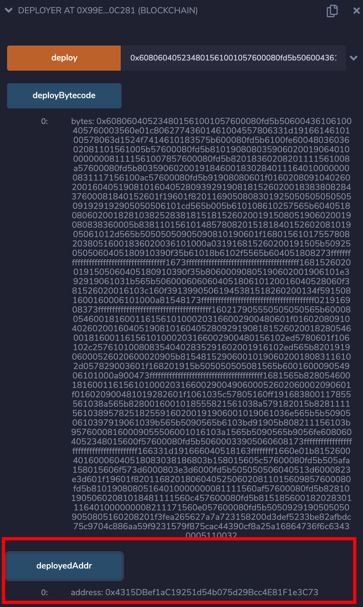

# CREATE2

`CREATE2` 是以太坊在“君士坦丁堡”這次硬分叉升級中引入的一個新操作碼，不同於 `CREATE`，它使用新的方式來計算合約地址，讓生成的合約地址更具有可控性。通過 `CREATE2` 可以延伸出很多有意思的玩法，在 CTF 中最常見的就是利用這種可控性，在同一個地址先後部署字節碼完全不同的合約。

## 原理

### CREATE

如果利用外部賬戶或者使用 `CREATE` 操作碼的合約賬戶創建一個合約，那麼很容易就能確定被創建合約的地址。每個賬戶都有一個與之關聯的 `nonce`：對外部賬戶而言，每發送一個交易，`nonce` 就會隨之 `+1`；對合約賬戶而言，每創建一個合約，`nonce` 就會隨之 `+1`。新合約的地址由創建合約交易的發送者賬戶地址及其 `nonce` 值計算得到，其具體公式如下：

```python
keccak256(rlp.encode(address, nonce))[12:]
```

### CREATE2

不同於原來的 `CREATE` 操作碼，在合約地址的計算方法上，`CREATE2` 不再依賴於賬戶的 `nonce`，而是對以下參數進行哈希計算，得出新的地址：

- 合約創建者的地址（`address`)
- 作爲參數的混淆值（`salt`）
- 合約創建代碼    (`init_code`)

具體的計算公式如下：

```python
keccak256(0xff ++ address ++ salt ++ keccak256(init_code))[12:]
```

一個需要注意的重要細節是，計算合約地址所需的最後一個參數並非合約代碼，而是其創建代碼。該代碼是用來創建合約的，合約創建完成後將返回運行時字節碼。

這意味着，如果我們控制了合約的創建代碼並使其保持不變，然後控制合約構造函數返回的運行時字節碼，那麼我們很容易就能做到在同一個地址上，反覆部署完全不同的合約。事實上 `CREATE2` 這種讓合約在部署後可以被重新更改的特性存在着潛在的安全問題，也引起了人們對其的[討論](https://ethereum-magicians.org/t/potential-security-implications-of-create2-eip-1014/2614)。

在 CTF 中，這種特性往往會被用來作爲一個技巧，通過在同一個地址上部署不同的合約用來 bypass 不同的校驗。

## 例子

以 2019 Balsn CTF 的 Creativity 的 WP 提供的 PoC 作爲例子，講解一下 `CREATE2` 的巧妙使用：

```solidity
pragma solidity ^0.5.10;

contract Deployer {
    bytes public deployBytecode;
    address public deployedAddr;

    function deploy(bytes memory code) public {
        deployBytecode = code;
        address a;
        // Compile Dumper to get this bytecode
        bytes memory dumperBytecode = hex'6080604052348015600f57600080fd5b50600033905060608173ffffffffffffffffffffffffffffffffffffffff166331d191666040518163ffffffff1660e01b815260040160006040518083038186803b158015605c57600080fd5b505afa158015606f573d6000803e3d6000fd5b505050506040513d6000823e3d601f19601f820116820180604052506020811015609857600080fd5b81019080805164010000000081111560af57600080fd5b8281019050602081018481111560c457600080fd5b815185600182028301116401000000008211171560e057600080fd5b50509291905050509050805160208201f3fe';
        assembly {
            a := create2(callvalue, add(0x20, dumperBytecode), mload(dumperBytecode), 0x9453)
        }
        deployedAddr = a;
    }
}

contract Dumper {
    constructor() public {
        Deployer dp = Deployer(msg.sender);
        bytes memory bytecode = dp.deployBytecode();
        assembly {
            return (add(bytecode, 0x20), mload(bytecode))
        }
    }
}
```

當我們每次利用 `deploy(code)` 函數來部署預期構造的合約時，由於實際上的 `init_code` 都是同樣的 `dumperBytecode`，再加上確定的合約地址以及 `salt`，所以通過 `deploy(code)` 部署的合約最終會部署在同一個地址上。然後被加載的合約在構造函數執行的時候，會跳轉到調用函數時傳入的 `code` 上，所以不管我們用 `deploy(code)` 函數部署什麼合約，其最終都會部署到同一個地址上。

在知道 `Deployer` 合約地址是 0x99Ed0b4646a5F4Ee0877B8341E9629e4BF30c281 的情況下，我們可以計算部署合約的地址爲 0x4315DBef1aC19251d54b075d29Bcc4E81F1e3C73：

```solidity
function getAddress(address addr, bytes memory bytecode, uint salt) public view returns (address) {
    bytes32 hash = keccak256(
        abi.encodePacked(
            bytes1(0xff),
            addr,
            salt,
            keccak256(bytecode)
        )
    );

    // NOTE: cast last 20 bytes of hash to address
    return address(uint160(uint256(hash)));
}
```

利用該合約，我們成功地在同一個地址上先後上部署了兩個不同的合約：





## 題目

### Balsn 2019
- 題目名稱 Creativity

### QWB 2020
- 題目名稱 EasyAssembly

## 參考

- [EIP-1014: Skinny CREATE2](https://eips.ethereum.org/EIPS/eip-1014)
- [充分利用 CREATE2](https://ethfans.org/posts/getting-the-most-out-of-create2)
- [Balsn CTF 2019 - Creativity](https://x9453.github.io/2020/01/04/Balsn-CTF-2019-Creativity/)
