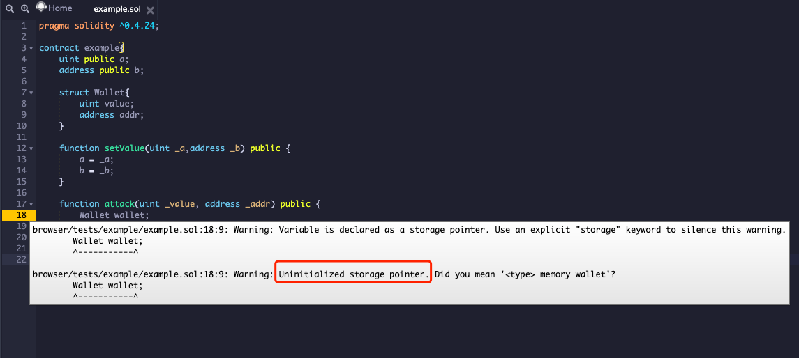
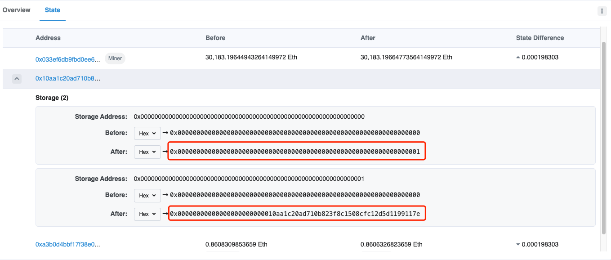
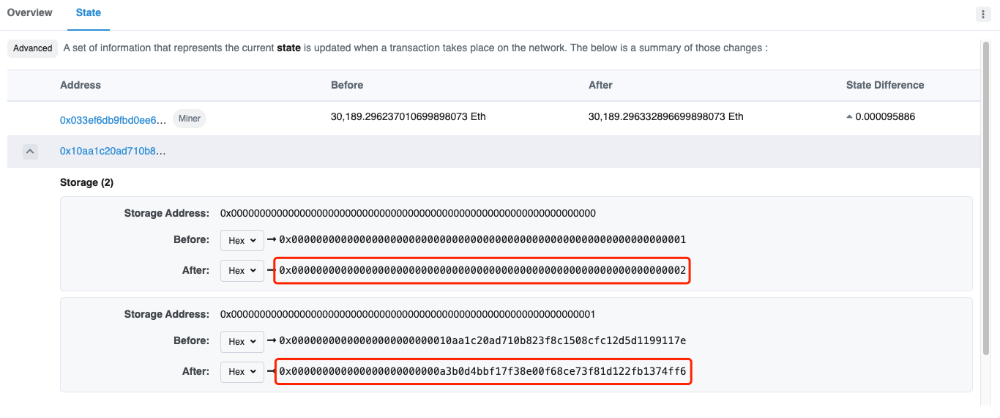
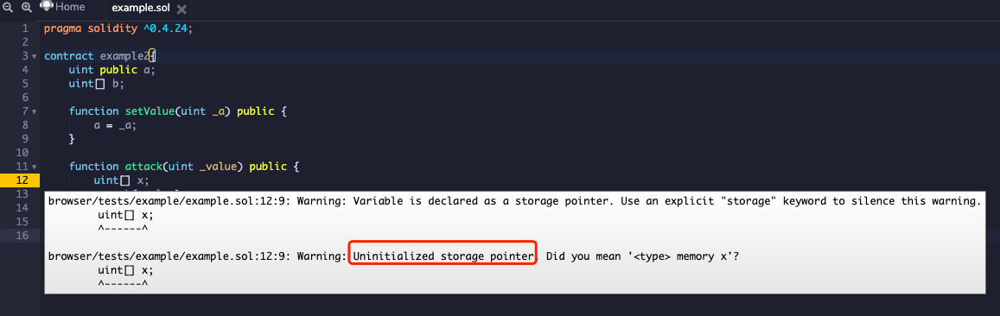

# Uninitialized Storage Pointer

## 原理
未初始化的存儲指針是指在 EVM 中未進行初始化的 storage 變量，這個變量會指向其他變量的區域，從而更改其他變量的值。

## 例子
### 典型例子
我們來看下面這個例子：

```solidity
pragma solidity ^0.4.24;

contract example1{
    uint public a;
    address public b;

    struct Wallet{
        uint value;
        address addr;
    }

    function setValue(uint _a,address _b) public {
        a = _a;
        b = _b;
    }

    function attack(uint _value, address _addr) public {
        Wallet wallet;
        wallet.value = _value;
        wallet.addr = _addr;
    }
}
```

將這份代碼放入 Remix 中，它會提示 Uninitialized Storage Pointer：



在我們部署後，首先使用 setValue 函數將 a 和 b 的值分別設爲 1 和 0x10aA1C20aD710B823f8c1508cfC12D5d1199117E，可以從交易中發現設置成功：



然後我們調用 attack 函數，傳入的 _value 和 _addr 值分別爲 2 和 0xa3b0D4BBF17F38e00F68Ce73f81D122FB1374ff6，可以從交易中發現 a 和 b 被傳入的 _value 和 _addr 值覆蓋了：



這個例子的修復方案是使用 mapping 進行結構體的初始化，並使用 storage 進行拷貝：

```solidity
pragma solidity ^0.4.24;

contract example1{
    uint public a;
    address public b;

    struct Wallet{
        uint value;
        address addr;
    }

    mapping (uint => Wallet) wallets;

    function setValue(uint _a,address _b) public {
        a = _a;
        b = _b;
    }

    function fix(uint _id, uint _value, address _addr) public {
        Wallet storage wallet = wallets[_id];
        wallet.value = _value;
        wallet.addr = _addr;
    }
}
```

不僅僅是 struct 會遇到這個問題，數組也有同樣的問題。我們來看下面的另一個例子：

```solidity
pragma solidity ^0.4.24;

contract example2{
    uint public a;
    uint[] b;

    function setValue(uint _a) public {
        a = _a;
    }

    function attack(uint _value) public {
        uint[] tmp;
        tmp.push(_value);
        b = tmp;
    }
}
```

將這份代碼放入 Remix 中，它也會提示 Uninitialized Storage Pointer：



在我們部署後，首先使用 setValue 函數將 a 的值設爲 1，可以從交易中發現設置成功：


然後我們調用 attack 函數，傳入的 _value 值爲 2，這是因爲聲明的 tmp 數組也使用 slot 0，數組聲明的 slot 存儲着本身的長度，所以再 push 導致數組長度增加 1，所以 slot 0 位置存儲着數值 2 = a(old) + 1，故 a(new) = 2：


這個例子的修復方案是在聲明局部變量 tmp 的時候對它進行初始化操作：

```solidity
pragma solidity ^0.4.24;

contract example2{
    uint public a;
    uint[] b;

    function setValue(uint _a) public {
        a = _a;
    }

    function fix(uint _value) public {
        uint[] tmp = b;
        tmp.push(_value);
    }
}
```

### 2019 BalsnCTF Bank
以 2019 Balsn CTF 的 Bank 的 WP 作爲參考，講解一下未初始化的存儲指針的攻擊方式。題目合約的源碼如下：
```solidity
pragma solidity ^0.4.24;

contract Bank {
    event SendEther(address addr);
    event SendFlag(address addr);
    
    address public owner;
    uint randomNumber = 0;
    
    constructor() public {
        owner = msg.sender;
    }
    
    struct SafeBox {
        bool done;
        function(uint, bytes12) internal callback;
        bytes12 hash;
        uint value;
    }
    SafeBox[] safeboxes;
    
    struct FailedAttempt {
        uint idx;
        uint time;
        bytes12 triedPass;
        address origin;
    }
    mapping(address => FailedAttempt[]) failedLogs;
    
    modifier onlyPass(uint idx, bytes12 pass) {
        if (bytes12(sha3(pass)) != safeboxes[idx].hash) {
            FailedAttempt info;
            info.idx = idx;
            info.time = now;
            info.triedPass = pass;
            info.origin = tx.origin;
            failedLogs[msg.sender].push(info);
        }
        else {
            _;
        }
    }
    
    function deposit(bytes12 hash) payable public returns(uint) {
        SafeBox box;
        box.done = false;
        box.hash = hash;
        box.value = msg.value;
        if (msg.sender == owner) {
            box.callback = sendFlag;
        }
        else {
            require(msg.value >= 1 ether);
            box.value -= 0.01 ether;
            box.callback = sendEther;
        }
        safeboxes.push(box);
        return safeboxes.length-1;
    }
    
    function withdraw(uint idx, bytes12 pass) public payable {
        SafeBox box = safeboxes[idx];
        require(!box.done);
        box.callback(idx, pass);
        box.done = true;
    }
    
    function sendEther(uint idx, bytes12 pass) internal onlyPass(idx, pass) {
        msg.sender.transfer(safeboxes[idx].value);
        emit SendEther(msg.sender);
    }
    
    function sendFlag(uint idx, bytes12 pass) internal onlyPass(idx, pass) {
        require(msg.value >= 100000000 ether);
        emit SendFlag(msg.sender);
        selfdestruct(owner);
    }

}
```

我們的目標是要執行 emit SendFlag(msg.sender)，很明顯不能通過 sendFlag 函數來觸發，因爲我們肯定不能滿足 msg.value >= 100000000 ether。

如果我們仔細觀察代碼，會發現有兩處未初始化的存儲指針：

```solidity
modifier onlyPass(uint idx, bytes12 pass) {
[...]
    FailedAttempt info; <--
[...]
}

function deposit(bytes12 hash) payable public returns(uint) {
[...]
    SafeBox box; <--
[...]
}
```

那麼我們需要思考如何利用它們。我們首先來看看合約剛創建的時候的 slot 的佈局：

```
-----------------------------------------------------
|     unused (12)     |          owner (20)         | <- slot 0
-----------------------------------------------------
|                 randomNumber (32)                 | <- slot 1
-----------------------------------------------------
|               safeboxes.length (32)               | <- slot 2
-----------------------------------------------------
|       occupied by failedLogs but unused (32)      | <- slot 3
-----------------------------------------------------
```

onlyPass 中的 FailedAttempt 的佈局如下，它會覆蓋原先的 slot0 到 slot2 的內容：

```
-----------------------------------------------------
|                      idx (32)                     |
-----------------------------------------------------
|                     time (32)                     |
-----------------------------------------------------
|          tx.origin (20)      |   triedPass (12)   |
-----------------------------------------------------
```

deposit 中的 SafeBox 的佈局如下，它會覆蓋原先的 slot0 到 slot1 的內容：

```
-----------------------------------------------------
| unused (11) | hash (12) | callback (8) | done (1) |
-----------------------------------------------------
|                     value (32)                    |
-----------------------------------------------------
```

如果當 FailedAttempt 中的 tx.origin 足夠大的時候，就可以覆蓋 safeboxes.length 並把它也改成一個足夠大的值，這樣在調用 withdraw 函數的時候就可以將訪問到 failedLogs，我們便可以控制 callback 爲任意的內容並控制程序執行流。

那麼我們需要控制執行流到什麼地方呢？在 opcodes 那節介紹過，跳轉指令只能跳轉到 JUMPDEST 處，我們需要控制程序執行流跳轉到 emit SendFlag(msg.sender) 前的地方，也就是下面所示的 070F 處：

```
06F6 6A PUSH11 0x52b7d2dcc80cd2e4000000
0702 34 CALLVALUE
0703 10 LT
0704 15 ISZERO
0705 15 ISZERO
0706 15 ISZERO
0707 61 PUSH2 0x070f
070A 57 JUMPI
070B 60 PUSH1 0x00
070D 80 DUP1
070E FD REVERT
070F 5B JUMPDEST <---- here
0710 7F PUSH32 0x2d3bd82a572c860ef85a36e8d4873a9deed3f76b9fddbf13fbe4fe8a97c4a579
0731 33 CALLER
0732 60 PUSH1 0x40
0734 51 MLOAD
0735 80 DUP1
0736 82 DUP3
```


最後我們來描述一下攻擊的具體步驟：

- 尋找一個 address 開頭較大的賬戶，之後的操作都用該賬戶進行。
- 由於 failedLogs 是 mapping 加上數組的形式，所以計算 `target = keccak256(keccak256(msg.sender||3)) + 2` 的值，也就是 failedLogs[msg.sender][0] 中的 tx.origin | triedPass 的 slot 位置。
- 計算 safeboxes 數組中第一個元素所在的 slot 的位置，也就是 `base = keccak256(2)`。
- 計算 target 在 safeboxes 數組中的索引，由於 safeboxes 數組中一個元素會佔據兩個 slot，所以計算出來爲 `idx = (target - base) // 2`。
- 判斷 (target - base) % 2 是否爲 0，如果是則 tx.origin | triedPass 剛好可以覆蓋到 unused | hash | callback | done，進而可以控制到 callback；否則返回第一步。
- 判斷 (msg.sender << (12 * 8)) 是否大於 idx，如果是則 safeboxes 可以訪問到 target 處；否則返回第一步。
- 調用 `deposit` 函數，設置傳入的 hash 值爲 0x000000000000000000000000 並附帶 1 ether，這樣我們便可以設置 safeboxes[0].callback = sendEther。
- 調用 `withdraw` 函數，設置傳入的 idx 值爲 0，pass 值爲 0x111111111111110000070f00，由於上一步我們設置了 safeboxes[0].callback = sendEther，那麼這一步便會調用 sendEther 函數，進而走到 onlyPass 中的 if 分支中，使得 failedLogs[msg.sender][0] 中的 triedPass 被修改爲了我們傳入的 pass 值，同時這步操作也修改了 safeboxes.length 爲 msg.sender | pass。
- 調用 `withdraw` 函數，設置傳入的 idx 值爲我們在第四步中所計算出的 idx 值，pass 值爲 0x000000000000000000000000，那麼程序執行流便會跳轉到 emit SendFlag(msg.sender) 繼續執行，最終目標合約會自毀，攻擊成功。

!!! note
    注：攻擊步驟中的 slot 計算規則可以在 Ethereum Storage 節中查看。


## 題目

### Balsn 2019
- 題目名稱 Bank

### RCTF 2020
- 題目名稱 roiscoin

### Byte 2019
- 題目名稱 hf

### 數字經濟大賽 2019
- 題目名稱 cow
- 題目名稱 rise

!!! note
    注：題目附件相關內容可至 [ctf-challenges/blockchain](https://github.com/ctf-wiki/ctf-challenges/tree/master/blockchain) 倉庫尋找。

## 參考

- [以太坊 Solidity 未初始化存儲指針安全風險淺析](https://github.com/slowmist/papers/blob/master/Solidity_Unintialised_Storage_Pointers_Security_Risk.pdf)
- [Balsn CTF 2019 - Bank](https://x9453.github.io/2020/01/16/Balsn-CTF-2019-Bank/)
