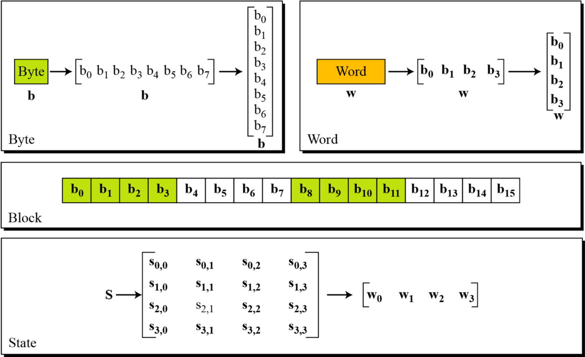
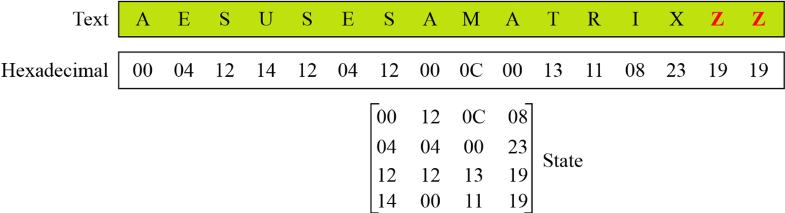
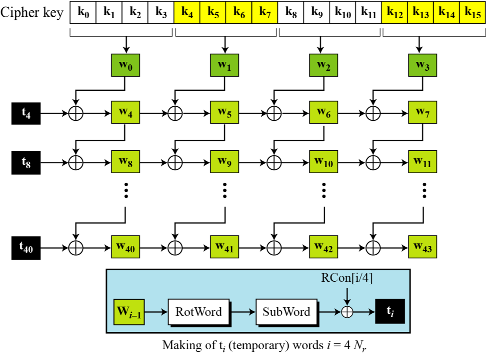

# AES

## 基本介紹

Advanced Encryption Standard（AES），高級加密標準，是典型的塊加密，被設計來取代 DES，由 Joan Daemen 和 Vincent Rijmen 所設計。其基本信息如下

- 輸入：128 比特。
- 輸出：128 比特。
- SPN 網絡結構。

其迭代輪數與密鑰長度有關係，如下

| 密鑰長度（比特） | 迭代輪數 |
| :--------------: | :------: |
|       128        |    10    |
|       192        |    12    |
|       256        |    14    |

## 基本流程

### 基本概念

在 AES 加解密過程中，每一塊都是 128 比特，所以我們這裏明確一些基本概念。



在 AES 中，塊與 State 之間的轉換過程如下


所以，可以看出，每一個 block 中的字節是按照列排列進入到狀態數組的。

而對於明文來說，一般我們會選擇使用其十六進制進行編碼。




### 加解密過程

這裏給個看雪上比較好的 [圖例](http://bbs.pediy.com/thread-90722.htm) ，以便於介紹基本的流程，每一輪主要包括

- 輪密鑰加，AddRoundKey
- 字節替換，SubBytes
- 行移位，ShiftRows
- 列混淆，MixColumns


上面的列混淆的矩陣乘法等號左邊的列向量應該在右邊。

這裏再給一張其加解密的全圖，其解密算法的正確性很顯然。


我們這裏重點關注一下以下。

#### 字節替換

在字節替換的背後，其實是有對應的數學規則來定義對應的替換表的，如下


這裏的運算均定義在 $GF(2^8)$ 內。

#### 列混淆

這裏的運算也是定義在 $GF(2^8)$ 上，使用的模多項式爲 $x^8+x^4+x^3+1$。

#### 密鑰擴展



## 等價解密算法

簡單分析一下，我們可以發現

- 交換逆向行移位和逆向字節代替並不影響結果。
- 交換輪密鑰加和逆向列混淆並不影響結果，關鍵在於
  - 首先可以把異或看成域上的多項式加法
  - 然後多項式中乘法對加法具有分配率。

## 攻擊方法

- 積分攻擊

## 2018 國賽 Crackmec

通過簡單分析這個算法，我們可以發現這個算法是一個簡化版的 AES，其基本操作爲

- 9 輪迭代
    - 行移位
    - 變種字節替換

如下

```c
  memcpy(cipher, plain, 0x10uLL);
  for ( i = 0LL; i <= 8; ++i )
  {
    shift_row(cipher);
    for ( j = 0LL; j <= 3; ++j )
      *(_DWORD *)&cipher[4 * j] =
        box[((4 * j + 3 + 16 * i) << 8) + (unsigned __int8)cipher[4 * j + 3]] ^
        box[((4 * j + 2 + 16 * i) << 8) + (unsigned __int8)cipher[4 * j + 2]] ^
        box[((4 * j + 1 + 16 * i) << 8) + (unsigned __int8)cipher[4 * j + 1]] ^
        box[((4 * j + 16 * i) << 8) + (unsigned __int8)cipher[4 * j]];
  }
  result = shift_row(cipher);
  for ( k = 0LL; k <= 0xF; ++k )
  {
    result = subbytes[256 * k + (unsigned __int8)cipher[k]];
    cipher[k] = result;
  }
  return result;
```

根據程序流程，我們已知程序加密的結果，而 subbytes 和 shift_row 又是可逆的，所以我們可以獲取最後一輪加密後的結果。此時，我們還知道 box 對應的常數，我們只是不知道上一輪中 `cipher[4*j]` 對應的值，一共 32 位，如果我們直接爆破的話，顯然不可取，因爲每一輪都需要這麼爆破，時間不可接受。那麼有沒有其它辦法呢？其實有的，我們可以考慮中間相遇攻擊，即首先枚舉所有的 `cipher[4*j]` 與`cipher[4*j+1]` 的字節組合，一共256\*256 種。在枚舉剩下兩個字節時，我們可以先計算出其與密文的異或值，然後去之前的組閤中找，如果找到的話，我們就認爲是正確的。這樣複雜度瞬間降到 $O(2^{16})$。

代碼如下

```python
encflag = [
    0x16, 0xEA, 0xCA, 0xCC, 0xDA, 0xC8, 0xDE, 0x1B, 0x16, 0x03, 0xF8, 0x84,
    0x69, 0x23, 0xB2, 0x25
]
subbytebox = eval(open('./subbytes').read())
box = eval(open('./box').read())
print subbytebox[-1], box[-1]


def inv_shift_row(now):
    tmp = now[13]
    now[13] = now[9]
    now[9] = now[5]
    now[5] = now[1]
    now[1] = tmp

    tmp = now[10]
    now[10] = now[2]
    now[2] = tmp
    tmp = now[14]
    now[14] = now[6]
    now[6] = tmp

    tmp = now[15]
    now[15] = now[3]
    now[3] = now[7]
    now[7] = now[11]
    now[11] = tmp

    return now


def byte2num(a):
    num = 0
    for i in range(3, -1, -1):
        num = num * 256
        num += a[i]
    return num


def getbytes(i, j, target):
    """
    box[((4 * j + 3 + 16 * i) << 8) + a2[4 * j + 3]]
    box[((4 * j + 2 + 16 * i) << 8 )+ a2[4 * j + 2]]
    box[((4 * j + 1 + 16 * i) << 8) + a2[4 * j + 1]]
    box[((4 * j + 16 * i) << 8) + a2[4 * j]];
    """
    box01 = dict()
    for c0 in range(256):
        for c1 in range(256):
            num0 = ((4 * j + 16 * i) << 8) + c0
            num1 = ((4 * j + 1 + 16 * i) << 8) + c1
            num = box[num0] ^ box[num1]
            box01[num] = (c0, c1)
    for c2 in range(256):
        for c3 in range(256):
            num2 = ((4 * j + 2 + 16 * i) << 8) + c2
            num3 = ((4 * j + 3 + 16 * i) << 8) + c3
            num = box[num2] ^ box[num3]
            calc = num ^ target
            if calc in box01:
                c0, c1 = box01[calc]
                return c0, c1, c2, c3
    print 'not found'
    print i, j, target, calc
    exit(0)


def solve():
    a2 = [0] * 16
    """
      for ( k = 0LL; k <= 0xF; ++k )
      {
        result = subbytesbox[256 * k + a2[k]];
        a2[k] = result;
      }
    """
    for i in range(15, -1, -1):
        tag = 0
        for j in range(256):
            if subbytebox[256 * i + j] == encflag[i]:
                # j = a2[k]
                tag += 1
                a2[i] = j
                if tag == 2:
                    print 'two number', i
                    exit(0)
    """
      result = shift_row(a2);
    """
    a2 = inv_shift_row(a2)
    """
      for ( i = 0LL; i <= 8; ++i )
      {
        shift_row(a2);
        for ( j = 0LL; j <= 3; ++j )
          *(_DWORD *)&a2[4 * j] = box[((4 * j + 3 + 16 * i) << 8) + a2[4 * j + 3]] ^ box[((4 * j + 2 + 16 * i) << 8)
                                                                                       + a2[4 * j + 2]] ^ box[((4 * j + 1 + 16 * i) << 8) + a2[4 * j + 1]] ^ box[((4 * j + 16 * i) << 8) + a2[4 * j]];
      }
    """
    for i in range(8, -1, -1):
        tmp = [0] * 16
        print 'round ', i
        for j in range(0, 4):
            num = byte2num(a2[4 * j:4 * j + 4])
            #print num, a2[4 * j:4 * j + 4]
            tmp[4 * j
               ], tmp[4 * j + 1], tmp[4 * j + 2], tmp[4 * j + 3] = getbytes(
                   i, j, num
               )
        a2 = inv_shift_row(tmp)
    print a2
    print ''.join(chr(c) for c in a2)


if __name__ == "__main__":
    solve()
```

運行結果

```shell
➜  cracemec git:(master) ✗ python exp.py
211 3549048324
round  8
round  7
round  6
round  5
round  4
round  3
round  2
round  1
round  0
[67, 73, 83, 67, 78, 98, 35, 97, 100, 102, 115, 64, 70, 122, 57, 51]
CISCNb#adfs@Fz93
```

## 題目

- 2018 強網杯 決賽 revolver

## 參考文獻

- https://zh.wikipedia.org/wiki/%E9%AB%98%E7%BA%A7%E5%8A%A0%E5%AF%86%E6%A0%87%E5%87%86
- Cryptography and Network Security， Advanced Encryption Standard  ppt
