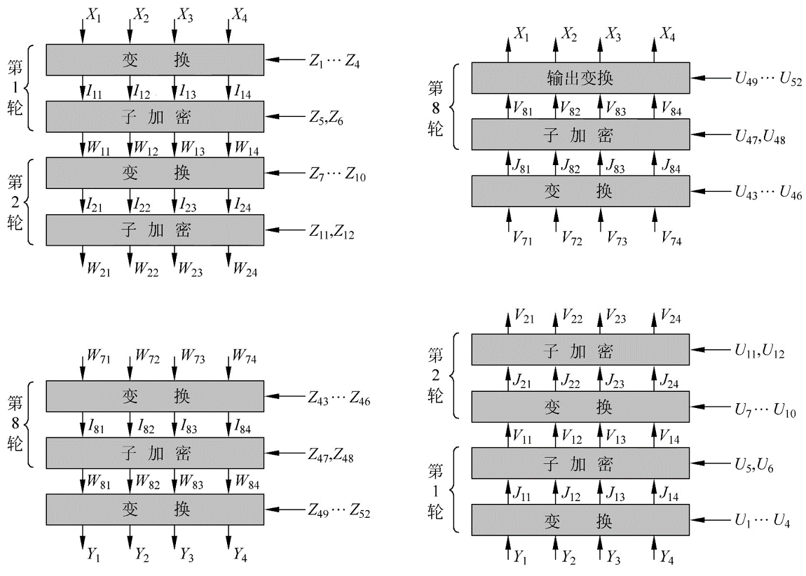

# IDEA

## 概述

**國際數據加密算法**（International Data Encryption Algorithm，IDEA），最早稱爲**改良建議加密標準**（Improved Proposed Encryption Standard，IPES），是密碼學上一種對稱密鑰分組密碼，由 James Massey 與來學嘉設計，在1991年首次提出。這個算法的提出，是爲了取代舊有的數據加密標準 DES。（來自維基百科）

## 基本流程

### 密鑰生成

IDEA 在加密的每輪中使用 6個密鑰，然後最後輸出輪使用4個密鑰。所以一共有52個。

1. 前8個密鑰來自與該算法最初的密鑰，K1 取自密鑰的高16比特，K8 取自密鑰的低16比特。
2. 將密鑰循環左移 25 位獲取下一輪密鑰，然後再次分爲8組。

### 加密流程

IDEA 加密的數據塊的大小爲 64 比特，其使用的密鑰長度爲128 比特。該算法會對輸入的數據塊進行8次相同的變換，只是每次使用的密鑰不同，最後會進行一次輸出變換。每一輪的操作

可以輸入和輸出都是 16 比特位一組。每一輪的主要執行的運算有

- 按位異或，⊕
- 模加，模數爲 $2^{16}$ ，⊞
- 模乘，模數爲 $2^{16}+1$ ，⊙。但是需要注意的是 0x0000 的輸入會被修改爲 $2^{16}$ ，$2^{16}$ 的輸出結果會被修改爲0x0000。

這裏我們稱由 K5，K6 構成的中間那個方格的加密方式爲MA。這也是 IDEA 算法中重要的一部分，此外，我們稱 MA_L 爲該部分加密後的左側結果，其最後會和最左邊的 16 比特操作；MA_R 爲該部分加密後的右半部分的結果，其最後會和第三個 16 比特操作。

在最後輸出輪的操作如下

### 解密流程

解密流程與加密流程相似，主要在於其密鑰的選取

- 第 i(1-9) 輪的解密的密鑰的前 4 個子密鑰由加密過程中第10-i 輪的前 4 個子密鑰得出
  - 其中第 1 個和第 4 個解密子密鑰爲相應的子密鑰關於 $2^{16}+1$ 的乘法逆元。
  - 第 2 個和第 3 個子密鑰的取法爲
    - 當輪數爲2，...，8時，取相應的第3個和第2個的子密鑰的$2^{16}$ 的加密逆元。
    - 當輪數爲 1 或 9 時，取相應的第 2 個和第 3 個子密鑰對應的$2^{16}$ 的加密逆元。
- 第 5 和第 6 個密鑰不變。

### 總體流程

我們來證明一下算法的正確性，這裏我們關注於解密算法的第一輪，首先我們先看一下$Y_i$ 是如何得到的

$Y_1 = W_{81} \odot Z_{49}$

$Y_2=W_{83}\boxplus Z_{50}$

$Y_3=W_{82}\boxplus Z_{51}$

$Y_4=W_{83}\odot Z_{52}$

解密時，第一輪直接進行的變換爲

$J_{11}=Y_1 \odot U_1=Y_1 \odot Z_{49}^{-1}=W_{81}$

$J_{12}=Y_2 \boxplus U2=Y_2\boxplus Z_{50}^{-1}=W_{83}$

$J_{13}=Y_3 \boxplus U3=Y_3\boxplus Z_{51}^{-1}=W_{82}$

$J_{14}=Y_4 \odot U_4=Y_4 \odot Z_{52}^{-1}=W_{84}$

可以看出得到的結果只有中間的兩個16位加密結果恰好相反。我們進一步看一下$W_{8i}$ 是如何得到的。

$W_{81}=I_{81} \oplus MA_R(I_{81}\oplus I_{83},I_{82}\oplus I_{84})$

$W_{82}=I_{83} \oplus MA_R(I_{81}\oplus I_{83},I_{82}\oplus I_{84})$

$W_{83}=I_{82} \oplus MA_L(I_{81}\oplus I_{83},I_{82}\oplus I_{84})$

$W_{84}=I_{84} \oplus MA_L(I_{81}\oplus I_{83},I_{82}\oplus I_{84})$

那麼對於V11來說

$V_{11}=J_{11} \oplus MA_R(J_{11}\oplus J_{13},J_{12}\oplus J_{14})$

通過簡單帶入已有的值，顯然

$V_{11}=W_{81} \oplus MA_R(I_{81}\oplus I_{83},I_{82} \oplus I_{84})=I_{81}$

對於其他的元素也類似，那麼其實我們會發現第一輪解密後的結果恰好是$I_{81},I_{83},I_{82},I_{84}$。

類似地，這個關係可以一直滿足直到

$V_{81}=I_{11},V_{82}=I_{13},V_{83}=I_{12},V_{84}=I_{14}$

那麼最後再經過一次簡單的輸出變換，恰好得到最初加密的數值。

## 題目

- 2017 HITCON seccomp
